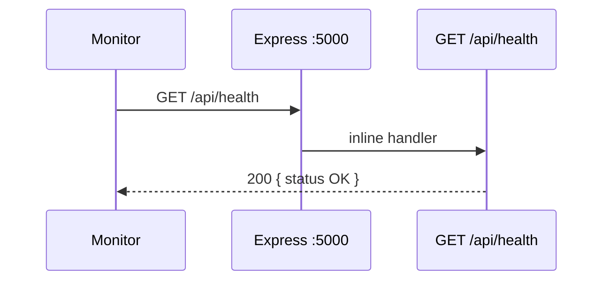

# Functional Requirement (FR) — Health Check API

## 1. Feature Overview

Endpoint **liveness** đơn giản xác nhận process Express đang chạy và có thể trả JSON — dùng cho dev, monitoring thủ công, CI smoke test, và (nếu cấu hình đúng) Docker/Kubernetes health probe.

```
GET /api/health
Auth: không yêu cầu
Response: 200 JSON cố định
```

**Không** kiểm tra kết nối database, Redis, VNPay, Cloudinary, hay recommendation service.

---

## 2. Actors

| Actor | Mô tả |
|-------|-------|
| **Dev / Ops** | `curl`, browser, uptime monitor |
| **CI/CD** | Smoke test sau deploy |
| **Docker / K8s** | Liveness probe (nếu path khớp — xem GAP) |
| **Express app** | `server.js` inline handler |

---

## 3. Scope

### In Scope

- Route đăng ký trực tiếp trên `app` (không qua router con).
- Trả `{ status, message }` khi process sống.
- Không middleware auth.

### Out of Scope

- Readiness probe (DB ping).
- Deep health / dependency matrix.
- `GET /health` (root) — **không tồn tại** trên API chính.
- Recommendation Flask `GET /health` (service riêng port 5001/8000).

---

## 4. API Contract

### Request

```http
GET /api/health
Accept: application/json
```

| Thuộc tính | Giá trị |
|------------|---------|
| Method | `GET` |
| Path | `/api/health` (full URL: `{API_HOST}/api/health`) |
| Headers | Không bắt buộc |
| Body | Không |

### Response — 200 OK

```json
{
  "status": "OK",
  "message": "Server is running"
}
```

| Field | Type | Mô tả |
|-------|------|--------|
| `status` | string | Luôn `"OK"` khi handler chạy |
| `message` | string | Mô tả tiếng Anh cố định |

### Errors

| HTTP | Khi nào |
|------|---------|
| — | Handler không throw — thường luôn 200 nếu server up |
| 502/connection refused | Process chưa listen hoặc crash |

**Lưu ý:** Lỗi DB **không** ảnh hưởng endpoint này — server vẫn có thể trả 200 trong khi `sequelize.authenticate()` đã fail lúc startup (process exit) hoặc API business routes lỗi DB.

---

## 5. Implementation

```javascript
// server/server.js
app.get("/api/health", (req, res) => {
  res.json({ status: "OK", message: "Server is running" });
});
```

| # | Business rule |
|---|----------------|
| BR-01 | Đăng ký **sau** `express.json()` / CORS — không cần body parser đặc biệt |
| BR-02 | Đăng ký **trước** `errorHandler` — lỗi handler không bọc route này trừ khi throw |
| BR-03 | **Không** log riêng mỗi request health (mặc định Express) |
| BR-04 | Cùng port với toàn bộ API (`PORT` env, default `5000`) |

### Startup sequence (liên quan)

```
1. require routes + jobs (releaseReservations cron starts)
2. app.use middleware + routes
3. app.get("/api/health", ...)
4. app.use(errorHandler)
5. startServer(): sequelize.authenticate() → optional sync → app.listen(PORT)
```

| # | Rule |
|---|------|
| BR-05 | Health route có sẵn **ngay khi** `listen` — không đợi DB; nhưng `startServer` **exit(1)** nếu DB auth fail → container restart |
| BR-06 | `DB_SYNC_ALTER=true` chỉ ảnh hưởng sync, không đổi payload health |

---

## 6. So sánh health trong đồ án

| Service | Path | Kiểm tra gì |
|---------|------|-------------|
| **Main API** | `GET /api/health` | Process HTTP |
| **Recommendation (Flask)** | `GET /health` | ML service + shape metadata |
| **Master spec GAP** | Dockerfile ghi `/health` | Có thể **lệch** `/api/health` |

---

## 7. Sequence



---

## 8. Frontend / Client usage

| # | Hành vi |
|---|---------|
| BR-07 | FE production **không** gọi health định kỳ |
| BR-08 | `VITE_API_URL` thường `http://localhost:5000/api` — health full path = base bỏ `/api` + `/api/health` hoặc `origin/api/health` |

Ví dụ local:

```bash
curl -s http://localhost:5000/api/health
```

---

## 9. Related FRs & Docs

| Tài liệu | Liên kết |
|----------|----------|
| `FR_JWTAuthenticationMiddleware.md` | Health **không** dùng JWT |
| `FR_ReleaseExpiredReservationsJob.md` | Cron chạy cùng process |
| `master_specification.md` §9.7 | Contract health |
| `master_specification.md` GAP Dockerfile | Path probe |

---

## 10. Source Files

| File | Vai trò |
|------|---------|
| `server/server.js` | Route L42–45, `startServer` L54–77 |
| `server/middleware/errorHandler.js` | Global errors (không áp health) |
| `docs/master_specification.md` | §9.7 Health |

---

## 11. Acceptance Criteria

- [ ] Server đang `listen` → `GET /api/health` → 200 + body đúng schema.
- [ ] Không gửi `Authorization` vẫn 200.
- [ ] Method POST/PUT → 404 (không định nghĩa) hoặc Express default.
- [ ] Sau `npm run dev` / `npm start`, curl trong vòng vài giây thành công.

---

## 12. Known Gaps / Enhancements

| # | Mô tả |
|---|--------|
| GAP-01 | **Không ping DB** — false positive khi DB down nhưng process cũ vẫn sống (hiếm vì startup auth) |
| GAP-02 | Dockerfile/probe có thể trỏ `/health` thay vì `/api/health` |
| GAP-03 | Không có `version`, `uptime`, `timestamp` cho ops |
| GAP-04 | Không tách readiness vs liveness cho K8s |
| GAP-05 | Cron job errors không phản ánh qua health |
| GAP-06 | Không rate-limit — có thể spam log nếu probe quá dày (tùy infra) |
