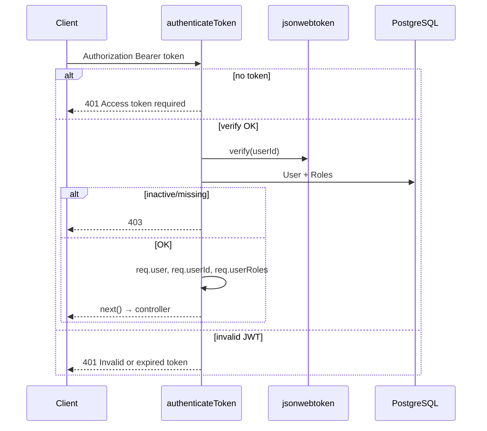

# Functional Requirement (FR) — JWT Authentication Middleware

## 1. Feature Overview

Middleware `authenticateToken` xác thực **JWT Bearer** trên các route được bảo vệ: parse header, verify chữ ký/TTL, load user + roles từ PostgreSQL, gắn `req.user` và tiếp tục pipeline.

```
Authorization: Bearer <access_token>
Secret: JWT_SECRET (fallback dev: "your-secret-key")
Payload session: { userId: number }
TTL session: 7d
File: server/middleware/auth.js
```

Token được **phát hành** bởi: `authController` (login/register), `passport.js` (OAuth), `verifyEmail` redirect — **không** phải trách nhiệm middleware.

---

## 2. Actors

| Actor | Mô tả |
|-------|-------|
| **Customer / Admin** | Gửi token từ FE |
| **authenticateToken** | Middleware async |
| **jsonwebtoken** | `verify` / lỗi expired |
| **User + Role models** | Load sau decode |

---

## 3. Scope

### In Scope

- Header `Authorization: Bearer <token>`.
- Verify `decoded.userId` → `User.findByPk` + `Role` many-to-many.
- Chặn user `is_active === false`.
- Exclude `password_hash` khỏi `req.user`.
- Set `req.user`, `req.userId`, `req.userRoles`.

### Out of Scope

- Phân quyền theo role (`authorizeRoles` — FR riêng).
- Refresh token / rotation.
- Blacklist logout.
- Kiểm tra `purpose` trên purpose-JWT (email verify, reset password).
- Passport session cho API REST (OAuth chỉ dùng JWT output).

---

## 4. Routes áp dụng (toàn dự án)

| Router | Pattern | Ghi chú |
|--------|---------|---------|
| `cartRoutes` | `router.use(authenticateToken)` | Toàn bộ `/api/cart/*` |
| `orderRoutes` | `router.use(authenticateToken)` | Toàn bộ `/api/orders/*` |
| `adminRoutes` | `router.use(authenticateToken)` | Trước `authorizeRoles` |
| `authRoutes` | Per-route | `GET /me`, `PUT /profile` |
| `productRoutes` | Per-route | POST questions/answers only |
| `auth`, `products` GET | **Public** | Không middleware |
| `vnpayRoutes`, `geo`, `shipping` quote | **Public** | VNPay return, v.v. |

---

## 5. Algorithm

```javascript
const authenticateToken = async (req, res, next) => {
  const authHeader = req.headers["authorization"];
  const token = authHeader && authHeader.split(" ")[1];

  if (!token) {
    return res.status(401).json({ message: "Access token required" });
  }

  const decoded = jwt.verify(token, process.env.JWT_SECRET || "your-secret-key");

  const user = await User.findByPk(decoded.userId, {
    include: [{ model: Role, through: { attributes: [] } }],
    attributes: { exclude: ["password_hash"] },
  });

  if (!user || !user.is_active) {
    return res.status(403).json({ message: "User not found or inactive" });
  }

  req.user = user;
  req.userId = user.user_id;
  req.userRoles = user.Roles?.map((r) => r.role_name) || [];
  next();
};
```

### Token issuance (đồng bộ payload)

```javascript
// authController.js, config/passport.js
jwt.sign({ userId }, process.env.JWT_SECRET || "your-secret-key", { expiresIn: "7d" });
```

| # | Business rule |
|---|----------------|
| BR-01 | Claim tên **`userId`** (camelCase), không `user_id` |
| BR-02 | Thiếu header hoặc không có phần sau `Bearer ` → **401** `Access token required` |
| BR-03 | `jwt.verify` throw → **401** `Invalid or expired token` (catch trong middleware, không qua `errorHandler`) |
| BR-04 | User không tồn tại hoặc `!is_active` → **403** `User not found or inactive` (khác 401) |
| BR-05 | OAuth user không password vẫn pass nếu active + có token hợp lệ |

### Purpose tokens (cùng secret, khác payload)

| purpose | Issuer | Dùng authenticateToken? |
|---------|--------|-------------------------|
| `email_verify` | `signPurposeToken` | Có thể **nếu** client gửi nhầm — middleware **không** chặn `purpose` → GAP bảo mật |
| `password_reset` | `signPurposeToken` | Tương tự |

---

## 6. HTTP Responses

| Status | `message` | Điều kiện |
|--------|-----------|-----------|
| 401 | `Access token required` | Không token |
| 401 | `Invalid or expired token` | Verify fail / hết hạn |
| 403 | `User not found or inactive` | DB không có user hoặc deactivated |
| — | `next()` | OK |

**errorHandler** cũng map `JsonWebTokenError` / `TokenExpiredError` — nhưng middleware **bắt trước** nên response thường từ middleware.

---

## 7. Frontend Integration

### Axios (`client/app/services/api.js`)

```javascript
api.interceptors.request.use((config) => {
  const token = localStorage.getItem("token");
  if (token) {
    config.headers.Authorization = `Bearer ${token}`;
  }
  return config;
});
```

### Response interceptor

| # | Rule |
|---|------|
| BR-06 | `401` hoặc `403` + message legacy token → clear `localStorage`, Redux logout, redirect login |
| BR-07 | **Không** auto-logout trên `/auth/login` / `/auth/register` |
| BR-08 | `useAuth` / `setAuthHeader` đồng bộ header sau login |

### Storage

| Key | Nội dung |
|-----|----------|
| `localStorage.token` | JWT string |
| `localStorage.user` | JSON user (redux persist manual) |
| `localStorage.roles` | JSON array role names |

Login response roles từ DB: `user.Roles.map(r => r.role_name)`.

---

## 8. Sequence



---

## 9. Environment

| Biến | Vai trò |
|------|---------|
| `JWT_SECRET` | Ký và verify — **bắt buộc production** |
| (fallback) | `"your-secret-key"` — chỉ dev |

| # | Security rule |
|---|----------------|
| BR-09 | Cùng secret cho session + purpose tokens |
| BR-10 | Không truyền JWT qua query string trên API (OAuth success dùng query một lần rồi FE lưu) |

---

## 10. Related FRs

| FR | Liên kết |
|----|----------|
| `FR_RoleBasedAuthorizationMiddleware.md` | Sau authenticate trên `/api/admin` |
| `FR_SeedAdminScript.md` | Tạo user có token sau login |
| Auth FRs | Register, verify, OAuth |
| `master_specification.md` §13.1 | JWT spec |

---

## 11. Source Files

| File | Vai trò |
|------|---------|
| `server/middleware/auth.js` | `authenticateToken` L5–37 |
| `server/controllers/authController.js` | `generateToken`, login |
| `server/config/passport.js` | OAuth JWT |
| `server/middleware/errorHandler.js` | JWT error names |
| `client/app/services/api.js` | Interceptors |
| `client/app/hooks/useAuth.js` | Login/logout header |
| `client/app/store/slices/authSlice.js` | Redux auth state |

---

## 12. Acceptance Criteria

- [ ] Request hợp lệ + token 7d + user active → controller nhận `req.user.user_id`.
- [ ] Không header → 401.
- [ ] Token sai secret / hết hạn → 401.
- [ ] User `is_active: false` → 403.
- [ ] `GET /api/products` không token → 200 (public).
- [ ] `GET /api/cart` không token → 401.

---

## 13. Known Gaps

| # | Mô tả |
|---|--------|
| GAP-01 | **Purpose JWT** có thể dùng như API token nếu lộ — không check `purpose` |
| GAP-02 | `req.userRoles` set nhưng nhiều controller không dùng (chỉ `authorizeRoles` đọc `req.user.Roles`) |
| GAP-03 | Register trả `roles: ["customer"]` hardcode — có thể lệch DB nếu chưa gán role |
| GAP-04 | Không refresh token — hết 7d user phải login lại |
| GAP-05 | Logout server-side không invalidate JWT |
| GAP-06 | 403 inactive vs 401 invalid — FE interceptor một số case xử lý như logout |
