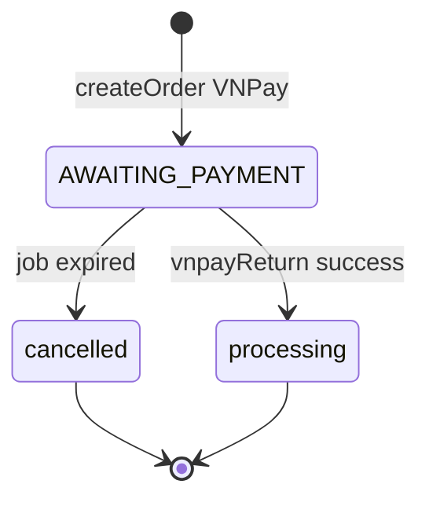

# Functional Requirement (FR) — Release Expired Reservations Job

## 1. Feature Overview

Background job **cron** chạy trong cùng process Node với API, giải phóng kho và hủy đơn VNPay **hết hạn giữ chỗ** (`reserve_expires_at < now`) khi khách không thanh toán kịp thời hạn 24 giờ.

```
Schedule: */2 * * * *  (mỗi 2 phút)
File: server/jobs/releaseReservations.js
Load: require("./jobs/releaseReservations") trong server.js
DB: PostgreSQL advisory lock + row locks
```

Đối tượng: orders `status = AWAITING_PAYMENT` và `reserve_expires_at` đã qua.

---

## 2. Actors

| Actor | Mô tả |
|-------|-------|
| **node-cron** | Scheduler in-process |
| **releaseReservations** | Job body |
| **Order / OrderItem / ProductVariation / Payment** | Models cập nhật |
| **createOrder (VNPay)** | Set `reserve_expires_at = now + 24h` + trừ kho |
| **Customer** | Không tương tác trực tiếp — side effect |

---

## 3. Scope

### In Scope

- Quét đơn expired awaiting payment.
- Hoàn `stock_quantity` theo từng `OrderItem`.
- `Payment` VNPay `pending` → `failed`.
- `Order.status` → `cancelled`, `reserve_expires_at` → `null`.
- Transaction + `FOR UPDATE` / `skipLocked`.
- Advisory lock tránh overlap 2 tick.

### Out of Scope

- COD orders (`reserve_expires_at` null) — **không** chạm.
- Đơn đã `processing` / paid — không chọn.
- Gửi email hủy (cancel user cũng không email).
- Worker process riêng / Bull queue.
- VNPay server cancel API.

---

## 4. Business context (VNPay hold)

| Bước | `createOrder` khi `payment_provider === "VNPAY"` |
|------|--------------------------------------------------|
| 1 | `status: AWAITING_PAYMENT` |
| 2 | `reserve_expires_at: now + 24h` (`holdMs = 24 * 60 * 60 * 1000`) |
| 3 | Trừ `stock_quantity` ngay (pessimistic lock) |
| 4 | `Payment` `pending`, provider `VNPAY` |
| 5 | Trả `redirect` URL |

| Kết quả | Ai xử lý |
|---------|----------|
| Khách thanh toán đúng hạn | `vnpayReturn` → `processing`, payment completed |
| Quá 24h chưa trả | **Job này** → hoàn kho, cancel, payment failed |

COD: `reserve_expires_at: null`, `status: processing` — **ngoài** job.

---

## 5. Schedule & lifecycle

```javascript
// server/server.js
require("./jobs/releaseReservations");
```

```javascript
cron.schedule("*/2 * * * *", async () => { ... });
```

| # | Rule |
|---|------|
| BR-01 | Job start khi **import** file — không đợi `app.listen` |
| BR-02 | Chạy **mọi môi trường** (dev, prod) nếu server chạy |
| BR-03 | Interval 2 phút — đơn có thể expired tới ~2 phút trước khi cleanup |
| BR-04 | Multi-instance: advisory lock giảm duplicate; `skipLocked` trên rows |

---

## 6. Algorithm (chi tiết)

### 6.1 Advisory lock (PostgreSQL)

```javascript
async function withPgAdvisoryLock(lockKey, fn) {
  const [row] = await sequelize.query(
    `SELECT pg_try_advisory_lock(${lockKey}) AS locked;`
  );
  const locked = row?.[0]?.locked || row?.locked;
  if (!locked) return; // instance khác đang chạy
  try {
    await fn();
  } finally {
    await sequelize.query(`SELECT pg_advisory_unlock(${lockKey});`);
  }
}
```

| # | Rule |
|---|------|
| BR-05 | Lock key cố định **`987654321`** |
| BR-06 | Không lock → **silent skip** tick (không log) |
| BR-07 | **Chỉ PostgreSQL** — dialect bắt buộc postgres (Neon) |

### 6.2 Transaction body

```javascript
cron.schedule("*/2 * * * *", async () => {
  await withPgAdvisoryLock(987654321, async () => {
    const t = await sequelize.transaction();
    try {
      const expiredOrders = await Order.findAll({
        where: {
          status: "AWAITING_PAYMENT",
          reserve_expires_at: { [Op.lt]: new Date() },
        },
        transaction: t,
        lock: t.LOCK.UPDATE,
        skipLocked: true,
      });

      for (const order of expiredOrders) {
        const items = await OrderItem.findAll({
          where: { order_id: order.order_id },
          transaction: t,
        });

        for (const it of items) {
          const v = await ProductVariation.findOne({
            where: { variation_id: it.variation_id },
            transaction: t,
            lock: t.LOCK.UPDATE,
            skipLocked: true,
          });
          if (v) {
            await v.increment("stock_quantity", { by: it.quantity, transaction: t });
          }
        }

        await Payment.update(
          { payment_status: "failed" },
          {
            where: {
              order_id: order.order_id,
              provider: "VNPAY",
              payment_status: "pending",
            },
            transaction: t,
          }
        );

        order.status = "cancelled";
        order.reserve_expires_at = null;
        await order.save({ transaction: t });
      }

      await t.commit();
    } catch (e) {
      await t.rollback();
      console.error("[releaseReservations] error:", e.message);
    }
  });
});
```

| # | Business rule |
|---|----------------|
| BR-08 | Chỉ `AWAITING_PAYMENT` + `reserve_expires_at < now` |
| BR-09 | Hoàn kho **`increment`** đúng `quantity` từng line |
| BR-10 | Variation lock fail (`skipLocked`) → **bỏ qua** dòng đó — có thể lệch kho (GAP) |
| BR-11 | Payment: chỉ `VNPAY` + `pending` → `failed` |
| BR-12 | Order → **`cancelled`** (không `FAILED`) |
| BR-13 | Clear `reserve_expires_at` — tick sau không pick lại (**idempotent**) |
| BR-14 | Một transaction **cho cả batch** trong tick — lỗi rollback toàn batch |

---

## 7. State transitions (job)



| Entity | Trước | Sau job |
|--------|-------|---------|
| `orders.status` | `AWAITING_PAYMENT` | `cancelled` |
| `orders.reserve_expires_at` | datetime | `null` |
| `payments.payment_status` | `pending` (VNPAY) | `failed` |
| `product_variations.stock_quantity` | đã trừ | +quantity hoàn |

---

## 8. Concurrency & races

| Scenario | Hành vi |
|----------|---------|
| 2 server instances cùng tick | Advisory lock — một instance chạy |
| Job vs `vnpayReturn` cùng lúc | Row `FOR UPDATE` / transaction order — một bên thắng |
| Khách trả sau expired, trước job | Return có thể đưa `processing` — job không select |
| Khách trả sau job cancelled | Return logic phải reject — xem vnpayController (GAP ngoài FR) |

---

## 9. Observability

| Output | Mô tả |
|--------|--------|
| Success | Không log per order |
| Error | `console.error("[releaseReservations] error:", e.message)` |
| Metrics | Không |

---

## 10. Related FRs

| FR | Liên kết |
|----|----------|
| `orders/FR_CreateOrder.md` | Set reserve 24h |
| VNPay return FRs | Happy path |
| `FR_HealthCheckAPI.md` | Cùng process |
| `master_specification.md` §10.4 | Cron documented |
| `event-driven-architecture.md` | ORDER_EXPIRED pattern |

---

## 11. Source Files

| File | Vai trò |
|------|---------|
| `server/jobs/releaseReservations.js` | Cron + logic |
| `server/server.js` | Side-effect import L21 |
| `server/controllers/orderController.js` | `reserve_expires_at` L212–226 |
| `server/models/Order.js` | Column `reserve_expires_at` |
| `server/package.json` | `node-cron` dependency |
| `server/config/database.js` | PostgreSQL |

---

## 12. Acceptance Criteria

- [ ] Tạo đơn VNPay, set `reserve_expires_at` quá khứ (test DB), đợi cron → order `cancelled`, stock hoàn.
- [ ] Payment VNPAY pending → `failed`.
- [ ] `reserve_expires_at` null sau job — không pick lặp.
- [ ] COD order không bị job đổi status.
- [ ] Hai instance: không double-increment stock (advisory lock).

---

## 13. Known Gaps

| # | Mô tả |
|---|--------|
| GAP-01 | **In-process cron** — scale horizontal cần advisory lock; không durable queue |
| GAP-02 | `skipLocked` trên variation → có thể **không hoàn** hết kho |
| GAP-03 | Batch một transaction — một order lỗi rollback cả tick |
| GAP-04 | Không email khách khi auto-cancel |
| GAP-05 | Không log số đơn processed |
| GAP-06 | Master spec bước 5b ghi `Payment failed` + `Order cancelled` — khớp; bước 5a ghi `PAID` có thể lệch `processing` |
| GAP-07 | Không chạy standalone CLI — bắt buộc chạy full server |
| GAP-08 | MySQL/SQLite không hỗ trợ advisory lock — project gắn Neon Postgres |
| GAP-09 | Delay tối đa ~2 phút sau expiry |
