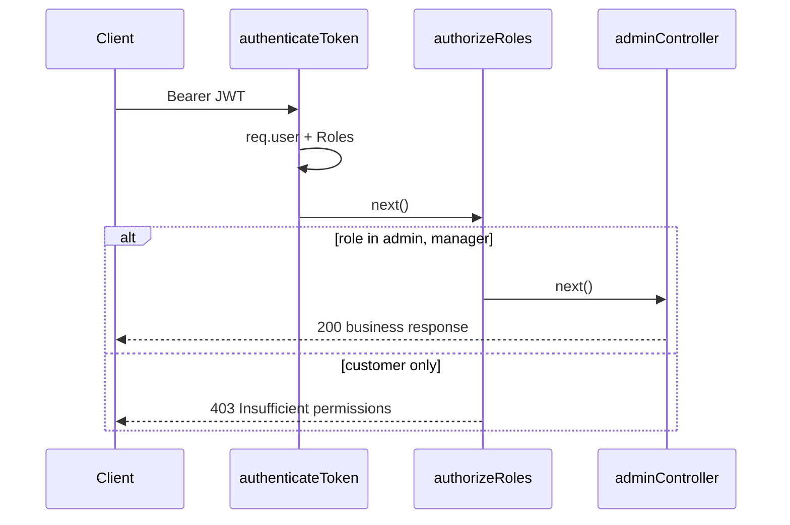

# Functional Requirement (FR) — Role-Based Authorization Middleware

## 1. Feature Overview

Middleware `authorizeRoles(...allowedRoles)` kiểm tra user đã qua `authenticateToken` có **ít nhất một** role trong danh sách cho phép — dùng chủ yếu cho prefix `/api/admin/*`.

```
Pipeline: authenticateToken → authorizeRoles("admin", "manager") → adminController
File: server/middleware/auth.js
Model: user_roles (M:N User ↔ Role)
```

**Không** dùng bảng `permissions` / `role_permissions` dù model có define — authorization thực tế **chỉ theo `role_name`**.

---

## 2. Actors

| Actor | Mô tả |
|-------|-------|
| **admin** | Full admin API (BE) |
| **manager** | Cùng quyền API admin (BE) |
| **customer** | Bị 403 trên `/api/admin` |
| **authorizeRoles** | Higher-order middleware |

---

## 3. Scope

### In Scope

- Variadic roles: `authorizeRoles("admin", "manager")`.
- Logic OR: có **một** role khớp → `next()`.
- Mount global trên `adminRoutes.js`.

### Out of Scope

- Fine-grained permission (`product:write`, v.v.).
- Row-level security (chỉ sửa đơn của mình).
- FE route guard (logic riêng — chỉ `admin`).
- Staff role (nếu có trong seed DB nhưng không whitelist).

---

## 4. Implementation

```javascript
const authorizeRoles = (...roles) => {
  return (req, res, next) => {
    if (!req.user) {
      return res.status(401).json({ message: "Authentication required" });
    }

    const userRoles = req.user.Roles.map((role) => role.role_name);
    const hasRole = roles.some((role) => userRoles.includes(role));

    if (!hasRole) {
      return res.status(403).json({ message: "Insufficient permissions" });
    }

    next();
  };
};
```

### Mount (`adminRoutes.js`)

```javascript
router.use(authenticateToken);
router.use(authorizeRoles("admin", "manager"));
```

| # | Business rule |
|---|----------------|
| BR-01 | **Phải** chạy sau `authenticateToken` — `req.user` + `Roles` loaded |
| BR-02 | So khớp chuỗi **chính xác** `role_name` (case-sensitive) |
| BR-03 | OR logic: admin **hoặc** manager đủ |
| BR-04 | Không role nào khớp → **403** `Insufficient permissions` |
| BR-05 | `!req.user` → **401** `Authentication required` (edge: mount sai thứ tự) |

---

## 5. Role matrix (đồ án)

| `role_name` | `/api/admin/*` | Storefront JWT routes | FE `AdminRoute` |
|-------------|----------------|------------------------|-----------------|
| `customer` | 403 | 200 (nếu auth OK) | Redirect `/` |
| `admin` | 200 | 200 | Cho phép |
| `manager` | 200 | 200 | **Chặn** — chỉ check `admin` |
| (khác) | 403 | tùy route | Redirect |

| # | Cross-layer rule |
|---|------------------|
| BR-06 | **Manager paradox:** API cho manager, UI admin panel **không** |
| BR-07 | Customer gọi `POST /api/admin/products` → 403 dù token hợp lệ |

---

## 6. Admin routes được bảo vệ (không exhaustive)

| Nhóm | Ví dụ path |
|------|------------|
| Products | `POST/PUT/DELETE /admin/products`, variations |
| Orders | `/admin/orders`, ship, deliver, refund, status |
| Users / Roles | `/admin/users`, `/admin/roles` |
| Catalog admin | `/admin/categories`, `/admin/brands` |
| Analytics | `/admin/analytics/dashboard`, `sales` |
| Q&A admin | `/admin/questions`, answers |

Toàn bộ file `adminRoutes.js` sau 2 middleware trên.

---

## 7. Routes **không** dùng authorizeRoles

| Area | Auth model |
|------|------------|
| `GET /api/products/*` | Public |
| `POST /api/products/.../questions` | `authenticateToken` only — **mọi user** đăng nhập |
| `/api/cart`, `/api/orders` | JWT, không check role |
| `/api/vnpay/*` | Public callback |

---

## 8. Data model

```javascript
// models/index.js
User.belongsToMany(Role, { through: "user_roles", foreignKey: "user_id" });
Role.belongsToMany(User, { through: "user_roles", foreignKey: "role_id" });
```

Gán role: `user.addRole(role)`, `user.setRoles([...])` — `adminController.updateUserRoles`, `seedAdmin.js`.

| Bảng | Mô tả |
|------|--------|
| `roles` | `role_id`, `role_name` UNIQUE |
| `user_roles` | `(user_id, role_id)` |

`Permission` + `role_permissions` — **chưa wired** vào middleware.

---

## 9. Sequence



---

## 10. Frontend vs Backend

```javascript
// AdminRoute.jsx
const isAdmin = user?.roles?.includes("admin");
if (!isAdmin) return <Navigate to="/" replace />;
```

| # | FE rule |
|---|---------|
| BR-08 | FE đọc `user.roles` từ login/`/me` — không parse JWT |
| BR-09 | Manager login storefront OK, vào `/admin` **bị đá** |
| BR-10 | Postman + manager JWT vẫn gọi API admin thành công |

---

## 11. Related FRs

| FR | Liên kết |
|----|----------|
| `FR_JWTAuthenticationMiddleware.md` | Tiền đề |
| `FR_SeedAdminScript.md` | Gán role `admin` |
| Admin user/role FRs | `updateUserRoles` |
| `master_specification.md` §13.2–13.3 | Role table |

---

## 12. Source Files

| File | Vai trò |
|------|---------|
| `server/middleware/auth.js` | `authorizeRoles` L39–54 |
| `server/routes/adminRoutes.js` | Global mount L8–9 |
| `server/models/Role.js`, `index.js` | Schema + associations |
| `client/app/components/AdminRoute.jsx` | FE guard |
| `server/controllers/adminController.js` | `updateUserRoles` |

---

## 13. Acceptance Criteria

- [ ] User role `admin` → `GET /api/admin/orders` → 200.
- [ ] User role `manager` only → same → 200.
- [ ] User role `customer` only → 403 Insufficient permissions.
- [ ] Không JWT → 401 từ authenticateToken (không tới authorizeRoles).
- [ ] `authorizeRoles` sai thứ tự (không auth) → 401 Authentication required.

---

## 14. Known Gaps

| # | Mô tả |
|---|--------|
| GAP-01 | **Permission model unused** — không RBAC chi tiết |
| GAP-02 | `req.user.Roles.map` — nếu `Roles` undefined → **500** (authenticateToken thường luôn include) |
| GAP-03 | **FE/BE mismatch** cho `manager` |
| GAP-04 | Q&A answer trên public product route — authenticated **không** cần admin role |
| GAP-05 | Không audit log ai gọi admin API |
| GAP-06 | Không hỗ trợ dynamic role config từ env |
