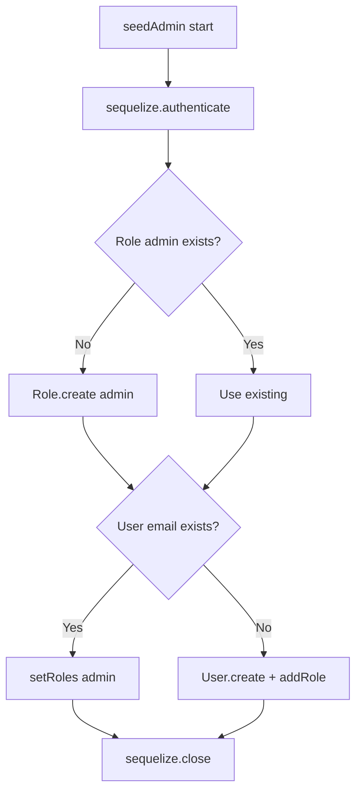

# Functional Requirement (FR) — Seed Admin Script

## 1. Feature Overview

Script CLI **một lần / lặp lại an toàn** tạo (hoặc đồng bộ) tài khoản quản trị mặc định và role `admin` trong PostgreSQL — bắt buộc cho lần đầu triển khai đồ án khi DB trống.

```bash
cd server
npm run seed:admin
# → node seedAdmin.js
```

**Không** chạy tự động khi `npm start` — operator phải gọi thủ công.

---

## 2. Actors

| Actor | Mô tả |
|-------|-------|
| **Dev / Deployer** | Chạy script local hoặc CI init |
| **seedAdmin.js** | Entry script |
| **User model hooks** | Băm `password_hash` bcrypt |
| **Role model** | Đảm bảo role `admin` |

---

## 3. Scope

### In Scope

- Kết nối DB qua Sequelize (`NEON_DATABASE_URL`).
- Upsert logic: role `admin`, user theo email cố định.
- Băm mật khẩu qua `beforeCreate` hook.
- Gán role qua `user_roles`.
- Đóng connection trong `finally`.

### Out of Scope

- Seed products, categories, orders.
- Seed role `customer` / `manager` (phải có sẵn hoặc tạo tay).
- Migration runner (Sequelize CLI migrations riêng).
- Đổi mật khẩu admin qua script (chỉ tạo lần đầu).

---

## 4. Constants (hardcoded)

| Constant | Giá trị mặc định |
|----------|------------------|
| `ADMIN_USERNAME` | `super_admin` |
| `ADMIN_EMAIL` | `admin@laptopstore.com` |
| `ADMIN_PASSWORD` | `AdminPassword123` |
| Role | `admin` — description `Quản trị viên hệ thống` |

| # | Security rule |
|---|----------------|
| BR-01 | Mật khẩu **plaintext trong source** — chỉ dev/demo |
| BR-02 | Comment trong file: *"nên đổi sau khi chạy"* |
| BR-03 | Production **phải** rotate password sau seed |

---

## 5. Algorithm



### Step detail

**1. DB connect**

```javascript
require("dotenv").config({ path: "./.env" });
await sequelize.authenticate();
```

| # | Rule |
|---|------|
| BR-04 | `.env` path relative **`./.env`** trong thư mục `server/` |
| BR-05 | Thiếu `NEON_DATABASE_URL` → `database.js` exit trước khi seed |

**2. Ensure role `admin`**

```javascript
let adminRole = await Role.findOne({ where: { role_name: "admin" } });
if (!adminRole) {
  adminRole = await Role.create({
    role_name: "admin",
    description: "Quản trị viên hệ thống",
  });
}
```

**3a. User đã tồn tại (theo email)**

```javascript
if (adminUser) {
  await adminUser.setRoles([adminRole]);
  return; // không đổi password
}
```

| # | Rule |
|---|------|
| BR-06 | Idempotent theo **email**, không username |
| BR-07 | Re-run **gán lại** role admin — sửa user mất role |

**3b. User mới**

```javascript
adminUser = await User.create({
  username: ADMIN_USERNAME,
  email: ADMIN_EMAIL,
  password_hash: ADMIN_PASSWORD, // hook → bcrypt
  full_name: "System Administrator",
  is_active: true,
});
await adminUser.addRole(adminRole);
```

| # | Rule |
|---|------|
| BR-08 | `password_hash` field nhận plaintext → `beforeCreate` hash cost 10 |
| BR-09 | `is_active: true` — login ngay được |
| BR-10 | **Không** tạo `Cart` (khác `register`) — admin có thể không có cart |

---

## 6. npm script

```json
// server/package.json
"seed:admin": "node seedAdmin.js"
```

| Lệnh | Hành vi |
|------|---------|
| `npm run seed:admin` | Chạy script, exit sau `sequelize.close()` |
| `npm start` | **Không** gọi seed |

---

## 7. Post-seed usage

| Bước | Hành động |
|------|-----------|
| 1 | Login `POST /api/auth/login` body `{ username: "super_admin", password: "AdminPassword123" }` |
| 2 | Nhận JWT + `roles: ["admin"]` |
| 3 | FE lưu token → vào `/admin` (cần role `admin` trên UI) |
| 4 | Gọi `/api/admin/*` với Bearer token |

---

## 8. Error handling

```javascript
} catch (error) {
  console.error("Error during admin seeding:", error.message);
} finally {
  await sequelize.close();
}
```

| # | Rule |
|---|------|
| BR-11 | Lỗi log **message** — không full stack mặc định |
| BR-12 | Exit code 0 kể cả lỗi (không `process.exit(1)`) — GAP CI |
| BR-13 | Duplicate username nhưng email khác → `User.create` fail UNIQUE |

---

## 9. Dependencies với hệ thống

| Thành phần | Phụ thuộc |
|------------|-----------|
| `FR_JWTAuthenticationMiddleware` | Login sau seed |
| `FR_RoleBasedAuthorizationMiddleware` | Cần role `admin` trong `user_roles` |
| Register flow | Tự gán `customer` — **không** thay seed |
| Master spec §13.5 | Documented command |

---

## 10. Related FRs

| FR | Liên kết |
|----|----------|
| Auth `FR_Login` | Username/password |
| Admin user FRs | Quản lý user khác |
| `FR_HealthCheckAPI` | Không liên quan |

---

## 11. Source Files

| File | Vai trò |
|------|---------|
| `server/seedAdmin.js` | Toàn bộ logic |
| `server/models/User.js` | bcrypt hooks |
| `server/models/Role.js` | Role schema |
| `server/models/index.js` | Associations |
| `server/config/database.js` | NEON PostgreSQL |
| `server/package.json` | npm script |

---

## 12. Acceptance Criteria

- [ ] DB trống → chạy seed → user `admin@laptopstore.com` + role admin tồn tại.
- [ ] Chạy lần 2 → log "already exists", role vẫn gán.
- [ ] Login thành công, JWT có quyền admin API.
- [ ] Password trong DB là bcrypt hash, không plaintext.
- [ ] `sequelize.close()` — không treo process.

---

## 13. Known Gaps

| # | Mô tả |
|---|--------|
| GAP-01 | **Hardcoded credentials** trong repo — rủi ro bảo mật |
| GAP-02 | Không seed `customer` role — register có thể fail nếu DB không có role |
| GAP-03 | Không tạo Cart cho admin |
| GAP-04 | Exit code không phản ánh failure |
| GAP-05 | Không CLI args để override email/password |
| GAP-06 | Chỉ tìm user theo **email** — đổi email trong script tạo user trùng username khác |
| GAP-07 | Không đồng bộ với Docker entrypoint tự động |
