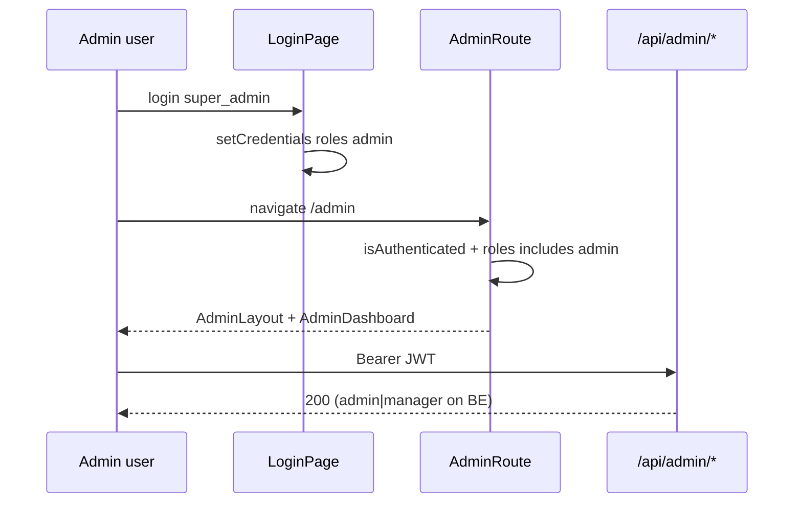

# Functional Requirement (FR) — Admin Route Guard & Admin Shell

## 1. Feature Overview

**`AdminRoute`** bảo vệ toàn bộ prefix `/admin/*`: yêu cầu đăng nhập + role **`admin`** trong `user.roles`, đồng thời bọc nội dung bằng **admin shell** (sidebar + main).

```
File: client/app/components/AdminRoute.jsx
Backend: /api/admin/* cần JWT + role admin|manager (lệch FE — manager bị chặn UI)
```

Admin shell **tách** khỏi storefront nav trong `Header` — nhưng route vẫn nested dưới `Layout` → vẫn có Header/Footer shop (xem `FR_AppLayoutNavigation`).

---

## 2. Actors

| Actor | Mô tả |
|-------|-------|
| **admin** | Pass guard + thấy sidebar |
| **manager** | BE API OK — **FE redirect `/`** (GAP) |
| **customer** | Redirect `/` |
| **guest** | Redirect `/login` |
| **AdminRoute / AdminLayout** | Guard + chrome |

---

## 3. Scope

### In Scope

- Auth check `isAuthenticated`.
- Role check `user?.roles?.includes("admin")`.
- `AdminLayout`: sidebar menu, logout, `children` trong `<main className="p-6">`.
- Tất cả route `admin/*` trong `App.jsx`.

### Out of Scope

- Permission granularity (`role_permissions` DB).
- Manager UI access.
- `AdminDashboard.jsx` inner `AdminLayout` function — **dead code**, không render.

---

## 4. Guard Logic

```jsx
export default function AdminRoute({ children }) {
  const dispatch = useDispatch();
  const { isAuthenticated, user } = useSelector((state) => state.auth);

  if (!isAuthenticated) {
    return <Navigate to="/login" replace />;
  }

  const isAdmin = user?.roles?.includes("admin");

  if (!isAdmin) {
    return <Navigate to="/" replace />;
  }

  const handleLogout = () => {
    dispatch(logout());
  };

  return <AdminLayout onLogout={handleLogout}>{children}</AdminLayout>;
}
```

| # | Business rule |
|---|----------------|
| BR-01 | **Chỉ** Redux `isAuthenticated` — **không** fallback `localStorage.token` (khác ProtectedRoute) |
| BR-02 | Role check **chỉ** string `"admin"` — không `manager` |
| BR-03 | Fail auth → `/login`; fail role → `/` (home) |
| BR-04 | Logout chỉ `dispatch(logout())` — **không** clear React Query / axios như `useLogout` (GAP) |
| BR-05 | `user.roles` từ login/OAuth/restore LS — phải có trong object `user` JSON |

---

## 5. Admin Sidebar Navigation

```javascript
const menuItems = [
  { title: "Dashboard", icon: "🏠", path: "/admin" },
  { title: "Analytics", icon: "📊", path: "/admin/analytics" },
  { title: "Sản phẩm", icon: "📦", path: "/admin/products" },
  { title: "Đơn hàng", icon: "🛒", path: "/admin/orders" },
  { title: "Người dùng", icon: "👥", path: "/admin/users" },
  { title: "Danh mục", icon: "📁", path: "/admin/categories" },
  { title: "Thương hiệu", icon: "🏷️", path: "/admin/brands" },
  { title: "Q&A", icon: "💬", path: "/admin/questions" },
];
```

| # | UX rule |
|---|---------|
| BR-06 | Active: `/admin` exact; path khác `startsWith` |
| BR-07 | Nav item dùng **`<a href={path}>`** — full page reload SPA (GAP) |
| BR-08 | Emoji icons — không Lucide như dead layout trong AdminDashboard |
| BR-09 | Không highlight `/admin/orders/:orderId` riêng — prefix `/admin/orders` OK |

### Entry từ storefront

`Header.jsx`:

```jsx
{user?.roles?.includes("admin") && (
  <Link to="/admin">Admin</Link>
)}
```

---

## 6. Admin Route Table (`App.jsx`)

| Path | Component |
|------|-----------|
| `/admin` | `AdminDashboard` (hub cards hoặc analytics nếu path analytics) |
| `/admin/analytics` | `AdminDashboard` → `AdminAnalyticsDashboard` |
| `/admin/products` | `AdminProducts` |
| `/admin/products/new` | `AdminProductNewPage` |
| `/admin/products/edit/:id` | `AdminProductEditPage` |
| `/admin/orders` | `AdminOrders` |
| `/admin/orders/:orderId` | `AdminOrders` (cùng component) |
| `/admin/users` | `AdminUsers` |
| `/admin/categories` | `AdminCategories` |
| `/admin/brands` | `AdminBrands` |
| `/admin/questions` | `AdminQuestions` |
| `/admin/questions/:question_id` | `AdminQuestionDetail` |

| # | Rule |
|---|------|
| BR-10 | Mỗi route bọc `<AdminRoute>` riêng — lặp wrapper, không layout route parent |
| BR-11 | `AdminDashboard` tại `/admin/analytics` render charts (`useAdminAnalytics`) |

---

## 7. AdminLayout Structure

```
┌─────────────────────────────────────────┐
│  Storefront Header (from Layout)         │
├──────────┬──────────────────────────────┤
│ Sidebar  │  main.p-6                     │
│ 256px    │  {children} — page content    │
│ + logout │                               │
├──────────┴──────────────────────────────┤
│  Storefront Footer (from Layout)         │
└─────────────────────────────────────────┘
```

```jsx
<div className="min-h-screen bg-gray-100 flex">
  <div className="w-64 bg-white shadow-lg">…nav…</div>
  <div className="flex-1">
    <main className="p-6">{children}</main>
  </div>
</div>
```

| # | Rule |
|---|------|
| BR-12 | Không mobile drawer trong `AdminRoute` layout — responsive hạn chế |
| BR-13 | `AdminDashboard.jsx` có layout mobile riêng **không** được dùng khi route qua AdminRoute |

---

## 8. Sequence — Admin login



---

## 9. Backend vs Frontend

| Role | `authorizeRoles("admin","manager")` | `AdminRoute` FE |
|------|-------------------------------------|-----------------|
| admin | ✅ | ✅ |
| manager | ✅ | ❌ → `/` |
| customer | ❌ 403 | ❌ |

---

## 10. Related FRs

| FR | Liên kết |
|----|----------|
| `FR_ProtectedRouteGuard.md` | Customer gate |
| `FR_RestoreAuthFromLocalStorage.md` | `user.roles` trong LS |
| `FR_AppLayoutNavigation.md` | Double chrome |
| `system/FR_RoleBasedAuthorizationMiddleware.md` | BE roles |
| `system/FR_SeedAdminScript.md` | Tạo admin |

---

## 11. Source Files

| File | Vai trò |
|------|---------|
| `client/app/components/AdminRoute.jsx` | Guard + AdminLayout |
| `client/app/App.jsx` | Admin routes L124–230 |
| `client/app/components/Header.jsx` | Link Admin |
| `client/app/pages/admin/AdminDashboard.jsx` | Dashboard/analytics content |
| `client/app/hooks/useOrders.js` | `useAdminAnalytics` |
| `server/routes/adminRoutes.js` | BE mount |

---

## 12. Acceptance Criteria

- [ ] Guest `/admin` → `/login`.
- [ ] Customer login → `/admin` → redirect `/`.
- [ ] Admin login → `/admin` → sidebar + dashboard.
- [ ] Sidebar link → tới đúng path (products, orders, …).
- [ ] Logout sidebar → Redux logged out (verify cart/query cleanup nếu cần).
- [ ] Manager: API Postman OK, FE `/admin` blocked.

---

## 13. Known Gaps

| # | Mô tả |
|---|--------|
| GAP-01 | **manager** không vào UI |
| GAP-02 | Admin logout **không** dùng `useLogout` — cache/header có thể sót |
| GAP-03 | `<a href>` sidebar — reload full page |
| GAP-04 | **Nested Layout** — Header/Footer shop trên admin |
| GAP-05 | Dead `AdminLayout` trong `AdminDashboard.jsx` — menu thiếu brands/Q&A trong dead code |
| GAP-06 | Không token fallback — race sau F5 nếu bootstrap chậm |
| GAP-07 | `roles` không restore từ `localStorage.roles` riêng — chỉ trong `user` JSON |
