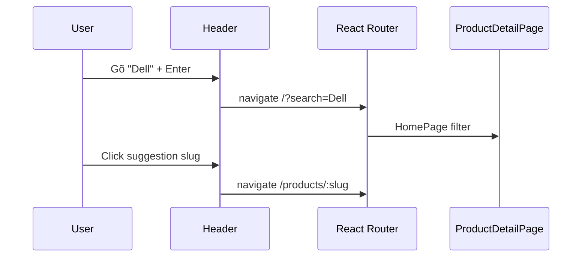

# Functional Requirement (FR) — App Layout & Navigation (Storefront Shell)

## 1. Feature Overview

**Layout shell** của storefront bọc hầu hết route React Router bằng khung cố định: **Header** (logo, tìm kiếm, auth, giỏ) + **`<Outlet />`** (nội dung trang) + **Footer** (link marketing/hỗ trợ).

```
Route tree: <Route path="/" element={<Layout />}> …children…
File: client/app/components/Layout.jsx
```

**Lưu ý kiến trúc:** Các route `/admin/*` cũng nằm **trong** `Layout` → admin vẫn thấy **Header + Footer storefront** phía trên/dưới, đồng thời `AdminRoute` thêm sidebar admin — **double chrome** (GAP).

---

## 2. Actors

| Actor | Mô tả |
|-------|-------|
| **Guest / Customer** | Điều hướng catalog, cart, login |
| **Admin** | Header link "Admin" + vào `/admin` |
| **Layout** | Shell component |
| **Header / Footer** | Navigation & chrome |
| **React Router** | `Outlet`, `Link`, `useNavigate` |

---

## 3. Scope

### In Scope

- `Layout.jsx`: `min-h-screen flex flex-col`, Header, main, Footer.
- `Header.jsx`: nav desktop/mobile, search, cart badge, auth menu.
- `Footer.jsx`: cột link, social placeholder.
- Route con trong `App.jsx` dưới `path="/"`.

### Out of Scope

- **Admin sidebar** (`AdminRoute.jsx` — FR riêng).
- Nội dung từng page (`HomePage`, `CheckoutPage`, …).
- Global error boundary / toast system.

---

## 4. Layout Component

```jsx
// client/app/components/Layout.jsx
export default function Layout() {
  return (
    <div className="min-h-screen flex flex-col">
      <Header />
      <main className="flex-1">
        <Outlet />
      </main>
      <Footer />
    </div>
  );
}
```

| # | Rule |
|---|------|
| BR-01 | Mọi child route render **trong** `<main>` |
| BR-02 | Header `sticky top-0 z-50` — luôn hiện khi scroll |
| BR-03 | `flex-1` main — footer đẩy xuống đáy viewport khi nội dung ngắn |

---

## 5. Route Map (children of Layout)

| Path | Protected | Layout chrome |
|------|-----------|---------------|
| `/` | Public | Header + Footer |
| `/products/:id` | Public | ✓ |
| `/cart` | Public* | ✓ (*API cart cần login để sync server) |
| `/login`, `/register` | Public | ✓ |
| `/oauth/success` | Public | ✓ |
| `/checkout` | ProtectedRoute | ✓ |
| `/checkout/success`, `/checkout/vnpay-return` | Public | ✓ |
| `/profile`, `/orders` | ProtectedRoute | ✓ |
| `/orders/:id` | Public | ✓ |
| `/admin/*` | AdminRoute | ✓ + admin sidebar |

Routes **ngoài** Layout: không có — mọi route trong `App.jsx` đều nested dưới `/`.

---

## 6. Header Navigation

### 6.1 Brand & search

| UI | Hành vi |
|----|---------|
| Logo "Laptop Lê Sơn" | `Link to="/"` |
| Search desktop `w-96` | Submit → `navigate('/?search=' + query)` |
| Search suggestions | `useSearchSuggestions` khi query ≥ 2 ký tự |
| Empty focus dropdown | MOCK_HISTORY + MOCK_TRENDING (chưa API) |
| Suggestion click | `navigate('/products/' + slug)` |

| # | Rule |
|---|------|
| BR-04 | `useGetCart()` gọi trong Header — prefetch cart khi có token |
| BR-05 | Cart badge = `sum(items.quantity)` từ Redux `cartSlice` |

### 6.2 Desktop nav — chưa đăng nhập

| Link | Path |
|------|------|
| Đăng nhập | `/login` |
| Đăng ký | `/register` (nút primary) |
| Giỏ | `/cart` |

### 6.3 Desktop nav — đã đăng nhập

| Link / action | Path / hành vi |
|---------------|----------------|
| Profile | `/profile` — hiển thị `full_name \|\| email` |
| Đơn hàng | `/orders` |
| Admin | `/admin` — **chỉ nếu** `user?.roles?.includes("admin")` |
| Đăng xuất | `useLogout()` + `navigate("/")` |
| Giỏ | `/cart` |

| # | Rule |
|---|------|
| BR-06 | Link Admin **không** hiện cho `manager` (chỉ check `admin`) |
| BR-07 | Logout dọn Redux cart, React Query cache, `pendingCheckout` |

### 6.4 Mobile menu

| # | Hành vi |
|---|---------|
| BR-08 | Hamburger toggle `isMenuOpen` |
| BR-09 | Form search mobile (không duplicate dropdown desktop đầy đủ) |
| BR-10 | Block nav mobile ghi `{/* ... Menu Mobile */}` — **nội dung nav có thể chưa đủ** (GAP) |

---

## 7. Footer Navigation

| Cột | Links (ví dụ) |
|-----|----------------|
| Sản phẩm | `/?category=gaming`, office, design, student |
| Hỗ trợ | `/about`, `/contact`, `/warranty`, `/shipping` |
| Tài khoản | `/login`, `/register`, `/orders` |

| # | Rule |
|---|------|
| BR-11 | Brand footer text "LaptopStore" — **khác** header "Laptop Lê Sơn" |
| BR-12 | Một số link (`/about`, …) **chưa** có route trong `App.jsx` → 404 hoặc catch-all thiếu (GAP) |
| BR-13 | Social icons `href="#"` placeholder |

---

## 8. Data dependencies (Header)

```javascript
const { user, isAuthenticated } = useSelector((state) => state.auth);
const { items } = useSelector((state) => state.cart);
useGetCart(); // React Query → GET /api/cart khi authenticated
```

Phụ thuộc `FR_RestoreAuthFromLocalStorage` + login để `isAuthenticated` và API cart hoạt động.

---

## 9. Sequence — Search to product



---

## 10. Related FRs

| FR | Liên kết |
|----|----------|
| `FR_ProtectedRouteGuard.md` | Checkout, profile, orders |
| `FR_AdminRouteGuard.md` | `/admin/*` nested trong Layout |
| `FR_RestoreAuthFromLocalStorage.md` | Header đọc Redux auth |
| `system/FR_JWTAuthenticationMiddleware.md` | API sau khi có token |
| `master_specification.md` §11.1 | Bảng route |

---

## 11. Source Files

| File | Vai trò |
|------|---------|
| `client/app/App.jsx` | Route tree, Router config |
| `client/app/components/Layout.jsx` | Shell |
| `client/app/components/Header.jsx` | Storefront nav |
| `client/app/components/Footer.jsx` | Footer links |
| `client/app/hooks/useCart.js` | `useGetCart` |
| `client/app/hooks/useProducts.js` | `useSearchSuggestions` |

---

## 12. Acceptance Criteria

- [ ] Mở `/` → thấy Header, HomePage, Footer.
- [ ] Guest: nav Đăng nhập / Đăng ký; không có Admin.
- [ ] User admin: thấy link Admin → vào `/admin`.
- [ ] Search submit → URL có `?search=`.
- [ ] Cart badge khớp số lượng Redux sau thêm giỏ.
- [ ] `/admin` vẫn có Header storefront (documented behavior).

---

## 13. Known Gaps

| # | Mô tả |
|---|--------|
| GAP-01 | **Admin trong Layout** — Header + Footer + admin sidebar |
| GAP-02 | **Hai AdminLayout** — `AdminDashboard.jsx` định nghĩa `AdminLayout` **không dùng**; sidebar thật ở `AdminRoute.jsx` |
| GAP-03 | Admin sidebar `AdminRoute` dùng `<a href>` — **full reload** thay vì `<Link>` |
| GAP-04 | Mobile menu nav chưa mirror desktop |
| GAP-05 | Footer routes chưa implement |
| GAP-06 | Brand name inconsistency Header vs Footer |
| GAP-07 | Search history/trending mock, không persist |
