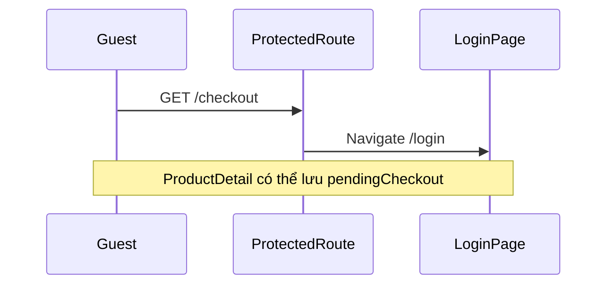

# Functional Requirement (FR) — Protected Route Guard (Customer Auth Gate)

## 1. Feature Overview

Component wrapper **`ProtectedRoute`** chặn truy cập các trang yêu cầu đăng nhập. Cho phép render children khi Redux `isAuthenticated === true` **hoặc** còn `localStorage.token` (bridge trước khi restore Redux xong).

```
File: client/app/components/ProtectedRoute.jsx
Redirect: <Navigate to="/login" replace />
```

**Khác** `AdminRoute`: không kiểm tra role — mọi user đã login (customer, admin, manager) đều qua.

---

## 2. Actors

| Actor | Mô tả |
|-------|-------|
| **Guest** | Bị redirect `/login` |
| **Authenticated user** | Vào được checkout, profile, orders list |
| **ProtectedRoute** | Guard component |
| **App.jsx** | Gắn guard lên route |

---

## 3. Scope

### In Scope

Routes bọc `ProtectedRoute` trong `App.jsx`:

| Path | Page |
|------|------|
| `/checkout` | `CheckoutPage` |
| `/profile` | `ProfilePage` |
| `/orders` | `OrdersPage` |

### Out of Scope (cùng app nhưng không bọc)

| Path | Lý do |
|------|--------|
| `/cart` | Public route — guest xem giỏ local/API tùy impl |
| `/orders/:id` | **Public** — chi tiết đơn không bọc ProtectedRoute |
| `/checkout/success`, `/checkout/vnpay-return` | Public — return URL VNPay / success COD |
| `/admin/*` | `AdminRoute` — FR riêng |
| `/login`, `/register` | Public |

---

## 4. Implementation

```jsx
// client/app/components/ProtectedRoute.jsx
export default function ProtectedRoute({ children }) {
  const { isAuthenticated } = useSelector((state) => state.auth);
  const hasToken = Boolean(localStorage.getItem("token"));

  if (!isAuthenticated && !hasToken) {
    return <Navigate to="/login" replace />;
  }

  return children;
}
```

| # | Business rule |
|---|----------------|
| BR-01 | Điều kiện pass: `isAuthenticated \|\| hasToken` (OR) |
| BR-02 | Fail → `Navigate` `/login` với `replace` (không stack history) |
| BR-03 | **Không** truyền `state.redirect` tự động — LoginPage có `?redirect=` thủ công (GAP) |
| BR-04 | Không gọi `/auth/me` validate token — tin localStorage/Redux |
| BR-05 | Token hết hạn vẫn pass guard cho đến khi API 401 (interceptor) |

---

## 5. So sánh với AdminRoute

| Tiêu chí | ProtectedRoute | AdminRoute |
|----------|----------------|------------|
| Cần login | Có (Redux hoặc token) | Có (`isAuthenticated` only) |
| Token fallback | **Có** `localStorage.token` | **Không** |
| Role | Bất kỳ | `admin` only |
| Redirect fail auth | `/login` | `/login` |
| Redirect fail role | — | `/` |
| Layout bọc thêm | Không | `AdminLayout` sidebar |

| # | Gap |
|---|-----|
| GAP-01 | User có token trong LS nhưng Redux chưa restore: ProtectedRoute **cho vào**, AdminRoute **đá login** |

---

## 6. Luồng người dùng

### 6.1 Guest → checkout



### 6.2 Sau login

`LoginPage` / `OAuthSuccess`:

- Đọc `localStorage.pendingCheckout` → `navigate('/checkout', { state })`
- Hoặc `?redirect=` query (login form)

ProtectedRoute sau login: `isAuthenticated` true → render `CheckoutPage`.

### 6.3 F5 trên /checkout

1. `main.jsx` bootstrap `setCredentials` từ LS.
2. `App.jsx` useEffect restore (backup nếu cần).
3. ProtectedRoute: `isAuthenticated` hoặc `hasToken` → OK.

---

## 7. Interaction với API layer

```javascript
// api.js request interceptor
const token = localStorage.getItem("token");
if (token) config.headers.Authorization = `Bearer ${token}`;
```

| # | Rule |
|---|------|
| BR-06 | Guard **không** set axios header — phụ thuộc bootstrap/login |
| BR-07 | 401 từ API → interceptor xóa LS + `window.location.href = "/login"` — mạnh hơn ProtectedRoute |

---

## 8. Pages behavior (sau khi qua guard)

| Page | API phụ thuộc JWT |
|------|-------------------|
| `CheckoutPage` | POST orders, shipping quote, geo |
| `ProfilePage` | GET/PUT profile |
| `OrdersPage` | GET orders list |

Guard chỉ **UI gate** — không đảm bảo API success.

---

## 9. Related FRs

| FR | Liên kết |
|----|----------|
| `FR_RestoreAuthFromLocalStorage.md` | Token bridge |
| `FR_AdminRouteGuard.md` | Admin gate |
| `FR_AppLayoutNavigation.md` | Layout bọc route |
| `orders/FR_CreateOrder.md` | Checkout |
| `auth/FR_Login.md` | Login success |

---

## 10. Source Files

| File | Vai trò |
|------|---------|
| `client/app/components/ProtectedRoute.jsx` | Guard |
| `client/app/App.jsx` | Route wiring L95–121 |
| `client/app/pages/LoginPage.jsx` | pendingCheckout redirect |
| `client/app/pages/ProductDetailPage.jsx` | Lưu pendingCheckout guest |
| `client/app/services/api.js` | 401 interceptor |

---

## 11. Acceptance Criteria

- [ ] Guest `/checkout` → redirect `/login`.
- [ ] User login → `/checkout` render CheckoutPage.
- [ ] F5 `/profile` với token hợp lệ trong LS → không redirect login.
- [ ] Xóa token + logout Redux → `/orders` redirect login.
- [ ] Admin user vào `/checkout` được (không cần role customer).

---

## 12. Known Gaps

| # | Mô tả |
|---|--------|
| GAP-01 | Không preserve `from` URL — UX quay lại checkout thủ công / pendingCheckout |
| GAP-02 | `hasToken` without valid JWT → flash protected page rồi 401 |
| GAP-03 | `/orders/:id` public — lộ đơn nếu biết ID (authorization server-side) |
| GAP-04 | Không đồng bộ với `useCurrentUser` refresh — hook tồn tại nhưng không mount global |
| GAP-05 | StrictMode double mount — restore logic ở App có thể log duplicate |
