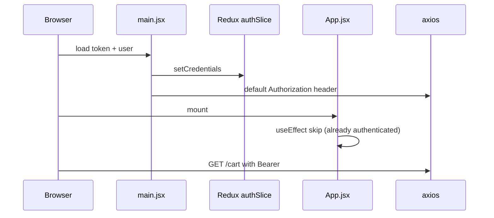

# Functional Requirement (FR) — Restore Auth From LocalStorage (Session Bootstrap)

## 1. Feature Overview

Khi user đã login trước đó, FE **khôi phục phiên** từ `localStorage` (token + user JSON) vào Redux + axios **trước / khi** app render — để F5 không mất đăng nhập và API gọi kèm `Authorization` ngay.

**Hai lớp bootstrap** (cùng tồn tại trong code):

| # | Vị trí | Thời điểm |
|---|--------|-----------|
| A | `main.jsx` | **Trước** `ReactDOM.createRoot` |
| B | `App.jsx` `useEffect` | Sau mount, nếu `!isAuthenticated` |

Ghi nhận: `setCredentials` trong `authSlice` **cũng ghi** lại localStorage khi dispatch.

---

## 2. Actors

| Actor | Mô tả |
|-------|-------|
| **Returning user** | F5, mở tab mới cùng origin |
| **authSlice** | `setCredentials`, `logout` |
| **main.jsx** | Eager bootstrap |
| **App.jsx** | Secondary restore + pendingCheckout cleanup |
| **api.js** | Interceptor đọc token mỗi request |

---

## 3. Scope

### In Scope

- Keys: `token`, `user` (bắt buộc cho restore); `roles` (phụ — login/OAuth set riêng).
- Redux: `isAuthenticated`, `user`, `token`.
- Axios: `api.defaults.headers.common.Authorization`.
- Parse JSON user; clear invalid data.
- Side effect: xóa `pendingCheckout` cũ (>5 phút) khi authenticated.

### Out of Scope

- httpOnly cookies / refresh token.
- Server session store.
- `sessionStorage`.
- Auto `GET /auth/me` on every app load (hook có nhưng **không** mount global).

---

## 4. LocalStorage Contract

| Key | Format | Ghi bởi | Đọc bởi |
|-----|--------|---------|---------|
| `token` | JWT string | `setCredentials`, `useLogin`, `main.jsx`, OAuth | Bootstrap, interceptors, guards |
| `user` | `JSON.stringify({ user_id, username, email, roles, … })` | `setCredentials` | Bootstrap, một số page fallback |
| `roles` | `JSON.stringify(string[])` | `useLogin`, `useCurrentUser` | `ProductDetailPage` (legacy check) |
| `pendingCheckout` | JSON + `timestamp` | Guest checkout flow | Login/OAuth/App cleanup |

### `user` object kỳ vọng

```json
{
  "user_id": 1,
  "username": "super_admin",
  "email": "admin@laptopstore.com",
  "full_name": "System Administrator",
  "phone_number": "...",
  "avatar_url": null,
  "roles": ["admin"]
}
```

| # | Rule |
|---|------|
| BR-01 | `roles` **nên** nằm trong `user` cho AdminRoute/Header |
| BR-02 | `localStorage.roles` duplicate — không đọc khi bootstrap (GAP đồng bộ) |

---

## 5. Bootstrap A — `main.jsx` (primary)

```javascript
const token = localStorage.getItem("token");
const rawUser = localStorage.getItem("user");
if (token && rawUser) {
  try {
    const user = JSON.parse(rawUser);
    store.dispatch(setCredentials({ token, user }));
    api.defaults.headers.common.Authorization = `Bearer ${token}`;
  } catch (_) {}
}
```

| # | Rule |
|---|------|
| BR-03 | Chạy **đồng bộ** trước render — first paint đã `isAuthenticated: true` nếu data hợp lệ |
| BR-04 | Parse lỗi → **im lặng** — không xóa LS (khác App.jsx) |
| BR-05 | `setCredentials` → ghi lại token/user vào LS (idempotent) |

---

## 6. Bootstrap B — `App.jsx` (secondary)

```javascript
useEffect(() => {
  const token = localStorage.getItem("token");
  const userStr = localStorage.getItem("user");

  if (token && userStr && !isAuthenticated) {
    try {
      const user = JSON.parse(userStr);
      dispatch(setCredentials({ token, user }));
    } catch (error) {
      localStorage.removeItem("token");
      localStorage.removeItem("user");
      localStorage.removeItem("roles");
    }
  }
}, [dispatch, isAuthenticated]);
```

| # | Rule |
|---|------|
| BR-06 | Chỉ chạy khi `!isAuthenticated` — tránh loop sau bootstrap A |
| BR-07 | Parse fail → **xóa** token, user, roles |
| BR-08 | **Không** set axios header ở đây — giả định main.jsx đã set hoặc interceptor per-request |
| BR-09 | `console.log` debug auth restore |

---

## 7. authSlice `setCredentials` / `logout`

```javascript
setCredentials: (state, action) => {
  state.user = action.payload.user;
  state.token = action.payload.token;
  state.isAuthenticated = true;
  localStorage.setItem("token", action.payload.token);
  localStorage.setItem("user", JSON.stringify(action.payload.user));
},
logout: (state) => {
  state.user = null;
  state.token = null;
  state.isAuthenticated = false;
  localStorage.removeItem("token");
  localStorage.removeItem("user");
  localStorage.removeItem("roles");
},
```

| # | Rule |
|---|------|
| BR-10 | Login success: `useLogin` cũng `setAuthHeader` + `localStorage.roles` |
| BR-11 | Logout đầy đủ hơn qua `useLogout` (query cache) vs `AdminRoute` logout |

---

## 8. Writers (ai ghi LS)

| Luồng | Ghi token/user | Ghi roles |
|-------|----------------|-----------|
| `useLogin` onSuccess | ✓ (+ dispatch setCredentials) | ✓ `localStorage.roles` |
| `register` direct | ✓ setCredentials | hardcode trong response |
| `OAuthSuccess` | ✓ + GET `/auth/me` | từ `data.user.roles` trong setCredentials |
| `verifyEmail` redirect | FE `/oauth/success?token=` | sau /me |
| F5 restore | đọc | không refresh roles file |

---

## 9. Readers & consumers

| Consumer | Cách đọc auth |
|----------|----------------|
| `api` request interceptor | `localStorage.getItem("token")` mỗi request |
| `ProtectedRoute` | Redux + `hasToken` fallback |
| `AdminRoute` | Redux only |
| `Header` | Redux `user`, `isAuthenticated` |
| `ProductDetailPage` | Redux + fallback parse `user` + `roles` key |
| `api` 401 interceptor | Xóa token, user, roles + Redux logout |

---

## 10. pendingCheckout cleanup (`App.jsx`)

```javascript
useEffect(() => {
  if (isAuthenticated) {
    const pendingCheckoutStr = localStorage.getItem("pendingCheckout");
    // Parse timestamp — remove if older than 5 minutes
    if (Date.now() - timestamp > 300000) {
      localStorage.removeItem("pendingCheckout");
    }
  }
}, [isAuthenticated]);
```

| # | Rule |
|---|------|
| BR-12 | Tránh checkout “ma” sau khi login từ session cũ |
| BR-13 | Login/OAuth **ưu tiên** dùng pendingCheckout trước khi cleanup xóa |

---

## 11. Sequence — F5 authenticated



---

## 12. Failure & expiry

| Sự kiện | Hành vi |
|---------|---------|
| JWT expired | API 401 → interceptor clear LS + redirect `/login` |
| Invalid user JSON (App path) | Clear LS keys |
| Invalid user JSON (main path) | Silent skip — có thể kẹt guest với token rời |
| User deactivated server | 403 on API — interceptor có thể coi như 401 case |

---

## 13. Related FRs

| FR | Liên kết |
|----|----------|
| `FR_ProtectedRouteGuard.md` | `hasToken` bridge |
| `FR_AdminRouteGuard.md` | Cần `user.roles` trong restored user |
| `system/FR_JWTAuthenticationMiddleware.md` | BE verify |
| `auth/FR_Login.md` | Writer |
| `master_specification.md` §13.1 | JWT storage |

---

## 14. Source Files

| File | Vai trò |
|------|---------|
| `client/app/main.jsx` | Bootstrap A |
| `client/app/App.jsx` | Bootstrap B, pendingCheckout |
| `client/app/store/slices/authSlice.js` | Persist on setCredentials |
| `client/app/hooks/useAuth.js` | Login/logout/me |
| `client/app/services/api.js` | Interceptors |
| `client/app/pages/OAuthSuccess.jsx` | OAuth restore |
| `client/app/pages/LoginPage.jsx` | pendingCheckout |

---

## 15. Acceptance Criteria

- [ ] Login → F5 → vẫn đăng nhập, Header hiện user.
- [ ] F5 → request API có header Authorization.
- [ ] Corrupt `user` JSON → App effect xóa LS; user thấy guest.
- [ ] Logout → token/user/roles removed.
- [ ] Admin restore → link Admin visible sau F5.
- [ ] OAuth token query → /me → Redux + LS populated.

---

## 16. Known Gaps

| # | Mô tả |
|---|--------|
| GAP-01 | **Dual bootstrap** — redundant, khó debug |
| GAP-02 | `main.jsx` catch không purge invalid LS |
| GAP-03 | `localStorage.roles` có thể **lệch** `user.roles` |
| GAP-04 | Không refresh profile từ `/auth/me` on load — stale avatar/phone |
| GAP-05 | `useCurrentUser` / `useMe` không gắn App root |
| GAP-06 | Token trong LS — XSS surface |
| GAP-07 | StrictMode double effect logs |
| GAP-08 | Register returns token nhưng roles hardcoded `["customer"]` trong response body |
