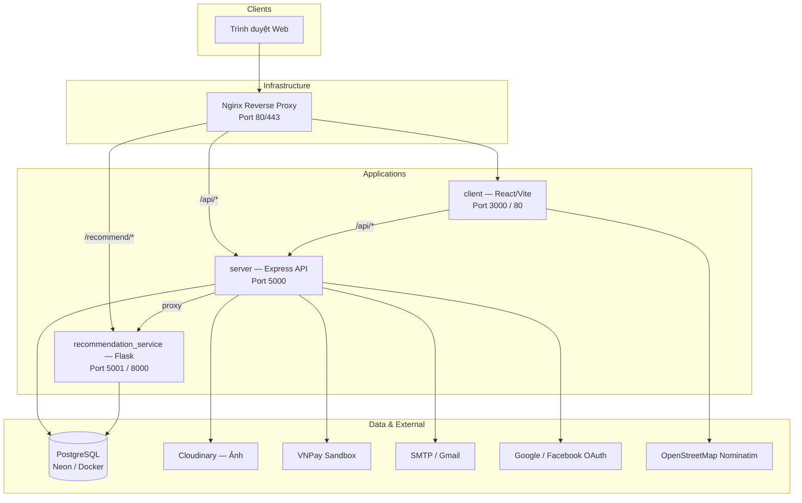
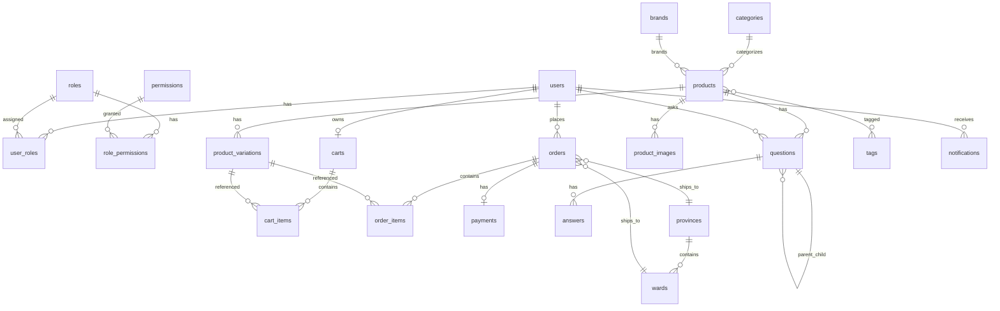
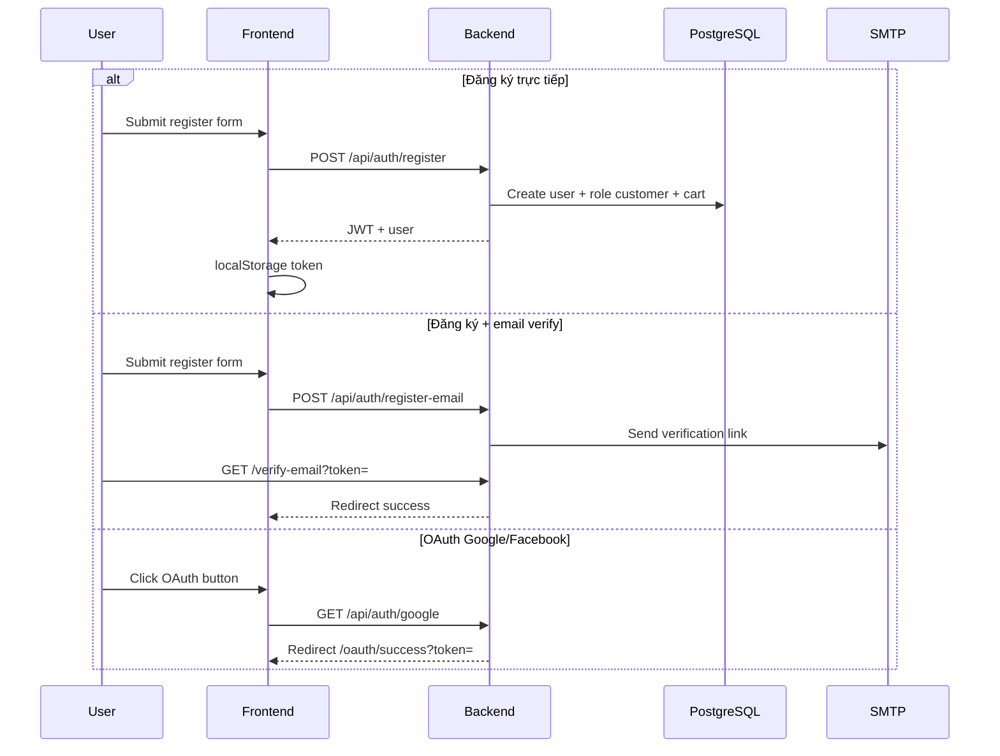
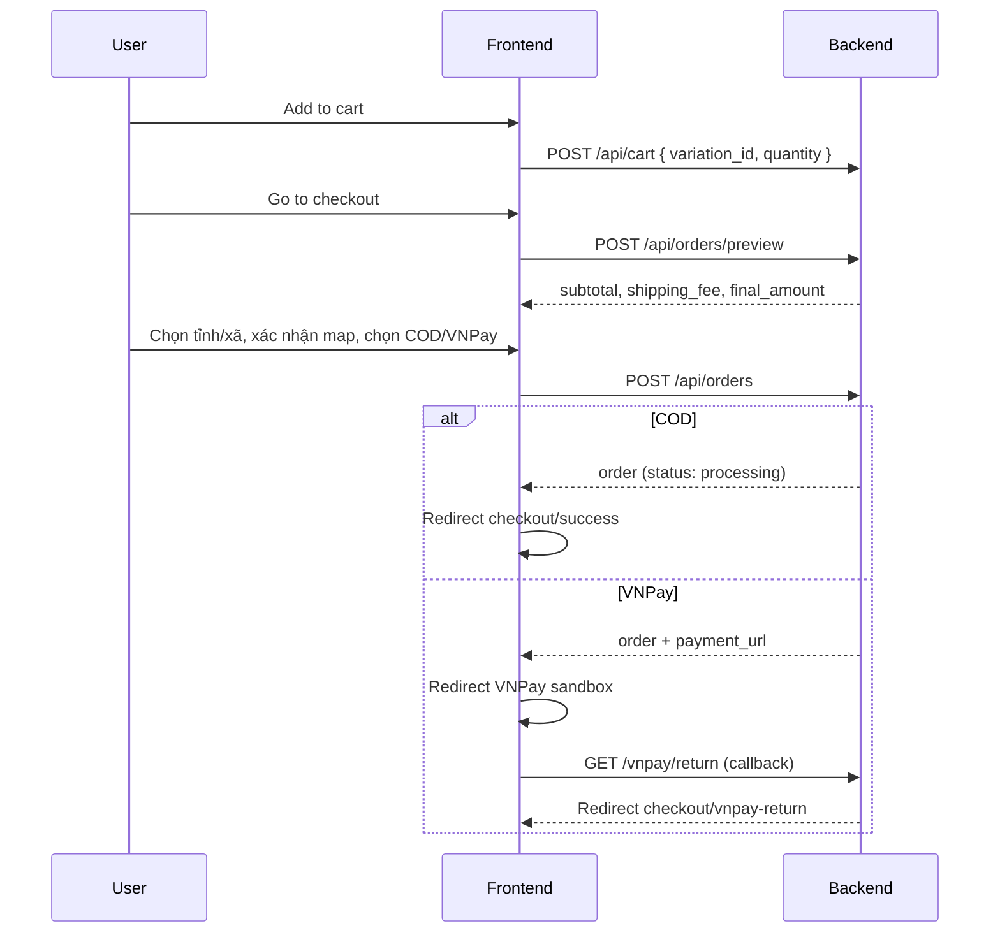

# Master Specification — LaptopStore (laptop_NEW)

> **Phiên bản tài liệu:** 1.0  
> **Ngày cập nhật:** 2026-05-26  
> **Trạng thái dự án:** MVP — đã triển khai đầy đủ luồng mua bán laptop, admin panel, thanh toán VNPay/COD, gợi ý sản phẩm KNN  
> **Thị trường mục tiêu:** Việt Nam (VNPay, tỉnh/thành–phường/xã, giao diện tiếng Việt)

---

## Mục lục

1. [Tổng quan dự án](#1-tổng-quan-dự-án)
2. [Kiến trúc hệ thống](#2-kiến-trúc-hệ-thống)
3. [Công nghệ sử dụng](#3-công-nghệ-sử-dụng)
4. [Cấu trúc thư mục](#4-cấu-trúc-thư-mục)
5. [Định nghĩa đối tượng (Actors)](#5-định-nghĩa-đối-tượng-actors)
6. [Phạm vi MVP — Tính năng cốt lõi](#6-phạm-vi-mvp--tính-năng-cốt-lõi)
7. [Ngoài phạm vi MVP & Hạn chế hiện tại](#7-ngoài-phạm-vi-mvp--hạn-chế-hiện-tại)
8. [Mô hình dữ liệu (Domain Model)](#8-mô-hình-dữ-liệu-domain-model)
9. [API — Tổng quan endpoint](#9-api--tổng-quan-endpoint)
10. [Luồng nghiệp vụ chính](#10-luồng-nghiệp-vụ-chính)
11. [Frontend — Trang & tính năng](#11-frontend--trang--tính-năng)
12. [Recommendation Service (KNN)](#12-recommendation-service-knn)
13. [Xác thực & Phân quyền](#13-xác-thực--phân-quyền)
14. [Tích hợp bên thứ ba](#14-tích-hợp-bên-thứ-ba)
15. [DevOps — Docker, Nginx, CI/CD](#15-devops--docker-nginx-cicd)
16. [Biến môi trường & Cấu hình](#16-biến-môi-trường--cấu-hình)
17. [Nợ kỹ thuật & Khoảng trống cần xử lý](#17-nợ-kỹ-thuật--khoảng-trống-cần-xử-lý)
18. [Chỉ mục tài liệu liên quan](#18-chỉ-mục-tài-liệu-liên-quan)

---

## 1. Tổng quan dự án

### 1.1. Mô tả

**LaptopStore** (`laptop_NEW`) là nền tảng **thương mại điện tử chuyên bán laptop**, hướng tới thị trường Việt Nam. Hệ thống gồm:

- **Cửa hàng trực tuyến (Storefront):** Danh mục sản phẩm laptop với bộ lọc kỹ thuật nâng cao (CPU, RAM, ổ cứng, GPU, màn hình, trọng lượng), so sánh sản phẩm, hỏi đáp, giỏ hàng, thanh toán.
- **Tài khoản người dùng:** Đăng ký/đăng nhập JWT, xác minh email, quên/đặt lại mật khẩu, OAuth Google/Facebook.
- **Đặt hàng & Thanh toán:** COD và VNPay (sandbox), tính phí vận chuyển theo tỉnh/thành–phường/xã, xác nhận vị trí giao hàng trên bản đồ.
- **Bảng quản trị (Admin Panel):** CRUD sản phẩm/biến thể, đơn hàng, người dùng, danh mục, thương hiệu, Q&A, dashboard phân tích doanh thu.
- **Dịch vụ gợi ý (Recommendation):** Microservice Python Flask dùng thuật toán **K-Nearest Neighbors (KNN)** trên không gian đặc trưng giá + hiệu năng.

### 1.2. Mục tiêu sản phẩm

| Mục tiêu | Mô tả |
|----------|-------|
| Bán laptop trực tuyến | Catalog phong phú với biến thể SKU (cấu hình khác nhau cho cùng một model) |
| Trải nghiệm mua sắm thông minh | Lọc theo thông số kỹ thuật, so sánh, gợi ý laptop tương tự |
| Thanh toán Việt Nam | Hỗ trợ COD và VNPay phổ biến tại VN |
| Vận hành nội bộ | Admin quản lý toàn bộ catalog, đơn hàng, người dùng |
| Triển khai container hóa | Docker Compose + Nginx + CI/CD GitHub Actions |

### 1.3. Kiến trúc tổng thể (Monorepo)

Dự án là **monorepo** gồm 3 ứng dụng độc lập chia sẻ cùng PostgreSQL:

```
laptop_NEW/
├── client/                  → React SPA (Vite)
├── server/                  → Express REST API (Sequelize ORM)
├── recommendation_service/  → Flask ML microservice
├── nginx/                   → Reverse proxy (production)
├── docs/                    → Tài liệu dự án (file này)
├── docker-compose.yml       → Dev/local stack
├── docker-compose.prod.yml  → Production stack
├── READMEAPI.md             → Chi tiết API contract
├── DOCKER_README.md         → Hướng dẫn Docker
└── env-example.txt          → Template biến môi trường
```

---

## 2. Kiến trúc hệ thống

### 2.1. Sơ đồ thành phần



### 2.2. Mô hình giao tiếp

| Luồng | Giao thức | Ghi chú |
|-------|-----------|---------|
| Frontend ↔ Backend | REST JSON qua `/api/*` | JWT Bearer token |
| Backend ↔ Recommendation | HTTP proxy nội bộ | `GET /recommend?variation_id=` |
| Backend ↔ PostgreSQL | Sequelize ORM | SSL khi dùng Neon |
| Backend ↔ VNPay | Redirect URL + HMAC-SHA512 | Sandbox |
| Backend ↔ Cloudinary | Multer upload | Ảnh sản phẩm, logo, icon |
| Frontend ↔ Nominatim | HTTP trực tiếp | Geocoding checkout |

### 2.3. Nguyên tắc thiết kế

- **Monolith API + Microservice ML:** Logic nghiệp vụ chính tập trung ở `server/`; gợi ý sản phẩm tách riêng để train/deploy độc lập.
- **SKU-level inventory:** Tồn kho và giá quản lý ở cấp `product_variations`, không phải cấp `products`.
- **Stock reservation:** Khi đặt hàng VNPay, trừ kho ngay và giữ 24h; cron job hoàn trả nếu hết hạn.
- **Rule-based shipping:** Phí ship tính từ bảng `provinces` + `wards`, không tích hợp đơn vị vận chuyển thật (GHN/GHTK).

---

## 3. Công nghệ sử dụng

### 3.1. Backend (`server/`)

| Thành phần | Công nghệ | Phiên bản |
|------------|-----------|-----------|
| Runtime | Node.js | 18+ |
| Framework | Express | 4.18 |
| ORM | Sequelize | 6.37 |
| Database driver | pg | 8.16 |
| Auth | jsonwebtoken, bcryptjs, Passport | JWT 7 ngày |
| Upload | multer + multer-storage-cloudinary | Cloudinary |
| Email | nodemailer | SMTP |
| Cron | node-cron | Mỗi 2 phút |
| Validation | express-validator | — |

### 3.2. Frontend (`client/`)

| Thành phần | Công nghệ | Phiên bản |
|------------|-----------|-----------|
| UI Framework | React | 18.2 |
| Build tool | Vite | 5.4 |
| Routing | React Router | 7.9 |
| State | Redux Toolkit + React Query | RTK 2.0, RQ 5.14 |
| Styling | Tailwind CSS | 3.4 |
| Charts (Admin) | Recharts | 3.6 |
| Map | Leaflet + react-leaflet | 1.9 / 4.2 |
| Rich text (Admin) | react-quill | 2.0 |
| Icons | lucide-react, react-icons | — |

### 3.3. Recommendation Service (`recommendation_service/`)

| Thành phần | Công nghệ |
|------------|-----------|
| Runtime | Python 3.11 |
| Web framework | Flask 3 |
| ML/Numeric | numpy, pandas, scikit-learn (MinMaxScaler), joblib |
| DB access | SQLAlchemy |
| CORS | flask-cors |

### 3.4. Hạ tầng

| Thành phần | Công nghệ |
|------------|-----------|
| Database | PostgreSQL 15 (Docker) / Neon Serverless (production) |
| Container | Docker + Docker Compose |
| Reverse proxy | Nginx Alpine |
| CI/CD | GitHub Actions → Docker Hub → SSH deploy |

---

## 4. Cấu trúc thư mục

### 4.1. Backend — `server/`

```
server/
├── server.js              # Entry point — mount routes, cron, DB connect
├── seedAdmin.js           # Tạo tài khoản admin mặc định
├── config/
│   ├── database.js        # Sequelize → NEON_DATABASE_URL
│   └── passport.js        # Google/Facebook OAuth strategies
├── controllers/
│   ├── authController.js
│   ├── productController.js
│   ├── cartController.js
│   ├── orderController.js
│   ├── adminController.js
│   ├── questionsController.js
│   ├── vnpayController.js
│   └── shippingController.js
├── routes/
│   ├── authRoutes.js
│   ├── authSocialRoutes.js
│   ├── productRoutes.js
│   ├── cartRoutes.js
│   ├── orderRoutes.js
│   ├── adminRoutes.js
│   ├── geo.js
│   ├── vnpayRoutes.js
│   └── shippingRoutes.js
├── models/                # Sequelize models (18 entities)
├── middleware/
│   ├── auth.js            # JWT + role authorization
│   ├── errorHandler.js
│   └── upload.js          # Cloudinary multer
├── services/
│   ├── vnpayService.js
│   ├── shippingService.js
│   └── emailService.js
├── jobs/
│   └── releaseReservations.js  # Cron: hoàn kho đơn VNPay hết hạn
└── utils/
    └── slugifyVN.js
```

### 4.2. Frontend — `client/app/`

```
client/app/
├── main.jsx               # React entry
├── App.jsx                # Router definitions
├── pages/
│   ├── HomePage.jsx
│   ├── ProductDetailPage.jsx
│   ├── CartPage.jsx
│   ├── CheckoutPage.jsx
│   ├── LoginPage.jsx, RegisterPage.jsx
│   ├── ProfilePage.jsx
│   ├── OrdersPage.jsx, OrderDetailPage.jsx
│   ├── OAuthSuccess.jsx
│   ├── checkout/VnpayReturn.jsx, CheckoutSuccessPage.jsx
│   └── admin/             # AdminDashboard, Products, Orders, Users, ...
├── components/            # Layout, Header, ProductCard, MapPicker, ...
├── hooks/                 # useProducts, useCart, useOrders, useAuth, ...
├── store/slices/          # authSlice, cartSlice, compareSlice, uiSlice
└── services/api.js        # Axios client
```

### 4.3. Recommendation — `recommendation_service/`

```
recommendation_service/
├── app.py                 # Flask entry — /health, /recommend
├── train_recommend.py     # Offline training → artifacts/
├── core/
│   ├── recommend.py       # recommend_core() — KNN + fresh pool
│   ├── knn_numpy.py       # Weighted Euclidean KNN
│   ├── features.py        # Performance score calculation
│   ├── bench.py           # CPU/GPU benchmark lookup
│   ├── rules.py           # Rule-based fallback scoring
│   ├── recency.py         # Fresh item recency boost
│   ├── db.py              # SQLAlchemy queries
│   └── config.py          # Hyperparameters & paths
├── data/
│   ├── cpu_benchmark.json
│   └── gpu_benchmark.json
└── artifacts/             # Generated: .pkl, .npy, .joblib (không commit)
```

---

## 5. Định nghĩa đối tượng (Actors)

| Actor | Mô tả | Quyền hạn chính |
|-------|-------|-----------------|
| **Guest (Khách)** | Người dùng chưa đăng nhập | Xem catalog, lọc, so sánh, đọc Q&A; không thêm giỏ/đặt hàng |
| **Customer (Khách hàng)** | Người dùng đã đăng ký, role `customer` | Giỏ hàng, checkout, đặt hàng, hủy đơn, đổi phương thức thanh toán/địa chỉ, đặt câu hỏi |
| **Admin** | Quản trị viên, role `admin` | Toàn quyền admin panel (FE gate chỉ cho `admin`) |
| **Manager** | Quản lý, role `manager` | Backend cho phép truy cập `/api/admin/*` (FE **chưa** hỗ trợ) |
| **System (Cron Job)** | `releaseReservations.js` | Tự động hủy đơn VNPay hết hạn, hoàn kho, đánh fail payment |

---

## 6. Phạm vi MVP — Tính năng cốt lõi

### 6.1. Storefront — Cửa hàng

| # | Tính năng | Mô tả | Trạng thái |
|---|-----------|-------|------------|
| 1 | Danh mục sản phẩm | Grid laptop với phân trang | ✅ Hoàn thiện |
| 2 | Lọc nâng cao (v2) | category, brand, price range, processor, RAM, storage, GPU, screen_size, weight | ✅ Hoàn thiện |
| 3 | Sắp xếp | price_asc, price_desc, newest, best_selling | ✅ Hoàn thiện |
| 4 | Tìm kiếm | Full-text search + search suggestions | ✅ Hoàn thiện |
| 5 | Facets | Bộ đếm/filter động theo catalog | ✅ Hoàn thiện |
| 6 | Chi tiết sản phẩm | Slug hoặc ID, chọn biến thể, gallery ảnh, specs JSONB | ✅ Hoàn thiện |
| 7 | So sánh sản phẩm | Tối đa 3 biến thể, Redux + API compare | ✅ Hoàn thiện |
| 8 | Gợi ý sản phẩm | KNN proxy qua backend | ✅ Hoàn thiện (cần train artifacts) |
| 9 | Hỏi đáp (Q&A) | Global (trang chủ) + theo sản phẩm | ✅ Hoàn thiện |
| 10 | Giỏ hàng | CRUD, snapshot giá tại thời điểm thêm | ✅ Hoàn thiện |

### 6.2. Tài khoản & Xác thực

| # | Tính năng | Trạng thái |
|---|-----------|------------|
| 1 | Đăng ký trực tiếp (JWT ngay) | ✅ |
| 2 | Đăng ký + xác minh email | ✅ |
| 3 | Đăng nhập username/password | ✅ |
| 4 | Quên/đặt lại mật khẩu | ✅ |
| 5 | OAuth Google | ✅ |
| 6 | OAuth Facebook | ✅ |
| 7 | Cập nhật profile | ✅ |
| 8 | Tự tạo giỏ hàng khi đăng ký/OAuth | ✅ |

### 6.3. Đặt hàng & Thanh toán

| # | Tính năng | Trạng thái |
|---|-----------|------------|
| 1 | Checkout từ giỏ hoặc Mua ngay (buy_now) | ✅ |
| 2 | Preview đơn hàng (tính phí ship trước) | ✅ |
| 3 | Chọn tỉnh/thành + phường/xã | ✅ |
| 4 | Xác nhận vị trí trên bản đồ (geo_lat/lng) | ✅ |
| 5 | Thanh toán COD | ✅ → status `processing` |
| 6 | Thanh toán VNPay (QR, Bank, IntCard, Installment) | ✅ → status `AWAITING_PAYMENT` |
| 7 | Giữ kho 24h cho VNPay | ✅ |
| 8 | Cron hoàn kho đơn hết hạn | ✅ (mỗi 2 phút) |
| 9 | Retry thanh toán VNPay | ✅ |
| 10 | Đổi phương thức thanh toán sau đặt | ✅ |
| 11 | Cập nhật địa chỉ giao hàng | ✅ |
| 12 | Hủy đơn (user) | ✅ |
| 13 | Tab đơn hàng + counters | ✅ |
| 14 | Email xác nhận/cập nhật đơn | ✅ (khi SMTP cấu hình) |

### 6.4. Admin Panel

| # | Tính năng | Trạng thái |
|---|-----------|------------|
| 1 | Dashboard analytics (Recharts) | ✅ |
| 2 | Sales analytics | ✅ |
| 3 | CRUD sản phẩm + biến thể + upload ảnh | ✅ |
| 4 | CRUD danh mục (category) | ✅ |
| 5 | CRUD thương hiệu (brand) | ✅ |
| 6 | Quản lý đơn hàng (list, detail, status) | ✅ |
| 7 | Ship / Deliver / Refund đơn | ✅ |
| 8 | Quản lý người dùng (list, active/inactive, roles) | ✅ |
| 9 | Quản lý roles | ✅ |
| 10 | Kiểm duyệt Q&A (list, detail, trả lời) | ✅ |

### 6.5. Recommendation Service

| # | Tính năng | Trạng thái |
|---|-----------|------------|
| 1 | KNN trên (price, performance_score) | ✅ |
| 2 | CPU/GPU benchmark lookup + rule fallback | ✅ |
| 3 | Fresh pool (sản phẩm mới 60 ngày) | ✅ |
| 4 | Recency boost | ✅ |
| 5 | Dedup theo product_id | ✅ |
| 6 | Offline training script | ✅ |
| 7 | Health endpoint | ✅ |

### 6.6. DevOps

| # | Tính năng | Trạng thái |
|---|-----------|------------|
| 1 | docker-compose (dev) | ✅ |
| 2 | docker-compose.prod | ✅ |
| 3 | Nginx reverse proxy | ✅ |
| 4 | GitHub Actions CI/CD | ✅ (deploy path placeholder) |

---

## 7. Ngoài phạm vi MVP & Hạn chế hiện tại

### 7.1. Chưa triển khai (Out of Scope)

| Hạng mục | Ghi chú |
|----------|---------|
| Đánh giá sản phẩm (Reviews) | Model có `rating_average`, `review_count` nhưng **không có API/UI review** |
| Thông báo in-app | Model `Notification` tồn tại, **không có route/UI** |
| Tags sản phẩm | Model `Tag` + junction `product_tags`, **không expose feature** |
| Permission-based auth | Model `Permission` tồn tại, chỉ dùng **role-based** |
| VNPay IPN webhook | Chỉ có Return URL, **không có `/vnpay/ipn`** |
| Đơn vị vận chuyển thật | GHN, GHTK, Viettel Post — **không tích hợp** |
| SMS OTP | **Không có** |
| Mobile app | Chỉ web responsive |
| Real-time (WebSocket) | `socket.io` trong package.json nhưng **không sử dụng** |
| Đa ngôn ngữ (i18n) | Chỉ tiếng Việt |
| Seller marketplace | Không có shop riêng, chỉ admin quản lý catalog |

### 7.2. Triển khai một phần / Không nhất quán

| Hạng mục | Chi tiết |
|----------|----------|
| ML artifacts | File `.pkl`, `.npy`, `.joblib` **không commit** — phải chạy `train_recommend.py` |
| `server/init.sql` | Docker compose mount file này nhưng **file không tồn tại** |
| Admin answer update/delete | Controller có logic, **route chưa mount** |
| Role `manager` | Backend OK, **Frontend AdminRoute chỉ check `admin`** |
| Env var naming | `NEON_DATABASE_URL` vs `DATABASE_URL`, `VNP_*` vs `VNPAY_*`, `RECO_API_BASE` vs `RECOMMENDATION_SERVICE_URL` |
| Recommendation port | `app.py` default 8000, Docker expose 5001 |
| Health check Dockerfile | Hit `/health` nhưng app serve `/api/health` |
| Geo API mismatch | FE gọi `/wards/:id/centroid` — **backend không có** |
| Ward API path | FE có thể gọi `/wards` — server dùng `/provinces/:id/wards` |

---

## 8. Mô hình dữ liệu (Domain Model)

### 8.1. Sơ đồ quan hệ tổng quan



### 8.2. Bảng dữ liệu chi tiết

#### `users`

| Cột | Kiểu | Mô tả |
|-----|------|-------|
| user_id | INTEGER PK | Auto increment |
| username | VARCHAR(50) UNIQUE | Bắt buộc |
| email | VARCHAR(100) UNIQUE | Bắt buộc, validate email |
| password_hash | VARCHAR(255) | Nullable (OAuth user) |
| full_name | VARCHAR(100) | |
| phone_number | VARCHAR(20) UNIQUE | Nullable |
| address | TEXT | |
| avatar_url | VARCHAR(255) | |
| is_active | BOOLEAN | Default true |
| last_login | DATE | |
| oauth_provider | VARCHAR(20) | `google` / `facebook` |
| oauth_id | VARCHAR(191) | Provider subject ID |

#### `products`

| Cột | Kiểu | Mô tả |
|-----|------|-------|
| product_id | INTEGER PK | |
| product_name | VARCHAR(255) | |
| slug | VARCHAR(255) UNIQUE | URL-friendly |
| description | TEXT | |
| category_id | INTEGER FK | → categories |
| brand_id | INTEGER FK | → brands |
| discount_percentage | DECIMAL(5,2) | % giảm giá áp dụng cho mọi biến thể |
| thumbnail_url | VARCHAR(255) | |
| is_active | BOOLEAN | |
| view_count | INTEGER | |
| rating_average | DECIMAL(3,2) | Chưa có review flow |
| review_count | INTEGER | Chưa có review flow |
| specs | JSONB | Thông số bổ sung linh hoạt |

#### `product_variations` (SKU)

| Cột | Kiểu | Mô tả |
|-----|------|-------|
| variation_id | INTEGER PK | |
| product_id | INTEGER FK | |
| sku | VARCHAR(100) UNIQUE | |
| processor | VARCHAR(100) | CPU — dùng cho KNN |
| ram | VARCHAR(50) | |
| storage | VARCHAR(50) | |
| graphics_card | VARCHAR(100) | GPU — dùng cho KNN |
| screen_size | VARCHAR(50) | |
| color | VARCHAR(50) | |
| price | DECIMAL(10,2) | Giá bán |
| stock_quantity | INTEGER | Tồn kho |
| is_available | BOOLEAN | |
| is_primary | BOOLEAN | Biến thể mặc định hiển thị |

#### `orders`

| Cột | Kiểu | Mô tả |
|-----|------|-------|
| order_id | INTEGER PK | |
| user_id | INTEGER FK | |
| order_code | VARCHAR(50) UNIQUE | Mã đơn hiển thị |
| total_amount | DECIMAL(16,2) | Tổng trước giảm |
| discount_amount | DECIMAL(16,2) | Tổng giảm |
| shipping_fee | DECIMAL(16,2) | Phí ship |
| final_amount | DECIMAL(16,2) | Thành tiền |
| status | ENUM | Xem mục 8.3 |
| shipping_address | TEXT | |
| shipping_phone | VARCHAR(20) | |
| shipping_name | VARCHAR(100) | |
| note | TEXT | |
| reserve_expires_at | DATE | Hết hạn giữ kho VNPay |
| province_id | INTEGER FK | |
| ward_id | INTEGER FK | |
| geo_lat | DECIMAL(10,6) | Vĩ độ xác nhận giao hàng |
| geo_lng | DECIMAL(10,6) | Kinh độ |

#### `payments`

| Cột | Kiểu | Mô tả |
|-----|------|-------|
| payment_id | INTEGER PK | |
| order_id | INTEGER FK UNIQUE | 1:1 với order |
| payment_method | ENUM | COD, VNPAYQR, VNBANK, INTCARD, INSTALLMENT, ... |
| payment_status | STRING | pending, success, failed |
| amount | DECIMAL | |
| provider | STRING | COD / VNPAY |
| txn_ref | STRING | Mã giao dịch VNPay |
| transaction_id | STRING | ID từ VNPay |
| raw_return | JSONB | Payload return URL |
| paid_at | DATE | |

#### `provinces` & `wards`

| Bảng | Cột quan trọng | Mô tả |
|------|----------------|-------|
| provinces | base_shipping_fee, is_free_shipping, max_shipping_fee, is_hcm | Quy tắc phí ship cấp tỉnh |
| wards | extra_fee | Phụ phí theo phường/xã |

### 8.3. Trạng thái đơn hàng (Order Status)

```
                    ┌─────────────────┐
                    │ AWAITING_PAYMENT │ ← VNPay: chờ thanh toán (24h)
                    └────────┬────────┘
                             │ VNPay success
                             ▼
┌──────────┐          ┌────────────┐          ┌──────────┐
│ pending  │─────────▶│ processing │─────────▶│ shipping │
└──────────┘          └─────┬──────┘          └────┬─────┘
                            │                      │
                     COD tạo đơn              ┌─────▼─────┐
                     trực tiếp               │ delivered │
                                             └───────────┘

Các trạng thái kết thúc: cancelled, FAILED
Trạng thái trung gian: confirmed, PAID
```

| Status | Ý nghĩa | Khi nào |
|--------|---------|---------|
| `AWAITING_PAYMENT` | Chờ thanh toán VNPay | Tạo đơn VNPay |
| `processing` | Đang xử lý | COD tạo đơn / sau thanh toán |
| `shipping` | Đang giao | Admin ship |
| `delivered` | Đã giao | Admin deliver |
| `cancelled` | Đã hủy | User hủy / cron hết hạn VNPay |
| `PAID` | Đã thanh toán | VNPay return success |
| `FAILED` | Thất bại | Thanh toán thất bại |

### 8.4. Quy tắc tính phí vận chuyển

```
1. Nếu province.is_free_shipping = true  → phí = 0
2. Nếu province.is_hcm AND subtotal >= 1,000,000 VND → phí = 0
3. Ngược lại: phí = province.base_shipping_fee + ward.extra_fee
4. Nếu có max_shipping_fee → phí = min(phí, max)
5. Phí tối thiểu = 0, làm tròn số nguyên
```

---

## 9. API — Tổng quan endpoint

> Chi tiết request/response schema: xem `READMEAPI.md` (~1640 dòng).

### 9.1. Authentication — `/api/auth`

| Method | Path | Auth | Mô tả |
|--------|------|------|-------|
| POST | `/register` | — | Đăng ký + JWT |
| POST | `/register-email` | — | Đăng ký + gửi email xác minh |
| GET | `/verify-email?token=` | — | Xác minh email → redirect FE |
| POST | `/login` | — | Đăng nhập |
| POST | `/forgot-password` | — | Gửi link reset |
| GET | `/reset-password/verify?token=` | — | Redirect FE reset form |
| POST | `/reset-password` | — | Đặt mật khẩu mới |
| GET | `/me` | JWT | Thông tin user hiện tại |
| PUT | `/profile` | JWT | Cập nhật profile |
| GET | `/google` | — | OAuth Google redirect |
| GET | `/google/callback` | — | OAuth callback → FE token |
| GET | `/facebook` | — | OAuth Facebook redirect |
| GET | `/facebook/callback` | — | OAuth callback → FE token |

### 9.2. Products — `/api/products`

| Method | Path | Auth | Mô tả |
|--------|------|------|-------|
| GET | `/facets` | — | Facet counts |
| GET | `/v2` | — | Danh sách + filter nâng cao |
| GET | `/search-suggestions?q=` | — | Gợi ý tìm kiếm |
| GET | `/` | — | Danh sách cơ bản |
| GET | `/categories` | — | Danh mục |
| GET | `/brands` | — | Thương hiệu |
| GET | `/questions` | — | Q&A global |
| POST | `/questions` | JWT | Tạo câu hỏi global |
| GET | `/:id` | — | Chi tiết (id hoặc slug) |
| GET | `/variations/:variation_id/recommendations` | — | Gợi ý KNN (proxy) |
| GET/POST | `/compare` | — | So sánh biến thể |
| POST | `/:id/questions` | JWT | Hỏi theo sản phẩm |
| POST | `/questions/:question_id/answers` | JWT | Trả lời câu hỏi |

**Query params `/v2`:** `page`, `limit`, `category_id`, `brand_id`, `min_price`, `max_price`, `processor`, `ram`, `storage`, `graphics_card`, `screen_size`, `min_weight`, `max_weight`, `search`, `sort_by`

### 9.3. Cart — `/api/cart` (JWT required)

| Method | Path | Mô tả |
|--------|------|-------|
| GET | `/` | Lấy giỏ hàng |
| POST | `/` | Thêm `{ variation_id, quantity }` |
| PUT | `/:cart_item_id` | Cập nhật số lượng |
| DELETE | `/:cart_item_id` | Xóa item |
| DELETE | `/` | Xóa toàn bộ giỏ |

### 9.4. Orders — `/api/orders` (JWT required)

| Method | Path | Mô tả |
|--------|------|-------|
| POST | `/` | Tạo đơn hàng |
| GET | `/counters` | Đếm đơn theo tab |
| POST | `/:order_id/payment-method` | Đổi phương thức thanh toán |
| PUT | `/:order_id/shipping-address` | Cập nhật địa chỉ |
| GET | `/` | Danh sách đơn (tabs) |
| GET | `/:order_id` | Chi tiết đơn |
| POST | `/:order_id/cancel` | Hủy đơn |
| POST | `/preview` | Preview tổng tiền |
| GET | `/:order_id/slim` | Chi tiết rút gọn |
| POST | `/:order_id/payments/retry` | Retry VNPay |

**Order list tabs:** `all`, `awaiting_payment`, `to_ship`, `shipping`, `completed`, `cancelled`, `failed`

### 9.5. Admin — `/api/admin` (JWT + admin/manager)

| Nhóm | Endpoints |
|------|-----------|
| Products | POST `/products`, PUT `/products/:id`, DELETE `/products/:id` |
| Variations | POST `/products/:id/variations`, PUT `/variations/:id` |
| Orders | GET `/orders`, GET `/orders/:id`, PUT `/orders/:id/status`, POST `.../ship`, `.../deliver`, `.../refund` |
| Users | GET `/users`, PUT `/users/:id/status`, PUT `/users/:id/roles` |
| Categories | GET/POST `/categories`, PUT/DELETE `/categories/:id` |
| Brands | GET `/brands`, GET `/brands/:id`, POST/PUT/DELETE `/brands/:id` |
| Roles | GET/POST `/roles`, PUT/DELETE `/roles/:id` |
| Analytics | GET `/analytics/dashboard`, GET `/analytics/sales` |
| Q&A | GET `/questions`, GET `/questions/:id`, POST `/questions/:id/answers` |

### 9.6. Geo, Payment, Shipping — `/api`

| Method | Path | Mô tả |
|--------|------|-------|
| GET | `/provinces` | Danh sách tỉnh/thành |
| GET | `/provinces/:id/wards` | Phường/xã theo tỉnh |
| POST | `/vnpay/create_payment_url` | Tạo URL thanh toán |
| GET | `/vnpay/return` | VNPay callback → redirect FE |
| GET | `/quote?province_id=&ward_id=&subtotal=` | Báo giá phí ship |

### 9.7. Health

| Method | Path | Response |
|--------|------|----------|
| GET | `/api/health` | `{ status: "OK", message: "Server is running" }` |

### 9.8. Recommendation Service — port 5001/8000

| Method | Path | Response |
|--------|------|----------|
| GET | `/health` | `{ ok, items, x_all_shape }` |
| GET | `/recommend?variation_id=` | Danh sách gợi ý |
| GET | `/recommend/<variation_id>` | Tương tự |

---

## 10. Luồng nghiệp vụ chính

### 10.1. Đăng ký & Đăng nhập



### 10.2. Duyệt sản phẩm & Gợi ý

1. User vào trang chủ → `GET /api/products/v2` + `/facets` + `/categories` + `/brands`
2. Áp dụng filter (CPU, RAM, ...) → re-fetch v2
3. Click sản phẩm → `GET /api/products/:slug`
4. Chọn biến thể → cập nhật giá/stock
5. Component `ProductRecommendations` → `GET /api/products/variations/:id/recommendations`
6. Backend proxy → Flask `/recommend?variation_id=` → enrich metadata → trả FE

### 10.3. Giỏ hàng → Checkout



**Validation bắt buộc khi tạo đơn:**
- `province_id`, `ward_id` — bắt buộc
- `geo_lat`, `geo_lng` — bắt buộc (xác nhận trên bản đồ)
- `payment_provider`: `COD` | `VNPAY`
- `payment_method` phải khớp provider

**Tính tiền:**
```
itemDiscount = round(price × discount_percentage / 100) × quantity
subtotalAfterDiscount = Σ(itemTotal - itemDiscount)
shipping_fee = quoteShipping(province, ward, subtotalAfterDiscount)
final_amount = subtotalAfterDiscount + shipping_fee
```

### 10.4. VNPay — Giữ kho & Hết hạn

| Bước | Hành động |
|------|-----------|
| 1 | Tạo order status `AWAITING_PAYMENT`, `reserve_expires_at` = now + 24h |
| 2 | Trừ `stock_quantity` ngay (pessimistic lock) |
| 3 | Tạo Payment status `pending`, provider `VNPAY` |
| 4 | Trả `payment_url` cho FE redirect |
| 5a | **Thành công:** VNPay return → cập nhật Payment `success`, Order → `PAID`/`processing` |
| 5b | **Hết hạn:** Cron mỗi 2 phút → hoàn kho → Payment `failed` → Order `cancelled` |

**Cron job:** `server/jobs/releaseReservations.js`
- Schedule: `*/2 * * * *`
- Advisory lock PostgreSQL (key: 987654321) tránh chạy song song
- Transaction-safe với row-level lock

### 10.5. Admin — Quản lý đơn hàng

```
processing → (admin ship) → shipping → (admin deliver) → delivered
         ↘ (admin refund) → cancelled + hoàn kho
```

### 10.6. Q&A

| Loại | product_id | Vị trí |
|------|------------|--------|
| Global Q&A | NULL | Trang chủ |
| Product Q&A | có giá trị | Trang chi tiết sản phẩm |

- User đặt câu hỏi (JWT)
- Admin trả lời qua `/api/admin/questions/:id/answers`
- Hỗ trợ `parent_question_id` (câu hỏi lồng nhau)

---

## 11. Frontend — Trang & tính năng

### 11.1. Bảng route

| Path | Component | Bảo vệ | Chức năng |
|------|-----------|--------|-----------|
| `/` | HomePage | Public | Catalog + filter + global Q&A |
| `/products/:id` | ProductDetailPage | Public | Chi tiết, biến thể, Q&A, compare, recommend |
| `/cart` | CartPage | Public | Giỏ hàng |
| `/login` | LoginPage | Public | Đăng nhập |
| `/register` | RegisterPage | Public | Đăng ký |
| `/oauth/success` | OAuthSuccess | Public | Nhận token OAuth |
| `/checkout` | CheckoutPage | Protected | Thanh toán |
| `/checkout/success` | CheckoutSuccessPage | Public | COD success |
| `/checkout/vnpay-return` | VnpayReturn | Public | VNPay return |
| `/profile` | ProfilePage | Protected | Hồ sơ |
| `/orders` | OrdersPage | Protected | Danh sách đơn (tabs) |
| `/orders/:id` | OrderDetailPage | Public* | Chi tiết đơn |
| `/admin` | AdminDashboard | AdminRoute | Dashboard |
| `/admin/analytics` | AdminDashboard | AdminRoute | Analytics |
| `/admin/products` | AdminProducts | AdminRoute | Quản lý SP |
| `/admin/products/new` | AdminProductNewPage | AdminRoute | Tạo SP |
| `/admin/products/edit/:id` | AdminProductEditPage | AdminRoute | Sửa SP |
| `/admin/orders` | AdminOrders | AdminRoute | Quản lý đơn |
| `/admin/users` | AdminUsers | AdminRoute | Quản lý user |
| `/admin/categories` | AdminCategories | AdminRoute | Danh mục |
| `/admin/brands` | AdminBrands | AdminRoute | Thương hiệu |
| `/admin/questions` | AdminQuestions | AdminRoute | Q&A list |
| `/admin/questions/:id` | AdminQuestionDetail | AdminRoute | Q&A detail |

### 11.2. State management

| Store | Nội dung |
|-------|----------|
| `authSlice` | token, user, roles — persist localStorage |
| `cartSlice` | Client cart state, sync API qua hooks |
| `compareSlice` | Tối đa 3 variation_id |
| `uiSlice` | UI flags (modal, sidebar, ...) |

### 11.3. Component quan trọng

| Component | Vai trò |
|-----------|---------|
| `ProductFilter.jsx` | Bộ lọc kỹ thuật laptop |
| `ProductRecommendations.jsx` | Hiển thị gợi ý KNN |
| `CompareBar.jsx` / `CompareModal.jsx` | So sánh sản phẩm |
| `MapPicker.jsx` | Leaflet map chọn vị trí giao hàng |
| `PaymentOptions.jsx` | Chọn COD / VNPay |
| `ProtectedRoute.jsx` | Gate yêu cầu đăng nhập |
| `AdminRoute.jsx` | Gate yêu cầu role `admin` |

---

## 12. Recommendation Service (KNN)

### 12.1. Tổng quan thuật toán

Hệ thống gợi ý laptop **tương tự** dựa trên 2 đặc trưng chính:

1. **Giá (`price`)** — MinMax scaled
2. **Điểm hiệu năng (`performance_score`)** — 0–100

### 12.2. Công thức Performance Score

```
performance_score = 0.40 × CPU + 0.35 × GPU + 0.15 × RAM + 0.10 × Storage
```

| Thành phần | Nguồn điểm |
|------------|------------|
| CPU | Benchmark JSON (`cpu_benchmark.json`) → scale 0–100; fallback rule |
| GPU | Benchmark JSON (`gpu_benchmark.json`) → scale 0–100; fallback rule |
| RAM | Rule-based từ chuỗi (vd: "16GB" → score) |
| Storage | Rule-based từ chuỗi (vd: "512GB SSD" → score) |

### 12.3. KNN Pipeline

```
Input: variation_id
  │
  ├─ Có trong index (artifacts)?
  │    └─ Lấy (price, perf) → MinMax transform → query vector
  │
  └─ Không có (sản phẩm mới)?
       └─ Fetch từ DB → tính perf → transform

  ├─ Pool 1: Indexed KNN (numpy weighted Euclidean)
  │    └─ Penalty giá cao hơn: LAMBDA_PRICE_JUMP × (p_i - base) / base
  │
  ├─ Pool 2: Fresh items (60 ngày gần nhất, chưa index)
  │    └─ Recency boost: RECENCY_GAMMA, RECENCY_HALFLIFE
  │
  └─ Merge → sort by similarity → dedup product_id → top TOPK (default 10)
```

### 12.4. Hyperparameters (env)

| Biến | Default | Ý nghĩa |
|------|---------|---------|
| RECS_TOPK | 10 | Số gợi ý trả về |
| RECS_ALPHA_PRICE | 0.6 | Trọng số giá trong khoảng cách |
| RECS_BETA_PERF | 0.4 | Trọng số hiệu năng |
| RECS_PRICE_JUMP_LAMBDA | 0.6 | Penalty laptop đắt hơn |
| RECS_FRESH_LIMIT | 200 | Giới hạn fresh pool |
| RECS_FRESH_WINDOW_DAYS | 60 | Cửa sổ sản phẩm mới |
| RECS_RECENCY_GAMMA | 0.12 | Hệ số recency |
| RECS_RECENCY_HALFLIFE | 21 | Half-life recency (ngày) |

### 12.5. Training & Artifacts

```bash
# Chạy offline sau khi có dữ liệu sản phẩm trong DB
cd recommendation_service
python train_recommend.py
```

**Output (`artifacts/`):**

| File | Nội dung |
|------|----------|
| `products_df_from_db.pkl` | DataFrame toàn bộ variations + scores |
| `scaler.joblib` | MinMaxScaler fit trên (price, perf) |
| `knn_X_all.npy` | Ma trận feature đã scale (N × 2) |
| `knn_variation_ids.npy` | Mapping index → variation_id |

### 12.6. Luồng tích hợp

```
ProductDetailPage
  → useRecommendedByVariation(variationId)
    → GET /api/products/variations/:id/recommendations
      → productController.getRecommendedByVariation()
        → GET ${RECO_API_BASE}/recommend?variation_id=
          → recommend_core() in Flask
        → Enrich: thumbnail, slug, product_name from PostgreSQL
      ← { products[], basedOn, source: "knn" }
```

---

## 13. Xác thực & Phân quyền

### 13.1. JWT

| Thuộc tính | Giá trị |
|------------|---------|
| Payload | `{ userId }` |
| Secret | `JWT_SECRET` |
| Expiry | 7 ngày |
| Header | `Authorization: Bearer <token>` |
| Storage (FE) | `localStorage.token` + `localStorage.user` |

### 13.2. Roles

| Role | Backend | Frontend AdminRoute |
|------|---------|---------------------|
| `customer` | Storefront APIs | ❌ |
| `admin` | `/api/admin/*` | ✅ |
| `manager` | `/api/admin/*` | ❌ (chưa hỗ trợ) |

### 13.3. Middleware

```javascript
// middleware/auth.js
authenticateToken   // Verify JWT, set req.user
authorizeRoles(...roles)  // Check req.user.roles includes any role
```

### 13.4. OAuth flow

1. User click Google/Facebook → redirect provider
2. Callback → Passport strategy tìm/tạo user
3. Auto-assign role `customer` + tạo cart nếu mới
4. Redirect FE: `/oauth/success?token=<JWT>`

### 13.5. Seed admin mặc định

```bash
cd server && npm run seed:admin
# Tạo: super_admin / admin@laptopstore.com với role admin
```

---

## 14. Tích hợp bên thứ ba

| Dịch vụ | Mục đích | File chính | Ghi chú |
|---------|----------|------------|---------|
| **VNPay** | Thanh toán online | `services/vnpayService.js` | Sandbox, HMAC-SHA512, amount × 100 |
| **Cloudinary** | Lưu trữ ảnh | `middleware/upload.js` | Product, category icon, brand logo |
| **Google OAuth** | Social login | `config/passport.js` | passport-google-oauth20 |
| **Facebook OAuth** | Social login | `config/passport.js` | passport-facebook |
| **Gmail/SMTP** | Email giao dịch | `services/emailService.js` | Xác minh email, xác nhận đơn |
| **Neon PostgreSQL** | Database cloud | `config/database.js` | SSL, serverless |
| **OpenStreetMap Nominatim** | Geocoding | `CheckoutPage.jsx` | Reverse geocode tọa độ |
| **Leaflet** | Bản đồ | `MapPicker.jsx` | Chọn vị trí giao hàng |
| **Docker Hub** | Registry CI | `.github/workflows/ci-cd.yml` | Push 3 images |

---

## 15. DevOps — Docker, Nginx, CI/CD

### 15.1. Docker Compose (dev) — Services

| Service | Image/Build | Port | Depends on |
|---------|-------------|------|------------|
| postgres | postgres:15-alpine | 5432 | — |
| server | ./server/Dockerfile | 5000 | postgres |
| recommendation | ./recommendation_service/Dockerfile | 5001 | postgres |
| client | ./client/Dockerfile | 3000→80 | server, recommendation |
| nginx | nginx:alpine | 80, 443 | all (profile: production) |

### 15.2. Nginx routing (production)

| Path | Upstream |
|------|----------|
| `/` | client |
| `/api/*` | server:5000 (rate limit 10r/s) |
| `/recommend/*` | recommendation:5001 |

**Security headers:** X-Frame-Options, X-XSS-Protection, X-Content-Type-Options, CSP, Referrer-Policy

### 15.3. CI/CD Pipeline

```
Trigger: push to main
  │
  ├─ Job 1: Test backend (Postgres service container)
  ├─ Job 2: Test frontend (build)
  ├─ Job 3: Test recommendation (pip install, flake8)
  │
  └─ Job 4 (main only):
       ├─ Build & push Docker images (server, client, recommendation)
       └─ Deploy via SSH (appleboy/ssh-action)
```

### 15.4. Khởi chạy local (không Docker)

```bash
# Terminal 1 — Backend
cd server && npm install && npm run dev

# Terminal 2 — Frontend
cd client && npm install && npm run dev

# Terminal 3 — Recommendation (sau khi train artifacts)
cd recommendation_service && pip install -r requirements.txt && python app.py

# Seed admin
cd server && npm run seed:admin
```

---

## 16. Biến môi trường & Cấu hình

### 16.1. Server (`server/.env`)

| Biến | Bắt buộc | Mô tả |
|------|----------|-------|
| `NEON_DATABASE_URL` | ✅ | PostgreSQL connection string (SSL) |
| `JWT_SECRET` | ✅ | JWT signing key |
| `PORT` | — | Default 5000 |
| `DB_SYNC_ALTER` | — | `true` → sequelize.sync({ alter: true }) |
| `VNP_TMN_CODE` | VNPay | Terminal code |
| `VNP_HASHSECRET` | VNPay | Hash secret |
| `VNP_PAYURL` | VNPay | Payment URL |
| `VNP_RETURNURL` | VNPay | Return callback URL |
| `FE_APP_URL` | OAuth/VNPay | Frontend base URL |
| `GOOGLE_CLIENT_ID/SECRET/CALLBACK_URL` | OAuth | Google |
| `FACEBOOK_CLIENT_ID/SECRET/CALLBACK_URL` | OAuth | Facebook |
| `CLOUDINARY_NAME/KEY/SECRET` | Upload | Cloudinary |
| `EMAIL_HOST/PORT/SECURE/USER/PASS/FROM` | Email | SMTP |
| `RECO_API_BASE` | Recommend | Default `http://127.0.0.1:8000` |
| `RECO_TIMEOUT_MS` | Recommend | Timeout proxy |

### 16.2. Recommendation (`recommendation_service/.env`)

| Biến | Mô tả |
|------|-------|
| `DATABASE_URL` | PostgreSQL connection |
| `RECS_TOPK`, `RECS_ALPHA_PRICE`, `RECS_BETA_PERF`, ... | Hyperparameters |
| `USE_BENCH_IN_API`, `BENCH_SCALE_METHOD`, `BENCH_DOMAIN` | Benchmark config |

### 16.3. Client

| Biến | Mô tả |
|------|-------|
| `VITE_API_URL` / `VITE_API_BASE_URL` | Backend API base |
| `VITE_RECOMMENDATION_BASE_URL` | ML service (optional, FE dùng backend proxy) |

### 16.4. Lưu ý naming inconsistency

| Context | Biến thực tế dùng | Biến trong docker-compose/env-example |
|---------|-------------------|---------------------------------------|
| DB (server) | `NEON_DATABASE_URL` | `DATABASE_URL` |
| VNPay (server) | `VNP_*` | `VNPAY_*` |
| Recommend (server) | `RECO_API_BASE` | `RECOMMENDATION_SERVICE_URL` |
| API (client) | `VITE_API_URL` | `VITE_API_BASE_URL` |

---

## 17. Nợ kỹ thuật & Khoảng trống cần xử lý

### 17.1. Ưu tiên cao (trước production)

| # | Vấn đề | Hành động đề xuất |
|---|--------|-------------------|
| 1 | ML artifacts chưa có trong repo | Document + CI step chạy `train_recommend.py` |
| 2 | `init.sql` missing | Tạo migration/seed SQL hoặc bỏ mount |
| 3 | Env var naming không thống nhất | Chuẩn hóa một bộ tên |
| 4 | VNPay IPN chưa có | Thêm `/vnpay/ipn` webhook |
| 5 | Health check Dockerfile sai path | Sửa thành `/api/health` |
| 6 | Recommendation port mismatch | Set `PORT=5001` trong Dockerfile |

### 17.2. Ưu tiên trung bình

| # | Vấn đề | Hành động đề xuất |
|---|--------|-------------------|
| 7 | Review/Rating chưa có flow | Implement hoặc xóa fields thừa |
| 8 | Notification model orphan | Implement API hoặc xóa model |
| 9 | Manager role FE gate | Mở rộng AdminRoute |
| 10 | Geo API mismatch FE/BE | Đồng bộ endpoint |
| 11 | Admin answer update/delete | Mount routes |
| 12 | socket.io unused | Xóa dependency |

### 17.3. Ưu tiên thấp / Tương lai

| # | Vấn đề |
|---|--------|
| 13 | Tích hợp GHN/GHTK shipping thật |
| 14 | VNPay production (non-sandbox) |
| 15 | Mobile app |
| 16 | i18n |
| 17 | Permission-based fine-grained auth |
| 18 | Product tags UI |
| 19 | Real-time order tracking |

---

## 18. Chỉ mục tài liệu liên quan

| Tài liệu | Đường dẫn | Nội dung |
|----------|-----------|----------|
| **Master Specification** | `docs/master_specification.md` | Tài liệu này — tổng quan toàn dự án |
| **System Architecture** | `docs/architecture/system-architecture.md` | Kiến trúc hệ thống, thành phần, deployment, security, ADR |
| **Database Strategy** | `docs/architecture/database-strategy.md` | Chiến lược DB, schema, transactions, inventory |
| **Event-Driven Architecture** | `docs/architecture/event-driven-architecture.md` | Luồng async, cron, webhooks, lộ trình EDA |
| **API Standard** | `docs/engineering_rules/api-standard.md` | Chuẩn REST API, auth, pagination, errors |
| **Backend Convention** | `docs/engineering_rules/backend-convention.md` | Cấu trúc server, controllers, services, models |
| **Commerce Object Storage** | `docs/engineering_rules/commerce-object-storage.md` | Cloudinary upload, folder, URL storage |
| **Design System** | `docs/engineering_rules/design-system.md` | Tailwind tokens, components, UI patterns |
| **FE Master Context** | `docs/engineering_rules/fe-master-context.md` | Ngữ cảnh tổng hợp frontend cho dev/AI |
| **Frontend API Integration** | `docs/engineering_rules/frontend-api-integration.md` | Axios, React Query, hooks, error handling |
| **Frontend Convention** | `docs/engineering_rules/frontend-convention.md` | Component, page, hook, form conventions |
| **Naming Convention** | `docs/engineering_rules/naming-convention.md` | snake_case, PascalCase, naming across stack |
| **API Contract** | `READMEAPI.md` | Chi tiết request/response từng endpoint |
| **Docker Guide** | `DOCKER_README.md` | Setup container, troubleshooting |
| **Env Template** | `env-example.txt` | Biến môi trường mẫu |
| **Server Entry** | `server/server.js` | Route mounting, startup |
| **Frontend Router** | `client/app/App.jsx` | Danh sách trang |
| **ML Training** | `recommendation_service/train_recommend.py` | Hướng dẫn train KNN |
| **Nginx Config** | `nginx/nginx.conf` | Reverse proxy production |
| **CI/CD** | `.github/workflows/ci-cd.yml` | Pipeline tự động |

---

## Phụ lục A — Authority Order (Thứ tự ưu tiên tài liệu)

Khi có mâu thuẫn giữa các nguồn, ưu tiên theo thứ tự:

1. **`docs/master_specification.md`** — Phạm vi, kiến trúc, luồng nghiệp vụ
2. **`READMEAPI.md`** — Contract API chi tiết
3. **Source code** — Implementation thực tế (ưu tiên hơn doc cũ)
4. **`DOCKER_README.md`** — Hạ tầng triển khai
5. **`README.md`** — Placeholder, không có giá trị tham chiếu

---

## Phụ lục B — Checklist nghiệm thu MVP

- [ ] Đăng ký/đăng nhập (email + OAuth) hoạt động
- [ ] Catalog lọc theo thông số kỹ thuật laptop
- [ ] Chi tiết sản phẩm + chọn biến thể + gợi ý KNN
- [ ] Giỏ hàng CRUD
- [ ] Checkout COD thành công
- [ ] Checkout VNPay sandbox thành công
- [ ] Cron hoàn kho đơn VNPay hết hạn
- [ ] Admin CRUD sản phẩm với upload ảnh
- [ ] Admin quản lý đơn hàng (ship/deliver)
- [ ] Dashboard analytics hiển thị
- [ ] Q&A global + theo sản phẩm
- [ ] Docker compose khởi chạy full stack
- [ ] Recommendation service train + serve

---

*Tài liệu được sinh từ phân tích toàn bộ source code dự án `laptop_NEW`. Cập nhật khi có thay đổi kiến trúc hoặc phạm vi tính năng.*
