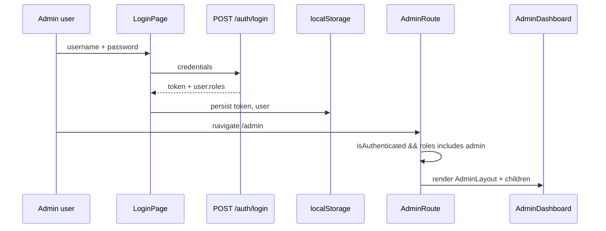

# Use Case — UC-ADM-01: Truy cập cổng quản trị (Access Admin Portal)

| Thuộc tính | Giá trị |
|------------|---------|
| **ID** | UC-ADM-01 |
| **Tên** | Đăng nhập và vào Admin Panel với role `admin` |
| **Mức độ ưu tiên** | Cao (tiên quyết mọi UC admin khác) |
| **Phiên bản** | Bám code hiện tại |
| **Liên quan FR** | `FR_SendOrderUpdateEmail.md` (email khi admin thao tác đơn — phụ thuộc session admin) |
| **Liên quan UC** | UC-ADM-02 … UC-ADM-05, các UC QA admin |

---

## 1. Mô tả ngắn

Quản trị viên **đăng nhập** bằng tài khoản có role **`admin`**, được phép truy cập các route React dưới prefix **`/admin/*`**, bọc bởi component **`AdminRoute`** (sidebar + layout). Mọi API admin gọi qua **`/api/admin/*`** kèm JWT Bearer; backend yêu cầu role **`admin`** hoặc **`manager`**.

**Lưu ý lệch quyền:** FE chỉ cho **`admin`**; BE cho cả **`manager`**.

---

## 2. Tác nhân

| Tác nhân | Vai trò |
|----------|---------|
| **Administrator** | User có role `admin` trong JWT / Redux |
| **Manager** | BE cho phép API; FE **chặn** vào `/admin` |
| **Guest / Customer** | Bị redirect khi vào `/admin` |
| **AdminRoute / AdminLayout** | Guard + UI shell |
| **Express** | `authenticateToken` + `authorizeRoles("admin", "manager")` |
| **seedAdmin.js** | Tạo tài khoản admin mẫu (dev) |

---

## 3. Preconditions

| # | Điều kiện |
|---|-----------|
| PRE-01 | Server chạy, DB có bảng `users`, `roles`, `user_roles` |
| PRE-02 | User tồn tại, `is_active = true` |
| PRE-03 | User được gán role `admin` (ví dụ chạy `node server/seedAdmin.js`) |
| PRE-04 | Client build có `VITE_API_URL` trỏ đúng API (mặc định `http://localhost:5000/api`) |

---

## 4. Postconditions

### Thành công

| # | Kết quả |
|---|---------|
| POST-01 | `localStorage.token` + `localStorage.user` (có `roles: ["admin", ...]`) |
| POST-02 | Redux `auth.isAuthenticated = true` |
| POST-03 | Truy cập `/admin` hiển thị `AdminDashboard` trong layout sidebar |
| POST-04 | Request admin API trả 200 (có JWT) |

### Thất bại

| # | Kết quả |
|---|---------|
| POST-E01 | Chưa login → redirect **`/login`** |
| POST-E02 | Login nhưng không có role `admin` → redirect **`/`** |
| POST-E03 | Token hết hạn / invalid → interceptor logout + redirect login |
| POST-E04 | API admin không đủ quyền → **403** `{ message: "Insufficient permissions" }` |

---

## 5. Trigger

- User click link **「Admin」** trên Header (`user.roles.includes("admin")`).
- User gõ URL trực tiếp: `/admin`, `/admin/orders`, …
- F5 trên trang admin (restore session từ `localStorage`).

---

## 6. Luồng chính — Đăng nhập và vào portal



| Bước | Mô tả |
|------|--------|
| 1 | Mở `/login`, submit `username` / `password` |
| 2 | `authController.login` verify bcrypt, check `is_active` |
| 3 | Response: `token`, `user` gồm `roles: user.Roles.map(role_name)` |
| 4 | FE lưu token + user (hook login / authSlice) |
| 5 | Navigate `/admin` hoặc click Header **Admin** |
| 6 | `AdminRoute`: nếu OK → `AdminLayout` + page con |

### Khôi phục session (F5)

`App.jsx` `useEffect`:

- Đọc `localStorage.token`, `localStorage.user`
- Nếu có và Redux chưa auth → `dispatch(setCredentials({ token, user }))`

---

## 7. Guard phía Frontend — `AdminRoute.jsx`

```javascript
if (!isAuthenticated) {
  return <Navigate to="/login" replace />
}
const isAdmin = user?.roles?.includes("admin")
if (!isAdmin) {
  return <Navigate to="/" replace />
}
```

| Kiểm tra | Hành vi |
|----------|---------|
| Chưa đăng nhập | → `/login` |
| Đã login, không phải admin | → `/` (trang chủ) |
| Admin | Render sidebar + `children` |

**Logout:** `dispatch(logout())` — xóa token/user khỏi store và storage.

---

## 8. Guard phía Backend — `adminRoutes.js`

```javascript
router.use(authenticateToken)
router.use(authorizeRoles("admin", "manager"))
```

| Middleware | Chức năng |
|------------|-----------|
| `authenticateToken` | Bearer JWT → load `User` + `Roles` → `req.user`, `req.userId` |
| `authorizeRoles` | Ít nhất một role trong danh sách |

Mount: `app.use("/api/admin", adminRoutes)` trong `server.js`.

---

## 9. Cấu trúc route Admin (React)

Tất cả bọc `<AdminRoute>` trong `App.jsx`:

| Path | Page |
|------|------|
| `/admin` | `AdminDashboard` |
| `/admin/analytics` | `AdminDashboard` (view analytics) |
| `/admin/products` | `AdminProducts` |
| `/admin/products/new` | `AdminProductNewPage` |
| `/admin/products/edit/:id` | `AdminProductEditPage` |
| `/admin/orders` | `AdminOrders` (list) |
| `/admin/orders/:orderId` | `AdminOrders` → `AdminOrderDetail` |
| `/admin/users` | `AdminUsers` |
| `/admin/categories` | `AdminCategories` |
| `/admin/brands` | `AdminBrands` |
| `/admin/questions` | `AdminQuestions` |
| `/admin/questions/:question_id` | `AdminQuestionDetail` |

**Sidebar** (`AdminLayout` menuItems): Dashboard, Analytics, Sản phẩm, Đơn hàng, Người dùng, Danh mục, Thương hiệu, Q&A.

Link dùng thẻ `<a href="...">` (full page navigation), không `NavLink` React Router.

---

## 10. Entry point UI — Header

```jsx
{user?.roles?.includes("admin") && (
  <Link to="/admin">Admin</Link>
)}
```

Chỉ user có role `admin` mới thấy link.

---

## 11. Tài khoản admin mẫu — `seedAdmin.js`

| Field | Giá trị mặc định |
|-------|------------------|
| Username | `super_admin` |
| Email | `admin@laptopstore.com` |
| Password | `AdminPassword123` (hash qua User model hook) |
| Role | `admin` |

Chạy: `node server/seedAdmin.js` (từ thư mục `server/`, có `.env` + DB).

---

## 12. Axios interceptor

**Request:** gắn `Authorization: Bearer ${token}` từ `localStorage`.

**Response 401 / 403 token:** (trừ `/auth/login`, `/auth/register`) → `logout()`, clear cart, redirect login.

Admin API dùng cùng instance `api` — không cần header riêng.

---

## 13. Luồng thay thế

### ALT-01 — Manager đăng nhập

- Gọi `GET /api/admin/orders` với JWT manager → **200** (BE).
- Mở `/admin` trên FE → redirect **`/`** (FE chỉ nhận `admin`).

### ALT-02 — OAuth user không có admin

OAuth success chỉ gán role customer — không vào admin trừ khi gán role thủ công DB.

### ALT-03 — Deep link admin khi chưa login

`/admin/orders` → `AdminRoute` → `/login` → sau login user phải tự quay lại `/admin` (không lưu `returnUrl`).

---

## 14. Ánh xạ mã nguồn

| Thành phần | Đường dẫn |
|------------|-----------|
| Guard FE | `client/app/components/AdminRoute.jsx` |
| Routes | `client/app/App.jsx` |
| Auth restore | `client/app/App.jsx`, `client/app/store/slices/authSlice.js` |
| Login API | `server/controllers/authController.js` |
| Middleware | `server/middleware/auth.js` |
| Admin routes | `server/routes/adminRoutes.js` |
| Seeder | `server/seedAdmin.js` |
| Header link | `client/app/components/Header.jsx` |

---

## 15. Known gaps

| # | Gap |
|---|-----|
| GAP-01 | FE **`admin` only** vs BE **`admin` + `manager`** |
| GAP-02 | Không có `returnUrl` sau login để quay lại URL admin ban đầu |
| GAP-03 | Sidebar dùng `<a href>` → reload full page |
| GAP-04 | Không refresh roles từ `GET /auth/me` khi vào admin — chỉ tin `localStorage.user` |
| GAP-05 | `seedAdmin` password hardcode — rủi ro nếu chạy production không đổi pass |
| GAP-06 | Không MFA / audit log đăng nhập admin |

---

## 16. Tiêu chí chấp nhận

- [ ] Login `super_admin` → thấy link Admin, vào `/admin` OK
- [ ] Customer login → không thấy Admin, gõ `/admin` → về `/`
- [ ] Chưa login → `/admin` → `/login`
- [ ] API `GET /api/admin/orders` không token → 401
- [ ] API với token customer → 403
- [ ] F5 trên `/admin/products` vẫn vào được nếu token còn hạn
