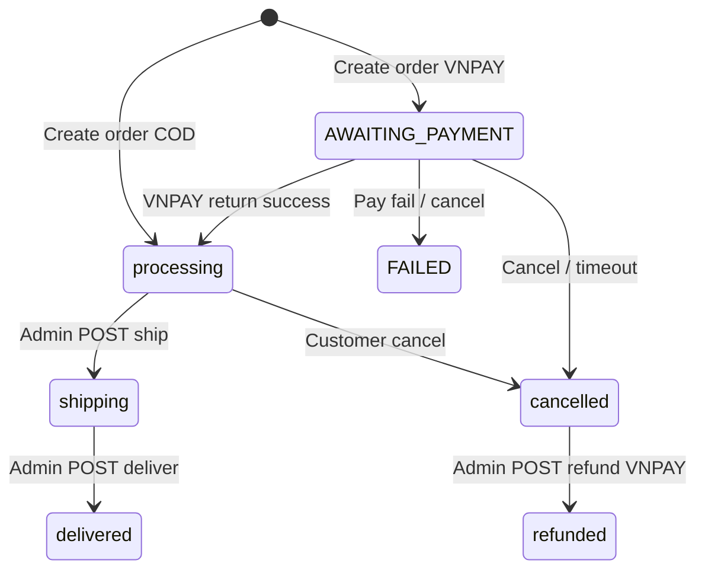
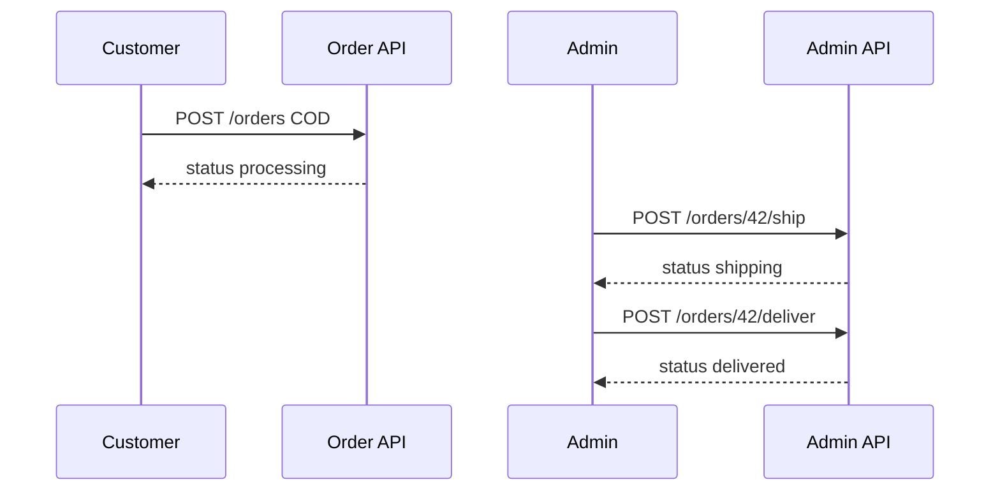
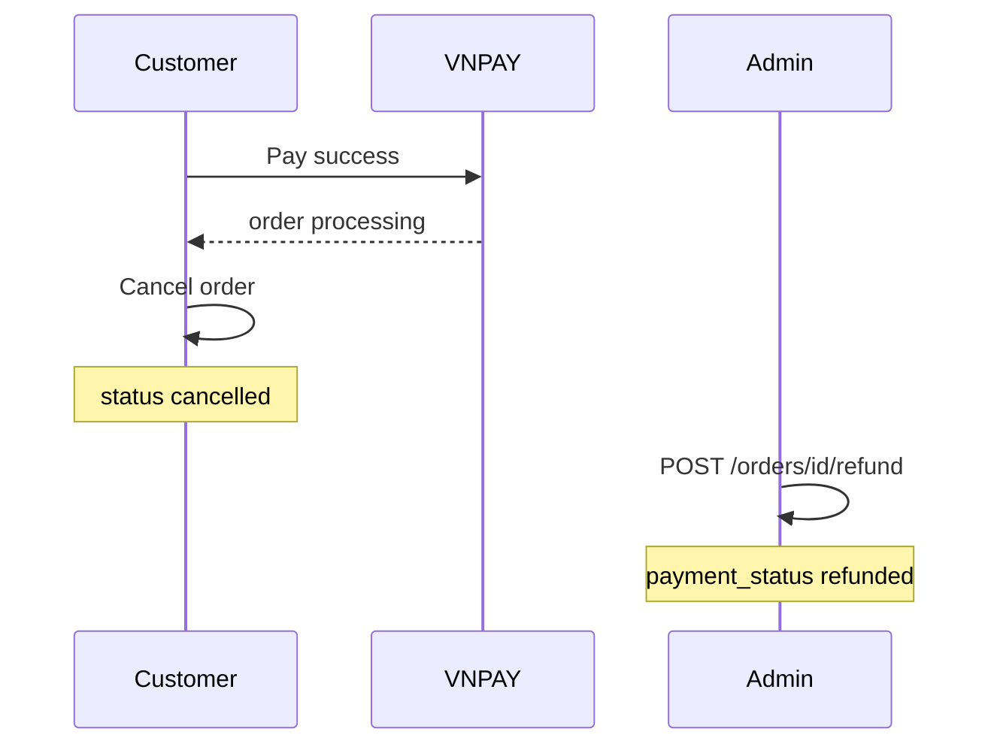

# Use Case — UC-ADM-05: Vòng đời fulfillment đơn hàng (Admin Fulfill Order Lifecycle)

| Thuộc tính | Giá trị |
|------------|---------|
| **ID** | UC-ADM-05 |
| **Tên** | Admin điều phối giao hàng: ship → deliver → hoàn tiền VNPAY đã hủy |
| **Mức độ ưu tiên** | Cao |
| **Phiên bản** | Bám code hiện tại |
| **Liên quan FR** | `FR_AdminShipOrder.md`, `FR_AdminDeliverOrder.md`, `FR_AdminRefundOrder.md`, `FR_SendOrderUpdateEmail.md` |
| **Liên quan UC** | UC-ADM-04, UC-ORD-* (tạo đơn, VNPAY), UC-PAY-* |

---

## 1. Mô tả ngắn

Sau khi khách đặt hàng và thanh toán (COD hoặc VNPAY thành công), đơn ở trạng thái **`processing`** (chờ giao). Admin thực hiện chuỗi thao tác có **ràng buộc** trên API:

```text
processing  --[POST /ship]-->  shipping  --[POST /deliver]-->  delivered

cancelled (VNPAY)  --[POST /refund]-->  payment.payment_status = refunded
```

UI: nút trên **`/admin/orders`** theo tab (không trên trang detail).

**Bổ sung:** Admin có thể đổi status tùy ý qua `PUT /status` (UC-ADM-04) — bypass lifecycle.

---

## 2. Tác nhân

| Tác nhân | Vai trò |
|----------|---------|
| **Administrator** | Bấm Giao hàng / Đã nhận / Hoàn tiền |
| **adminController** | `shipOrder`, `deliverOrder`, `refundOrder` |
| **Customer order flow** | Tạo đơn, VNPAY return → `processing` |
| **emailService** | Thông báo email |

---

## 3. Preconditions

| Bước | Điều kiện |
|------|-----------|
| **Ship** | `order.status === 'processing'` |
| **Deliver** | `order.status === 'shipping'` |
| **Refund** | `order.status === 'cancelled'` AND `payment.provider === 'VNPAY'` |

Thêm: UC-ADM-01, đơn đã thanh toán đủ điều kiện business (COD pending hoặc VNPAY completed) thường nằm ở `processing` — BE ship **chỉ** check status, không check `payment_status`.

---

## 4. Postconditions

| API | Thành công | DB |
|-----|------------|-----|
| Ship | `200` | `order.status = shipping` |
| Deliver | `200` | `order.status = delivered` |
| Refund | `200` | `payment.payment_status = refunded` (order vẫn `cancelled`) |

Email queued (best effort) mỗi bước.

| Lỗi | HTTP |
|-----|------|
| Sai status | `400` + message |
| Order not found | `404` |
| Refund non-VNPAY | `400 Only VNPAY orders...` |

---

## 5. Vòng đời end-to-end (tích hợp storefront)



### Tạo đơn (`orderController`)

| Payment | `order.status` ban đầu |
|---------|------------------------|
| VNPAY | `AWAITING_PAYMENT` |
| COD | `processing` |

### VNPAY return (`vnpayController.vnpayReturn`)

Thanh toán OK → `payment.payment_status = completed`, `order.status = processing`.

### Reserve kho

Lúc tạo đơn: `stock_quantity` đã **trừ** (transaction). Hủy đơn có logic hoàn kho (order cancel UC — ngoài phạm vi admin fulfill).

---

## 6. API chi tiết

### 6.1 Ship

```http
POST /api/admin/orders/:order_id/ship
Authorization: Bearer <token>
```

```javascript
if (order.status !== 'processing') {
  return res.status(400).json({ message: "Order must be in processing status to ship" })
}
await order.update({ status: 'shipping' })
```

Email: `oldData.status: processing` → `newData.status: shipping`.

### 6.2 Deliver

```http
POST /api/admin/orders/:order_id/deliver
```

```javascript
if (order.status !== 'shipping') {
  return res.status(400).json({ message: "Order must be in shipping status to deliver" })
}
await order.update({ status: 'delivered' })
```

### 6.3 Refund (manual bookkeeping)

```http
POST /api/admin/orders/:order_id/refund
```

Điều kiện:

- `order.status === 'cancelled'`
- `order.payment.provider === 'VNPAY'`

Hành động:

- `payment.update({ payment_status: 'refunded' })`
- **Không** gọi VNPAY refund API thật — chỉ cập nhật DB + email `ORDER_REFUND`.

---

## 7. Luồng UI — `AdminOrders.jsx`

| Tab active | Nút | Hook | API |
|------------|-----|------|-----|
| `processing` | 🚚 Giao hàng | `useShipOrder` | POST ship |
| `shipping` | ✅ Đã nhận | `useDeliverOrder` | POST deliver |
| `cancelled` | 💰 Hoàn tiền | `useRefundOrder` | POST refund (chỉ VNPAY, chưa refunded) |
| Mọi tab | 👁 Xem | navigate detail | — |

### Confirm dialogs

| Nút | Text confirm (FE) | Thực tế API |
|-----|-------------------|-------------|
| Giao hàng | 「xác nhận **đã giao hàng**」 | Chuyển sang **shipping** (mới bắt đầu giao) |
| Đã nhận | 「khách **đã nhận** hàng」 | → **delivered** |
| Hoàn tiền | 「xác nhận **đã hoàn tiền**」 | Cập nhật payment refunded |

Sau success: `invalidateQueries(["admin-orders"])`.

### Tab cancelled — trạng thái hoàn tiền

- `payment_status === 'refunded'` → label 「✅ Đã hoàn tiền」 (không nút).
- Ngược lại + VNPAY → nút Hoàn tiền.

COD cancelled: **không** nút refund (đúng BE).

---

## 8. Sequence — Happy path COD



---

## 9. Sequence — VNPAY + refund



---

## 10. Tương tác với `updateOrderStatus`

Admin có thể trên detail:

- `processing` → `delivered` **một bước** (PUT status).

Hệ quả:

- Bỏ qua `shipping`.
- Nút Ship/Deliver trên list có thể **không khớp** trạng thái thực tế.

Khuyến nghị vận hành: dùng nút Ship/Deliver; chỉ dùng dropdown khi xử lý ngoại lệ.

---

## 11. Email

| Sự kiện | changeType |
|---------|------------|
| Ship / Deliver / manual status | `ORDER_STATUS` |
| Refund | `ORDER_REFUND` (kèm amount, provider) |

Template map status tiếng Việt trong `emailService.js`.

---

## 12. Hooks

```javascript
// useOrders.js
useShipOrder()    → POST `/admin/orders/${orderId}/ship`
useDeliverOrder() → POST `/admin/orders/${orderId}/deliver`
useRefundOrder()  → POST `/admin/orders/${orderId}/refund`
```

---

## 13. Ánh xạ mã nguồn

| Thành phần | Đường dẫn |
|------------|-----------|
| UI actions | `client/app/pages/admin/AdminOrders.jsx` — `renderActionButtons` |
| Hooks | `client/app/hooks/useOrders.js` |
| Controller | `server/controllers/adminController.js` L472–616 |
| Routes | `server/routes/adminRoutes.js` L24–26 |
| VNPAY → processing | `server/controllers/vnpayController.js` |
| Create order status | `server/controllers/orderController.js` |

---

## 14. Known gaps

| # | Gap |
|---|-----|
| GAP-01 | Refund **không** tích hợp VNPAY Refund API — chỉ đánh dấu DB |
| GAP-02 | Ship **không** kiểm tra `payment_status === completed` |
| GAP-03 | Text confirm 「đã giao hàng」**sai** với hành vi ship → shipping |
| GAP-04 | Fulfillment nút **chỉ trên list**, không trên detail |
| GAP-05 | `PUT /status` bypass FSM |
| GAP-06 | Không tracking number / đơn vị vận chuyển |
| GAP-07 | Deliver không set `payment_status` (COD vẫn pending có thể) |
| GAP-08 | Không auto ship sau X ngày |

---

## 15. Tiêu chí chấp nhận

- [ ] Đơn `processing` → Ship → `shipping`, nút Deliver xuất hiện tab shipping
- [ ] Deliver → `delivered`
- [ ] Ship khi đang `shipping` → 400
- [ ] Đơn cancelled VNPAY → Refund → `payment_status=refunded`, UI 「Đã hoàn tiền」
- [ ] Refund COD cancelled → 400
- [ ] Refund lần 2 → vẫn 200 hoặc vẫn refunded (idempotent không implement — có thể gọi lại)
- [ ] Customer nhận email (nếu SMTP cấu hình)

---

## 16. Checklist vận hành

1. Tab **Chờ giao hàng** — xác nhận thanh toán (VNPAY/COD) nếu cần.
2. **Giao hàng** khi đã bàn giao đơn vị VC.
3. Tab **Đang giao** — **Đã nhận** khi khách xác nhận.
4. Tab **Đã hủy** — **Hoàn tiền** sau khi thực hiện hoàn VNPAY thủ công bên cổng.
