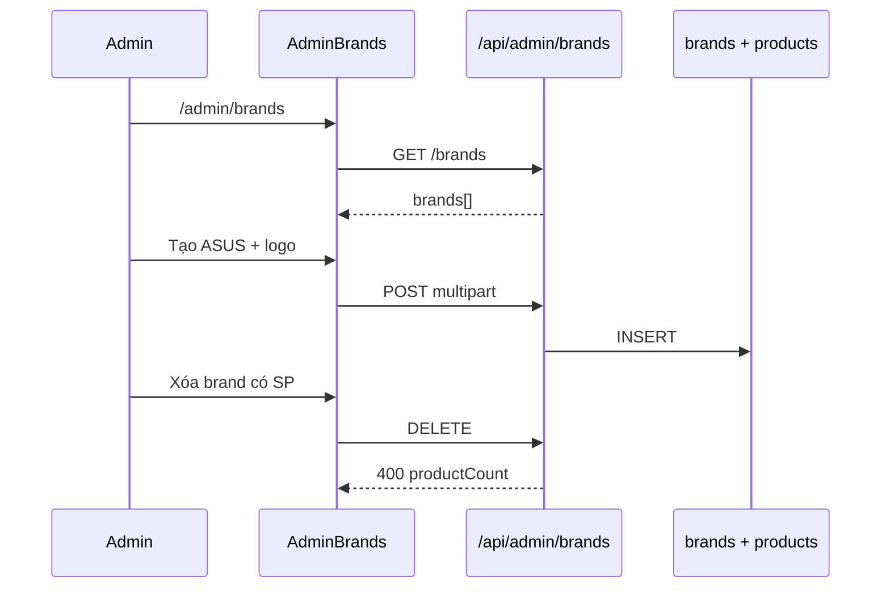

# Use Case — UC-ADM-09: Quản trị thương hiệu (Admin Manage Brands)

| Thuộc tính | Giá trị |
|------------|---------|
| **ID** | UC-ADM-09 |
| **Tên** | Admin CRUD thương hiệu (brand) kèm logo Cloudinary |
| **Mức độ ưu tiên** | Trung bình |
| **Phiên bản** | Bám code hiện tại |
| **Liên quan FR** | `FR_AdminListBrands.md`, `FR_AdminCreateBrand.md`, `FR_AdminUpdateBrand.md`, `FR_AdminDeleteBrand.md`, `FR_AdminGetBrandById.md` |
| **Liên quan UC** | UC-ADM-02, UC-CAT-03 |

---

## 1. Mô tả ngắn

Trang **`/admin/brands`** (`AdminBrands.jsx`) quản lý bảng **`brands`**:

- Load qua `adminAPI.getAllBrands()`.
- Tạo / sửa: `brand_name`, `description`, logo (`thumbnail` file field).
- Xóa khi **không** còn product gắn `brand_id`.

Slug auto từ tên. Storefront: **`GET /api/products/brands`**.

**Lưu ý navigation:** Route có trong `App.jsx` nhưng **sidebar `AdminRoute.jsx` không có link Brands`** — vào qua URL trực tiếp hoặc bookmark.

---

## 2. Tác nhân

| Tác nhân | Vai trò |
|----------|---------|
| **Administrator** | CRUD UI |
| **adminController** | Brand CRUD (+ `getBrandById`) |
| **Product** | FK `brand_id` |

---

## 3. Preconditions

| # | Điều kiện |
|---|-----------|
| PRE-01 | UC-ADM-01 |
| PRE-02 | Cloudinary cho upload logo |

---

## 4. Postconditions

| # | Kết quả |
|---|---------|
| POST-01 | Create → `201` + `slug`, `logo_url` |
| POST-02 | Update → `200` |
| POST-03 | Delete → `destroy` nếu không còn product |
| POST-E01 | Slug trùng → 400 |
| POST-E02 | Delete có product → 400 kèm message đếm số SP |

---

## 5. Trigger

- Navigate **`/admin/brands`** (không có menu sidebar mặc định).
- Thêm / Sửa / Xóa thương hiệu.

---

## 6. API Backend

| Method | Path | Ghi chú |
|--------|------|---------|
| GET | `/api/admin/brands` | `order: brand_name ASC` |
| GET | `/api/admin/brands/:brand_id` | Chi tiết — **UI không gọi** |
| POST | `/api/admin/brands` | `uploadProductFiles` |
| PUT | `/api/admin/brands/:brand_id` | multipart |
| DELETE | `/api/admin/brands/:brand_id` | Guard products |

### Body multipart

| Field | Map DB |
|-------|--------|
| `brand_name` | `brand_name` + auto `slug` |
| `description` | `description` |
| `thumbnail` (file) | `logo_url` |

### DELETE

```javascript
const productCount = await brand.countProducts()
if (productCount > 0) {
  return res.status(400).json({
    message: `Cannot delete brand "${brand.brand_name}" because it is associated with ${productCount} product(s)...`
  })
}
```

**Lưu ý code:** File `adminController.js` có **hai** định nghĩa `createBrand`/`updateBrand` đầu file (JSON thuần) bị **ghi đè** bởi phiên bản có upload ở cuối file — runtime dùng bản **multipart + slug**.

---

## 7. Luồng FE — `AdminBrands.jsx`

| Bước | Chi tiết |
|------|----------|
| Mount | `useEffect` → `loadBrands()` → `adminAPI.getAllBrands()` |
| State local | `brands` trong `useState` — **không** React Query |
| Submit | `FormData` + `adminAPI.createBrand` / `updateBrand` |
| Delete | confirm → `adminAPI.deleteBrand` → `loadBrands()` |
| Preview logo | FileReader base64 local |

Không dùng hooks tập trung — pattern khác `AdminCategories` (React Query).

---

## 8. Tích hợp catalog

| Nơi dùng | API |
|----------|-----|
| `AdminProductNewPage` / Edit | `useBrands()` → `GET /products/brands` |
| Filter storefront | Public brands list |
| Analytics dashboard | `sales_by_brand` top 5 (SQL aggregate order_items) |

---

## 9. Sơ đồ



---

## 10. Ánh xạ mã nguồn

| Thành phần | Đường dẫn |
|------------|-----------|
| UI | `client/app/pages/admin/AdminBrands.jsx` |
| API client | `client/app/services/api.js` L127–131 |
| Controller | `server/controllers/adminController.js` L1219–1355 (+ overwrite create/update) |
| Routes | `server/routes/adminRoutes.js` L39–43 |
| Route FE | `client/app/App.jsx` path `admin/brands` |
| Sidebar gap | `client/app/components/AdminRoute.jsx` — **không** có Brands |

---

## 11. Known gaps

| # | Gap |
|---|-----|
| GAP-01 | **Không link sidebar** tới `/admin/brands` |
| GAP-02 | Dashboard menu cards **không** có Quản lý thương hiệu |
| GAP-03 | FE **không dùng React Query** — stale sau tab khác |
| GAP-04 | `GET /brands/:id` không dùng |
| GAP-05 | Duplicate `createBrand` đầu file (dead code) |
| GAP-06 | Logo field tên `thumbnail` giống category |
| GAP-07 | `brandLogoStorage` trong upload.js không gắn route |

---

## 12. Tiêu chí chấp nhận

- [ ] `/admin/brands` load danh sách
- [ ] Tạo brand + logo → chọn được trong form thêm SP
- [ ] Xóa brand đang có SP → 400
- [ ] Xóa brand trống → OK
- [ ] Slug hiển thị đúng trên bảng admin
