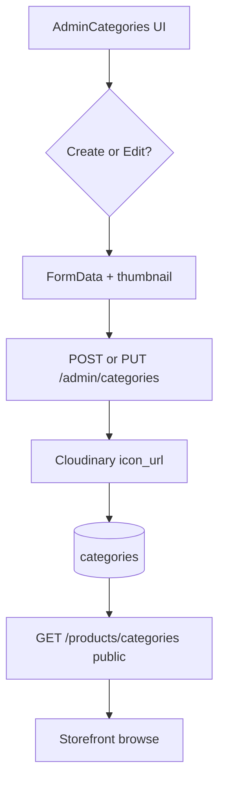

# Use Case — UC-ADM-08: Quản trị danh mục (Admin Manage Categories)

| Thuộc tính | Giá trị |
|------------|---------|
| **ID** | UC-ADM-08 |
| **Tên** | Admin CRUD danh mục sản phẩm kèm icon Cloudinary và thứ tự hiển thị |
| **Mức độ ưu tiên** | Trung bình–Cao |
| **Phiên bản** | Bám code hiện tại |
| **Liên quan FR** | `FR_AdminListCategories.md`, `FR_AdminCreateCategory.md`, `FR_AdminUpdateCategory.md`, `FR_AdminDeleteCategory.md` |
| **Liên quan UC** | UC-ADM-02 (gán category cho SP), UC-CAT-03 (browse categories storefront) |

---

## 1. Mô tả ngắn

Trang **`/admin/categories`** (`AdminCategories.jsx`) quản lý bảng **`categories`**:

- Liệt kê toàn bộ danh mục (admin API).
- Tạo / sửa inline form: tên, mô tả, `display_order`, **icon** (upload field `thumbnail`).
- Xóa nếu **không** còn sản phẩm gắn.

Slug **tự sinh** từ `category_name` trên server. Storefront đọc danh mục qua **`GET /api/products/categories`** (public).

---

## 2. Tác nhân

| Tác nhân | Vai trò |
|----------|---------|
| **Administrator** | CRUD trên UI |
| **adminController** | `getAllCategories`, `createCategory`, `updateCategory`, `deleteCategory` |
| **Cloudinary** | Lưu `icon_url` |
| **Category model** | `hasMany` Product |

---

## 3. Preconditions

| # | Điều kiện |
|---|-----------|
| PRE-01 | UC-ADM-01 |
| PRE-02 | Cloudinary env cấu hình (upload icon) |
| PRE-03 | Tên danh mục unique sau khi slug hóa (tránh trùng slug) |

---

## 4. Postconditions

| # | Kết quả |
|---|---------|
| POST-01 | Tạo → `201`, row + `slug`, optional `icon_url` |
| POST-02 | Sửa → cập nhật name/slug/icon/order |
| POST-03 | Xóa → `destroy` nếu `productCount === 0` |
| POST-E01 | Slug trùng → `400 Slug already exists` |
| POST-E02 | Xóa khi còn SP → `400 Cannot delete category with associated products` |

---

## 5. Trigger

- Sidebar **Danh mục** / card dashboard → `/admin/categories`.
- **Thêm danh mục**, **Chỉnh sửa**, **Xóa** + confirm.

---

## 6. API Backend

| Method | Path | Mô tả |
|--------|------|--------|
| GET | `/api/admin/categories` | List, `order: display_order ASC` |
| POST | `/api/admin/categories` | multipart + `uploadProductFiles` |
| PUT | `/api/admin/categories/:category_id` | multipart |
| DELETE | `/api/admin/categories/:category_id` | Có guard products |

### POST / PUT — body (multipart)

| Field | Mô tả |
|-------|--------|
| `category_name` | Bắt buộc (FE) |
| `description` | Optional |
| `display_order` | Number, default 0 |
| `thumbnail` | File → lưu `icon_url` (Cloudinary path) |

### Slug generation (server)

```javascript
const slug = category_name.toLowerCase()
  .replace(/[^\w\s-]/g, '')
  .trim()
  .replace(/\s+/g, '-')
```

Update name: kiểm tra slug conflict với category khác (`Op.ne`).

### DELETE guard

```javascript
const productCount = await category.countProducts()
if (productCount > 0) {
  return res.status(400).json({ message: "Cannot delete category with associated products" })
}
```

---

## 7. Luồng FE — `AdminCategories.jsx`

| Bước | Chi tiết |
|------|----------|
| Load | `useAdminCategories()` → `GET /admin/categories` |
| Layout | Grid: form trái (khi create/edit) + bảng phải |
| Icon | `FormData.append('thumbnail', iconFile)` |
| Submit | `adminAPI.createCategory` / `updateCategory` trực tiếp (hooks `useCreateCategory` import nhưng **không dùng** trong page) |
| Sau success | `invalidateQueries(["admin-categories"])` |

Bảng hiển thị: icon, tên, slug, `display_order`, Edit/Delete.

---

## 8. Tích hợp storefront

| Consumer | Endpoint |
|----------|----------|
| Header / filter / PDP form | `GET /products/categories` |
| `useCategories` (product form) | Cùng public API — cache key `["admin-categories"]` dùng chung hook name (dễ nhầm) |

Admin list **đầy đủ** hơn public (cùng bảng, admin không filter `is_active` vì model Category không có field đó).

**Analytics:** `getDashboardAnalytics` query `sales_by_category` từ `order_items` JOIN categories.

---

## 9. Sơ đồ



---

## 10. Hooks (tùy chọn)

| Hook | Dùng trong page? |
|------|------------------|
| `useAdminCategories` | ✅ Load list |
| `useCreateCategory` | ❌ (có trong import, page dùng adminAPI) |
| `useUpdateCategory` | ❌ |
| `useDeleteCategory` | ❌ |

---

## 11. Ánh xạ mã nguồn

| Thành phần | Đường dẫn |
|------------|-----------|
| UI | `client/app/pages/admin/AdminCategories.jsx` |
| Hooks | `client/app/hooks/useProducts.js` L133–183 |
| API | `client/app/services/api.js` — `adminAPI.getCategories` … |
| Controller | `server/controllers/adminController.js` L687–811 |
| Routes | `server/routes/adminRoutes.js` L33–36 |
| Upload | `server/middleware/upload.js` — `uploadProductFiles` |

---

## 12. Known gaps

| # | Gap |
|---|-----|
| GAP-01 | Icon field tên **`thumbnail`** — dễ nhầm với product thumbnail |
| GAP-02 | Không sửa slug thủ công — chỉ đổi khi đổi tên |
| GAP-03 | `useCategories` product form dùng **public** API, không sync invalidate với admin list key |
| GAP-04 | Import hooks create/update/delete **unused** |
| GAP-05 | Không soft-delete category |
| GAP-06 | `categoryIconStorage` trong upload.js **không** dùng cho category route (dùng `productImageStorage`) |

---

## 13. Tiêu chí chấp nhận

- [ ] Tạo danh mục + icon → hiện trên `/admin/categories` và filter storefront
- [ ] `display_order` ảnh hưởng thứ tự GET admin categories
- [ ] Xóa danh mục có SP → 400 + alert FE
- [ ] Xóa danh mục trống → thành công
- [ ] Trùng tên → slug conflict → 400
