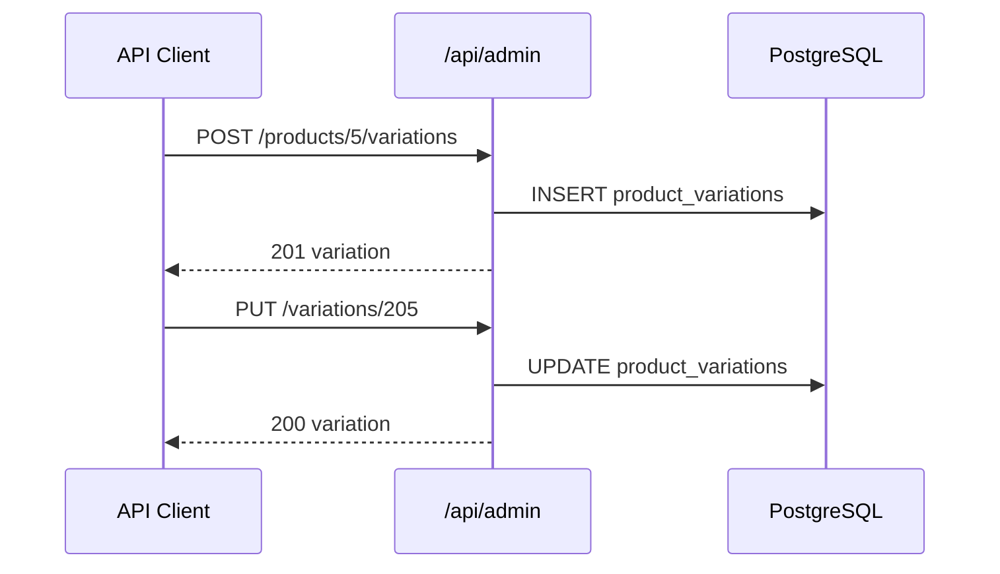

# Use Case — UC-ADM-03: Quản lý biến thể qua API admin (Admin Manage Product Variations Via API)

| Thuộc tính | Giá trị |
|------------|---------|
| **ID** | UC-ADM-03 |
| **Tên** | Tạo / cập nhật biến thể (`product_variations`) qua endpoint REST tách, độc lập form sản phẩm |
| **Mức độ ưu tiên** | Trung bình (BE có sẵn; FE form chính dùng sync trong PUT product) |
| **Phiên bản** | Bám code hiện tại |
| **Liên quan FR** | `FR_AdminCreateVariationEndpoint.md`, `FR_AdminUpdateVariationEndpoint.md` |
| **Liên quan UC** | UC-ADM-02 |

---

## 1. Mô tả ngắn

Ngoài việc gửi mảng `variations` trong **create/update product** (UC-ADM-02), backend expose **hai endpoint chuyên biến thể**:

| Method | Path |
|--------|------|
| `POST` | `/api/admin/products/:product_id/variations` |
| `PUT` | `/api/admin/variations/:variation_id` |

Dùng cho tích hợp script, Postman, hoặc client tương lai. **UI admin hiện tại không gọi** các endpoint này — form New/Edit sync qua `PUT /admin/products/:id`.

**Không có** `DELETE /admin/variations/:id` trên router.

---

## 2. Tác nhân

| Tác nhân | Vai trò |
|----------|---------|
| **Administrator / Manager** | Gọi API (JWT) |
| **adminController** | `createVariation`, `updateVariation` |
| **adminAPI** (client) | Helper — **path sai** so với PUT thật |
| **Integration / DevOps** | Consumer thực tế có thể dùng curl |

---

## 3. Preconditions

| # | Điều kiện |
|---|-----------|
| PRE-01 | JWT + role `admin` hoặc `manager` |
| PRE-02 | `product_id` tồn tại (POST) |
| PRE-03 | `variation_id` tồn tại (PUT) |

---

## 4. Postconditions

| # | Kết quả |
|---|---------|
| POST-01 | `201` + object `variation` mới |
| PUT-01 | `200` + `variation` đã cập nhật |
| POST-E01 | Product không tồn tại → `404` |
| PUT-E01 | Variation không tồn tại → `404` |

---

## 5. Trigger

- HTTP client gọi endpoint sau khi đã có product master.
- (Không) click UI — form product xử lý variations inline.

---

## 6. API — Tạo biến thể

### Request

```http
POST /api/admin/products/:product_id/variations
Authorization: Bearer <token>
Content-Type: application/json
```

### Body (ví dụ)

```json
{
  "processor": "Intel Core i7-13700H",
  "ram": "16GB",
  "storage": "512GB SSD",
  "graphics_card": "RTX 4060",
  "screen_size": "15.6 inch",
  "color": "Gray",
  "price": 28990000,
  "stock_quantity": 10,
  "is_primary": false,
  "sku": "LAP-I7-16-512-GRA"
}
```

### Logic `createVariation`

1. `Product.findByPk(product_id)` — không có → `404 Product not found`.
2. `ProductVariation.create({ ...req.body, product_id })`.
3. Trả `201` `{ message, variation }`.

**Không validate** “chỉ một primary” ở endpoint này (khác `createProduct`).

---

## 7. API — Cập nhật biến thể

### Request

```http
PUT /api/admin/variations/:variation_id
Authorization: Bearer <token>
Content-Type: application/json
```

Body: **partial hoặc full** — `variation.update(updateData)` với mọi field trong `req.body`.

### Logic `updateVariation`

1. `ProductVariation.findByPk(variation_id)`.
2. Không có → `404 Variation not found`.
3. `await variation.update(updateData)`.
4. `200` `{ message, variation }`.

Có thể cập nhật: `price`, `stock_quantity`, `is_available`, specs, `sku`, `is_primary`, …

---

## 8. So sánh với sync trong `updateProduct`

| Khía cạnh | `PUT /admin/products/:id` (form) | `PUT /admin/variations/:id` |
|-----------|----------------------------------|-----------------------------|
| Transaction | Có — cùng product + images | Không — single row |
| Xóa variation | Có (destroy ID thiếu trong JSON) | Không |
| Validate 1 primary | Có (nếu gửi variations) | Không |
| Upload ảnh | Có | Không |
| FE sử dụng | **Có** | **Không** |

---

## 9. Client `adminAPI` — lệch route

Trong `client/app/services/api.js`:

```javascript
createVariation: (productId, data) =>
  api.post(`/admin/products/${productId}/variations`, data),  // ✅ khớp BE

updateVariation: (productId, variationId, data) =>
  api.put(`/admin/products/${productId}/variations/${variationId}`, data),  // ❌ BE không có

deleteVariation: (productId, variationId) =>
  api.delete(`/admin/products/${productId}/variations/${variationId}`),  // ❌ không mount
```

**Route thật:**

```javascript
router.put("/variations/:variation_id", adminController.updateVariation)
```

Gọi `adminAPI.updateVariation` → **404**.

---

## 10. Sơ đồ sequence (API độc lập)



---

## 11. Model `ProductVariation` (fields thường dùng)

| Field | Ghi chú |
|-------|---------|
| `variation_id` | PK |
| `product_id` | FK |
| `processor`, `ram`, `storage`, `graphics_card`, `screen_size`, `color` | Spec |
| `price` | VND |
| `stock_quantity` | Tồn kho |
| `is_primary` | Cấu hình mặc định PDP |
| `sku` | Mã SKU |
| `is_available` | Dùng reco train (`is_available = true`) — API có thể set nhưng form admin không |

---

## 12. Luồng thay thế

### ALT-01 — Script restock nhanh

```bash
curl -X PUT "$API/admin/variations/205" \
  -H "Authorization: Bearer $TOKEN" \
  -H "Content-Type: application/json" \
  -d '{"stock_quantity": 50}'
```

### ALT-02 — Thêm cấu hình mới không mở form edit

POST variation → sau đó admin vào form product đánh dấu primary nếu cần (hoặc POST với `is_primary: true` — có thể conflict 2 primary).

### EXC-01 — Gọi `adminAPI.updateVariation` từ FE

404 — cần sửa path thành `/admin/variations/:variation_id`.

---

## 13. Ánh xạ mã nguồn

| Thành phần | Đường dẫn |
|------------|-----------|
| Routes | `server/routes/adminRoutes.js` L17–18 |
| Controller | `server/controllers/adminController.js` L304–347 |
| Client API | `client/app/services/api.js` L104–109 |
| FR docs | `docs/feature_requirements/admin/product_and_variation/` |
| Engineering note | `docs/engineering_rules/frontend-api-integration.md` |

---

## 14. Known gaps

| # | Gap |
|---|-----|
| GAP-01 | **Không DELETE** variation endpoint |
| GAP-02 | `adminAPI.updateVariation` / `deleteVariation` **sai path** |
| GAP-03 | POST variation **không** enforce single `is_primary` |
| GAP-04 | UI admin **không dùng** UC này — duplicate mental model với UC-ADM-02 |
| GAP-05 | PUT body không whitelist — có thể gửi field lạ |
| GAP-06 | Không invalidate cache FE khi chỉ gọi API variation |

---

## 15. Tiêu chí chấp nhận

- [ ] POST tạo variation hợp lệ → 201, row trong DB
- [ ] PUT đổi `price` → PDP reflect sau reload
- [ ] PUT variation_id sai → 404
- [ ] POST product_id sai → 404
- [ ] `adminAPI.updateVariation` hiện tại → 404 (documented gap)
- [ ] Manager JWT → POST/PUT OK (BE)
