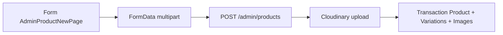

# Use Case — UC-ADM-02: Quản trị sản phẩm (Admin Manage Products)

| Thuộc tính | Giá trị |
|------------|---------|
| **ID** | UC-ADM-02 |
| **Tên** | Admin xem danh sách, tạo, sửa, xóa (soft) sản phẩm kèm ảnh và đồng bộ biến thể qua form |
| **Mức độ ưu tiên** | Cao |
| **Phiên bản** | Bám code hiện tại |
| **Liên quan FR** | `FR_AdminCreateProductWithImages.md`, `FR_AdminUpdateProductWithVariations.md`, `FR_AdminDeleteProduct.md` |
| **Liên quan UC** | UC-ADM-01, UC-ADM-03 (API variation riêng), UC-CAT-* (catalog public) |

---

## 1. Mô tả ngắn

Admin quản lý catalog laptop qua:

1. **`/admin/products`** — bảng danh sách (API **public** `GET /products`).
2. **`/admin/products/new`** — tạo SP + variations + upload Cloudinary (`multipart/form-data`).
3. **`/admin/products/edit/:id`** — cập nhật SP, sync variations, ảnh.

**Xóa:** `DELETE /api/admin/products/:id` → soft delete `is_active = false`.

Biến thể trên form **gộp** trong `POST/PUT /admin/products` (JSON string field `variations`). UC-ADM-03 mô tả endpoint variation **tách**.

---

## 2. Tác nhân

| Tác nhân | Vai trò |
|----------|---------|
| **Administrator** | Thao tác UI |
| **AdminProducts** | List + delete |
| **AdminProductNewPage / AdminProductEditPage** | Form CRUD |
| **adminController** | `createProduct`, `updateProduct`, `deleteProduct` |
| **Cloudinary (multer)** | Lưu thumbnail + gallery |

---

## 3. Preconditions

| # | Điều kiện |
|---|-----------|
| PRE-01 | UC-ADM-01 — đã vào admin |
| PRE-02 | Có ít nhất 1 category, 1 brand (dropdown form) |
| PRE-03 | Env Cloudinary: `CLOUDINARY_NAME`, `CLOUDINARY_KEY`, `CLOUDINARY_SECRET` |
| PRE-04 | JWT gửi kèm request admin |

---

## 4. Postconditions

| # | Kết quả |
|---|---------|
| POST-01 | Tạo mới → `201`, product + variations trong DB |
| POST-02 | Sửa → `200`, product + variations/images đồng bộ |
| POST-03 | Xóa → `is_active: false`, SP biến mất khỏi listing active (tùy query public) |
| POST-E01 | Thiếu primary variation → `400` |
| POST-E02 | Upload/DB lỗi → transaction rollback (create/update) |

---

## 5. Trigger

- Menu **Sản phẩm** → `/admin/products`.
- Nút **Thêm sản phẩm** → `/admin/products/new`.
- Nút **Sửa** (Edit) → `/admin/products/edit/:product_id`.
- **Xóa** + confirm.

---

## 6. Luồng chính — Danh sách (`AdminProducts.jsx`)

| Bước | Hành động |
|------|-----------|
| 1 | `useProducts({ page, limit: 20 })` → **`GET /api/products`** (public, không prefix admin) |
| 2 | Render bảng: ảnh, tên, category, giá (variation đầu), `is_active` |
| 3 | Pagination client theo `data.pagination` |
| 4 | Delete → `useDeleteProduct` → **`DELETE /api/admin/products/:id`** |

**Lưu ý:** List dùng API catalog chung — admin thấy cả SP inactive tùy filter BE public (kiểm tra `productController.getProducts` nếu cần ẩn inactive).

---

## 7. Luồng chính — Tạo sản phẩm (`AdminProductNewPage`)

### Validation FE

| Rule | Mô tả |
|------|--------|
| category_id, brand_id | Bắt buộc |
| product_name | Không rỗng; auto **slug** từ tên |
| variations | ≥ 1; **đúng 1** `is_primary: true` |
| Mỗi variation | `price > 0`, `sku` không rỗng (auto SKU từ CPU/RAM/SSD/color) |

### Payload — `FormData`

| Field | Kiểu |
|-------|------|
| `product_name`, `slug`, `description` | string |
| `category_id`, `brand_id` | number/string |
| `discount_percentage` | number |
| `thumbnail` | file (optional) |
| `product_images` | files[] (max 10 BE) |
| `variations` | **JSON.stringify(array)** |

### API

```
POST /api/admin/products
Content-Type: multipart/form-data
Authorization: Bearer <token>
```

### BE `createProduct`

1. `uploadProductFiles` (multer fields `thumbnail`, `product_images`).
2. Parse `variations` JSON — lỗi → `400 Invalid variations data`.
3. Validate **exactly one** `is_primary`.
4. Transaction:
   - `Product.create` (`is_active: true`, `thumbnail_url` từ Cloudinary path).
   - `ProductVariation.bulkCreate`.
   - `ProductImage.bulkCreate` nếu có gallery.
5. `commit` → `201`.



---

## 8. Luồng chính — Sửa sản phẩm (`AdminProductEditPage`)

### Load dữ liệu

`useAdminProduct(id)` → **`GET /api/products/:id`** (public detail) — **không** endpoint admin riêng.

### Submit — `FormData`

Giống tạo, thêm:

| Field | Mô tả |
|-------|--------|
| `is_active` | boolean string |
| `deleted_image_ids` | id ảnh xóa (có thể lặp key) |
| `variations` | JSON có `variation_id` cho SP cũ |

```
PUT /api/admin/products/:product_id
```

### BE `updateProduct` — sync variations

| Nhánh | Logic |
|-------|--------|
| Có `variation_id` | `ProductVariation.update` |
| Không `variation_id` | `bulkCreate` mới |
| ID cũ không còn trong payload | `destroy` (hard delete variation) |

Cập nhật fields: `processor`, `ram`, `storage`, `graphics_card`, `screen_size`, `color`, `price`, `stock_quantity`, `is_primary`, `sku`.

Ảnh: xóa theo `deleted_image_ids`; thêm file mới `product_images`.

---

## 9. Luồng xóa (soft delete)

```
DELETE /api/admin/products/:product_id
```

```javascript
await product.update({ is_active: false })
```

Không xóa cascade variations trong code hiện tại.

---

## 10. Upload — `middleware/upload.js`

| Field | Cloudinary folder |
|-------|-------------------|
| `thumbnail` | `laptop-store/thumbnails` (storage config dùng productImageStorage cho combined middleware) |
| `product_images` | `laptop-store/products` |

`uploadProductFiles`: tối đa 1 thumbnail + 10 `product_images`.

---

## 11. Model dữ liệu (tóm tắt)

**Product:** `product_name`, `slug`, `description`, `category_id`, `brand_id`, `discount_percentage`, `thumbnail_url`, `is_active`.

**ProductVariation (trong form):** specs + `price`, `stock_quantity`, `is_primary`, `sku`.

Field `is_available` trên variation **không** set từ form admin hiện tại (default model).

---

## 12. Hooks & API client

| Hook | API |
|------|-----|
| `useCreateProduct` | `adminAPI.createProduct` → POST `/admin/products` |
| `useUpdateProduct` | `adminAPI.updateProduct` → PUT `/admin/products/:id` |
| `useDeleteProduct` | DELETE `/admin/products/:id` |
| `useProducts` (list) | GET `/products` |
| `useAdminProduct` | GET `/products/:id` |

`useCategories` / `useBrands` — public endpoints cho dropdown.

---

## 13. Luồng thay thế / ngoại lệ

### ALT-01 — Chỉ đổi ảnh, không đổi variations

Gửi `variations: []` hoặc không gửi — BE **không** chạy khối sync variations (`if (variations.length > 0)`).

### EXC-01 — Hai primary

FE + BE đều reject: `Exactly one variation must be marked as primary`.

### EXC-02 — Product not found (edit)

`404 Product not found`.

### EXC-03 — Cloudinary misconfig

Upload fail → transaction rollback, 500.

---

## 14. Tác động hệ thống khác

| Hệ thống | Ảnh hưởng |
|----------|-----------|
| **KNN recommendation** | Variation mới/cập nhật cần **train lại offline** mới vào index |
| **Cart / Order** | Variation bị destroy khi edit có thể ảnh hưởng đơn cũ (FK) — cần cẩn trọng ops |
| **Catalog PDP** | `GET /products/:id` phản ánh sau invalidate React Query `["products"]` |

---

## 15. Ánh xạ mã nguồn

| Thành phần | Đường dẫn |
|------------|-----------|
| List | `client/app/pages/admin/AdminProducts.jsx` |
| New | `client/app/pages/admin/AdminProductNewPage.jsx` |
| Edit | `client/app/pages/admin/AdminProductEditPage.jsx` |
| Hooks | `client/app/hooks/useProducts.js` |
| API helpers | `client/app/services/api.js` → `adminAPI` |
| Controller | `server/controllers/adminController.js` |
| Routes | `server/routes/adminRoutes.js` L12–14 |
| Upload | `server/middleware/upload.js` |

---

## 16. Known gaps

| # | Gap |
|---|-----|
| GAP-01 | List admin dùng **public** `GET /products` — có thể không phù hợp nếu cần chỉ SP inactive |
| GAP-02 | Edit load qua **public** detail — không có field admin-only |
| GAP-03 | Delete soft — variations vẫn tồn tại; reco vẫn index nếu `is_available` |
| GAP-04 | Không quản lý **tags** trên form admin |
| GAP-05 | `useCreateProduct` hook tồn tại nhưng New page gọi **`adminAPI` trực tiếp** |
| GAP-06 | Không validate slug unique ở FE |
| GAP-07 | ReactQuill description — HTML, không sanitize rõ trong UC |

---

## 17. Tiêu chí chấp nhận

- [ ] Tạo SP 2 variations, 1 primary → hiện trên storefront
- [ ] Upload thumbnail + 2 gallery → URL Cloudinary trên PDP
- [ ] Sửa giá variation → PDP giá đổi
- [ ] Xóa SP → `is_active false`, list phản ánh
- [ ] User không admin → POST/PUT/DELETE admin → 403
