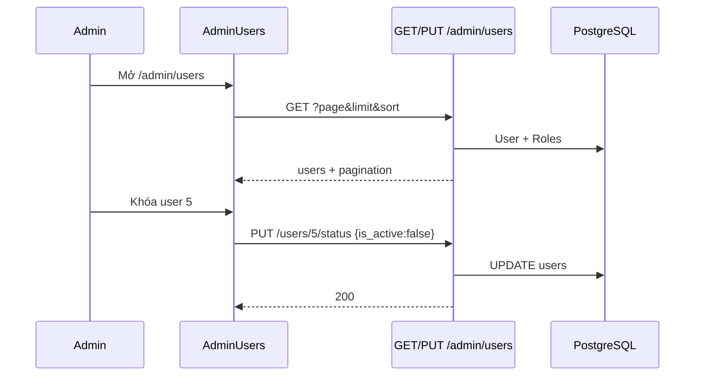

# Use Case — UC-ADM-06: Quản trị người dùng (Admin Manage Users)

| Thuộc tính | Giá trị |
|------------|---------|
| **ID** | UC-ADM-06 |
| **Tên** | Admin xem danh sách user, kích hoạt / khóa tài khoản |
| **Mức độ ưu tiên** | Trung bình–Cao |
| **Phiên bản** | Bám code hiện tại |
| **Liên quan FR** | `FR_AdminListUsers.md`, `FR_AdminUpdateUserActiveStatus.md` |
| **Liên quan UC** | UC-ADM-01, UC-ADM-07 (gán role — API riêng, **không có UI**) |

---

## 1. Mô tả ngắn

Trang **`/admin/users`** cho phép admin:

- Xem danh sách **tất cả** tài khoản (phân trang, sắp xếp server-side).
- Hiển thị **vai trò** (từ bảng `user_roles`).
- **Khóa** / **Kích hoạt** qua `is_active` (`PUT /api/admin/users/:user_id/status`).

**Không** có UI: tạo user, đổi mật khẩu, gán role (xem UC-ADM-07 API).

---

## 2. Tác nhân

| Tác nhân | Vai trò |
|----------|---------|
| **Administrator** | Thao tác trên `AdminUsers.jsx` |
| **adminController** | `getAllUsers`, `updateUserStatus` |
| **User / Role models** | Sequelize M:N |

---

## 3. Preconditions

| # | Điều kiện |
|---|-----------|
| PRE-01 | UC-ADM-01 — JWT admin/manager |
| PRE-02 | Có ít nhất 0 user trong DB |

---

## 4. Postconditions

| # | Kết quả |
|---|---------|
| POST-01 | List hiển thị users + roles, không lộ `password_hash` |
| POST-02 | Khóa user → `is_active: false` → login/API customer **403** inactive |
| POST-03 | Kích hoạt lại → `is_active: true` |
| POST-E01 | User không tồn tại → 404 |

---

## 5. Trigger

- Sidebar **Người dùng** → `/admin/users`.
- Card **Quản lý người dùng** từ `/admin` dashboard.
- Click **Khóa** / **Kích hoạt** + confirm.

---

## 6. API Backend

### GET `/api/admin/users`

| Query | Default | Mô tả |
|-------|---------|--------|
| `page` | 1 | Trang |
| `limit` | 20 | FE dùng **10** |
| `sort` | `created_at` | Whitelist: `user_id`, `username`, `created_at`, `last_login`, `email` |
| `order` | `DESC` | `ASC` \| `DESC` |

Response:

```json
{
  "users": [
    {
      "user_id": 1,
      "username": "super_admin",
      "email": "admin@laptopstore.com",
      "full_name": "System Administrator",
      "is_active": true,
      "Roles": [{ "role_id": 1, "role_name": "admin" }]
    }
  ],
  "pagination": { "total": 50, "page": 1, "limit": 10, "totalPages": 5 }
}
```

`attributes: { exclude: ["password_hash"] }`.

### PUT `/api/admin/users/:user_id/status`

```json
{ "is_active": false }
```

Response: `{ message, user }` (có thể vẫn chứa password_hash trong object user thô — tùy serialize; list đã exclude).

---

## 7. Luồng FE — `AdminUsers.jsx`

| Bước | Hành động |
|------|-----------|
| 1 | `useAdminUsers({ page, limit: 10 })` |
| 2 | Render bảng: ID, tên/email, roles, badge trạng thái |
| 3 | `formatRoleName`: `admin` → 「Quản trị viên」, `manager` → 「Quản lý」 |
| 4 | Nút Khóa/Kích hoạt → `useUpdateUserStatus.mutateAsync` |
| 5 | Pagination nếu `totalPages > 1` |

### Hook `useAdminUsers`

```javascript
const defaultParams = {
  sort: 'user_id',
  order: 'asc',
  ...params
};
api.get("/admin/users", { params: defaultParams });
```

**Lưu ý:** Mặc định sort **`user_id ASC`** — khác BE default `created_at DESC` khi không gửi sort (FE luôn gửi sort).

---

## 8. Tác động khóa tài khoản

`authenticateToken` (mọi API protected):

```javascript
if (!user || !user.is_active) {
  return res.status(403).json({ message: "User not found or inactive" })
}
```

User bị khóa **không** gọi được cart, orders, profile — kể cả token còn trong localStorage.

Admin **không** tự khóa mình qua UI (không chặn — nên cẩn trọng ops).

---

## 9. Sơ đồ



---

## 10. So sánh `adminAPI` khai báo thừa

`client/app/services/api.js`:

```javascript
updateUserRole: (id, data) => api.put(`/admin/users/${id}/role`, data),  // ❌ không tồn tại
deleteUser: (id) => api.delete(`/admin/users/${id}`),                    // ❌ không tồn tại
```

Route thật gán role: **`PUT /admin/users/:user_id/roles`** (UC-ADM-07).

---

## 11. Ánh xạ mã nguồn

| Thành phần | Đường dẫn |
|------------|-----------|
| UI | `client/app/pages/admin/AdminUsers.jsx` |
| Hooks | `client/app/hooks/useAdminUsers.js` |
| Controller | `server/controllers/adminController.js` L619–685 |
| Routes | `server/routes/adminRoutes.js` L29–30 |
| Auth check inactive | `server/middleware/auth.js` |

---

## 12. Known gaps

| # | Gap |
|---|-----|
| GAP-01 | **Không UI** gán role — chỉ xem roles |
| GAP-02 | `adminAPI.updateUserRole` / `deleteUser` **sai/không có route** |
| GAP-03 | Không tìm kiếm theo email/username |
| GAP-04 | Không filter theo role hoặc `is_active` |
| GAP-05 | FE limit 10 vs BE default 20 khi gọi trực tiếp API |
| GAP-06 | Không audit log ai khóa ai |
| GAP-07 | Không ngăn admin khóa chính mình |

---

## 13. Tiêu chí chấp nhận

- [ ] `/admin/users` load danh sách + roles
- [ ] Khóa user → user đó login lại → 403 inactive
- [ ] Kích hoạt lại → login OK
- [ ] Pagination hoạt động khi > 10 users
- [ ] Non-admin JWT → 403 admin routes
