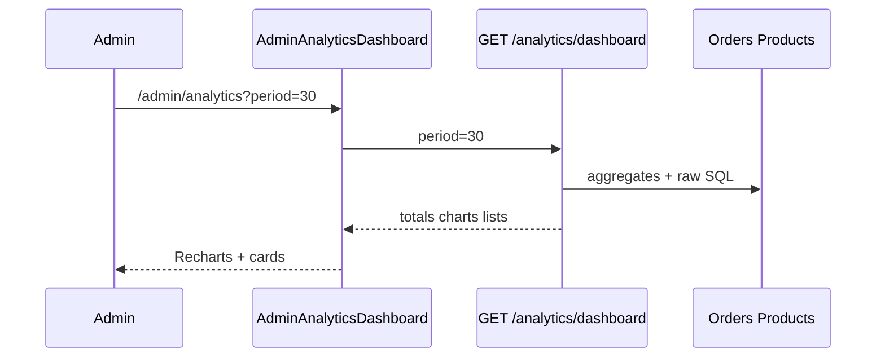

# Use Case — UC-ADM-10: Xem dashboard analytics (Admin View Analytics Dashboard)

| Thuộc tính | Giá trị |
|------------|---------|
| **ID** | UC-ADM-10 |
| **Tên** | Admin xem báo cáo tổng hợp: KPI, biểu đồ, tồn kho thấp, top SP |
| **Mức độ ưu tiên** | Trung bình |
| **Phiên bản** | Bám code hiện tại |
| **Liên quan FR** | (Analytics trong master spec / admin portal) |
| **Liên quan UC** | UC-ADM-11 (endpoint sales riêng), UC-ADM-05 (đơn delivered) |

---

## 1. Mô tả ngắn

Hai màn hình liên quan trong `AdminDashboard.jsx`:

| URL | UI |
|-----|-----|
| `/admin` | **Hub** — lưới card link tới modules (Analytics, SP, đơn, user, category, Q&A) |
| `/admin/analytics` | **Analytics Dashboard** — KPI + Recharts |

Data: **`GET /api/admin/analytics/dashboard?period={7|30|90}`**  
Hook: **`useAdminAnalytics({ period })`** → **không** gọi `/analytics/sales` (UC-ADM-11).

Component: `AdminAnalyticsDashboard` — Area chart doanh thu, Pie trạng thái đơn, Bar theo category, list low stock & top products.

**Layout:** Bọc bởi `AdminRoute` từ `App.jsx` (sidebar chuẩn). Class `AdminLayout` **bên trong** `AdminDashboard.jsx` là **dead code** (không export dùng).

---

## 2. Tác nhân

| Tác nhân | Vai trò |
|----------|---------|
| **Administrator** | Chọn period, xem chart |
| **getDashboardAnalytics** | Aggregate SQL / Sequelize |
| **Recharts** | Render biểu đồ FE |

---

## 3. Preconditions

| # | Điều kiện |
|---|-----------|
| PRE-01 | UC-ADM-01 |
| PRE-02 | DB có orders / products (có thể rỗng — chart trống) |

---

## 4. Postconditions

| # | Kết quả |
|---|---------|
| POST-01 | Hiển thị 8 stat cards + charts |
| POST-02 | Đổi period → refetch data (queryKey `["admin-analytics", period]`) |
| POST-E01 | API lỗi → 「Không tải được dữ liệu analytics」 |

---

## 5. Trigger

- Card **Analytics** từ `/admin` hoặc sidebar **Analytics** (`AdminRoute` → `/admin/analytics`).
- Đổi dropdown **7 / 30 / 90 ngày**.

---

## 6. API — `GET /admin/analytics/dashboard`

### Query

| Param | Default | Mô tả |
|-------|---------|--------|
| `period` | `30` | Số ngày lùi từ hôm nay |

### Khoảng thời gian

```javascript
periodStartDate = now - periodDays
```

Metrics **theo period** vs **all-time**:

| Metric | Phạm vi |
|--------|---------|
| `totals.users`, `totals.products` | **All time** (`User.count`, `Product.count is_active`) |
| `totals.orders`, `revenue`, `discount`, `aov`, `success_rate` | Trong **period** |
| `recent.orders_last_7_days` | Cố định **7 ngày** (không phụ thuộc period selector) |
| `sales_data` | Theo period, chỉ `status = delivered` |
| `order_status_breakdown` | **All orders** (không filter period) |
| `sales_by_category`, `sales_by_brand`, `top_products` | **All time** (SQL không filter ngày) |
| `low_stock_alerts` | Snapshot hiện tại top 10 stock thấp |

### Response shape (tóm tắt)

```json
{
  "totals": {
    "users": 120,
    "products": 45,
    "orders": 80,
    "revenue": 500000000,
    "discount": 10000000,
    "aov": 6250000,
    "success_rate": 62.5
  },
  "recent": { "orders_last_7_days": 12 },
  "order_status_breakdown": [{ "status": "processing", "count": 5 }],
  "low_stock_alerts": [{ "variation_id": 1, "sku": "...", "stock_quantity": 2, "product.product_name": "..." }],
  "sales_by_category": [{ "category_name": "Gaming", "total_quantity": 10, "total_revenue": "..." }],
  "sales_by_brand": [...],
  "top_products": [...],
  "sales_data": [{ "date": "2026-05-20", "order_count": 3, "total_revenue": "..." }]
}
```

### Công thức

```javascript
aov = deliveredOrders > 0 ? totalRevenue / deliveredOrders : 0
successRate = totalOrders > 0 ? (deliveredOrders / totalOrders) * 100 : 0
```

- `totalOrders`: count orders **created** trong period (mọi status).
- `totalRevenue` / `deliveredOrders`: chỉ **`status = delivered`** trong period.

### Low stock SQL

10 variation có `stock_quantity > 0`, `is_available`, product `is_active`, **ORDER BY stock_quantity ASC**.

---

## 7. Luồng FE — `AdminAnalyticsDashboard`

### Period selector

```javascript
const [period, setPeriod] = useState("30")
const { data, isLoading, error, refetch } = useAdminAnalytics({ period })

const handlePeriodChange = (newPeriod) => {
  setPeriod(newPeriod)
  refetch()  // redundant — queryKey đổi đã auto refetch
}
```

### Stat cards (8)

| Card | Nguồn |
|------|--------|
| Tổng doanh thu | `totals.revenue` |
| AOV | `totals.aov` |
| Tỷ lệ thành công | `totals.success_rate` % |
| Tổng chiết khấu | `totals.discount` |
| Tổng đơn hàng | `totals.orders` + subtitle 7 ngày |
| Tổng sản phẩm | `totals.products` active |
| Tổng người dùng | `totals.users` |
| Cảnh báo kho | `lowStockAlerts.length` |

### Charts

| Chart | Library | Data |
|-------|---------|------|
| Doanh thu theo ngày | `AreaChart` | `sales_data` → map `date`, `revenue` |
| Trạng thái đơn | `PieChart` | `order_status_breakdown` |
| Doanh số danh mục | `BarChart` | `sales_by_category` |

### Lists

- **Cảnh báo hết hàng** — keys dạng `'product.product_name'` (BE transform).
- **Sản phẩm bán chạy** — `top_products` (quantity + revenue).

### Label status FE (gap)

Map có `pending`, `shipped` — DB thực tế dùng `AWAITING_PAYMENT`, `shipping`, `FAILED`, … → label fallback hiển thị raw status.

---

## 8. Hub `/admin` (không gọi analytics API)

Grid link:

- Analytics → `/admin/analytics`
- Sản phẩm, Đơn hàng, Users, Categories, Q&A

**Thiếu:** Brands, Orders shortcut khác.

---

## 9. Sơ đồ



---

## 10. Ánh xạ mã nguồn

| Thành phần | Đường dẫn |
|------------|-----------|
| UI hub + analytics | `client/app/pages/admin/AdminDashboard.jsx` |
| Hook | `client/app/hooks/useOrders.js` — `useAdminAnalytics` |
| Controller | `server/controllers/adminController.js` L950–1154 |
| Route | `server/routes/adminRoutes.js` L53 |
| Format tiền | `client/app/utils/formatters.js` — `formatPrice` |

---

## 11. Known gaps

| # | Gap |
|---|-----|
| GAP-01 | `sales_by_category/brand/top_products` **không** filter theo period — dễ hiểu nhầm với dropdown |
| GAP-02 | `order_status_breakdown` **all time** trong khi revenue theo period |
| GAP-03 | Pie chart labels **lệch** status thực (`shipping` vs `shipped`) |
| GAP-04 | `sales_by_brand` trả về BE nhưng **không** có chart riêng trên FE |
| GAP-05 | Duplicate unused `AdminLayout` trong cùng file |
| GAP-06 | Không export CSV/PDF |
| GAP-07 | Success rate: mẫu số là mọi đơn tạo trong period, không phải đơn đã thanh toán |

---

## 12. Tiêu chí chấp nhận

- [ ] `/admin/analytics` load không lỗi với admin JWT
- [ ] Đổi 7/30/90 ngày → doanh thu chart / totals orders thay đổi
- [ ] Có đơn `delivered` trong period → revenue > 0
- [ ] Variation stock thấp → hiện trong cảnh báo
- [ ] Customer token → 403 dashboard API
