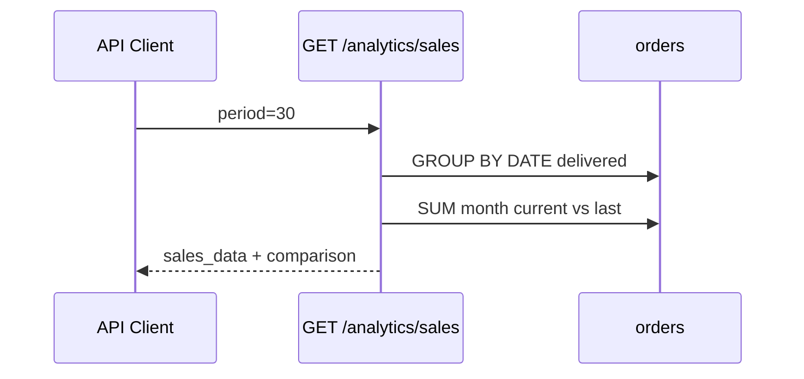

# Use Case — UC-ADM-11: Xem phân tích doanh số (Admin View Sales Analytics)

| Thuộc tính | Giá trị |
|------------|---------|
| **ID** | UC-ADM-11 |
| **Tên** | API phân tích doanh số theo ngày + so sánh tháng (endpoint chuyên biệt) |
| **Mức độ ưu tiên** | Thấp–Trung bình (BE có, **FE chưa tích hợp**) |
| **Phiên bản** | Bám code hiện tại |
| **Liên quan FR** | (Sales analytics — backend only) |
| **Liên quan UC** | UC-ADM-10 (dashboard dùng `sales_data` tương tự từ `/dashboard`) |

---

## 1. Mô tả ngắn

Endpoint **`GET /api/admin/analytics/sales?period=N`** trả về:

1. **`sales_data`** — chuỗi thời gian doanh thu / số đơn **theo ngày** (chỉ đơn **`delivered`**).
2. **`comparison`** — tổng doanh thu **tháng hiện tại** vs **tháng trước** + `% growth`.

**Không có** trang React, hook, hay component nào gọi endpoint này trong repo hiện tại.  
UC-ADM-10 đã embed **`sales_data`** (cùng logic group-by date) trong **`/analytics/dashboard`**.

Use case này mô tả **API sẵn sàng** cho báo cáo sales chuyên sâu / tích hợp tương lai.

---

## 2. Tác nhân

| Tác nhân | Vai trò |
|----------|---------|
| **Administrator / Manager** | Consumer API |
| **getSalesAnalytics** | Controller |
| **BI / Mobile app (tương lai)** | Có thể gọi trực tiếp |

---

## 3. Preconditions

| # | Điều kiện |
|---|-----------|
| PRE-01 | JWT + role admin/manager |
| PRE-02 | Bảng `orders` có cột `created_at`, `final_amount`, `status` |

---

## 4. Postconditions

| # | Kết quả |
|---|---------|
| POST-01 | `200` + `sales_data` array + `comparison` object |
| POST-02 | Period không hợp lệ → `parseInt` NaN có thể gây query lỗi (không validate) |

---

## 5. Trigger

- Gọi HTTP thủ công (Postman, curl, script).
- (Tương lai) Trang 「Sales Report」hoặc widget trên dashboard.

**Không trigger** khi admin mở `/admin/analytics` hiện tại.

---

## 6. API — `GET /api/admin/analytics/sales`

### Request

```http
GET /api/admin/analytics/sales?period=30
Authorization: Bearer <token>
```

| Query | Default | Ý nghĩa |
|-------|---------|---------|
| `period` | `30` | Số ngày lùi từ hôm nay |

### Response

```json
{
  "sales_data": [
    {
      "date": "2026-05-01",
      "order_count": "4",
      "total_revenue": "45000000"
    }
  ],
  "comparison": {
    "current_month": 120000000,
    "last_month": 95000000,
    "growth_percentage": "26.32"
  }
}
```

---

## 7. Logic Backend — `getSalesAnalytics`

### 7.1 Daily series

```javascript
const startDate = new Date()
startDate.setDate(startDate.getDate() - parseInt(period))

Order.findAll({
  attributes: [
    [Sequelize.fn('DATE', Sequelize.col('created_at')), 'date'],
    [Sequelize.fn('COUNT', Sequelize.col('order_id')), 'order_count'],
    [Sequelize.fn('SUM', Sequelize.col('final_amount')), 'total_revenue'],
  ],
  where: {
    created_at: { [Op.gte]: startDate },
    status: 'delivered',
  },
  group: [Sequelize.fn('DATE', Sequelize.col('created_at'))],
  order: [[Sequelize.fn('DATE', Sequelize.col('created_at')), 'ASC']],
  raw: true,
})
```

| Quy tắc | Chi tiết |
|---------|----------|
| Chỉ đơn hoàn thành | `status = 'delivered'` |
| Revenue | `SUM(final_amount)` — **chưa** trừ refund |
| Ngày không có đơn | **Không** có điểm 0 (gap chart FE nếu merge) |

### 7.2 Month-over-month

```javascript
currentMonthSales = Order.sum('final_amount', {
  where: {
    created_at: { gte: firstDayThisMonth, lt: firstDayNextMonth },
    status: 'delivered',
  },
})
// tương tự lastMonthSales
growth_percentage = lastMonthSales
  ? ((currentMonth - lastMonth) / lastMonth * 100).toFixed(2)
  : 0
```

| Lưu ý | |
|-------|---|
| Calendar month | Theo timezone server Node |
| `lastMonthSales === 0` | `growth_percentage` = `0` (string `"0"`) |

---

## 8. So sánh với UC-ADM-10 `/analytics/dashboard`

| Khía cạnh | `/analytics/dashboard` | `/analytics/sales` |
|-----------|-------------------------|-------------------|
| `sales_data` | ✅ Cùng pattern delivered + group date | ✅ |
| Period filter | ✅ Query `period` | ✅ Query `period` |
| Month comparison | ❌ | ✅ `comparison` |
| KPI cards | ✅ totals, aov, … | ❌ |
| Top products / category | ✅ | ❌ |
| Low stock | ✅ | ❌ |
| FE hook | `useAdminAnalytics` | **Không có** |

**Trùng lặp:** Hai endpoint tính `sales_data` gần giống — maintain risk.

---

## 9. Tích hợp FE đề xuất (chưa có)

Ví dụ hook tương lai:

```javascript
export function useSalesAnalytics({ period = "30" } = {}) {
  return useQuery({
    queryKey: ["admin-sales-analytics", period],
    queryFn: async () => {
      const { data } = await api.get(`/admin/analytics/sales?period=${period}`)
      return data
    },
  })
}
```

UI có thể:

- Line chart `sales_data` (giống UC-ADM-10).
- Card 「Tăng trưởng tháng」hiển thị `growth_percentage` + `current_month` / `last_month`.

---

## 10. Sơ đồ



---

## 11. Ví dụ curl

```bash
curl -s "$API/admin/analytics/sales?period=7" \
  -H "Authorization: Bearer $ADMIN_TOKEN" | jq
```

---

## 12. Ánh xạ mã nguồn

| Thành phần | Đường dẫn |
|------------|-----------|
| Controller | `server/controllers/adminController.js` L1156–1217 |
| Route | `server/routes/adminRoutes.js` L54 |
| Dashboard overlap | `getDashboardAnalytics` L1006–1020 |
| FE (none) | — |

---

## 13. Known gaps

| # | Gap |
|---|-----|
| GAP-01 | **Không có UI** — endpoint orphan |
| GAP-02 | Trùng `sales_data` với dashboard — DRY violation |
| GAP-03 | Không validate `period` (NaN, âm, max cap) |
| GAP-04 | Ngày trống không fill 0 — chart đứt đoạn |
| GAP-05 | `growth_percentage` string, không phải number |
| GAP-06 | Timezone month boundary không document |
| GAP-07 | Chỉ `delivered` — đơn `shipping` không tính pipeline revenue |
| GAP-08 | Không export, không cache |

---

## 14. Tiêu chí chấp nhận

- [ ] GET với admin JWT → 200 + `sales_data` + `comparison`
- [ ] Có đơn delivered trong 30 ngày → ít nhất 1 phần tử `sales_data`
- [ ] `period=7` vs `period=30` → số điểm khác nhau
- [ ] Token customer → 403
- [ ] Document: mở `/admin/analytics` **không** gọi endpoint này (kiểm tra Network tab)

---

## 15. Quan hệ vận hành

Admin muốn xem biểu đồ doanh thu **hôm nay** → dùng **UC-ADM-10** (`/admin/analytics`).  
Cần **% tăng trưởng tháng** → gọi **UC-ADM-11** API trực tiếp hoặc bổ sung FE sau.
