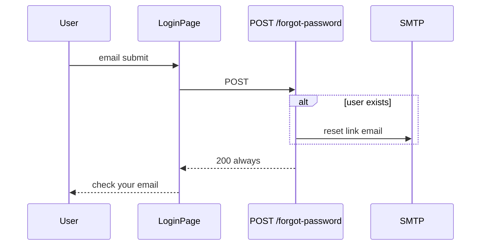

# Use Case — UC-AUTH-13: Yêu cầu quên mật khẩu (Forgot Password Request)

| Thuộc tính | Giá trị |
|------------|---------|
| **ID** | UC-AUTH-13 |
| **Tên** | Gửi email đặt lại mật khẩu (forgot password) |
| **Mức độ ưu tiên** | Cao |
| **Phiên bản** | Bám code hiện tại |

---

## 1. Mô tả ngắn

User quên mật khẩu nhập **email** trên `/login?mode=forgot`. Hệ thống **luôn** trả HTTP 200 với message chung — không tiết lộ email có tồn tại hay không. Nếu email khớp user, gửi mail chứa link tới backend verify reset (UC-AUTH-12).

**Endpoint:** `POST /api/auth/forgot-password`  
**FE:** `LoginPage` + `useForgotPassword()`

---

## 2. Tác nhân

| Tác nhân | Vai trò |
|----------|---------|
| **Guest / User** | Biết email đã đăng ký |
| **Hệ thống** | Tìm user, ký purpose JWT, SMTP |
| **Email** | Link reset |

---

## 3. Preconditions

| # | Điều kiện |
|---|-----------|
| PRE-01 | Truy cập `/login?mode=forgot` |
| PRE-02 | Email format hợp lệ (validator) |

---

## 4. Postconditions

### Thành công (luôn với email hợp lệ)

| # | Kết quả |
|---|---------|
| POST-01 | HTTP **200** message chung |
| POST-02 | FE `forgotSent=true` — UI “đã gửi mail” |
| POST-03 | Nếu user tồn tại: email với link `reset-password/verify?token=` |

### Không tiết lộ

| # | Kết quả |
|---|---------|
| POST-N01 | Email không có trong DB — **vẫn** 200, không gửi mail |

---

## 5. Trigger

Submit form forgot password trên `LoginPage`.

---

## 6. Luồng chính

| Bước | Tác nhân | Hành động |
|------|----------|-----------|
| 1 | User | Mở `/login?mode=forgot` |
| 2 | User | Nhập email, submit |
| 3 | FE | `forgotPassword.mutateAsync({ email: trim })` |
| 4 | BE | `emailOnlyValidation` |
| 5 | BE | `User.findOne({ where: { email } })` |
| 6a | BE | Nếu user: `signPurposeToken({ purpose: "password_reset", userId, email, expiresIn: "15m" })` |
| 6b | BE | `verifyUrl = API_PUBLIC_URL + /api/auth/reset-password/verify?token=` |
| 6c | BE | `sendEmail` HTML + nút xác nhận |
| 7 | BE | `200 { message: "If the email exists, a reset link has been sent" }` |
| 8 | FE | Hiển thị success, link về login |

---

## 7. Luồng thay thế

### AF-01: Dev không SMTP

`sendEmail` log link ra console — vẫn 200.

### AF-02: OAuth-only user có email

Vẫn gửi mail — reset sẽ **set** `password_hash` mới (bcrypt hook) — cho phép login form sau đó.

---

## 8. Luồng ngoại lệ

### EF-01: Email invalid — 400

```json
{ "errors": [{ "msg": "Invalid email", ... }] }
```

### EF-02: FE network error

`localError` — “Không thể gửi email…”

---

## 9. Quy tắc nghiệp vụ

| ID | Quy tắc |
|----|---------|
| BR-01 | **Anti-enumeration** — response uniform |
| BR-02 | Purpose token TTL `PASSWORD_RESET_EXPIRES_IN \|\| "15m"` |
| BR-03 | Link **backend-first** (không FE trực tiếp) |
| BR-04 | Stateless JWT — không lưu DB token table |
| BR-05 | Không rate limit |

---

## 10. API

```http
POST /api/auth/forgot-password
{ "email": "user@example.com" }
```

```json
{
  "message": "If the email exists, a reset link has been sent"
}
```

---

## 11. Triển khai

| File | Vai trò |
|------|---------|
| `authController.forgotPassword` L259–298 | BE |
| `authRoutes.js` | Route |
| `LoginPage.jsx` | UI mode forgot |
| `useAuth.js` | `useForgotPassword` |
| `api.js` | `authAPI.forgotPassword` |

---

## 12. Sơ đồ tuần tự



---

## 13. Liên kết

| UC |
|----|
| UC-AUTH-12 Verify reset token redirect |
| UC-AUTH-14 Reset password submit |
| UC-AUTH-04 Login |
| `FR_ForgotPassword.md` |

---

## 14. GAP

| # | Mô tả |
|---|--------|
| GAP-01 | Không rate limit / CAPTCHA |
| GAP-02 | Không invalidate session sau khi đặt lại MK |
| GAP-03 | TTL 15m — user chậm đọc mail có thể hết hạn |
