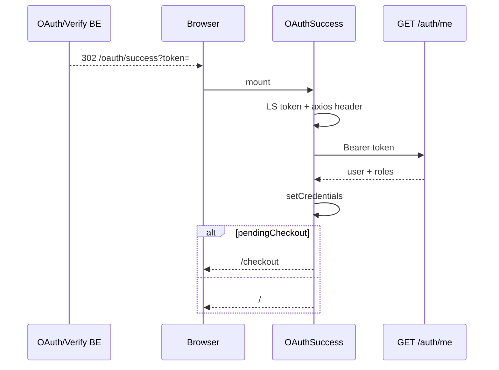

# Use Case — UC-AUTH-07: Xử lý callback OAuth / token trên FE (Handle OAuth Success Callback)

| Thuộc tính | Giá trị |
|------------|---------|
| **ID** | UC-AUTH-07 |
| **Tên** | Hoàn tất đăng nhập tại `/oauth/success` |
| **Mức độ ưu tiên** | Cao — điểm hợp nhất OAuth + verify email |
| **Phiên bản** | Bám code hiện tại |

---

## 1. Mô tả ngắn

Trang SPA **`/oauth/success`** nhận **session JWT** qua query `?token=`, gọi `GET /api/auth/me` để lấy profile đầy đủ (roles), lưu Redux + localStorage, rồi điều hướng trang chủ hoặc **checkout** nếu có `pendingCheckout`.

**Nguồn token:**

| Nguồn | Redirect tới |
|--------|----------------|
| Google OAuth callback | `/oauth/success?token=` |
| Facebook OAuth callback | `/oauth/success?token=` |
| Email verify (UC-AUTH-03) | `/oauth/success?token=` |

**File:** `client/app/pages/OAuthSuccess.jsx`  
**Route:** `App.jsx` — public, trong `Layout` (có Header/Footer).

---

## 2. Tác nhân

| Tác nhân | Vai trò |
|----------|---------|
| **Browser** | Load URL có query token |
| **OAuthSuccess** | React page |
| **API** | `GET /auth/me` với Bearer |
| **Redux** | `setCredentials` |

---

## 3. Preconditions

| # | Điều kiện |
|---|-----------|
| PRE-01 | Query `token` là JWT session hợp lệ (`{ userId }`, chưa hết hạn) |
| PRE-02 | User tồn tại và `is_active` (middleware `/me`) |
| PRE-03 | CORS/API base URL đúng (`VITE_API_URL`) |

---

## 4. Postconditions

### Thành công

| # | Kết quả |
|---|---------|
| POST-01 | `localStorage.token`, `user` (qua setCredentials) |
| POST-02 | `api.defaults.headers.Authorization` |
| POST-03 | Redux authenticated |
| POST-04 | User tại `/` hoặc `/checkout` với state |

### Thất bại

| # | Kết quả |
|---|---------|
| POST-F01 | `/login?oauth=failed` hoặc `oauth=missing` |

---

## 5. Trigger

HTTP GET `http://localhost:3000/oauth/success?token=<jwt>` (redirect từ BE hoặc bookmark).

---

## 6. Luồng chính

| Bước | Tác nhân | Hành động |
|------|----------|-----------|
| 1 | Browser | Load `/oauth/success?token=...` |
| 2 | FE | Render “Đang hoàn tất đăng nhập...” |
| 3 | FE | `useEffect`: `token = params.get("token")` |
| 4 | FE | `api.defaults.headers.Authorization = Bearer ${token}` |
| 5 | FE | `localStorage.setItem("token", token)` |
| 6 | FE | `api.get("/auth/me")` |
| 7 | BE | `authenticateToken` → user + roles |
| 8 | FE | `dispatch(setCredentials({ token, user: data.user }))` — LS user qua slice |
| 9 | FE | Đọc `pendingCheckout` từ LS |
| 10a | FE | Nếu có → parse JSON, remove key, `navigate('/checkout', { state, replace: true })` |
| 10b | FE | Else `navigate('/', { replace: true })` |

---

## 7. Luồng thay thế

### AF-01: Có `pendingCheckout` (mua hàng guest → OAuth)

| Bước | Mô tả |
|------|--------|
| AF-01.1 | `ProductDetailPage` lưu `pendingCheckout` trước redirect social |
| AF-01.2 | Sau success → checkout với `location.state` |

### AF-02: Bootstrap `main.jsx` đã set header

| Bước | Mô tả |
|------|--------|
| AF-02.1 | Token trong LS từ bước 5 — F5 vẫn logged in (`FR_RestoreAuthFromLocalStorage`) |

### AF-03: Verify email → cùng trang

UC-AUTH-03 redirect đúng `/oauth/success` — **không** qua `/register?token=`.

---

## 8. Luồng ngoại lệ

### EF-01: Thiếu query token

```javascript
navigate("/login?oauth=missing", { replace: true });
```

### EF-02: `/auth/me` fail (401/403/network)

```javascript
navigate("/login?oauth=failed", { replace: true });
```

### EF-03: `pendingCheckout` JSON corrupt

Log error, fallback `navigate("/")`.

### EF-04: Token purpose JWT lẫn session JWT

Nếu verify token bị đưa nhầm vào URL success — `/me` có thể pass middleware (GAP — không check purpose).

---

## 9. Quy tắc nghiệp vụ

| ID | Quy tắc |
|----|---------|
| BR-01 | **Luôn** gọi `/me` — không tin payload OAuth từ BE redirect |
| BR-02 | `setCredentials` ghi đè LS `user` với roles từ `/me` |
| BR-03 | `replace: true` — tránh back về URL lộ token |
| BR-04 | **Không** lưu `localStorage.roles` riêng ở đây — roles nằm trong `user` object |
| BR-05 | Một `useEffect` deps `[params, navigate, dispatch]` — chạy lại nếu đổi query |

---

## 10. Bảo mật & UX

| Chủ đề | Hiện trạng |
|--------|------------|
| Token in URL | JWT trong query string — lộ history/referrer (GAP) |
| XSS | Token trong LS — chuẩn SPA |
| Loading UI | Text tiếng Việt, không spinner component |

---

## 11. Khác biệt với `RegisterPage` useEffect token

`RegisterPage.jsx` L75–92: nếu có `?token` trên **/register** → `/me` + `setCredentials` + `navigate("/")` — **legacy / hiếm dùng** vì BE redirect `/oauth/success`.

**Canonical path:** chỉ UC-AUTH-07.

---

## 12. Triển khai

| File | Vai trò |
|------|---------|
| `OAuthSuccess.jsx` | Toàn bộ logic |
| `App.jsx` L91 | Route |
| `authSocialRoutes.js` | Redirect target |
| `authController.verifyEmail` | Redirect target |
| `authSlice.js` | `setCredentials` |
| `useAuth.js` | Pattern tương tự login |

---

## 13. Sơ đồ tuần tự



---

## 14. Liên kết

| UC |
|----|
| UC-AUTH-03, UC-AUTH-05, UC-AUTH-06 |
| UC-AUTH-04 (login form khác đường) |
| `ui/FR_RestoreAuthFromLocalStorage.md` |
| `FR_OAuthSuccessCallback.md` (nếu có trong auth FR) |

---

## 15. GAP

| # | Mô tả |
|---|--------|
| GAP-01 | JWT exposed in URL query |
| GAP-02 | Không xóa query token khỏi history (chỉ replace navigate away) |
| GAP-03 | Không set `localStorage.roles` — code khác đọc `roles` key có thể stale |
| GAP-04 | LoginPage không xử lý `google_failed` / `facebook_failed` query từ OAuth failure |
| GAP-05 | Không invalidate cart query explicitly (login hook có) |
