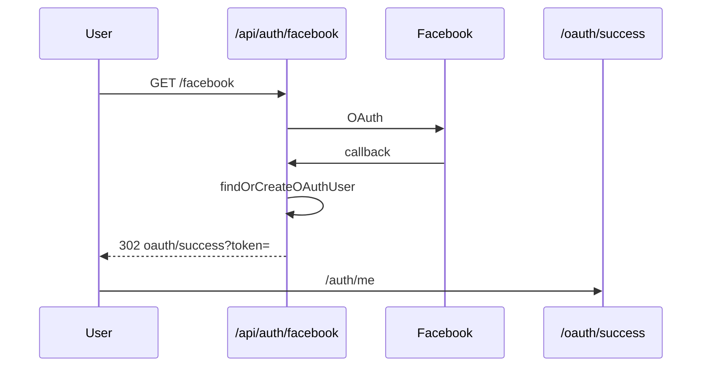

# Use Case — UC-AUTH-06: Đăng nhập / đăng ký bằng Facebook (Login With Facebook)

| Thuộc tính | Giá trị |
|------------|---------|
| **ID** | UC-AUTH-06 |
| **Tên** | OAuth Facebook — Passport FacebookStrategy |
| **Mức độ ưu tiên** | Cao |
| **Phiên bản** | Bám code hiện tại |

---

## 1. Mô tả ngắn

Tương tự Google: nút Facebook trên Login/Register → `GET /api/auth/facebook` → Facebook dialog → callback → `findOrCreateOAuthUser` → redirect `/oauth/success?token=...`.

**Khác Google:** Facebook **có thể không trả email**; callback handler chỉ destructure `{ token }` từ `req.user` (vẫn đủ cho FE).

---

## 2. Tác nhân

| Tác nhân | Vai trò |
|----------|---------|
| **User** | Browser |
| **Facebook** | IdP |
| **Passport** | `FacebookStrategy` |
| **Hệ thống** | Chung `findOrCreateOAuthUser` |

---

## 3. Preconditions

| # | Điều kiện |
|---|-----------|
| PRE-01 | `FACEBOOK_CLIENT_ID`, `FACEBOOK_CLIENT_SECRET`, `FACEBOOK_CALLBACK_URL` |
| PRE-02 | Facebook App OAuth redirect whitelist |
| PRE-03 | `profileFields: ["id", "displayName", "emails", "photos"]` |

---

## 4. Postconditions

### Thành công

Giống UC-AUTH-05 với `oauth_provider: "facebook"`.

### Thất bại

`{FE_APP_URL}/login?oauth=facebook_failed`

---

## 5. Trigger

```javascript
window.location.assign(`${BACKEND}/api/auth/facebook`);
```

---

## 6. Luồng chính

| Bước | Tác nhân | Hành động |
|------|----------|-----------|
| 1 | User | Click “Đăng nhập bằng Facebook” |
| 2 | Browser | `GET /api/auth/facebook` |
| 3 | Passport | `authenticate("facebook", { scope: ["email"], session: false })` |
| 4 | Facebook | Login + permissions |
| 5 | Callback | `GET /api/auth/facebook/callback` |
| 6 | Strategy | `email = profile.emails?.[0]?.value \|\| null` |
| 7 | Hệ thống | `findOrCreateOAuthUser({ provider: "facebook", oauthId: profile.id, ... })` |
| 8 | Route | `redirect FE_URL/oauth/success?token=...` (**chỉ token** trong handler) |
| 9 | FE | UC-AUTH-07 — user lấy từ `/auth/me` |

---

## 7. Luồng thay thế

### AF-01: Facebook không cấp email

| Bước | Mô tả |
|------|--------|
| AF-01.1 | `email = null` |
| AF-01.2 | Tạo user mới chỉ bằng `oauth_id` — **có thể lỗi** nếu DB bắt buộc email NOT NULL |
| AF-01.3 | Hoặc match chỉ qua `oauth_provider + oauth_id` lần sau |

### AF-02: Email trùng tài khoản có sẵn

Gắn `oauth_provider`, `oauth_id` vào user email trùng (giống Google).

---

## 8. Luồng ngoại lệ

### EF-01: OAuth failed

Redirect `facebook_failed` — LoginPage **không** map message riêng (chung `oauth=failed` nếu từ OAuthSuccess).

### EF-02: App Facebook chưa live / thiếu quyền email

Lỗi tại Passport → failureRedirect.

---

## 9. Quy tắc nghiệp vụ

| ID | Quy tắc |
|----|---------|
| BR-01 | Cùng `findOrCreateOAuthUser` với Google |
| BR-02 | Scope `["email"]` — không đảm bảo email luôn có |
| BR-03 | Callback không truyền `user` object qua URL — chỉ token |
| BR-04 | Username auto `{base}_{random5}` |

---

## 10. Cấu hình môi trường

| Biến | Mục đích |
|------|----------|
| `FACEBOOK_CLIENT_ID` | App ID |
| `FACEBOOK_CLIENT_SECRET` | Secret |
| `FACEBOOK_CALLBACK_URL` | `http://localhost:5000/api/auth/facebook/callback` |
| `FE_APP_URL` | Redirect sau login |

---

## 11. So sánh Google vs Facebook (code)

| Khía cạnh | Google | Facebook |
|-----------|--------|----------|
| Scope | `profile`, `email` | `email` |
| Callback destructuring | `{ token, user }` | `{ token }` only |
| Failure query | `google_failed` | `facebook_failed` |
| Email reliability | Cao hơn | Thấp hơn |

---

## 12. Triển khai

| File | Vai trò |
|------|---------|
| `authSocialRoutes.js` L24–37 | Routes |
| `passport.js` L79–105 | Strategy |
| `LoginPage.jsx`, `RegisterPage.jsx` | UI |

---

## 13. Sơ đồ tuần tự



---

## 14. Liên kết

| UC / FR |
|---------|
| UC-AUTH-05, UC-AUTH-07 |
| `FR_OAuthFacebook.md` |

---

## 15. GAP

| # | Mô tả |
|---|--------|
| GAP-01 | Email null + `email` NOT NULL constraint |
| GAP-02 | Không yêu cầu phone — user OAuth thiếu phone cho checkout validation |
| GAP-03 | Failure URL khác nhau — FE xử lý hạn chế |
