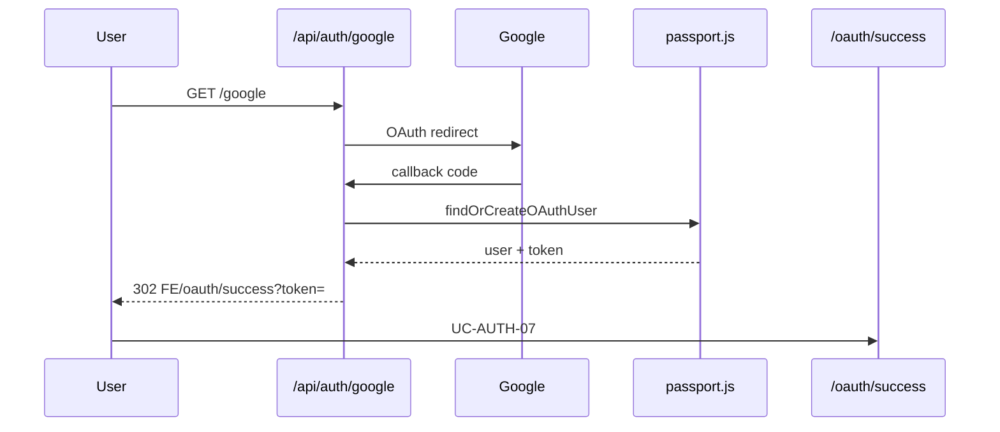

# Use Case — UC-AUTH-05: Đăng nhập / đăng ký bằng Google (Login With Google)

| Thuộc tính | Giá trị |
|------------|---------|
| **ID** | UC-AUTH-05 |
| **Tên** | OAuth 2.0 Google — Passport GoogleStrategy |
| **Mức độ ưu tiên** | Cao |
| **Phiên bản** | Bám code hiện tại |

---

## 1. Mô tả ngắn

User bấm “Đăng nhập/Đăng ký bằng Google” → browser chuyển tới Google → callback backend → tìm/tạo user → JWT → redirect FE `/oauth/success?token=...` (UC-AUTH-07).

**Bắt đầu:** `GET /api/auth/google`  
**Callback:** `GET /api/auth/google/callback`

---

## 2. Tác nhân

| Tác nhân | Vai trò |
|----------|---------|
| **User** | Browser |
| **Google** | Identity Provider |
| **Passport** | `GoogleStrategy` trong `passport.js` |
| **Hệ thống** | `findOrCreateOAuthUser` |

---

## 3. Preconditions

| # | Điều kiện |
|---|-----------|
| PRE-01 | `GOOGLE_CLIENT_ID`, `GOOGLE_CLIENT_SECRET`, `GOOGLE_CALLBACK_URL` |
| PRE-02 | `passport.initialize()` trong `server.js` |
| PRE-03 | Google Cloud OAuth consent + redirect URI khớp callback |
| PRE-04 | Role `customer` nếu tạo user mới |

---

## 4. Postconditions

### Thành công

| # | Kết quả |
|---|---------|
| POST-01 | User có `oauth_provider=google`, `oauth_id` |
| POST-02 | `last_login` updated |
| POST-03 | Browser redirect `{FE_APP_URL}/oauth/success?token=<jwt>` |
| POST-04 | Sau UC-AUTH-07: session storefront |

### Thất bại

| # | Kết quả |
|---|---------|
| POST-F01 | `{FE}/login?oauth=google_failed` |

---

## 5. Trigger

```javascript
// LoginPage.jsx / RegisterPage.jsx
window.location.assign(`${BACKEND}/api/auth/google`);
// BACKEND = VITE_BACKEND_URL || http://localhost:5000
```

---

## 6. Luồng chính

| Bước | Tác nhân | Hành động |
|------|----------|-----------|
| 1 | User | Click nút Google |
| 2 | Browser | `GET /api/auth/google` |
| 3 | Passport | `authenticate("google", { scope: ["profile","email"], session: false })` |
| 4 | Google | Consent + redirect `.../google/callback?code=` |
| 5 | Passport | Exchange code, gọi strategy callback |
| 6 | Strategy | `email`, `displayName`, `photos[0]` từ profile |
| 7 | Hệ thống | `findOrCreateOAuthUser({ provider: "google", oauthId, email, name, avatar })` |
| 8 | Hệ thống | `issueJwt(user_id)` → `{ user, token }` |
| 9 | Passport | `done(null, { user, token })` |
| 10 | Route handler | `redirect FE_URL/oauth/success?token=encodeURIComponent(token)` |
| 11 | FE | UC-AUTH-07 |

---

## 7. `findOrCreateOAuthUser` (chi tiết)

| Bước | Logic |
|------|--------|
| 7.1 | Tìm `oauth_provider + oauth_id` |
| 7.2 | Nếu không có và có `email` → tìm user email trùng → **gắn** oauth fields |
| 7.3 | Vẫn không có → `User.create` username random `{base}_{random}`, **không** password/phone |
| 7.4 | User mới → `addRole(customer)`, `Cart.create` |
| 7.5 | `update last_login`, return `{ user, token }` |

---

## 8. Luồng thay thế

### AF-01: Email đã có tài khoản password

Liên kết OAuth vào user cũ — vẫn login được Google; password cũ vẫn tồn tại nếu có hash.

### AF-02: User mới không cần verify email

OAuth user `is_active` default **true** — không qua UC-AUTH-02.

---

## 9. Luồng ngoại lệ

### EF-01: User từ chối Google / lỗi OAuth

`failureRedirect`: `${FE_URL}/login?oauth=google_failed`

### EF-02: Thiếu email trên Google profile

`email = null` — vẫn có thể tạo user nếu oauth_id mới (email column nullable? model allowNull on email is false - **User.create requires email** - could fail if no email - GAP)

Check User model - email allowNull: false - creating user with email null might fail!

From passport.js:
```
user = await User.create({
  username,
  email,  // can be null from profile
```

This could be a DB error - document as GAP

### EF-03: Env FE_URL vs FRONTEND_URL

OAuth callback uses `FE_APP_URL`; verify email uses `FRONTEND_URL` — có thể khác port (GAP).

---

## 10. Cấu hình môi trường

| Biến | Ví dụ |
|------|--------|
| `GOOGLE_CLIENT_ID` | OAuth client |
| `GOOGLE_CLIENT_SECRET` | Secret |
| `GOOGLE_CALLBACK_URL` | `http://localhost:5000/api/auth/google/callback` |
| `FE_APP_URL` | `http://localhost:3000` |
| `JWT_SECRET` | Ký JWT |

---

## 11. Triển khai

| File | Vai trò |
|------|---------|
| `server/routes/authSocialRoutes.js` L8–22 | Routes |
| `server/config/passport.js` L52–77 | Strategy |
| `server/server.js` | `authSocialRoutes`, `passport.initialize` |
| `LoginPage.jsx`, `RegisterPage.jsx` | Nút Google |

---

## 12. Sơ đồ tuần tự



---

## 13. Liên kết

| UC / FR |
|---------|
| UC-AUTH-07 |
| UC-AUTH-06 Facebook |
| `FR_OAuthGoogle.md` |

---

## 14. GAP

| # | Mô tả |
|---|--------|
| GAP-01 | Google không trả email → `User.create` có thể fail (`email` NOT NULL) |
| GAP-02 | `FE_APP_URL` ≠ `FRONTEND_URL` |
| GAP-03 | Session Passport `session: false` — stateless OK |
