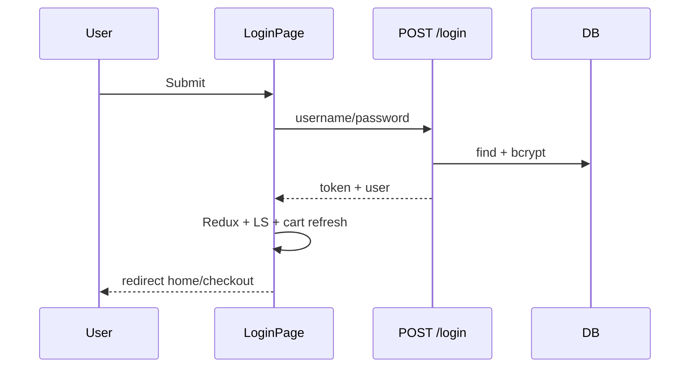

# Use Case — UC-AUTH-04: Đăng nhập username & mật khẩu (Login With Username Password)

| Thuộc tính | Giá trị |
|------------|---------|
| **ID** | UC-AUTH-04 |
| **Tên** | Đăng nhập bằng username và password |
| **Mức độ ưu tiên** | Cao — auth chính storefront |
| **Phiên bản** | Bám code hiện tại |

---

## 1. Mô tả ngắn

User đã có tài khoản (password local) nhập **username** (không phải email) + password trên `/login`; nhận JWT và profile kèm roles; FE persist session và có thể resume checkout.

**Endpoint:** `POST /api/auth/login`  
**FE:** `LoginPage.jsx` + `useLogin()`

---

## 2. Tác nhân

| Tác nhân | Vai trò |
|----------|---------|
| **User đã đăng ký** | Active, có `password_hash` |
| **Guest** | Bị redirect từ ProtectedRoute |
| **Hệ thống** | bcrypt, JWT, cập nhật `last_login` |

---

## 3. Preconditions

| # | Điều kiện |
|---|-----------|
| PRE-01 | User tồn tại với `username` khớp |
| PRE-02 | `is_active === true` (đã verify nếu đăng ký email) |
| PRE-03 | `password_hash` không null (OAuth-only **không** login form) |
| PRE-04 | Password đúng |

---

## 4. Postconditions

### Thành công

| # | Kết quả |
|---|---------|
| POST-01 | `last_login` cập nhật |
| POST-02 | Client: `localStorage.token`, `user`, `roles` |
| POST-03 | Redux `isAuthenticated`, axios Bearer |
| POST-04 | React Query invalidate `cart`, `me` |

### Thất bại

| # | Kết quả |
|---|---------|
| POST-F01 | 401 / 403 — không set session |

---

## 5. Trigger

Submit form đăng nhập trên `LoginPage` hoặc API client `POST /login`.

---

## 6. Luồng chính

| Bước | Tác nhân | Hành động |
|------|----------|-----------|
| 1 | User | Nhập username, password |
| 2 | FE | `useLogin.mutateAsync({ username: trim, password })` |
| 3 | BE | `loginValidation` pass |
| 4 | BE | `User.findOne({ where: { username }, include: Role })` |
| 5 | BE | `comparePassword(password)` |
| 6 | BE | Reject nếu `!is_active` → 403 |
| 7 | BE | `update({ last_login })`, `generateToken(user_id)` |
| 8 | BE | `200 { message, token, user: { ..., roles: Roles.map } }` |
| 9 | FE | `setAuthHeader`, LS token + roles, `dispatch(setCredentials)` |
| 10 | FE | Nếu `pendingCheckout` → `navigate('/checkout', { state })` |
| 11 | FE | Else `navigate(redirect query \|\| '/')` |

---

## 7. Luồng thay thế

### AF-01: Từ ProtectedRoute

| Bước | Mô tả |
|------|--------|
| AF-01.1 | Guest `/checkout` → `/login` |
| AF-01.2 | Sau login → checkout (pendingCheckout hoặc manual) |

### AF-02: Banner verify / reset trên LoginPage

| Query | UI |
|-------|-----|
| `?verify=invalid` | `verifyBanner` đỏ |
| `?reset=success` | Banner xanh — đăng nhập mật khẩu mới |

### AF-03: Chế độ forgot / reset password

| Mode | Route |
|------|-------|
| `?mode=forgot` | Form email → `POST /forgot-password` |
| `?mode=reset&token=` | `POST /reset-password` — **không** auto login |

---

## 8. Luồng ngoại lệ

### EF-01: Sai credentials — 401

```json
{ "message": "Invalid username or password" }
```

Message **chung** — không tiết lộ user tồn tại hay không.

### EF-02: Chưa verify email — 403

```json
{ "message": "Account is inactive" }
```

### EF-03: OAuth user cố login password — 401

`password_hash` null → compare fail.

### EF-04: API 401 sau login

Interceptor xóa session → `window.location.href = '/login'` (trừ login/register URL).

---

## 9. Quy tắc nghiệp vụ

| ID | Quy tắc |
|----|---------|
| BR-01 | Login theo **username** only |
| BR-02 | JWT `{ userId }`, expiry `7d` |
| BR-03 | Roles từ DB `user.Roles` |
| BR-04 | FE lưu `roles` vào LS riêng |
| BR-05 | Không server logout endpoint |

---

## 10. API

```http
POST /api/auth/login
{ "username": "super_admin", "password": "..." }
```

```json
{
  "message": "Login successful",
  "token": "<jwt>",
  "user": {
    "user_id": 1,
    "username": "...",
    "email": "...",
    "full_name": "...",
    "phone_number": "...",
    "avatar_url": null,
    "roles": ["admin"]
  }
}
```

---

## 11. Triển khai

| File | Vai trò |
|------|---------|
| `authController.login` L360–417 | BE |
| `authRoutes.js` | Route |
| `LoginPage.jsx` | Form + social + forgot |
| `useAuth.js` `useLogin` | Mutation |
| `main.jsx` / `App.jsx` | Session restore |
| `ProtectedRoute.jsx` | Gate |

---

## 12. Sơ đồ tuần tự



---

## 13. Liên kết

| UC / FR |
|---------|
| UC-AUTH-02, UC-AUTH-03 |
| UC-AUTH-04 |
| `FR_Login.md`, `ui/FR_ProtectedRouteGuard.md` |

---

## 14. GAP

| # | Mô tả |
|---|--------|
| GAP-01 | Không login bằng email |
| GAP-02 | `?redirect=` có trên code nhưng ít link tạo |
| GAP-03 | 403 inactive message không hướng dẫn “check email” |
