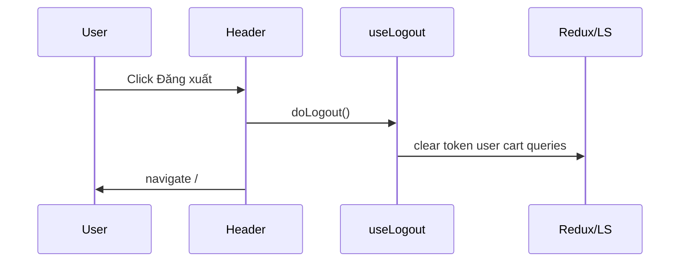

# Use Case — UC-AUTH-08: Đăng xuất (Logout)

| Thuộc tính | Giá trị |
|------------|---------|
| **ID** | UC-AUTH-08 |
| **Tên** | Đăng xuất — xóa phiên phía client |
| **Mức độ ưu tiên** | Cao |
| **Phiên bản** | Bám code hiện tại |

---

## 1. Mô tả ngắn

User chủ động kết thúc phiên đăng nhập trên trình duyệt: xóa JWT và user khỏi `localStorage`, Redux `auth`, cache React Query, và header axios. **Không có** `POST /api/auth/logout` trên backend — JWT vẫn hợp lệ về mặt kỹ thuật cho đến khi hết hạn (7 ngày).

**Triển khai chính:** `useLogout()` trong `client/app/hooks/useAuth.js`  
**UI:** `Header.jsx` (storefront), `AdminRoute.jsx` / `AdminDashboard.jsx` (admin — **phiên bản rút gọn**).

---

## 2. Tác nhân

| Tác nhân | Vai trò |
|----------|---------|
| **User đã đăng nhập** | Click “Đăng xuất” |
| **Hệ thống (FE)** | Dọn state client |
| **API backend** | Không tham gia |

---

## 3. Preconditions

| # | Điều kiện |
|---|-----------|
| PRE-01 | User đang có session client (`token` trong LS hoặc Redux `isAuthenticated`) |
| PRE-02 | Trình duyệt cho phép thao tác localStorage |

---

## 4. Postconditions

### Thành công

| # | Kết quả |
|---|---------|
| POST-01 | `localStorage`: không còn `token`, `roles`; `user` xóa qua `authSlice.logout` |
| POST-02 | `localStorage.removeItem("pendingCheckout")` |
| POST-03 | Redux: `isAuthenticated = false`, cart cleared |
| POST-04 | React Query: removed `cart`, `orders`, `order-counters`, `me`, `currentUser` |
| POST-05 | `delete api.defaults.headers.common.Authorization` |
| POST-06 | User thường ở `/` (Header `navigate("/")`) |

### Không đảm bảo

| # | Kết quả |
|---|---------|
| POST-N01 | JWT không bị revoke server-side |

---

## 5. Trigger

- Storefront: `Header` → `handleLogout()` → `useLogout()` + `navigate("/")`
- Admin sidebar: `AdminRoute` `handleLogout` → **chỉ** `dispatch(logout())` (GAP — thiếu bước dọn cache)

---

## 6. Luồng chính — `useLogout()` (Header)

| Bước | Tác nhân | Hành động |
|------|----------|-----------|
| 1 | User | Click “Đăng xuất” trên Header |
| 2 | FE | `setAuthHeader(null)` |
| 3 | FE | `localStorage.removeItem("token")`, `removeItem("roles")` |
| 4 | FE | `dispatch(clearCart())`, `dispatch(logout())` |
| 5 | FE | `qc.removeQueries` — cart, orders, order-counters, me, currentUser |
| 6 | FE | `localStorage.removeItem("pendingCheckout")` |
| 7 | FE | `navigate("/")` |

### `authSlice.logout`

```javascript
logout: (state) => {
  state.user = null;
  state.token = null;
  state.isAuthenticated = false;
  localStorage.removeItem("token");
  localStorage.removeItem("user");
  localStorage.removeItem("roles");
},
```

---

## 7. Luồng thay thế

### AF-01: Logout gián tiếp qua API 401

| Bước | Mô tả |
|------|--------|
| AF-01.1 | Request API với token hết hạn → `api.js` interceptor |
| AF-01.2 | Xóa LS + `logout()` + `clearCart()` + `window.location.href = "/login"` |
| AF-01.3 | **Không** gọi `useLogout` — không removeQueries đầy đủ như manual logout (một phần có) |

### AF-02: Admin logout rút gọn

| Bước | Mô tả |
|------|--------|
| AF-02.1 | `AdminRoute` chỉ `dispatch(logout())` |
| AF-02.2 | Có thể còn axios default header / React Query cache (GAP) |

---

## 8. Luồng ngoại lệ

### EF-01: User mở nhiều tab

Tab khác vẫn giữ LS cho đến khi reload — **không** sync cross-tab (GAP).

### EF-02: `useLogout` try/catch no-op

Lỗi nội bộ bị nuốt — user vẫn thấy đã logout nếu Redux đổi.

---

## 9. Quy tắc nghiệp vụ

| ID | Quy tắc |
|----|---------|
| BR-01 | Logout = **client-only** |
| BR-02 | Không invalidate JWT trên server |
| BR-03 | Giỏ Redux cleared — server cart vẫn tồn tại cho user |
| BR-04 | Guest có thể tiếp tục xem catalog |

---

## 10. So sánh điểm gọi logout

| Vị trí | Hành vi |
|--------|---------|
| `Header` + `useLogout` | Đầy đủ dọn dẹp |
| `AdminRoute` | Chỉ `logout()` slice |
| `AdminDashboard` inner (dead layout) | `dispatch(logout())` |
| `api` 401 interceptor | LS + logout + redirect login |

---

## 11. Triển khai

| File | Vai trò |
|------|---------|
| `client/app/hooks/useAuth.js` | `useLogout` L142–171 |
| `client/app/store/slices/authSlice.js` | `logout` reducer |
| `client/app/components/Header.jsx` | UI storefront |
| `client/app/components/AdminRoute.jsx` | Admin logout |
| `client/app/services/api.js` | Passive logout on 401 |

---

## 12. Sơ đồ tuần tự



---

## 13. Liên kết

| UC / FR |
|---------|
| UC-AUTH-09 Restore session |
| UC-AUTH-04 Login |
| `ui/FR_RestoreAuthFromLocalStorage.md` |
| `system/FR_JWTAuthenticationMiddleware.md` |

---

## 14. GAP

| # | Mô tả |
|---|--------|
| GAP-01 | **Không** endpoint `/auth/logout` |
| GAP-02 | Admin logout không dùng `useLogout` |
| GAP-03 | JWT vẫn dùng được nếu bị lộ |
| GAP-04 | Multi-tab không đồng bộ logout |
