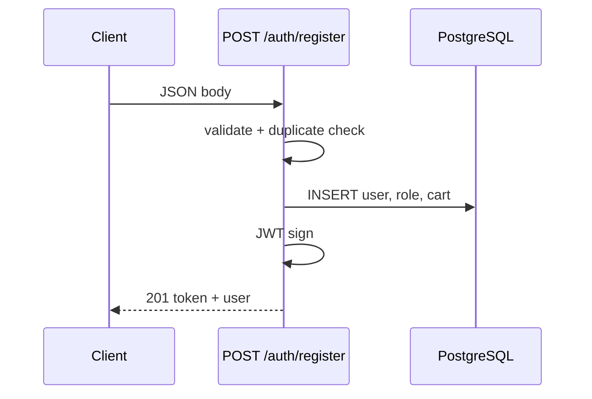

# Use Case — UC-AUTH-01: Đăng ký trực tiếp (Register Direct)

| Thuộc tính | Giá trị |
|------------|---------|
| **ID** | UC-AUTH-01 |
| **Tên** | Đăng ký tài khoản trực tiếp (không xác minh email) |
| **Mức độ ưu tiên** | Trung bình (API có; UI storefront **không** dùng) |
| **Phiên bản** | Bám code hiện tại |

---

## 1. Mô tả ngắn

Khách gửi form đăng ký đầy đủ; hệ thống tạo user **active ngay**, gán role `customer`, tạo giỏ hàng, trả **JWT 7 ngày** — có thể gọi API ngay không cần bước email.

**Endpoint:** `POST /api/auth/register`  
**Controller:** `authController.register`  
**FE mặc định:** trang `/register` gọi `register-email` — **không** gọi use case này (xem UC-AUTH-02).

---

## 2. Tác nhân (Actors)

| Tác nhân | Vai trò |
|----------|---------|
| **Khách (Guest)** | Người muốn tạo tài khoản |
| **Client API** | Postman, mobile app, hoặc FE tích hợp sau |
| **Hệ thống** | Validate, persist DB, phát JWT |

---

## 3. Điều kiện tiên quyết (Preconditions)

| # | Điều kiện |
|---|-----------|
| PRE-01 | DB có bảng `users`, `roles`, `user_roles`, `carts` |
| PRE-02 | Role `customer` tồn tại trong `roles` |
| PRE-03 | `username`, `email`, `phone_number` chưa được user khác dùng |
| PRE-04 | `JWT_SECRET` cấu hình (hoặc fallback dev) |

---

## 4. Điều kiện sau (Postconditions)

### Thành công

| # | Kết quả |
|---|---------|
| POST-01 | Bản ghi `users` mới, `is_active = true` (default model) |
| POST-02 | `password_hash` đã bcrypt (hook `beforeCreate`) |
| POST-03 | `user_roles` gắn `customer` |
| POST-04 | `carts` một dòng `user_id` |
| POST-05 | Client nhận `201` + `token` + `user` (roles hardcode `["customer"]` trong response) |

### Thất bại

| # | Kết quả |
|---|---------|
| POST-F01 | Không tạo user; trả 400/409 |

---

## 5. Kích hoạt (Trigger)

Client gửi `POST /api/auth/register` với body JSON hợp lệ.

---

## 6. Luồng chính (Main Success Scenario)

| Bước | Tác nhân | Hành động |
|------|----------|-----------|
| 1 | Client | Gửi `{ username, email, password, full_name, phone_number }` |
| 2 | Hệ thống | `validationResult` — `registerValidation` pass |
| 3 | Hệ thống | `User.findOne` OR username/email/phone — không trùng |
| 4 | Hệ thống | `User.create` — password qua hook → hash |
| 5 | Hệ thống | `Role.findOne({ role_name: "customer" })` → `user.addRole` |
| 6 | Hệ thống | `Cart.create({ user_id })` |
| 7 | Hệ thống | `generateToken(user_id)` — JWT `{ userId }`, `7d` |
| 8 | Hệ thống | `201` JSON `{ message, token, user }` |
| 9 | Client *(nếu có)* | `setCredentials`, lưu LS, redirect home/checkout |

---

## 7. Luồng thay thế (Alternative Flows)

### AF-01: Client dùng hook `useRegister()` (chưa gắn UI)

| Bước | Mô tả |
|------|--------|
| AF-01.1 | `useRegister` → `authAPI.register` |
| AF-01.2 | `onSuccess` tùy implement — hook hiện **không** auto `setCredentials` như `useLogin` |

### AF-02: Sau đăng ký → checkout

| Bước | Mô tả |
|------|--------|
| AF-02.1 | Client lưu token, gọi `GET /api/cart` |
| AF-02.2 | Navigate `/checkout` nếu có `pendingCheckout` (pattern LoginPage) |

---

## 8. Luồng ngoại lệ (Exception Flows)

### EF-01: Validation fail — 400

```json
{ "errors": [ { "msg": "...", "path": "username" } ] }
```

### EF-02: Trùng username/email/phone — 409

```json
{
  "message": "Duplicate entry",
  "errors": [
    { "field": "email", "code": "DUPLICATE_EMAIL", "message": "Email already registered" }
  ]
}
```

### EF-03: Thiếu role `customer` — vẫn 201

User tạo nhưng không gán role nếu `Role.findOne` null (GAP).

### EF-04: Sequelize unique race — 500/409

Hai request đồng thời cùng email.

---

## 9. Quy tắc nghiệp vụ

| ID | Quy tắc |
|----|---------|
| BR-01 | `phone_number` **bắt buộc** (validator + model unique) |
| BR-02 | `full_name` optional trên BE |
| BR-03 | Response `roles: ["customer"]` — **không** query DB roles |
| BR-04 | Không gửi email xác nhận |
| BR-05 | User active ngay — có thể `POST /auth/login` ngay |

---

## 10. Dữ liệu request / response

### Request

```http
POST /api/auth/register
Content-Type: application/json

{
  "username": "nguyenvana",
  "email": "a@example.com",
  "password": "secret12",
  "full_name": "Nguyen Van A",
  "phone_number": "+84901234567"
}
```

### Response 201

```json
{
  "message": "User registered successfully",
  "token": "<jwt>",
  "user": {
    "user_id": 1,
    "username": "nguyenvana",
    "email": "a@example.com",
    "full_name": "Nguyen Van A",
    "phone_number": "+84901234567",
    "roles": ["customer"]
  }
}
```

---

## 11. Ánh xạ triển khai

| Layer | File |
|-------|------|
| Route | `server/routes/authRoutes.js` — `POST /register` |
| Controller | `server/controllers/authController.js` — `register` |
| Model | `server/models/User.js` — bcrypt hooks |
| Hook FE | `client/app/hooks/useAuth.js` — `useRegister` |
| API client | `client/app/services/api.js` — `authAPI.register` |

---

## 12. Sơ đồ tuần tự



---

## 13. Liên kết

| Tài liệu | Quan hệ |
|----------|---------|
| UC-AUTH-02 | Register email verification — **luồng FE chính** |
| UC-AUTH-04 | Login sau khi đã có tài khoản |
| `docs/feature_requirements/auth/FR_RegisterDirect.md` | FR chi tiết |

---

## 14. Ghi chú / GAP

| # | Mô tả |
|---|--------|
| GAP-01 | **RegisterPage.jsx không gọi** endpoint này |
| GAP-02 | Response thiếu `avatar_url` so với login |
| GAP-03 | Không rate limit / CAPTCHA |
