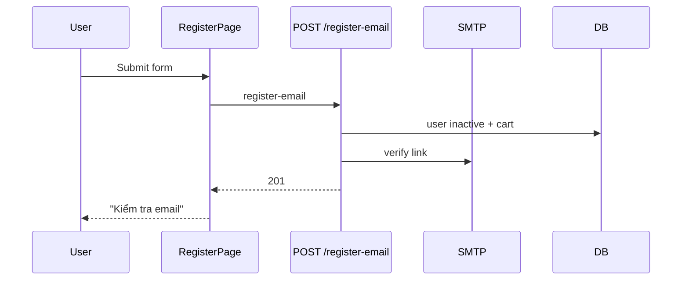

# Use Case — UC-AUTH-02: Đăng ký có xác minh email (Register With Email Verification)

| Thuộc tính | Giá trị |
|------------|---------|
| **ID** | UC-AUTH-02 |
| **Tên** | Đăng ký tài khoản + gửi email xác nhận |
| **Mức độ ưu tiên** | Cao — **luồng đăng ký mặc định trên FE** |
| **Phiên bản** | Bám code hiện tại |

---

## 1. Mô tả ngắn

Khách điền form trên `/register`; hệ thống tạo user **`is_active: false`**, gán role + cart, gửi email chứa link `GET /api/auth/verify-email?token=...`. Khách **chưa** nhận JWT session cho đến khi bấm link (UC-AUTH-03).

**Endpoint:** `POST /api/auth/register-email`  
**FE:** `RegisterPage.jsx` + `useRegisterEmailVerification()`

---

## 2. Tác nhân

| Tác nhân | Vai trò |
|----------|---------|
| **Khách** | Đăng ký trên web |
| **Hệ thống** | Persist, ký purpose JWT, gửi SMTP |
| **Dịch vụ email** | `authController.sendEmail` — `EMAIL_HOST/PORT/...` |

---

## 3. Preconditions

| # | Điều kiện |
|---|-----------|
| PRE-01 | Giống UC-AUTH-01 (DB, role customer) |
| PRE-02 | Email chưa đăng ký |
| PRE-03 | SMTP: thiếu `EMAIL_*` → email skip, vẫn 201 (dev log link) |

---

## 4. Postconditions

### Thành công

| # | Kết quả |
|---|---------|
| POST-01 | User tồn tại, `is_active = false` |
| POST-02 | Cart + role customer |
| POST-03 | Purpose JWT `email_verify` trong email |
| POST-04 | FE hiển thị màn “Kiểm tra email của bạn” |

### Thất bại

| # | Kết quả |
|---|---------|
| POST-F01 | 400 validation / 409 duplicate — không tạo user |

---

## 5. Trigger

Khách submit form “Đăng ký” trên `RegisterPage` (sau validate mật khẩu khớp ở FE).

---

## 6. Luồng chính

| Bước | Tác nhân | Hành động |
|------|----------|-----------|
| 1 | Khách | Nhập username, email, password, confirm, full_name, phone |
| 2 | FE | Kiểm tra `password === confirmPassword` — lỗi local nếu không |
| 3 | FE | `POST /api/auth/register-email` |
| 4 | BE | Validate `registerValidation` |
| 5 | BE | Duplicate check (username, email, phone) |
| 6 | BE | `User.create({ ..., is_active: false })` |
| 7 | BE | `addRole(customer)`, `Cart.create` |
| 8 | BE | `signPurposeToken({ purpose: "email_verify", userId, email, expiresIn: 24h })` |
| 9 | BE | `verifyUrl = API_PUBLIC_URL + /api/auth/verify-email?token=` |
| 10 | BE | `sendEmail` HTML + nút “Xác nhận” |
| 11 | BE | `201 { message: "Verification email sent", email }` |
| 12 | FE | `setEmailSent(true)`, hiển thị hướng dẫn + nút về `/login` |

---

## 7. Luồng thay thế

### AF-01: Đăng ký bằng Google/Facebook từ cùng trang

| Bước | Mô tả |
|------|--------|
| AF-01.1 | Nút social → `window.location.assign(BACKEND + /api/auth/google|facebook)` |
| AF-01.2 | Không qua register-email — xem UC-AUTH-05/06/07 |

### AF-02: Dev không có SMTP

| Bước | Mô tả |
|------|--------|
| AF-02.1 | `sendEmail` log `[MAIL] Missing EMAIL_*` + in link trong console |
| AF-02.2 | Vẫn 201 — copy link verify thủ công |

---

## 8. Luồng ngoại lệ

### EF-01: 409 duplicate — FE map field errors

`RegisterPage` parse `errors[].field` → hiển thị dưới input / `dupHints`.

### EF-02: Khách login trước khi verify

`POST /auth/login` → `403 Account is inactive` (UC-AUTH-04).

### EF-03: Gửi lại email

**Không có** endpoint resend — phải đăng ký lại hoặc admin (GAP).

---

## 9. Quy tắc nghiệp vụ

| ID | Quy tắc |
|----|---------|
| BR-01 | Token verify là **purpose JWT**, không phải session JWT |
| BR-02 | TTL `EMAIL_VERIFY_EXPIRES_IN` default `24h` |
| BR-03 | Link verify trỏ **backend** URL (`API_PUBLIC_URL`), không FE |
| BR-04 | Không trả `token` session trong response 201 |

---

## 10. Request / Response

```http
POST /api/auth/register-email
```

Body giống UC-AUTH-01.

```json
// 201
{
  "message": "Verification email sent",
  "email": "user@example.com"
}
```

---

## 11. Triển khai

| Layer | File |
|-------|------|
| Route | `authRoutes.js` L33–37 |
| Controller | `authController.registerEmailVerification` L142–221 |
| FE Page | `RegisterPage.jsx` |
| FE Hook | `useRegisterEmailVerification` |

---

## 12. Sơ đồ tuần tự



---

## 13. Liên kết

| UC / FR |
|---------|
| UC-AUTH-03 Verify email + auto login |
| UC-AUTH-01 Register direct (không dùng trên FE) |
| `FR_RegisterEmailVerification.md` |

---

## 14. GAP

| # | Mô tả |
|---|--------|
| GAP-01 | Không resend verification email |
| GAP-02 | `RegisterPage` useEffect token trên `/register` — **hiếm dùng** (verify redirect `/oauth/success`) |
| GAP-03 | Email stack khác `emailService` order emails |
