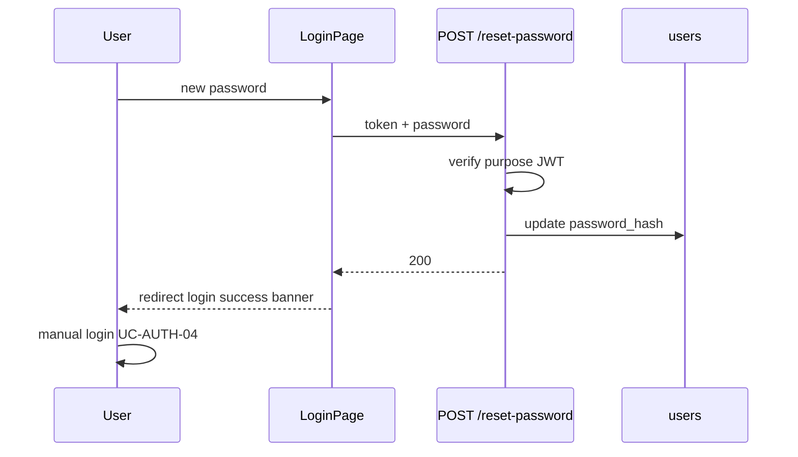

# Use Case — UC-AUTH-14: Đặt mật khẩu mới (Reset Password)

| Thuộc tính | Giá trị |
|------------|---------|
| **ID** | UC-AUTH-14 |
| **Tên** | Gửi mật khẩu mới kèm purpose token |
| **Mức độ ưu tiên** | Cao |
| **Phiên bản** | Bám code hiện tại |

---

## 1. Mô tả ngắn

Sau UC-AUTH-12, user nhập mật khẩu mới trên `LoginPage` (`mode=reset`). FE gọi **`POST /api/auth/reset-password`** với `{ token, password }`. Backend verify purpose JWT, hash password, cập nhật DB. **Không** tự động login — user quay login thủ công với mật khẩu mới.

**Endpoint:** `POST /api/auth/reset-password`  
**FE:** `useResetPassword()` + `LoginPage.handleResetSubmit`

---

## 2. Tác nhân

| Tác nhân | Vai trò |
|----------|---------|
| **User** | Có token từ email flow |
| **LoginPage** | Form reset |
| **Hệ thống** | bcrypt via User hook |

---

## 3. Preconditions

| # | Điều kiện |
|---|-----------|
| PRE-01 | Query `token` từ UC-AUTH-12 redirect |
| PRE-02 | Token `password_reset` còn hạn |
| PRE-03 | User tồn tại `decoded.userId` |
| PRE-04 | FE: password ≥ 6, confirm khớp |

---

## 4. Postconditions

### Thành công

| # | Kết quả |
|---|---------|
| POST-01 | `users.password_hash` bcrypt mới |
| POST-02 | `200 { message: "Password updated successfully" }` |
| POST-03 | FE `resetDone` → sau ~900ms → `/login?reset=success` |
| POST-04 | User **chưa** có JWT session mới |

### Thất bại

| # | Kết quả |
|---|---------|
| POST-F01 | 400 invalid token / validation |
| POST-F02 | 404 user not found |

---

## 5. Trigger

Submit form “Lưu mật khẩu mới” trên `LoginPage` khi `mode=reset`.

---

## 6. Luồng chính

| Bước | Tác nhân | Hành động |
|------|----------|-----------|
| 1 | User | Nhập password + confirm |
| 2 | FE | Validate length ≥ 6, match confirm |
| 3 | FE | `resetPassword.mutateAsync({ token: resetToken, password })` |
| 4 | BE | `resetPasswordValidation` — token required, password min 6 |
| 5 | BE | `jwt.verify` — purpose `password_reset`, `userId` |
| 6 | BE | `User.findByPk(decoded.userId)` |
| 7 | BE | `user.update({ password_hash: password })` — hook hash |
| 8 | BE | `200` message success |
| 9 | FE | `setResetDone(true)` |
| 10 | FE | `setTimeout` → `navigate("/login?reset=success", { replace: true })` |
| 11 | User | Login UC-AUTH-04 với mật khẩu mới |

```javascript
// FE handleResetSubmit (excerpt)
await resetPassword.mutateAsync({ token: resetToken, password: resetForm.password });
setResetDone(true);
window.setTimeout(() => navigate("/login?reset=success", { replace: true }), 900);
```

---

## 7. Luồng thay thế

### AF-01: OAuth user thêm password

User chỉ có Google trước đó → sau reset có thể login **username/password** nếu biết username.

### AF-02: Inactive user (email verify chưa xong)

Reset vẫn đổi password — login vẫn 403 inactive cho đến khi verify email (edge).

---

## 8. Luồng ngoại lệ

### EF-01: Thiếu token query — FE

`localError`: "Thiếu token đặt lại mật khẩu." — không gọi API.

### EF-02: BE 400

```json
{ "message": "Invalid or expired token" }
```
hoặc
```json
{ "message": "Invalid token" }
```
hoặc validation errors array.

### EF-03: BE 404

```json
{ "message": "User not found" }
```

### EF-04: Mật khẩu không khớp — chỉ FE

Không gọi API.

---

## 9. Quy tắc nghiệp vụ

| ID | Quy tắc |
|----|---------|
| BR-01 | **Không** auto-issue session JWT sau reset |
| BR-02 | **Không** revoke JWT cũ đang lưu trên thiết bị khác |
| BR-03 | Cùng `signPurposeToken` secret với forgot email |
| BR-04 | `password` min 6 BE + FE |
| BR-05 | Purpose token không dùng cho `/auth/me` (middleware gap) |

---

## 10. API

```http
POST /api/auth/reset-password
Content-Type: application/json

{
  "token": "<purpose_jwt_from_query>",
  "password": "newSecret123"
}
```

```json
{
  "message": "Password updated successfully"
}
```

---

## 11. Validation

### Backend (`resetPasswordValidation`)

| Field | Rules |
|-------|--------|
| `token` | notEmpty |
| `password` | min length 6 |

### Frontend

| Check | Message |
|-------|---------|
| confirm match | FE only |
| min 6 | FE only |

---

## 12. Triển khai

| File | Vai trò |
|------|---------|
| `authController.resetPassword` L322–357 | BE |
| `authRoutes.js` | POST route |
| `LoginPage.jsx` | reset mode UI |
| `useAuth.js` | `useResetPassword` |
| `User.js` | `beforeUpdate` hash |

---

## 13. Sơ đồ tuần tự



---

## 14. Liên kết

| UC |
|----|
| UC-AUTH-13 Forgot |
| UC-AUTH-12 Verify redirect |
| UC-AUTH-04 Login |
| `FR_ForgotPassword.md` (và FR reset nếu có) |

---

## 15. GAP

| # | Mô tả |
|---|--------|
| GAP-01 | Không auto-login sau reset |
| GAP-02 | Session JWT cũ vẫn valid đến hết 7d |
| GAP-03 | Token trong browser history |
| GAP-04 | Không đánh dấu purpose token đã dùng |
