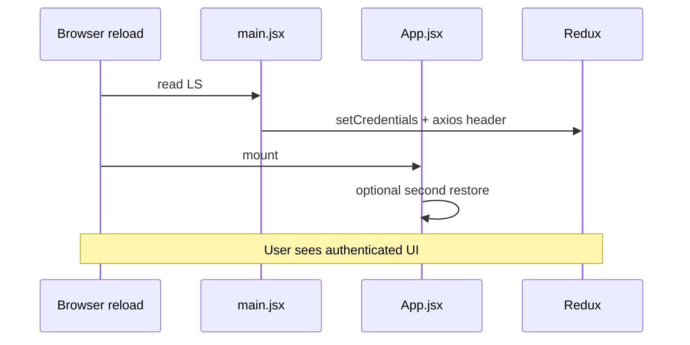

# Use Case — UC-AUTH-09: Khôi phục phiên đăng nhập (Restore Auth Session)

| Thuộc tính | Giá trị |
|------------|---------|
| **ID** | UC-AUTH-09 |
| **Tên** | Khôi phục session từ localStorage sau F5 / mở tab |
| **Mức độ ưu tiên** | Cao |
| **Phiên bản** | Bám code hiện tại |

---

## 1. Mô tả ngắn

Khi user đã login trước đó và **tải lại** ứng dụng (F5) hoặc mở lại tab, FE đọc `localStorage.token` + `localStorage.user`, khôi phục Redux `isAuthenticated` và axios `Authorization` **trước hoặc ngay sau** render — **không** bắt buộc gọi lại `POST /login`.

**Hai lớp:** `main.jsx` (eager) + `App.jsx` `useEffect` (backup).  
**Không** tự động `GET /auth/me` on app load (hooks có sẵn nhưng không mount global).

---

## 2. Tác nhân

| Tác nhân | Vai trò |
|----------|---------|
| **Returning user** | Có LS từ lần login/OAuth/register trước |
| **Browser** | Persist localStorage |
| **Redux / axios** | Nhận bootstrap |

---

## 3. Preconditions

| # | Điều kiện |
|---|-----------|
| PRE-01 | `localStorage.token` và `localStorage.user` tồn tại và JSON user hợp lệ |
| PRE-02 | (Khuyến nghị) JWT chưa hết hạn — nếu hết hạn API sẽ 401 sau đó |

---

## 4. Postconditions

### Thành công

| # | Kết quả |
|---|---------|
| POST-01 | Redux: `isAuthenticated=true`, `user`, `token` |
| POST-02 | `api.defaults.headers.common.Authorization = Bearer ...` (main.jsx) |
| POST-03 | `ProtectedRoute` cho phép vào `/checkout` (Redux hoặc token LS) |
| POST-04 | Request interceptor gắn Bearer mỗi call |

### Thất bại / partial

| # | Kết quả |
|---|---------|
| POST-F01 | Parse user JSON lỗi → App xóa LS; main im lặng |
| POST-F02 | Token hết hạn → UI vẫn “logged in” đến khi API 401 |

---

## 5. Trigger

- Load/reload SPA (`index.html` → `main.jsx` → `App`)
- Không cần user action

---

## 6. Luồng chính — Bootstrap A (`main.jsx`)

| Bước | Hành động |
|------|-----------|
| 1 | `token = localStorage.getItem("token")` |
| 2 | `rawUser = localStorage.getItem("user")` |
| 3 | Nếu cả hai có: `user = JSON.parse(rawUser)` |
| 4 | `store.dispatch(setCredentials({ token, user }))` |
| 5 | `api.defaults.headers.common.Authorization = Bearer ${token}` |
| 6 | Render React tree (`App`, routes) |

`setCredentials` **ghi lại** token/user vào LS (idempotent).

---

## 7. Luồng bổ sung — Bootstrap B (`App.jsx`)

| Bước | Hành động |
|------|-----------|
| 1 | `useEffect` khi mount / `isAuthenticated` đổi |
| 2 | Nếu `token && userStr && !isAuthenticated` |
| 3 | Parse user → `dispatch(setCredentials)` |
| 4 | Catch parse error → remove token, user, roles |

Cover edge case main parse fail hoặc StrictMode timing.

---

## 8. Luồng phụ — `pendingCheckout` cleanup

Sau khi `isAuthenticated`:

| Bước | Hành động |
|------|-----------|
| 1 | Đọc `pendingCheckout` |
| 2 | Nếu `timestamp` > 5 phút trước → xóa key |
| 3 | Parse lỗi → xóa key |

Tránh checkout “ma” sau session cũ.

---

## 9. Luồng thay thế

### AF-01: Chỉ có token, mất user JSON

| Kết quả |
|---------|
| Bootstrap **không** chạy → guest cho đến khi login lại |
| `ProtectedRoute` vẫn pass nếu **còn** token (`hasToken`) |

### AF-02: OAuth / verify redirect

Token mới ghi LS qua `OAuthSuccess` → F5 dùng UC-AUTH-09.

### AF-03: `useCurrentUser` / `useMe` (không mount mặc định)

Nếu gọi → refresh roles vào `localStorage.roles`; **không** cập nhật Redux user tự động trừ onSuccess custom.

---

## 10. Luồng ngoại lệ

### EF-01: JWT expired

| Bước | Mô tả |
|------|--------|
| 1 | User F5 → restored UI logged in |
| 2 | `GET /cart` → 401 |
| 3 | Interceptor xóa session → `/login` |

### EF-02: User deactivated sau khi lưu LS

`authenticateToken` → 403 trên API; interceptor có thể xử lý như 401 legacy.

### EF-03: Stale profile in LS

`user` JSON cũ — không refetch `/me` on load (GAP).

---

## 11. Dữ liệu localStorage

| Key | Vai trò trong restore |
|-----|------------------------|
| `token` | JWT session |
| `user` | Object Redux (cần `roles[]` cho AdminRoute) |
| `roles` | **Không** đọc khi bootstrap — chỉ ghi khi login |

---

## 12. Quy tắc nghiệp vụ

| ID | Quy tắc |
|----|---------|
| BR-01 | Restore **không** validate JWT server-side tại bootstrap |
| BR-02 | Truth đầy đủ profile: `GET /auth/me` (khi gọi) |
| BR-03 | Dual bootstrap intentional redundancy |
| BR-04 | Session length = JWT `7d` |

---

## 13. Triển khai

| File | Vai trò |
|------|---------|
| `client/app/main.jsx` | Bootstrap A |
| `client/app/App.jsx` | Bootstrap B, pendingCheckout |
| `client/app/store/slices/authSlice.js` | `setCredentials` |
| `client/app/services/api.js` | Request interceptor |
| `client/app/components/ProtectedRoute.jsx` | `hasToken` fallback |

---

## 14. Sơ đồ tuần tự

---

## 15. Liên kết

| UC / FR |
|---------|
| UC-AUTH-04, UC-AUTH-07 |
| UC-AUTH-08 Logout |
| UC-AUTH-11 View profile (`/me`) |
| `ui/FR_RestoreAuthFromLocalStorage.md` |

---

## 16. GAP

| # | Mô tả |
|---|--------|
| GAP-01 | Không refetch `/me` on app start |
| GAP-02 | Dual bootstrap + StrictMode noise |
| GAP-03 | `roles` key có thể lệch `user.roles` |
| GAP-04 | main.jsx catch không purge invalid LS |
