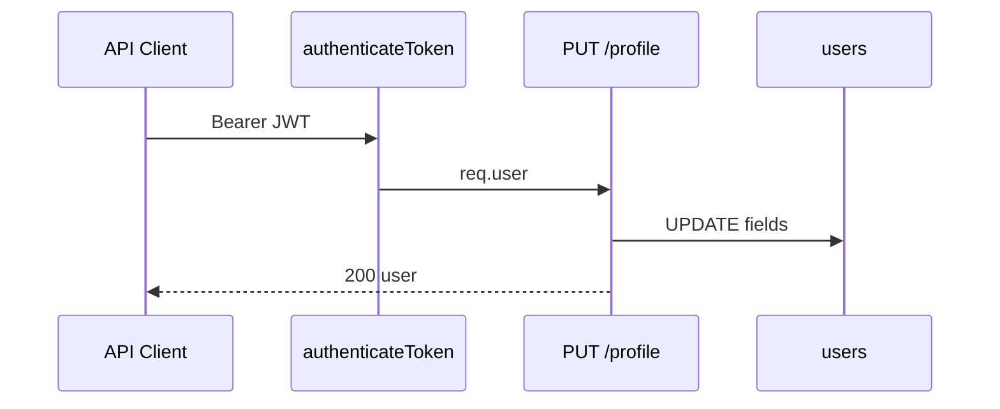

# Use Case — UC-AUTH-10: Cập nhật hồ sơ user (Update User Profile)

| Thuộc tính | Giá trị |
|------------|---------|
| **ID** | UC-AUTH-10 |
| **Tên** | Cập nhật full_name, phone, address, avatar_url |
| **Mức độ ưu tiên** | Trung bình (BE sẵn sàng; **FE chưa có form**) |
| **Phiên bản** | Bám code hiện tại |

---

## 1. Mô tả ngắn

User đã đăng nhập gửi **`PUT /api/auth/profile`** để cập nhật một số trường hồ sơ. Username và email **không** đổi qua endpoint này. Password đổi qua luồng reset (UC-AUTH-14/12).

**Backend:** `authController.updateProfile`  
**Frontend:** **chưa** implement — `authAPI` không có `updateProfile`; `ProfilePage` chỉ xem.

---

## 2. Tác nhân

| Tác nhân | Vai trò |
|----------|---------|
| **Authenticated user** | Bearer JWT |
| **API client / tương lai FE** | Gửi JSON body |
| **authenticateToken** | Gate |

---

## 3. Preconditions

| # | Điều kiện |
|---|-----------|
| PRE-01 | JWT session hợp lệ, `is_active` |
| PRE-02 | `Content-Type: application/json` |

---

## 4. Postconditions

### Thành công

| # | Kết quả |
|---|---------|
| POST-01 | DB user row cập nhật các field gửi lên |
| POST-02 | `200` + message + subset `user` (không có `roles`) |
| POST-03 | FE **nên** sync Redux/LS — **chưa** có code mặc định |

### Thất bại

| # | Kết quả |
|---|---------|
| POST-F01 | 401/403 — không đổi DB |

---

## 5. Trigger

`PUT /api/auth/profile` (Postman, mobile app, hoặc FE form tương lai).

---

## 6. Luồng chính (backend)

| Bước | Hành động |
|------|-----------|
| 1 | `authenticateToken` → `req.user` instance |
| 2 | Destructure `full_name, phone_number, address, avatar_url` từ `req.body` |
| 3 | `await req.user.update({ full_name, phone_number, address, avatar_url })` |
| 4 | Trả JSON user refreshed (không include roles) |

```javascript
await req.user.update({
  full_name,
  phone_number,
  address,
  avatar_url,
});
```

| # | Rule |
|---|------|
| BR-01 | Gửi `undefined` field có thể ghi NULL — client nên gửi đủ field muốn giữ |
| BR-02 | **Không** express-validator trên route |
| BR-03 | `phone_number` unique DB — trùng user khác → 409/500 |
| BR-04 | `avatar_url` là URL string — không upload file |

---

## 7. Luồng thay thế

### AF-01: Client sau update gọi `GET /me`

Refresh roles + address cho Redux (pattern khuyến nghị — chưa coded).

### AF-02: Checkout dùng phone

Cập nhật `phone_number` ảnh hưởng đơn sau này — không retroactive orders.

---

## 8. Luồng ngoại lệ

### EF-01: 401 / 403

Giống middleware auth chung.

### EF-02: Unique phone violation

Sequelize `SequelizeUniqueConstraintError` → errorHandler 409.

### EF-03: OAuth user null phone

Có thể set phone lần đầu qua PUT — hữu ích cho checkout validation.

---

## 9. API

```http
PUT /api/auth/profile
Authorization: Bearer <token>
Content-Type: application/json

{
  "full_name": "Nguyen Van A",
  "phone_number": "+84901234567",
  "address": "123 Street",
  "avatar_url": "https://res.cloudinary.com/..."
}
```

```json
{
  "message": "Profile updated successfully",
  "user": {
    "user_id": 1,
    "username": "...",
    "email": "...",
    "full_name": "Nguyen Van A",
    "phone_number": "+84901234567",
    "address": "123 Street",
    "avatar_url": "https://..."
  }
}
```

---

## 10. Phạm vi không đổi

| Field | Lý do |
|-------|--------|
| `username` | Không trong controller |
| `email` | Không trong controller |
| `password_hash` | Dùng reset password |
| `roles` | Admin API riêng |

---

## 11. Triển khai

| File | Vai trò |
|------|---------|
| `server/controllers/authController.js` | `updateProfile` L450–476 |
| `server/routes/authRoutes.js` | `PUT /profile` |
| `client/app/pages/ProfilePage.jsx` | Read-only — GAP |
| `docs/feature_requirements/auth/FR_UpdateProfile.md` | FR |

---

## 12. Sơ đồ tuần tự



---

## 13. Liên kết

| UC |
|----|
| UC-AUTH-11 View profile |
| UC-AUTH-09 Restore (stale LS after update) |
| `FR_UpdateProfile.md` |

---

## 14. GAP

| # | Mô tả |
|---|--------|
| GAP-01 | **Không có UI** cập nhật profile |
| GAP-02 | Response thiếu `roles` |
| GAP-03 | Không validation phone format trên PUT |
| GAP-04 | Redux/LS không auto-sync sau PUT |
