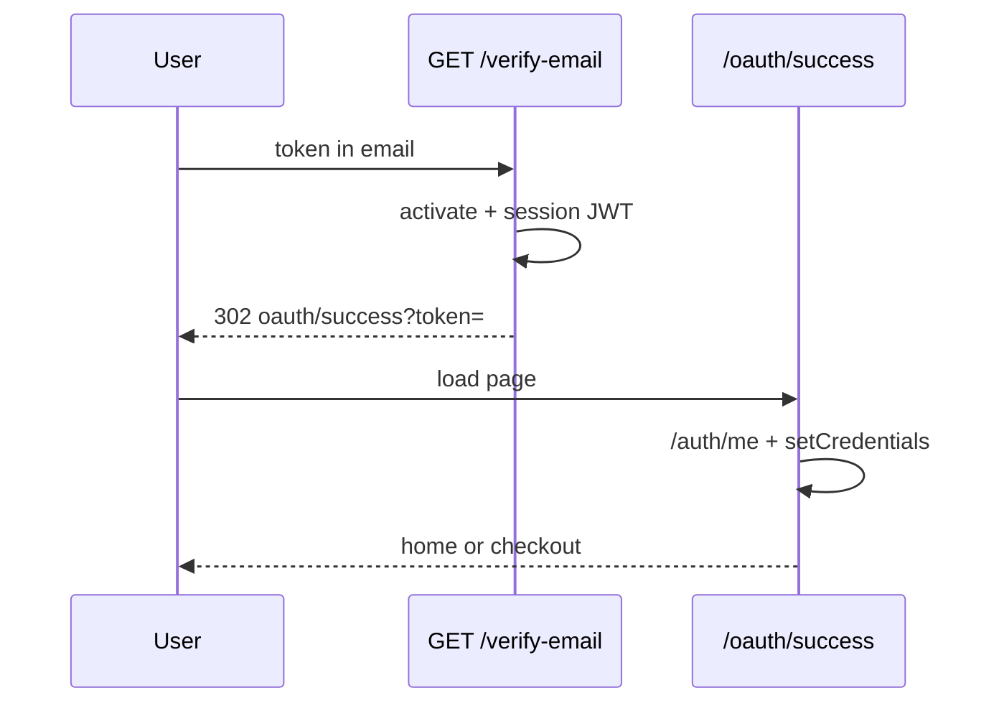

# Use Case — UC-AUTH-03: Xác minh email và tự động đăng nhập (Verify Email And Auto Login)

| Thuộc tính | Giá trị |
|------------|---------|
| **ID** | UC-AUTH-03 |
| **Tên** | Xác nhận email từ link → kích hoạt tài khoản → JWT → FE |
| **Mức độ ưu tiên** | Cao |
| **Phiên bản** | Bám code hiện tại |

---

## 1. Mô tả ngắn

Khách bấm link trong email đăng ký; browser gọi `GET /api/auth/verify-email?token=...` (backend). Server verify purpose JWT, set `is_active = true`, phát **session JWT**, redirect browser tới **`{FRONTEND}/oauth/success?token=`** — cùng trang hoàn tất OAuth (UC-AUTH-07).

**Controller:** `authController.verifyEmail`  
**Không** qua FE route trực tiếp cho bước verify.

---

## 2. Tác nhân

| Tác nhân | Vai trò |
|----------|---------|
| **Khách** | Mở link email |
| **Browser** | Follow redirect |
| **Hệ thống** | Verify JWT, activate user |
| **OAuthSuccess page** | Nhận token, `GET /auth/me`, Redux |

---

## 3. Preconditions

| # | Điều kiện |
|---|-----------|
| PRE-01 | User đã tạo qua UC-AUTH-02 |
| PRE-02 | Token purpose `email_verify` còn hạn |
| PRE-03 | `decoded.userId` tồn tại trong DB |
| PRE-04 | `FRONTEND_URL` / `CLIENT_URL` cấu hình cho redirect |

---

## 4. Postconditions

### Thành công

| # | Kết quả |
|---|---------|
| POST-01 | `users.is_active = true` |
| POST-02 | Browser tại `/oauth/success?token=<session_jwt>` |
| POST-03 | Sau UC-AUTH-07: Redux authenticated, có thể vào checkout |

### Thất bại

| # | Kết quả |
|---|---------|
| POST-F01 | Redirect `/login?verify=<reason>` |

---

## 5. Trigger

HTTP GET từ email client tới `verify-email?token=...`.

---

## 6. Luồng chính

| Bước | Tác nhân | Hành động |
|------|----------|-----------|
| 1 | Khách | Click “Xác nhận” trong email |
| 2 | Browser | `GET /api/auth/verify-email?token=...` |
| 3 | BE | Parse `req.query.token` |
| 4 | BE | `jwt.verify` — secret `JWT_SECRET` |
| 5 | BE | Check `purpose === "email_verify"` và `userId` |
| 6 | BE | `User.findByPk(userId)` |
| 7 | BE | Nếu `!is_active` → `update({ is_active: true })` |
| 8 | BE | `sessionToken = generateToken(user_id)` — JWT 7d, payload `{ userId }` |
| 9 | BE | `302` → `{FRONTEND}/oauth/success?token=<encodeURIComponent(sessionToken)>` |
| 10 | FE | `OAuthSuccess` — UC-AUTH-07 |
| 11 | FE | `GET /auth/me` → `setCredentials` → `/` hoặc `/checkout` |

---

## 7. Luồng thay thế

### AF-01: User đã active (bấm link lần 2)

| Bước | Mô tả |
|------|--------|
| AF-01.1 | Bỏ qua update nếu đã active |
| AF-01.2 | Vẫn phát session JWT mới và redirect success |

### AF-02: LoginPage hiển thị banner verify

| Bước | Mô tả |
|------|--------|
| AF-02.1 | Redirect lỗi → `/login?verify=invalid` etc. |
| AF-02.2 | `LoginPage` `verifyBanner` map query `verify` |

---

## 8. Luồng ngoại lệ

| Query `verify` | Redirect khi |
|--------------|--------------|
| `missing` | Không có token query |
| `invalid` | JWT fail hoặc sai purpose |
| `notfound` | User không tồn tại |
| `error` | Exception handler |

Tất cả: `getFrontendBaseUrl() + /login?verify=...`

### EF: Token hết hạn

`jwt.verify` throw → redirect `verify=invalid`.

### EF: Dùng purpose token gọi API khác

Middleware session không check purpose — nếu lộ token verify có thể abuse (GAP hệ thống).

---

## 9. Quy tắc nghiệp vụ

| ID | Quy tắc |
|----|---------|
| BR-01 | Chỉ `purpose: email_verify` được chấp nhận |
| BR-02 | Session token **khác** token trong email (mới sign 7d) |
| BR-03 | Dùng chung landing `/oauth/success` với OAuth |
| BR-04 | `getFrontendBaseUrl()` ưu tiên `FRONTEND_URL` rồi `CLIENT_URL` |

---

## 10. Redirect URLs

| Kết quả | URL |
|---------|-----|
| OK | `{FE}/oauth/success?token={jwt}` |
| Lỗi | `{FE}/login?verify=missing\|invalid\|notfound\|error` |

---

## 11. Triển khai

| File | Vai trò |
|------|---------|
| `authController.verifyEmail` L224–256 | Logic |
| `authRoutes.js` `GET /verify-email` | Route |
| `OAuthSuccess.jsx` | FE completion |
| `LoginPage.jsx` | Error banners |

---

## 12. Sơ đồ tuần tự

---

## 13. Liên kết

| UC |
|----|
| UC-AUTH-02 Register email |
| UC-AUTH-07 OAuth success callback |
| UC-AUTH-04 Login (sau active) |
| `FR_VerifyEmail.md` |

---

## 14. GAP

| # | Mô tả |
|---|--------|
| GAP-01 | Không invalidate purpose token sau dùng — có thể replay link trong TTL |
| GAP-02 | `FE_APP_URL` vs `FRONTEND_URL` — verify dùng `getFrontendBaseUrl`, OAuth callback dùng `FE_APP_URL` |
| GAP-03 | Không thông báo email “đã xác minh” nếu đã active |
