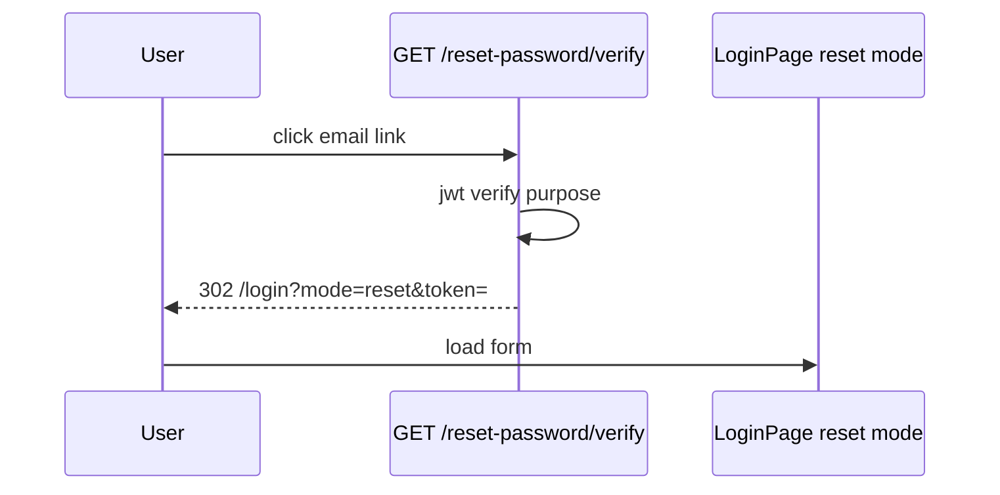

# Use Case — UC-AUTH-12: Xác minh token reset mật khẩu (Verify Reset Password Token)

| Thuộc tính | Giá trị |
|------------|---------|
| **ID** | UC-AUTH-12 |
| **Tên** | Click link email → BE verify → redirect form đặt MK mới |
| **Mức độ ưu tiên** | Cao |
| **Phiên bản** | Bám code hiện tại |

---

## 1. Mô tả ngắn

User bấm link trong email quên mật khẩu. Browser gọi **`GET /api/auth/reset-password/verify?token=...`** (backend). Server verify JWT purpose `password_reset`, rồi **redirect** sang FE:

```
/login?mode=reset&token=<purpose_jwt>
```

User nhập mật khẩu mới trên `LoginPage` (mode reset) — submit ở UC-AUTH-14.

**Controller:** `authController.resetPasswordRedirect`  
**Không** đổi password tại bước này — chỉ validate + redirect.

---

## 2. Tác nhân

| Tác nhân | Vai trò |
|----------|---------|
| **User** | Click link email |
| **Browser** | Follow 302 |
| **Backend** | JWT verify |
| **LoginPage** | Form reset với token query |

---

## 3. Preconditions

| # | Điều kiện |
|---|-----------|
| PRE-01 | Token từ email UC-AUTH-13 còn hạn (`~15m`) |
| PRE-02 | `purpose === "password_reset"` |
| PRE-03 | `decoded.userId` hợp lệ |

---

## 4. Postconditions

### Thành công

| # | Kết quả |
|---|---------|
| POST-01 | Browser tại `/login?mode=reset&token=...` |
| POST-02 | LoginPage hiển thị form mật khẩu mới |
| POST-03 | Password DB **chưa** đổi |

### Thất bại

| # | Kết quả |
|---|---------|
| POST-F01 | Redirect `/login?mode=reset&error=missing\|invalid\|error` |

---

## 5. Trigger

GET từ email client (user click).

---

## 6. Luồng chính

| Bước | Tác nhân | Hành động |
|------|----------|-----------|
| 1 | User | Click link trong email |
| 2 | Browser | `GET /api/auth/reset-password/verify?token=...` |
| 3 | BE | Parse `req.query.token` |
| 4 | BE | `jwt.verify(token, JWT_SECRET)` |
| 5 | BE | Check `purpose === "password_reset"` && `userId` |
| 6 | BE | `302` → `{FRONTEND}/login?mode=reset&token=${encodeURIComponent(token)}` |
| 7 | FE | `LoginPage` đọc `mode=reset`, `token` query |
| 8 | User | Nhập password + confirm (UC-AUTH-14) |

```javascript
// authController.resetPasswordRedirect (simplified)
if (!token) return redirect(`${FE}/login?mode=reset&error=missing`);
try {
  const decoded = jwt.verify(token, JWT_SECRET);
  if (decoded?.purpose !== "password_reset" || !decoded?.userId)
    return redirect(`${FE}/login?mode=reset&error=invalid`);
} catch {
  return redirect(`${FE}/login?mode=reset&error=invalid`);
}
return redirect(`${FE}/login?mode=reset&token=${encodeURIComponent(token)}`);
```

---

## 7. Luồng thay thế

### AF-01: User bookmark URL reset có token

Token purpose JWT trong query — có thể reuse trong TTL (GAP bảo mật).

### AF-02: Sau UC-AUTH-14 success

Redirect `/login?reset=success` — banner xanh đăng nhập lại.

---

## 8. Luồng ngoại lệ

| `error` query | Ý nghĩa |
|---------------|---------|
| `missing` | Không có token |
| `invalid` | JWT fail hoặc sai purpose |
| `error` | Exception handler |

FE có thể hiển thị lỗi tùy `error` (một phần qua `localError`).

### EF: Token hết hạn

Verify fail → `error=invalid` — phải gửi lại forgot (UC-AUTH-13).

### EF: Purpose token dùng như session JWT

`authenticateToken` không check purpose — nếu ai paste token vào API khác (GAP hệ thống).

---

## 9. Quy tắc nghiệp vụ

| ID | Quy tắc |
|----|---------|
| BR-01 | Verify **server-side** trước khi show form |
| BR-02 | Cùng `JWT_SECRET` với session và email verify |
| BR-03 | Token truyền tiếp qua **query string** tới FE (lộ history) |
| BR-04 | `getFrontendBaseUrl()` = `FRONTEND_URL` \|\| `CLIENT_URL` |

---

## 10. URL mẫu

**Email link (BE):**

```
https://api.example.com/api/auth/reset-password/verify?token=eyJhbG...
```

**Sau redirect (FE):**

```
https://shop.example.com/login?mode=reset&token=eyJhbG...
```

---

## 11. Triển khai

| File | Vai trò |
|------|---------|
| `authController.js` | `resetPasswordRedirect` L301–319 |
| `authRoutes.js` | `GET /reset-password/verify` |
| `LoginPage.jsx` | `mode === "reset"`, `resetToken` |
| UC-AUTH-13 | Email gửi link |

---

## 12. Sơ đồ tuần tự



---

## 13. Liên kết

| UC |
|----|
| UC-AUTH-13 Forgot request |
| UC-AUTH-14 Reset password POST |
| `FR_ForgotPassword.md` |

---

## 14. GAP

| # | Mô tả |
|---|--------|
| GAP-01 | JWT trong URL query — referrer/history risk |
| GAP-02 | Không one-time use token |
| GAP-03 | Không kiểm tra `user` còn tồn tại tại bước verify (chỉ JWT) |
