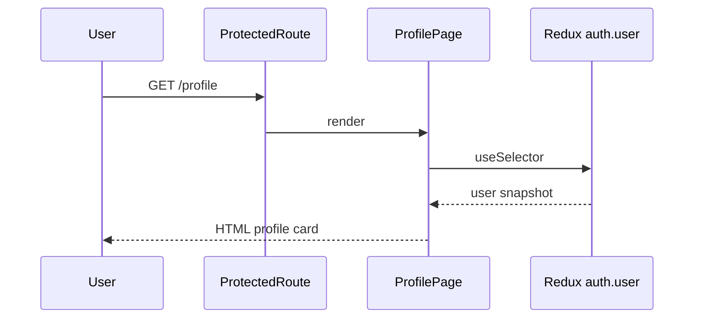

# Use Case — UC-AUTH-11: Xem hồ sơ user hiện tại (View Current User Profile)

| Thuộc tính | Giá trị |
|------------|---------|
| **ID** | UC-AUTH-11 |
| **Tên** | Xem thông tin tài khoản đang đăng nhập |
| **Mức độ ưu tiên** | Trung bình |
| **Phiên bản** | Bám code hiện tại |

---

## 1. Mô tả ngắn

User đã đăng nhập xem trang **`/profile`** — hiển thị họ tên, roles, email, phone, ngày tham gia từ **Redux `state.auth.user`** (dữ liệu lúc login/OAuth/restore), **không** gọi `GET /api/auth/me` khi vào trang.

API **`GET /api/auth/me`** vẫn là hợp đồng backend chính thức và được dùng ở `OAuthSuccess`, hooks `useMe` / `useCurrentUser` (khi được gọi).

---

## 2. Tác nhân

| Tác nhân | Vai trò |
|----------|---------|
| **Authenticated user** | Customer / admin / manager |
| **ProfilePage** | UI read-only |
| **getCurrentUser** | BE controller |

---

## 3. Preconditions

| # | Điều kiện |
|---|-----------|
| PRE-01 | Pass `ProtectedRoute` (`isAuthenticated` hoặc `localStorage.token`) |
| PRE-02 | Redux có `user` (từ login hoặc UC-AUTH-09) |

---

## 4. Postconditions

### Thành công (UI)

| # | Kết quả |
|---|---------|
| POST-01 | User thấy card profile với fields có trong Redux |
| POST-02 | Roles hiển thị tiếng Việt (admin, manager, …) |

### Khi gọi API `/me` (context khác)

| # | Kết quả |
|---|---------|
| POST-03 | JSON user đầy đủ hơn (có `address`, `avatar_url`) |

---

## 5. Trigger

- Navigate `/profile` (Header link “Profile” / tên user)
- Hoặc `GET /api/auth/me` từ code khác (OAuth, hooks)

---

## 6. Luồng chính — Trang Profile (FE only)

| Bước | Tác nhân | Hành động |
|------|----------|-----------|
| 1 | User | Click profile trên Header |
| 2 | FE | `ProtectedRoute` pass |
| 3 | FE | `ProfilePage` `useSelector(state => state.auth.user)` |
| 4 | FE | Render `full_name`, `rolesDisplay`, `email`, `phone_number` |
| 5 | FE | `created_at` → `toLocaleDateString("vi-VN")` hoặc "N/A" |

### Format role (`ProfilePage.jsx`)

```javascript
const formatRoleName = (roleName) => {
  if (roleName === "admin") return "Quản trị viên Hệ thống";
  if (roleName === "manager") return "Quản lý";
  return roleName.charAt(0).toUpperCase() + roleName.slice(1);
};
```

---

## 7. Luồng thay thế — `GET /api/auth/me`

| Bước | Mô tả |
|------|--------|
| 1 | Client `Authorization: Bearer <jwt>` |
| 2 | `authenticateToken` → `req.user` |
| 3 | `User.findByPk` + include `Role` |
| 4 | `200 { user: { user_id, username, email, full_name, phone_number, address, avatar_url, roles } }` |

**Response không có:** `created_at`, `username` trên Profile UI (username không hiển thị).

### Nơi gọi `/me` trong dự án

| Consumer | Mục đích |
|----------|----------|
| `OAuthSuccess.jsx` | Sau OAuth/verify → `setCredentials` |
| `useMe()` | Hook optional |
| `useCurrentUser()` | Refresh roles → LS; logout on 401 |
| `RegisterPage` legacy `?token` | Hiếm |

---

## 8. Luồng ngoại lệ

### EF-01: API `/me` — 401

```json
{ "message": "Invalid or expired token" }
```

### EF-02: API `/me` — 403 inactive

```json
{ "message": "User not found or inactive" }
```

### EF-03: Profile hiển thị `created_at` N/A

Login/OAuth response **không** gửi `created_at` → Redux thiếu field (GAP).

### EF-04: Stale data sau `PUT /profile`

Backend có update API nhưng FE không refetch — profile page không đổi (GAP).

---

## 9. API contract `GET /auth/me`

```http
GET /api/auth/me
Authorization: Bearer <token>
```

```json
{
  "user": {
    "user_id": 1,
    "username": "kiet_shop",
    "email": "user@example.com",
    "full_name": "Nguyen Van A",
    "phone_number": "0909123456",
    "address": null,
    "avatar_url": null,
    "roles": ["customer"]
  }
}
```

| Field | ProfilePage hiển thị? |
|-------|----------------------|
| full_name | ✓ |
| roles | ✓ |
| email | ✓ |
| phone_number | ✓ |
| address | ✗ |
| avatar_url | ✗ (placeholder icon) |
| username | ✗ |
| created_at | ✓ (thường N/A) |

---

## 10. Quy tắc nghiệp vụ

| ID | Quy tắc |
|----|---------|
| BR-01 | `/profile` protected — guest → `/login` |
| BR-02 | Không lộ `password_hash` |
| BR-03 | Mọi role JWT hợp lệ đều xem được profile mình |
| BR-04 | UI read-only — không form sửa |

---

## 11. Triển khai

| File | Vai trò |
|------|---------|
| `client/app/pages/ProfilePage.jsx` | UI |
| `client/app/App.jsx` | Route protected |
| `server/controllers/authController.js` | `getCurrentUser` L420–447 |
| `server/routes/authRoutes.js` | `GET /me` |
| `server/middleware/auth.js` | `authenticateToken` |
| `client/app/hooks/useAuth.js` | `useMe`, `useCurrentUser` |

---

## 12. Sơ đồ tuần tự (trang Profile)



---

## 13. Liên kết

| UC / FR |
|---------|
| UC-AUTH-09 Restore |
| UC-AUTH-10 Update profile (API) |
| UC-AUTH-07 OAuth success → `/me` |
| `FR_GetCurrentUser.md` |

---

## 14. GAP

| # | Mô tả |
|---|--------|
| GAP-01 | ProfilePage **không** gọi `/me` on mount |
| GAP-02 | `created_at` hiển thị nhưng thường thiếu trong Redux |
| GAP-03 | Không hiển thị address/avatar từ API |
| GAP-04 | Không nút “Chỉnh sửa” dù có PUT API |
