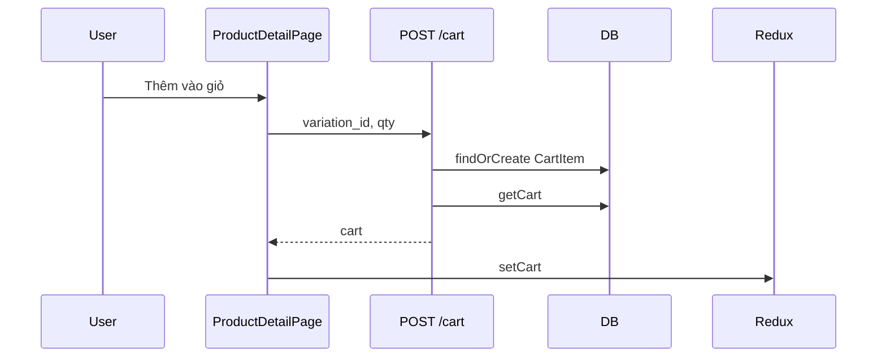

# Use Case — UC-CART-02: Thêm sản phẩm vào giỏ (Add Product To Cart)

| Thuộc tính | Giá trị |
|------------|---------|
| **ID** | UC-CART-02 |
| **Tên** | Thêm biến thể (variation) vào giỏ hàng |
| **Mức độ ưu tiên** | Cao |
| **Phiên bản** | Bám code hiện tại |

---

## 1. Mô tả ngắn

Khách **đã đăng nhập** chọn đủ cấu hình trên PDP và bấm **“Thêm vào giỏ”** → **`POST /api/cart`** body `{ variation_id, quantity }`. Backend kiểm tra tồn kho / `is_available`, **upsert** theo `(cart_id, variation_id)` (cộng dồn quantity nếu đã có), snapshot `price_at_add`, trả lại **toàn bộ giỏ** (`getCart`).

**Guest** bấm thêm giỏ trên PDP → **không** gọi API — lưu `pendingCheckout` + redirect login (giống buy now).

**Endpoint:** `POST /api/cart`  
**FE:** `useAddToCart`, `ProductDetailPage.handleAddToCart`  
**Ngoài luồng chính:** `ProductRecommendations` `dispatch(addItem)` — **chỉ Redux**, không POST cart.

---

## 2. Tác nhân

| Tác nhân | Vai trò |
|----------|---------|
| **Authenticated Customer** | Thêm từ PDP |
| **Guest** | Redirect login + `pendingCheckout` |
| **Backend** | `addToCart`, stock check, findOrCreate CartItem |
| **React Query** | Invalidate `['cart', user_id]` |

---

## 3. Preconditions

| # | Điều kiện |
|---|-----------|
| PRE-01 | User authenticated (PDP path) |
| PRE-02 | `variation_id` tồn tại |
| PRE-03 | `is_available === true` |
| PRE-04 | `stock_quantity >= quantity` (và tổng sau merge) |
| PRE-05 | PDP: `isReady && matched` variation |

---

## 4. Postconditions

### Thành công

| # | Kết quả |
|---|---------|
| POST-01 | Dòng mới hoặc `quantity` tăng trong `cart_items` |
| POST-02 | `price_at_add` = `variation.price` lúc tạo dòng (**không** update khi merge) |
| POST-03 | Redux + Header badge cập nhật qua `setCart` |
| POST-04 | Response `200` + full cart JSON |

### Thất bại

| # | Kết quả |
|---|---------|
| POST-F01 | 404 variation not found |
| POST-F02 | 400 insufficient stock / not available |
| POST-F03 | 401 → FE navigate login |

---

## 5. Trigger

- Click “Thêm vào giỏ” trên `ProductDetailPage`.
- `addToCart.mutate` từ `CartPage` khi **đổi cấu hình** (UC-CART-04).
- (Partial) RecoCard `addItem` Redux only.

---

## 6. Luồng chính — PDP (authenticated)

| Bước | Tác nhân | Hành động |
|------|----------|-----------|
| 1 | User | Chọn cấu hình, quantity |
| 2 | FE | Validate `isReady`, `matched`, stock local |
| 3 | FE | `addToCart.mutate({ variation_id, quantity: qty })` |
| 4 | FE | `POST /api/cart` `{ variation_id, quantity }` |
| 5 | BE | `ProductVariation.findByPk` + product |
| 6 | BE | Reject nếu `!is_available` hoặc stock < qty |
| 7 | BE | `CartItem.findOrCreate({ cart_id, variation_id }, defaults: { quantity, price_at_add })` |
| 8 | BE | Nếu existed: `newQty = old + qty`, check stock again |
| 9 | BE | `return exports.getCart(req, res, next)` |
| 10 | FE | `onSuccess` → `dispatch(setCart(data.cart))`, invalidate cache |

### Guest branch

| Bước | Mô tả |
|------|--------|
| G-1 | `localStorage.pendingCheckout` mode có thể `buy_now` khi nhấn thêm giỏ guest — **thực tế** code lưu `buy_now` trong block guest của handleAddToCart |
| G-2 | `navigate('/login?redirect=/checkout')` |
| G-3 | **Không** thêm vào DB cart |

---

## 7. Upsert logic (BE)

```javascript
const [ci, created] = await CartItem.findOrCreate({
  where: { cart_id: cart.cart_id, variation_id },
  defaults: { quantity, price_at_add: variation.price },
});

if (!created) {
  const newQty = Number(ci.quantity) + Number(quantity);
  if (newQty > stock) return 400;
  ci.quantity = newQty;
  await ci.save();
}
```

| Trường hợp | Kết quả |
|------------|---------|
| Variation mới trong giỏ | Insert + `price_at_add` |
| Đã có cùng variation | Cộng quantity |

---

## 8. Luồng thay thế

### AF-01: Đổi cấu hình từ CartPage

POST variation mới → DELETE dòng cũ (UC-CART-04).

### AF-02: RecoCard “Thêm vào giỏ”

| Bước | Mô tả |
|------|--------|
| AF-02.1 | `dispatch(addItem({ product_id, variation_id, ... }))` |
| AF-02.2 | Header badge tăng **local** |
| AF-02.3 | Refresh `/cart` khi login + `useGetCart` **ghi đè** từ server |

### AF-03: Cart tạo lúc đăng ký

`authController` / OAuth `Cart.create({ user_id })` — hoặc lazy `getOrCreateCart` lần đầu add.

---

## 9. Luồng ngoại lệ

### EF-01: Chưa chọn đủ cấu hình

Alert “Vui lòng chọn đầy đủ cấu hình…” — không gọi API.

### EF-02: Quantity > stock trên FE

Alert + `setQuantity(stock)` — không gọi API.

### EF-03: Merge vượt stock

BE `400 { message: "Insufficient stock" }`.

### EF-04: Comment code sai trong controller

Comment `POST /cart/items` — route thực tế **`POST /cart`**.

---

## 10. Quy tắc nghiệp vụ

| ID | Quy tắc |
|----|---------|
| BR-01 | Khóa upsert = **`variation_id`** trong cart |
| BR-02 | `price_at_add` cố định sau lần tạo — merge qty **không** refresh snapshot (comment OPTIONAL bị tắt) |
| BR-03 | Stock check tại thời điểm add và sau merge |
| BR-04 | Mọi mutation cart trả **full cart** — FE luôn `setCart` |
| BR-05 | PDP authenticated **không** `dispatch(addItem)` — chỉ API |

---

## 11. API

```http
POST /api/cart
Authorization: Bearer <token>
Content-Type: application/json

{
  "variation_id": 42,
  "quantity": 1
}
```

**404:**

```json
{ "message": "Product variation not found" }
```

**400:**

```json
{ "message": "Product not available or insufficient stock" }
```

---

## 12. Triển khai

| File | Vai trò |
|------|---------|
| `server/controllers/cartController.js` | `addToCart` |
| `server/routes/cartRoutes.js` | `POST /` |
| `client/app/hooks/useCart.js` | `useAddToCart` |
| `client/app/pages/ProductDetailPage.jsx` | `handleAddToCart` |
| `client/app/components/ProductRecommendations.jsx` | `addItem` local only |
| `client/app/services/api.js` | `cartAPI.addToCart` |

---

## 13. Sơ đồ tuần tự



---

## 14. Liên kết

| UC / FR |
|---------|
| UC-CAT-05 SelectProductConfiguration |
| UC-CART-01 ViewShoppingCart |
| UC-CART-04 ChangeCartItemVariation |
| `FR_AddToCart.md` |

---

## 15. Known gaps

| # | Mô tả |
|---|--------|
| GAP-01 | RecoCard `addItem` **không** sync server |
| GAP-02 | Guest “thêm giỏ” thực chất chuyển sang flow checkout/login |
| GAP-03 | Không toast success sau add trên PDP |
| GAP-04 | `price_at_add` lỗi thời khi admin đổi giá |
| GAP-05 | Không giới hạn số dòng khác variation trong cùng product |
