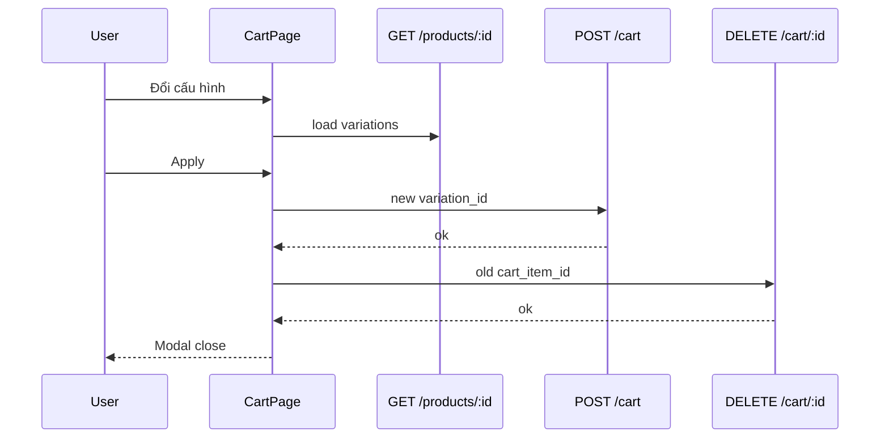

# Use Case — UC-CART-04: Đổi cấu hình dòng giỏ (Change Cart Item Variation)

| Thuộc tính | Giá trị |
|------------|---------|
| **ID** | UC-CART-04 |
| **Tên** | Đổi biến thể (RAM/SSD/màu…) của một dòng trong giỏ |
| **Mức độ ưu tiên** | Trung bình |
| **Phiên bản** | Bám code hiện tại |

---

## 1. Mô tả ngắn

Trên **`/cart`**, khách bấm **“Đổi cấu hình”** trên một dòng → modal tải **`GET /api/products/:product_id`**, chọn **RAM / SSD / Color** (subset ATTRS), khớp variation → **không có API đổi variation trực tiếp**.

Luồng thực tế:

1. **`POST /api/cart`** — add `chosen.variation_id` với `quantity` giữ nguyên.
2. **`DELETE /api/cart/:old_cart_item_id`** — xóa dòng cũ.

Nếu add thành công nhưng delete fail → có thể **trùng** hai dòng cùng product khác variation (GAP).

**FE:** `CartPage` variant modal  
**BE:** dùng lại `addToCart` + `removeCartItem` — **không** endpoint `PATCH variation`

---

## 2. Tác nhân

| Tác nhân | Vai trò |
|----------|---------|
| **Customer** | Mở modal, chọn cấu hình, xác nhận |
| **CartPage** | `openVariantModal`, `handleApplyVariation` |
| **Product API** | Load full variations list |
| **Cart API** | Add + remove compose |

---

## 3. Preconditions

| # | Điều kiện |
|---|-----------|
| PRE-01 | Item có `product.product_id` |
| PRE-02 | Product detail trả `variations[]` |
| PRE-03 | Cấu hình chọn khớp một variation |
| PRE-04 | Variation mới: `is_available` và `stock > 0` |
| PRE-05 | `chosen.variation_id !==` variation hiện tại |

---

## 4. Postconditions

### Thành công

| # | Kết quả |
|---|---------|
| POST-01 | Dòng cũ biến mất |
| POST-02 | Dòng mới (hoặc merged qty) với `variation_id` mới |
| POST-03 | Modal đóng; giỏ refresh qua `setCart` |
| POST-04 | `price_at_add` snapshot theo giá variation **mới** (nếu tạo dòng mới) |

### Thất bại

| # | Kết quả |
|---|---------|
| POST-F01 | Không load product → message lỗi modal |
| POST-F02 | Không match cấu hình → `variantError` |
| POST-F03 | Hết hàng → `variantError` |
| POST-F04 | Add fail → không xóa dòng cũ |

---

## 5. Trigger

- Click “Đổi cấu hình” cạnh dòng specs trên CartPage.

---

## 6. Luồng chính

| Bước | Tác nhân | Hành động |
|------|----------|-----------|
| 1 | User | Click “Đổi cấu hình” |
| 2 | FE | `openVariantModal(item)` |
| 3 | FE | `GET /products/${productId}` |
| 4 | FE | Pre-fill `variantSel` từ variation hiện tại (ram, storage, color) |
| 5 | User | Chọn RAM/SSD/Color trong modal |
| 6 | FE | `matchVariation(vars, variantSel)` — keys `ram`, `storage`, `color` |
| 7 | FE | Validate stock + available |
| 8 | FE | `addToCart.mutate({ variation_id: chosen, quantity: qty })` |
| 9 | FE | `onSuccess` → `removeItemSrv.mutate(oldItemId)` |
| 10 | FE | `onSuccess` remove → `closeVariantModal()` |

### Matching logic (CartPage)

```javascript
const matchVariation = (vars, sel) => {
  const keys = ["ram", "storage", "color"].filter((k) => sel[k]);
  if (!keys.length) return null;
  return (vars || []).find((v) =>
    keys.every((k) => String(v?.[k] || "") === String(sel[k] || ""))
  ) || null;
};
```

**Khác PDP:** không chọn `processor`, `graphics_card`, `screen_size` trong modal cart.

---

## 7. Luồng thay thế

### AF-01: Chọn lại đúng variation hiện tại

`String(oldVarId) === String(chosen.variation_id)` → đóng modal, không gọi API.

### AF-02: Variation mới đã có trong giỏ

`POST /cart` **merge quantity** vào dòng existing → sau đó xóa dòng cũ → qty có thể **cộng dồn** ngoài ý muốn (GAP).

### AF-03: Processor-only products

Nếu chỉ khác CPU mà không đổi ram/storage/color — modal **không** phân biệt được.

---

## 8. Luồng ngoại lệ

### EF-01: Add OK, delete fail

Giỏ có **cả** variation cũ và mới — user phải xóa tay.

### EF-02: Thiếu `product_id`

`throw new Error("Thiếu product_id")` → `variantError`.

### EF-03: BE `updateCartItem` body `variation_id`

Có fallback locate theo `variation_id` nhưng **không** đổi FK variation trên record — không dùng cho UC này.

---

## 9. Quy tắc nghiệp vụ

| ID | Quy tắc |
|----|---------|
| BR-01 | Đổi cấu hình = **add mới + delete cũ** (compensating transaction thủ công) |
| BR-02 | Giữ **quantity** dòng cũ khi add mới |
| BR-03 | Modal chỉ expose **3 thuộc tính** — không full ATTRS |
| BR-04 | Stock check trên variation **đích** trước khi add |
| BR-05 | Không atomic transaction cross add/delete |

---

## 10. API (chuỗi gọi)

```http
GET /api/products/1

POST /api/cart
{ "variation_id": 99, "quantity": 2 }

DELETE /api/cart/10
```

---

## 11. UI — Variant modal

| State | Mô tả |
|-------|--------|
| `variantModal.open` | boolean |
| `variantModal.item` | cart line |
| `variantProduct` | product + variations từ API |
| `variantSel` | `{ ram, storage, color }` |
| `variantLoading` | spinner khi fetch |
| `variantError` | inline error |

Nút Apply disabled khi `variantLoading || addToCart.isPending || removeItemSrv.isPending`.

---

## 12. Triển khai

| File | Vai trò |
|------|---------|
| `client/app/pages/CartPage.jsx` | Modal + compose add/remove |
| `client/app/hooks/useCart.js` | `useAddToCart`, `useRemoveFromCart` |
| `server/controllers/cartController.js` | add + remove (no change-variation) |
| `docs/feature_requirements/cart/FR_ChangeCartItemVariation.md` | FR |

---

## 13. Sơ đồ tuần tự



---

## 14. Liên kết

| UC / FR |
|---------|
| UC-CART-02 AddProductToCart |
| UC-CART-05 RemoveOrClearCartItems |
| UC-CAT-05 SelectProductConfiguration |
| `FR_ChangeCartItemVariation.md` |

---

## 15. Known gaps

| # | Mô tả |
|---|--------|
| GAP-01 | Không transaction — add/delete không atomic |
| GAP-02 | Modal thiếu CPU/GPU/screen — không đổi được mọi loại variation |
| GAP-03 | Merge nếu variation đích đã trong giỏ |
| GAP-04 | Nên có `PUT` đổi `variation_id` một bước |
| GAP-05 | `getUnique` / UI modal có thể không list processor |
