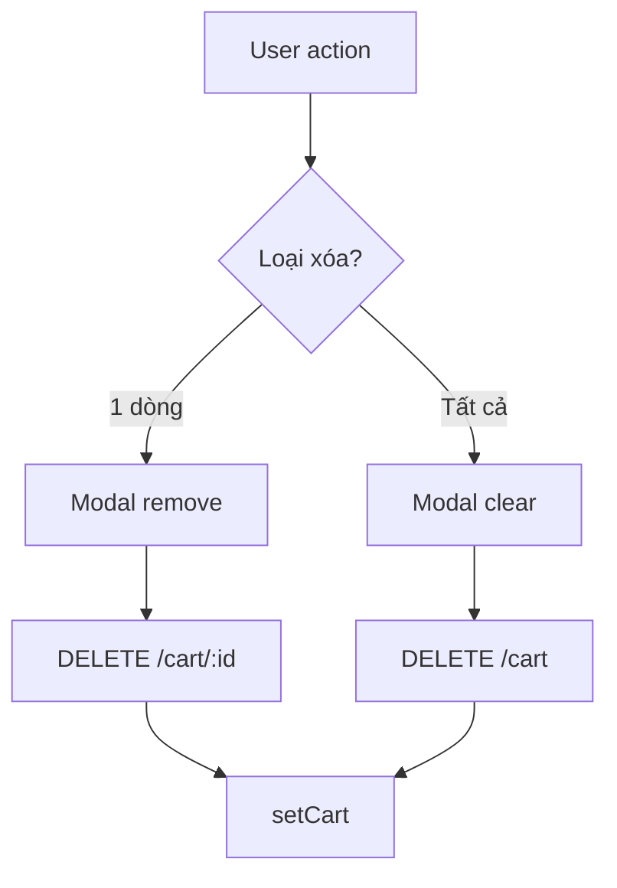

# Use Case — UC-CART-05: Xóa dòng hoặc xóa toàn bộ giỏ (Remove Or Clear Cart Items)

| Thuộc tính | Giá trị |
|------------|---------|
| **ID** | UC-CART-05 |
| **Tên** | Xóa một dòng hàng hoặc làm trống giỏ |
| **Mức độ ưu tiên** | Cao |
| **Phiên bản** | Bám code hiện tại |

---

## 1. Mô tả ngắn

Khách trên **`/cart`** có thể:

1. **Xóa một dòng** — icon thùng rác hoặc xác nhận khi giảm số lượng về 0 → **`DELETE /api/cart/:cart_item_id`**
2. **Xóa tất cả** — link “Xóa tất cả” → modal confirm → **`DELETE /api/cart`**

Mọi thao tác trả **full cart** (thường rỗng items). FE cập nhật Redux `setCart` và đồng bộ `selectedIds` (bỏ id đã xóa / clear Set).

**Ngoài CartPage:** `CheckoutPage` sau COD có thể `removeMany` Redux theo `cart_id` — không gọi DELETE từng dòng (GAP sync).

**Endpoints:**

- `DELETE /api/cart/:cart_item_id`
- `DELETE /api/cart`

---

## 2. Tác nhân

| Tác nhân | Vai trò |
|----------|---------|
| **Authenticated Customer** | Xóa dòng / clear |
| **CartPage** | Modal confirm, `doRemoveItem`, `doClearCart` |
| **Backend** | `removeCartItem`, `clearCart` |
| **useRemoveFromCart** | Mutation wrapper |

---

## 3. Preconditions

| # | Điều kiện |
|---|-----------|
| PRE-01 | JWT hợp lệ |
| PRE-02 | `cart_item_id` thuộc cart của user (delete one) |
| PRE-03 | Cart tồn tại (clear all) |

---

## 4. Postconditions

### Xóa một dòng

| # | Kết quả |
|---|---------|
| POST-01 | Row `cart_items` destroyed |
| POST-02 | `selectedIds` không còn id đó |
| POST-03 | Header badge giảm |

### Clear all

| # | Kết quả |
|---|---------|
| POST-C01 | Mọi `cart_items` của cart destroyed |
| POST-C02 | `selectedIds` = empty Set |
| POST-C03 | UI empty state nếu `items.length === 0` |

---

## 5. Trigger

- Click `Trash2` → modal confirm remove.
- `Minus` khi qty sẽ ≤ 0 → modal remove.
- Click “Xóa tất cả” → modal clear.
- CartPage đổi cấu hình: delete sau add (UC-CART-04).

---

## 6. Luồng chính — Xóa một dòng

| Bước | Tác nhân | Hành động |
|------|----------|-----------|
| 1 | User | Click thùng rác |
| 2 | FE | `setConfirmState({ kind: 'remove', targetId })` |
| 3 | User | Xác nhận modal |
| 4 | FE | `doRemoveItem(id)` |
| 5 | FE | `selectedIds.delete(id)` |
| 6 | FE | `removeItemSrv.mutate(id)` → `DELETE /cart/${id}` |
| 7 | BE | `CartItem.destroy({ cart_id, cart_item_id })` |
| 8 | BE | `getCart` response |
| 9 | FE | `setCart` via mutation onSuccess |

### Modal confirm (thay `window.confirm`)

| kind | Hành động Yes |
|------|----------------|
| `remove` | `doRemoveItem(targetId)` |
| `clear` | `doClearCart()` |

---

## 7. Luồng chính — Xóa toàn bộ

| Bước | Tác nhân | Hành động |
|------|----------|-----------|
| 1 | User | “Xóa tất cả” |
| 2 | FE | Modal `kind: 'clear'` |
| 3 | FE | `api.delete('/cart')` trực tiếp (không qua `useRemoveFromCart` hook) |
| 4 | BE | `CartItem.destroy({ where: { cart_id } })` |
| 5 | FE | `dispatch(setCart(data.cart))` |
| 6 | FE | `setSelectedIds(new Set())` |

---

## 8. Backend — Remove variants

```javascript
// DELETE /cart/:cart_item_id
if (cart_item_id) {
  await CartItem.destroy({ where: { cart_id, cart_item_id } });
} else if (variation_id) {
  await CartItem.destroy({ where: { cart_id, variation_id } });
}
```

Route param luôn có `cart_item_id` từ Express — nhánh `variation_id` params **hiếm** dùng.

### Update quantity ≤ 0

`updateCartItem` cũng `destroy` — overlap với UC-CART-03/05.

---

## 9. Luồng thay thế

### AF-01: Sau đặt hàng thành công (cart mode)

| Bước | Mô tả |
|------|--------|
| AF-01.1 | `createOrder` body có `items: [{variation_id, quantity}]` |
| AF-01.2 | BE `CartItem.destroy` where `variation_id IN (...)` |
| AF-01.3 | Checkout COD: `removeMany` Redux ids — **server đã xóa** |

### AF-02: VNPAY redirect

Không `removeMany` FE ngay — cart xóa khi order create trên server (items trong body).

### AF-03: Logout

`useLogout` → `clearCart()` Redux + invalidate queries — **không** DELETE server cart (items DB còn).

---

## 10. Luồng ngoại lệ

### EF-01: DELETE fail khi clear

Alert “Không xoá được giỏ hàng…” — Redux có thể lệch DB.

### EF-02: Xóa item không tồn tại

Destroy 0 rows — vẫn `getCart` OK.

### EF-03: `cartSlice.removeItem` / `clearCart`

Reducers tồn tại — CartPage **không** gọi trực tiếp cho remove one (chỉ server path).

---

## 11. Quy tắc nghiệp vụ

| ID | Quy tắc |
|----|---------|
| BR-01 | Chỉ xóa item **thuộc cart** `user_id` hiện tại |
| BR-02 | Clear cart **không** xóa bản ghi `carts` — chỉ `cart_items` |
| BR-03 | Mọi DELETE trả full cart để FE sync |
| BR-04 | Confirm modal bắt buộc cho clear và remove (UX) |

---

## 12. API

```http
DELETE /api/cart/10
Authorization: Bearer <token>
```

```http
DELETE /api/cart
```

Response: `{ cart: { items: [], item_count: 0, ... } }`

---

## 13. Triển khai

| File | Vai trò |
|------|---------|
| `server/controllers/cartController.js` | `removeCartItem`, `clearCart` |
| `server/controllers/orderController.js` | Clear subset sau order |
| `client/app/hooks/useCart.js` | `useRemoveFromCart` |
| `client/app/pages/CartPage.jsx` | UI + confirm + clear |
| `client/app/store/slices/cartSlice.js` | `removeItem`, `removeMany`, `clearCart` |
| `client/app/pages/CheckoutPage.jsx` | `removeMany` COD |

---

## 14. Sơ đồ hoạt động



---

## 15. Liên kết

| UC / FR |
|---------|
| UC-CART-03 UpdateCartItemQuantity |
| UC-CART-04 ChangeCartItemVariation |
| UC-CART-06 SelectItemsForCheckout |
| `FR_RemoveCartItem.md`, `FR_ClearCart.md` |

---

## 16. Known gaps

| # | Mô tả |
|---|--------|
| GAP-01 | Logout không xóa cart DB |
| GAP-02 | `removeMany` checkout chỉ Redux — rely on server order |
| GAP-03 | Clear dùng `api.delete` trực tiếp thay vì hook thống nhất |
| GAP-04 | Không undo sau xóa |
