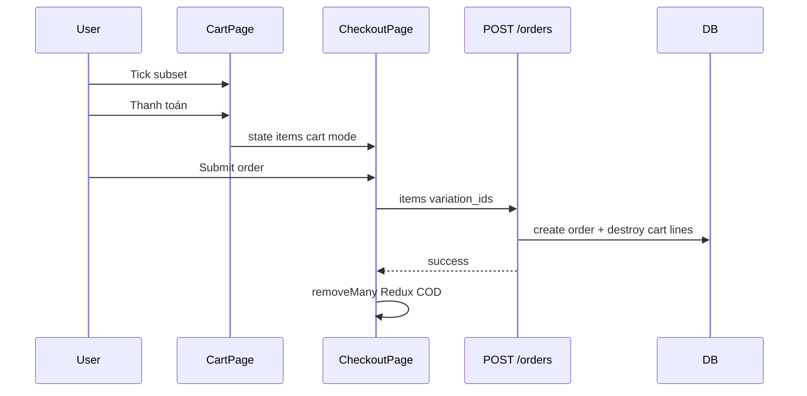

# Use Case — UC-CART-06: Chọn sản phẩm để thanh toán (Select Items For Checkout)

| Thuộc tính | Giá trị |
|------------|---------|
| **ID** | UC-CART-06 |
| **Tên** | Tick chọn subset giỏ hàng và chuyển sang checkout |
| **Mức độ ưu tiên** | Cao |
| **Phiên bản** | Bám code hiện tại |

---

## 1. Mô tả ngắn

Trên **`/cart`**, khách **tick checkbox** từng dòng hoặc **“Chọn tất cả”** → sidebar tính tổng **chỉ món đã chọn** → **“Thanh toán”** điều hướng **`/checkout`** với:

```javascript
navigate("/checkout", {
  state: {
    mode: "cart",
    items: [{ variation_id, quantity }, ...],
  },
});
```

`CheckoutPage` **chỉ** submit các `items` trong state — **không** tự lấy toàn bộ giỏ. `createOrder` nhận `body.items` và sau đó **xóa** đúng các `variation_id` đã đặt khỏi DB cart.

**State chọn:** `CartPage` dùng **`selectedIds: Set<cart_item_id>`** (local React) — **không** dùng `cartSlice.setItemSelected` (dead cho flow này).

**FE:** `CartPage`, `CheckoutPage`  
**BE:** `orderController.createOrder` items branch + partial cart clear

---

## 2. Tác nhân

| Tác nhân | Vai trò |
|----------|---------|
| **Customer** | Tick / untick, checkout |
| **CartPage** | Validation stock trên subset |
| **CheckoutPage** | `intentItems`, `viewItems`, POST order |
| **Backend** | Validate stock, pricing, destroy cart lines |

---

## 3. Preconditions

| # | Điều kiện |
|---|-----------|
| PRE-01 | Giỏ có ≥ 1 dòng (view cart) |
| PRE-02 | ≥ 1 dòng được tick (`selectedIds`) |
| PRE-03 | Mọi dòng tick: available + `quantity <= stock` |
| PRE-04 | Checkout cart mode: user authenticated (hoặc redirect login) |

---

## 4. Postconditions

### Thành công (navigate)

| # | Kết quả |
|---|---------|
| POST-01 | `location.state.mode === "cart"` |
| POST-02 | `state.items` = variation_id + quantity only |
| POST-03 | Checkout hiển thị subset (enrich từ Redux cart nếu có) |

### Sau đặt hàng thành công

| # | Kết quả |
|---|---------|
| POST-O01 | BE xóa `cart_items` matching `variation_id IN (...)` |
| POST-O02 | COD: FE `removeMany` Redux ids đã mua |
| POST-O03 | Dòng **không** tick vẫn còn trong giỏ DB |

### Không checkout được

| # | Kết quả |
|---|---------|
| POST-F01 | `hasInvalidSelected` → nút disabled + banner đỏ |
| POST-F02 | `selectedItems.length === 0` → không navigate |

---

## 5. Trigger

- Toggle checkbox dòng / “Chọn tất cả”.
- Click “Thanh toán” / “Tiến hành thanh toán”.
- Auto-select: `useEffect` khi `items` đổi → **tick tất cả** mặc định.

---

## 6. Luồng chính — Chọn và tính tổng

| Bước | Tác nhân | Hành động |
|------|----------|-----------|
| 1 | FE | `items` load từ Redux (sau `useGetCart`) |
| 2 | FE | `useEffect`: `setSelectedIds(new Set(items.map(i => i.cart_item_id)))` |
| 3 | User | Untick / tick từng dòng — `handleToggleItem` |
| 4 | User | “Chọn tất cả” — `handleToggleAll` |
| 5 | FE | `selectedItems = items.filter(id in selectedIds)` |
| 6 | FE | `subtotal = sum(selectedItems.price * quantity)` |
| 7 | FE | `selectedChecks` — stock, available, enoughStock |

### Validation checkout

```javascript
const hasInvalidSelected = selectedChecks.some(
  (c) => !c.isAvailable || !c.enoughStock
);
```

Nút checkout `disabled` khi `!canCheckout || hasInvalidSelected`.

---

## 7. Luồng chính — Navigate checkout

| Bước | Tác nhân | Hành động |
|------|----------|-----------|
| 1 | User | Click thanh toán |
| 2 | FE | Build `itemsPayload` chỉ variation_id + quantity |
| 3 | FE | Guest → `navigate('/login?redirect=/checkout')` |
| 4 | FE | Auth → `navigate('/checkout', { state: { mode: 'cart', items }})` |
| 5 | Checkout | `intentItems` từ `location.state.items` |
| 6 | Checkout | `viewItems` = merge `cartItems` Map by variation_id |
| 7 | Checkout | Submit `POST /orders` với `items: viewItems.map(...)` |
| 8 | BE | Load variations, check stock, tính tiền |
| 9 | BE | Destroy cart items selected variation_ids |
| 10 | COD FE | `removeMany(ids)` Redux |

---

## 8. CheckoutPage contract

```javascript
// location.state
{
  mode: "cart",  // hoặc "buy_now"
  items: [{ variation_id: 42, quantity: 2 }]
}
```

| mode | Nguồn items | Xóa cart Redux |
|------|-------------|----------------|
| `cart` | Cart tick | `removeMany` sau COD |
| `buy_now` | PDP, không qua giỏ | Không |

Nếu không có `intentItems` → redirect `/cart`.

---

## 9. Backend — Partial cart clear

```javascript
if (Array.isArray(items) && items.length > 0) {
  const selectedVariationIds = items.map((it) => Number(it.variation_id));
  await CartItem.destroy({
    where: { cart_id: cart.cart_id, variation_id: selectedVariationIds },
  });
} else {
  // Không truyền items → xóa TOÀN BỘ giỏ
  await CartItem.destroy({ where: { cart_id } });
}
```

| Hành vi | Mô tả |
|---------|--------|
| Có `body.items` | Chỉ xóa variation đã order |
| Không `items` | Clear all cart items (legacy full-cart checkout) |

---

## 10. Luồng thay thế

### AF-01: Mặc định chọn tất cả

Mỗi lần `items` thay đổi → auto tick **100%** — user phải untick nếu muốn mua subset (UX có thể ngạc nhiên).

### AF-02: Chỉ mua một phần

Untick các dòng không mua → checkout → dòng còn lại vẫn trong `GET /cart`.

### AF-03: Login redirect

`?redirect=/checkout` — sau login cần **state** cart items (không persist trong URL) — user có thể **mất** selection nếu refresh (GAP).

### AF-04: Buy now (ngoài UC)

PDP `mode: "buy_now"` — không qua tick cart — documented for contrast.

---

## 11. Luồng ngoại lệ

### EF-01: Giá trên cart vs order

Checkout tính giá **từ DB** lúc create order — có thể khác snapshot `price_at_add` hiển thị.

### EF-02: Item tick hết hàng giữa chừng

`hasInvalidSelected` block — user phải untick hoặc xóa dòng.

### EF-03: `cartSlice.selected` không dùng

Code có `setItemSelected` / `setAllSelected` — **CartPage không dispatch**.

### EF-04: VNPAY success

Redirect URL — cart đã xóa phía server khi tạo order; Redux có thể stale đến `useGetCart`.

---

## 12. Quy tắc nghiệp vụ

| ID | Quy tắc |
|----|---------|
| BR-01 | Checkout cart mode **bắt buộc** truyền `items[]` explicit |
| BR-02 | Không tick → không được checkout (empty selected) |
| BR-03 | Stock validate **trước** navigate (FE) và **lúc** create order (BE) |
| BR-04 | Untick items **remain** in cart DB |
| BR-05 | Order chỉ chứa variation/qty đã chọn — không gửi `cart_item_id` |

---

## 13. UI elements

| Element | Hành vi |
|---------|---------|
| Checkbox từng dòng | `handleToggleItem(cart_item_id)` |
| Chọn tất cả | `isAllSelected`, toggle all ids |
| Sidebar list | Chỉ `selectedItems` + warnings |
| Nút thanh toán | `handleCheckout`, disabled rules |

---

## 14. Triển khai

| File | Vai trò |
|------|---------|
| `client/app/pages/CartPage.jsx` | selectedIds, validation, navigate |
| `client/app/pages/CheckoutPage.jsx` | intentItems, submit, removeMany |
| `server/controllers/orderController.js` | items branch, partial destroy |
| `client/app/store/slices/cartSlice.js` | `removeMany` (unused select reducers) |
| `docs/feature_requirements/cart/FR_SelectCartItemsForCheckout.md` | FR |

---

## 15. Sơ đồ tuần tự



---

## 16. Liên kết

| UC / FR |
|---------|
| UC-CART-01 ViewShoppingCart |
| UC-CART-05 RemoveOrClearCartItems |
| Payment / Order UCs (checkout, VNPay) |
| `FR_SelectCartItemsForCheckout.md` |

---

## 17. Known gaps

| # | Mô tả |
|---|--------|
| GAP-01 | `selectedIds` không persist — refresh mất tick |
| GAP-02 | Auto-select all on every `items` change — khó giữ subset khi refetch |
| GAP-03 | Login redirect mất `location.state` |
| GAP-04 | `cartSlice` select reducers không wired |
| GAP-05 | Payload order không có `cart_item_id` — chỉ variation_id |
| GAP-06 | FE subtotal có thể lệch BE final amount |
