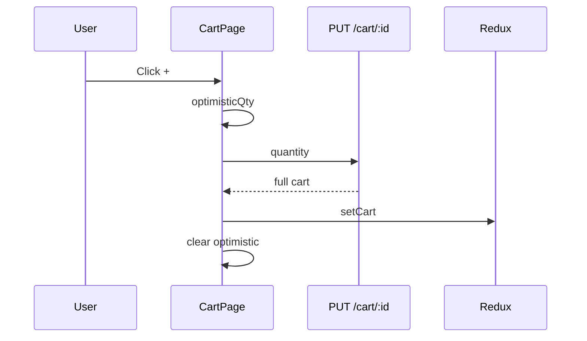

# Use Case — UC-CART-03: Cập nhật số lượng dòng giỏ (Update Cart Item Quantity)

| Thuộc tính | Giá trị |
|------------|---------|
| **ID** | UC-CART-03 |
| **Tên** | Tăng/giảm số lượng sản phẩm trong giỏ |
| **Mức độ ưu tiên** | Cao |
| **Phiên bản** | Bám code hiện tại |

---

## 1. Mô tả ngắn

Trên **`/cart`**, khách dùng nút **+ / −** để đổi `quantity` của một dòng. FE gọi **`PUT /api/cart/:cart_item_id`** body `{ quantity }` với **optimistic UI** (`optimisticQty`) trong lúc chờ API.

- `quantity <= 0` trên BE → **xóa** dòng (destroy) rồi trả giỏ.
- Trên FE, giảm về 0 → mở **modal xác nhận xóa** (không PUT 0 trực tiếp).

**Endpoint:** `PUT /api/cart/:cart_item_id`  
**FE:** `CartPage.handleUpdateQuantity`, `useUpdateCartItem`

---

## 2. Tác nhân

| Tác nhân | Vai trò |
|----------|---------|
| **Authenticated Customer** | Đổi số lượng |
| **CartPage** | Optimistic qty, max = stock |
| **Backend** | `updateCartItem` — validate stock |

---

## 3. Preconditions

| # | Điều kiện |
|---|-----------|
| PRE-01 | Dòng thuộc cart của `req.user` |
| PRE-02 | `cart_item_id` hợp lệ |
| PRE-03 | Body có `quantity` (required) |

---

## 4. Postconditions

### Thành công

| # | Kết quả |
|---|---------|
| POST-01 | `cart_items.quantity` cập nhật |
| POST-02 | Full cart JSON trả về |
| POST-03 | Redux đồng bộ; optimistic state cleared |

### quantity ≤ 0 (BE)

| # | Kết quả |
|---|---------|
| POST-D01 | Dòng bị xóa — tương đương remove |

### Thất bại

| # | Kết quả |
|---|---------|
| POST-F01 | 404 cart item not found |
| POST-F02 | 400 insufficient stock |
| POST-F03 | 400 quantity required |

---

## 5. Trigger

- Click `Minus` / `Plus` trên `CartPage`.
- Confirm remove khi user cố giảm ≤ 0.

---

## 6. Luồng chính — Tăng số lượng

| Bước | Tác nhân | Hành động |
|------|----------|-----------|
| 1 | User | Click `+` |
| 2 | FE | `shownQty = optimisticQty[id] ?? item.quantity` |
| 3 | FE | Disable `+` nếu `shownQty >= stockQuantity` |
| 4 | FE | `setOptimisticQty({ [id]: newQuantity })` |
| 5 | FE | `updateItem.mutate({ itemId: cart_item_id, quantity: newQuantity })` |
| 6 | FE | `PUT /cart/${itemId}` `{ quantity }` |
| 7 | BE | Find item thuộc cart user |
| 8 | BE | `quantity > variation.stock_quantity` → 400 |
| 9 | BE | Save + `getCart` |
| 10 | FE | `onSettled` → xóa optimistic override |

---

## 7. Luồng chính — Giảm số lượng

| Bước | Mô tả |
|------|--------|
| 1 | User click `−` |
| 2 | Nếu `newQuantity <= 0` → `setConfirmState({ kind: 'remove', targetId })` — **dừng** |
| 3 | Nếu `newQuantity >= 1` → optimistic + PUT như trên |

---

## 8. Backend — Tìm dòng & cập nhật

```javascript
const where = cart_item_id_param
  ? { cart_item_id: cart_item_id_param, cart_id: cart.cart_id }
  : cart_item_id_body
  ? { cart_item_id: cart_item_id_body, cart_id: cart.cart_id }
  : { cart_id: cart.cart_id, variation_id }; // fallback body variation_id
```

| Điều kiện | Hành động |
|-----------|-----------|
| `quantity <= 0` | `destroy()` |
| `quantity > stock` | 400 |
| else | `save()` |

**Lưu ý:** Body có thể gửi `variation_id` nhưng **không** dùng để đổi variation — chỉ locate fallback.

---

## 9. Luồng thay thế

### AF-01: Xác nhận xóa khi giảm về 0

| Bước | Mô tả |
|------|--------|
| AF-01.1 | Modal confirm |
| AF-01.2 | `doRemoveItem` → `DELETE /cart/:id` (UC-CART-05) |

### AF-02: Lỗi API — revert optimistic

`onError` → restore `optimisticQty[id]` = `prevQty`.

### AF-03: FE cap tại stock

Nút `+` disabled `isMaxQuantity` — không gọi API vượt stock.

---

## 10. Luồng ngoại lệ

### EF-01: Race hai tab

Hai PUT — last write wins; không version lock.

### EF-02: Stock giảm sau khi mở cart

PUT fail 400 — user thấy revert qty + message BE.

### EF-03: `updateQuantity` Redux slice

Reducer `updateQuantity` trong `cartSlice` **không** được CartPage gọi — chỉ API path.

---

## 11. Quy tắc nghiệp vụ

| ID | Quy tắc |
|----|---------|
| BR-01 | `quantity` tối thiểu 1 khi còn dòng (FE); BE xóa nếu ≤ 0 |
| BR-02 | Không vượt `variation.stock_quantity` |
| BR-03 | `price_at_add` **không** đổi khi chỉ update quantity |
| BR-04 | Line total UI = `unit_price_after_discount × quantity` (từ getCart) |

---

## 12. API

```http
PUT /api/cart/10
{ "quantity": 3 }
```

**400:**

```json
{ "message": "Insufficient stock" }
```

```json
{ "message": "quantity is required" }
```

---

## 13. Triển khai

| File | Vai trò |
|------|---------|
| `server/controllers/cartController.js` | `updateCartItem` |
| `client/app/hooks/useCart.js` | `useUpdateCartItem` |
| `client/app/pages/CartPage.jsx` | +/- UI, optimistic, confirm |

---

## 14. Sơ đồ tuần tự



---

## 15. Liên kết

| UC / FR |
|---------|
| UC-CART-01 ViewShoppingCart |
| UC-CART-05 RemoveOrClearCartItems |
| `FR_UpdateCartItemQuantity.md` |

---

## 16. Known gaps

| # | Mô tả |
|---|--------|
| GAP-01 | Không PUT `quantity: 0` từ FE — luôn qua modal DELETE |
| GAP-02 | `cartSlice.updateQuantity` dead code cho CartPage |
| GAP-03 | Không debounce spam click + |
| GAP-04 | BE không hỗ trợ đổi `variation_id` qua PUT |
