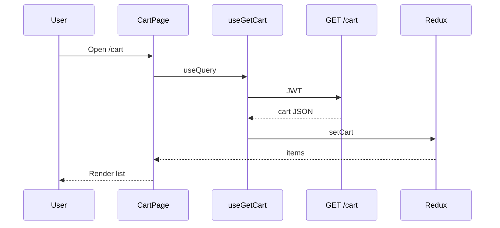

# Use Case — UC-CART-01: Xem giỏ hàng (View Shopping Cart)

| Thuộc tính | Giá trị |
|------------|---------|
| **ID** | UC-CART-01 |
| **Tên** | Xem danh sách sản phẩm trong giỏ hàng |
| **Mức độ ưu tiên** | Cao |
| **Phiên bản** | Bám code hiện tại |

---

## 1. Mô tả ngắn

Khách **đã đăng nhập** mở **`/cart`** để xem toàn bộ dòng hàng: ảnh, tên, cấu hình SKU, giá sau giảm, tồn kho, số lượng, và khối **“Tổng đơn hàng”** (theo món đã tick — UC-CART-06). Dữ liệu nguồn **`GET /api/cart`**; FE đồng bộ Redux qua `setCart` trong `useGetCart`.

**Badge Header** đếm `sum(quantity)` từ `state.cart.items` sau khi `Header` gọi `useGetCart()` trên mọi trang Layout.

**Endpoint:** `GET /api/cart` (JWT bắt buộc)  
**FE:** `CartPage.jsx`, `useGetCart`, `cartSlice.setCart`, `cartController.normalizeItem`

---

## 2. Tác nhân

| Tác nhân | Vai trò |
|----------|---------|
| **Authenticated Customer** | Xem `/cart`, thao tác tiếp |
| **Guest** | Vào `/cart` — `useGetCart` disabled → Redux thường rỗng (trừ `addItem` local từ RecoCard) |
| **Backend** | `getCart` + `getOrCreateCart` |
| **Header** | `cartItemsCount` từ Redux |

---

## 3. Preconditions

| # | Điều kiện |
|---|-----------|
| PRE-01 | JWT hợp lệ trong `Authorization` (API cart) |
| PRE-02 | `req.user.user_id` từ `authenticateToken` |
| PRE-03 | User `is_active` (middleware) |
| PRE-04 | Cart tồn tại hoặc được tạo lazy (`getOrCreateCart`) |

---

## 4. Postconditions

### Thành công

| # | Kết quả |
|---|---------|
| POST-01 | Redux `items` đồng bộ với DB |
| POST-02 | UI danh sách + sidebar tổng kết |
| POST-03 | `item_count`, `subtotal_snapshot`, `subtotal_after_discount` có trong payload |

### Giỏ trống

| # | Kết quả |
|---|---------|
| POST-E01 | Empty state “Giỏ hàng trống” + link về `/` |

### Lỗi auth

| # | Kết quả |
|---|---------|
| POST-F01 | 401/403 → `useGetCart` `clearCart()` Redux |

---

## 5. Trigger

- Navigate `/cart`.
- Sau mutation add/update/remove (BE trả lại full cart qua `getCart`).
- Login → `invalidateQueries(['cart'])` + `useGetCart` refetch.
- Mở bất kỳ trang Layout → Header `useGetCart`.

---

## 6. Luồng chính

| Bước | Tác nhân | Hành động |
|------|----------|-----------|
| 1 | User | Mở `/cart` |
| 2 | FE | `CartPage` mount → `useGetCart()` |
| 3 | FE | `enabled` khi `isAuthenticated && token && user_id` |
| 4 | FE | `GET /api/cart` |
| 5 | BE | `getOrCreateCart(user_id)` |
| 6 | BE | `CartItem.findAll` + include variation → product → primary image |
| 7 | BE | `order: added_at DESC` |
| 8 | BE | `normalizeItem` từng dòng |
| 9 | BE | Tính `subtotal_snapshot` (price_at_add × qty), `subtotal_after_discount` |
| 10 | FE | `dispatch(setCart(data.cart))` |
| 11 | FE | Render grid 2 cột (list + sticky summary) |

### Response shape (rút gọn)

```json
{
  "cart": {
    "cart_id": 1,
    "item_count": 3,
    "items": [
      {
        "cart_item_id": 10,
        "variation_id": 42,
        "quantity": 2,
        "price_at_add": 25000000,
        "variation": {
          "stock_quantity": 5,
          "is_available": true,
          "processor": "i7",
          "ram": "16GB",
          "storage": "512GB"
        },
        "product": {
          "product_id": 1,
          "product_name": "...",
          "thumbnail_url": "...",
          "discount_percentage": 10,
          "variation": { "price": 25000000 }
        },
        "unit_price_before_discount": 25000000,
        "unit_price_after_discount": 22500000,
        "line_total_after_discount": 45000000
      }
    ],
    "subtotal_snapshot": 50000000,
    "subtotal_after_discount": 45000000
  }
}
```

---

## 7. Mapping Redux (`setCart`)

| BE field | Redux item |
|----------|------------|
| `cart_item_id` | `id`, `cart_item_id` |
| `unit_price_after_discount` | `price` (ưu tiên) |
| `variation` (item level) | `variation` root + merge vào `product.variation` |
| — | `selected: false` (slice; **CartPage dùng `selectedIds` local**) |

`state.totalPrice` = `subtotal_after_discount` nếu BE gửi.

---

## 8. Luồng thay thế

### AF-01: Giỏ trống trên server

| Bước | Mô tả |
|------|--------|
| AF-01.1 | `items: []`, `item_count: 0` |
| AF-01.2 | CartPage `items.length === 0` → empty UI |

### AF-02: Guest vào `/cart`

| Bước | Mô tả |
|------|--------|
| AF-02.1 | Route **không** bọc `ProtectedRoute` |
| AF-02.2 | `useGetCart` disabled → không gọi API |
| AF-02.3 | Có thể thấy items từ `addItem` optimistic (RecoCard) nhưng **không đồng bộ DB** |

### AF-03: Ảnh sản phẩm

`resolveItemImage`: ưu tiên `product.thumbnail_url` → `images[0]` → placeholder.

---

## 9. Luồng ngoại lệ

### EF-01: Token hết hạn

`onError` → `dispatch(clearCart())` nếu 401 hoặc 403 legacy message.

### EF-02: Variation/product bị xóa

Include có thể null — UI hiển thị thiếu tên/ảnh.

### EF-03: `normalizeItem` thiếu field hiển thị

BE variation snapshot **không** gửi `color`, `graphics_card` — UI cart vẫn cố hiển thị `color` (có thể trống).

---

## 10. Quy tắc nghiệp vụ

| ID | Quy tắc |
|----|---------|
| BR-01 | Một user ↔ một cart (`User.hasOne(Cart)`) |
| BR-02 | Mỗi dòng = một `variation_id` duy nhất trong cart |
| BR-03 | `price_at_add` snapshot lúc add — **không** cập nhật khi merge quantity |
| BR-04 | Giá hiển thị UI ưu tiên **giá hiện tại + discount** (`unit_price_after_discount`) |
| BR-05 | `subtotal_snapshot` vs `subtotal_after_discount` — UI tổng tick dùng Redux `price` local |

---

## 11. UI — CartPage layout

| Vùng | Nội dung |
|------|----------|
| Header trang | Tiêu đề + “Xóa tất cả” |
| Cột trái | Checkbox, ảnh, tên, cấu hình, +/- qty, xóa dòng |
| Cột phải | Tổng đơn hàng, cảnh báo tồn kho, nút thanh toán |
| Empty | Icon + “Tiếp tục mua sắm” |

---

## 12. Triển khai

| File | Vai trò |
|------|---------|
| `server/routes/cartRoutes.js` | `router.use(authenticateToken)` |
| `server/controllers/cartController.js` | `getCart`, `normalizeItem` |
| `client/app/hooks/useCart.js` | `useGetCart` |
| `client/app/store/slices/cartSlice.js` | `setCart` |
| `client/app/pages/CartPage.jsx` | UI |
| `client/app/components/Header.jsx` | Badge + prefetch cart |
| `client/app/App.jsx` | Route `cart` |

---

## 13. Sơ đồ tuần tự



---

## 14. Liên kết

| UC / FR |
|---------|
| UC-CART-02 AddProductToCart |
| UC-CART-06 SelectItemsForCheckout |
| `FR_ViewCart.md`, `FR_AutoCreateCartOnRegistration.md` |

---

## 15. Known gaps

| # | Mô tả |
|---|--------|
| GAP-01 | `/cart` **không** bọc `ProtectedRoute` — guest thấy trang nhưng API không load |
| GAP-02 | `cartSlice.selected` / `setItemSelected` **không** dùng — CartPage dùng `selectedIds` local |
| GAP-03 | `normalizeItem` thiếu `color`, GPU, screen trên variation |
| GAP-04 | Link ảnh/tên dùng `product_id` thay vì `slug` |
| GAP-05 | `serverCart` từ hook không dùng trực tiếp trong render (chỉ dispatch) |
