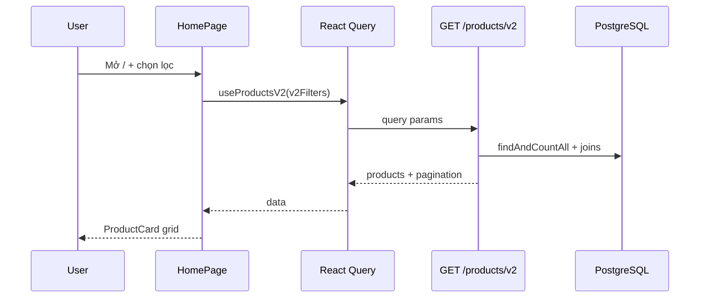

# Use Case — UC-CAT-01: Duyệt và lọc sản phẩm (Browse And Filter Products)

| Thuộc tính | Giá trị |
|------------|---------|
| **ID** | UC-CAT-01 |
| **Tên** | Duyệt danh sách laptop, lọc theo danh mục/hãng/giá/cấu hình, sắp xếp và phân trang |
| **Mức độ ưu tiên** | Cao — luồng khám phá sản phẩm chính |
| **Phiên bản** | Bám code hiện tại |

---

## 1. Mô tả ngắn

Khách truy cập trang chủ (`/`) để xem **carousel sản phẩm nổi bật**, **danh mục nhanh**, và **lưới sản phẩm** có phân trang. Họ mở bộ lọc (sidebar / panel), chọn **hãng**, **danh mục**, **khoảng giá**, **thông số biến thể** (CPU, RAM, SSD, GPU, màn hình, cân nặng), chọn **kiểu sắp xếp**, rồi hệ thống gọi API **`GET /api/products/v2`** và render `ProductCard`.

**Endpoint chính:** `GET /api/products/v2`  
**Facet metadata:** `GET /api/products/facets`  
**Metadata hãng/danh mục:** `GET /api/products/brands`, `GET /api/products/categories` (hook `customerUseBrandsFull` / `customerUseCategoriesFull`)  
**FE:** `HomePage.jsx`, `ProductFilter.jsx`, `useProductsV2`, `useProductFacets`

**Lưu ý:** API legacy `GET /api/products` (`getProducts`) vẫn tồn tại và hook `useProducts` vẫn có, nhưng **HomePage đang dùng v2** cho listing chính và featured carousel.

---

## 2. Tác nhân

| Tác nhân | Vai trò |
|----------|---------|
| **Guest / Customer** | Duyệt, lọc, đổi trang, chọn sort |
| **HomePage** | Gộp `localFilters` + `specFilters` + `urlSearchQuery` → `v2Filters` |
| **React Query** | Cache theo `queryKey: ["products-v2", filters]` |
| **Backend** | `getProductsV2`, `getProductFacets` — PostgreSQL + Sequelize |

---

## 3. Preconditions

| # | Điều kiện |
|---|-----------|
| PRE-01 | Server API và DB có bảng `products`, `product_variations`, `categories`, `brands` |
| PRE-02 | Route public mount: `/api/products/*` (không bắt buộc đăng nhập) |
| PRE-03 | FE build chạy, route `/` map tới `HomePage` trong `Layout` |

---

## 4. Postconditions

### Thành công

| # | Kết quả |
|---|---------|
| POST-01 | Danh sách `products` hiển thị theo bộ lọc + sort + page |
| POST-02 | `pagination` / `total` / `totalPages` đồng bộ UI phân trang |
| POST-03 | Chip “đã áp dụng” (`appliedChips`) phản ánh filter đang active |
| POST-04 | Featured block (best_selling) tải độc lập với bộ lọc listing |

### Thất bại / một phần

| # | Kết quả |
|---|---------|
| POST-F01 | API lỗi → `error` + UI loading/error (tùy chỗ render) |
| POST-F02 | Facet rỗng → checkbox cấu hình hiện “Chưa có dữ liệu.” |

---

## 5. Trigger

- User mở `/` lần đầu.
- User bật panel lọc, tick hãng/danh mục/cấu hình, nhập giá/cân nặng, chọn sort, đổi trang.
- User click chip category nhanh / banner danh mục (nếu có handler set `category_id`).

---

## 6. Luồng chính

| Bước | Tác nhân | Hành động |
|------|----------|-----------|
| 1 | User | Truy cập `/` |
| 2 | FE | `useSearchParams()` đọc `?search=` (nếu có từ Header — UC-CAT-02) |
| 3 | FE | `useProductFacets()` → `GET /products/facets` |
| 4 | FE | `customerUseBrandsFull()` / `customerUseCategoriesFull()` |
| 5 | FE | Gộp `v2Filters`: `localFilters` + `urlSearchQuery` + `sortBy` + `specFilters` + `_version: 'inactive_enabled'` |
| 6 | FE | `useProductsV2(v2Filters)` → build query string |
| 7 | BE | `getProductsV2`: parse CSV `category_id`, `brand_id`, spec lists, price, weight, `search`, `sort_by`, `page`, `limit` |
| 8 | BE | `Product.findAndCountAll` + include category, brand, variations (có thể `required: true` nếu lọc spec), ảnh primary |
| 9 | BE | `200 { products, pagination, total, totalPages }` |
| 10 | FE | Map `ProductCard` cho từng row; phân trang `handlePageChange` scroll top |
| 11 | User | Click card → navigate `/products/:slug` hoặc `product_id` (UC-CAT-04) |

### Featured carousel (song song)

| Bước | Mô tả |
|------|--------|
| F-1 | `featuredFilters = { page:1, limit:12, sortBy:"best_selling", _version }` |
| F-2 | `useProductsV2(featuredFilters)` — sort `best_selling` dùng subquery `sold_qty` trên order_items |

---

## 7. Tham số lọc — mapping FE ↔ BE

| FE (`v2Filters` / state) | Query API (`getProductsV2`) | Ghi chú |
|--------------------------|----------------------------|---------|
| `search` (từ URL) | `search` | `ILIKE` trên `product_name` |
| `category_id[]` | `category_id` CSV | `Op.in` nếu nhiều |
| `brand_id[]` | `brand_id` CSV | tương tự |
| `minPrice` / `maxPrice` | `min_price` / `max_price` | Lọc `base_price` |
| `processor[]` | `processor` | Lọc trên `ProductVariation`, `required: true` |
| `ram[]` | `ram` | |
| `storage[]` | `storage` | Alias BE: `ssd` |
| `graphics_card[]` | `graphics_card` | Alias: `gpu` |
| `screen_size[]` | `screen_size` | Alias: `screenSize` |
| `minWeight` / `maxWeight` | `min_weight` / `max_weight` | Parse `specs->>'weight'` JSONB |
| `sortBy` | `sort_by` | `price_asc`, `price_desc`, `newest`, `best_selling`, `""` = default `created_at DESC` |
| `page` / `limit` | `page` / `limit` | Default BE: 12; FE listing thường `limit: 30` |

---

## 8. Luồng thay thế

### AF-01: Chỉ lọc hãng/danh mục/giá qua `ProductFilter`

| Bước | Mô tả |
|------|--------|
| AF-01.1 | `ProductFilter` nhận `filters.brands` / `categories` / `price` |
| AF-01.2 | `onFilterChange` map về `localFilters.brand_id`, `category_id`, `minPrice`, `maxPrice` |
| AF-01.3 | **Không** ghi đè `search` URL từ panel lọc |

### AF-02: Lọc cấu hình (spec) trên HomePage

| Bước | Mô tả |
|------|--------|
| AF-02.1 | Checkbox CPU/RAM/SSD/GPU/màn hình → `specFilters` |
| AF-02.2 | Input cân nặng min/max kg |
| AF-02.3 | Mỗi thay đổi reset `page: 1` |

### AF-03: Xóa bộ lọc

| Bước | Mô tả |
|------|--------|
| AF-03.1 | `handleClearFilters` reset `localFilters`, `specFilters`, `sortBy` |
| AF-03.2 | **Giữ** `?search=` trên URL (comment code: không xóa URL search khi clear) |

### AF-04: Sort pill UI

| Giá trị UI | `sort_by` |
|------------|-----------|
| Phổ biến | `""` (mặc định created_at DESC) |
| Khuyến mãi HOT | `best_selling` |
| Giá Thấp - Cao | `price_asc` |
| Giá Cao - Thấp | `price_desc` |

*(UI có label “newest” trong FR khác nhưng `sortChoices` hiện tại **không** expose `newest` — BE vẫn hỗ trợ.)*

### AF-05: Category quick list

| Bước | Mô tả |
|------|--------|
| AF-05.1 | `categoriesNeedList` ưu tiên tên: Văn phòng, Gaming, Mỏng nhẹ, … |
| AF-05.2 | Fallback `categoriesFull.slice(0, 10)` nếu không khớp tên |

---

## 9. Luồng ngoại lệ

### EF-01: API v2 lỗi 500

React Query `error`; HomePage hiển thị trạng thái lỗi / spinner tùy block.

### EF-02: Không có sản phẩm sau lọc

`products.length === 0` — grid rỗng, total = 0.

### EF-03: Lọc spec “chặt” loại sản phẩm không có variation khớp

`variationWhere` + `required: true` → product biến mất khỏi list dù vẫn có SP khác cấu hình.

---

## 10. Quy tắc nghiệp vụ

| ID | Quy tắc |
|----|---------|
| BR-01 | Tìm kiếm tên SP: `product_name ILIKE %search%` (v2) |
| BR-02 | Giá lọc theo **`base_price`** sản phẩm, không theo giá variation |
| BR-03 | Lọc CPU/RAM/… áp trên bảng **variations**; SP phải có ít nhất 1 variation thỏa |
| BR-04 | `best_selling`: chỉ đơn `confirmed`, `processing`, `shipping`, `delivered`, `PAID` |
| BR-05 | Facet values = `DISTINCT` từ `product_variations` (+ weight từ `products.specs` JSONB) |
| BR-06 | **`getProductsV2` không lọc `is_active`** (khác `search-suggestions`) |

---

## 11. API

```http
GET /api/products/v2?page=1&limit=30&brand_id=1,2&category_id=3&min_price=10000000&max_price=30000000&processor=Intel+i7&ram=16GB&sort_by=price_asc&search=Dell
```

```http
GET /api/products/facets
```

Response facets (rút gọn):

```json
{
  "facets": {
    "processor": ["..."],
    "ram": ["..."],
    "storage": ["..."],
    "graphics_card": ["..."],
    "screen_size": ["..."],
    "weight": ["1.2", "1.5"]
  }
}
```

---

## 12. Triển khai

| File | Vai trò |
|------|---------|
| `server/routes/productRoutes.js` | Mount routes |
| `server/controllers/productController.js` | `getProductsV2`, `getProductFacets`, `getProducts` (legacy) |
| `client/app/pages/HomePage.jsx` | UI listing, filters, chips, pagination, featured |
| `client/app/components/ProductFilter.jsx` | Hãng, danh mục, giá VND format |
| `client/app/components/ProductCard.jsx` | Card + link detail |
| `client/app/hooks/useProducts.js` | `useProductsV2`, `useProductFacets` |

---

## 13. Sơ đồ tuần tự



---

## 14. Liên kết

| UC / FR |
|---------|
| UC-CAT-02 SearchProductsByKeyword |
| UC-CAT-03 UseSearchAutocomplete |
| UC-CAT-04 ViewProductDetail |
| `FR_ViewProductListV2.md`, `FR_GetProductFacets.md`, `FR_FilterSortProducts.md` |

---

## 15. Known gaps

| # | Mô tả |
|---|--------|
| GAP-01 | Listing v2 **không** lọc `is_active`; suggestions có lọc |
| GAP-02 | `useProducts` (legacy `/products`) import ở HomePage nhưng listing chính dùng v2 |
| GAP-03 | `ProductFilter` API shape (`brands`/`categories`) khác state HomePage (`brand_id` arrays) — đã map ở parent |
| GAP-04 | Clear filter **không** xóa `?search=` URL |
| GAP-05 | Facet `weight` có trên API; UI cân nặng có ở HomePage nhưng không dùng dropdown facet weight |
| GAP-06 | Sort `newest` có trên BE, chưa có trên pill UI |
| GAP-07 | `_version: 'inactive_enabled'` chỉ để bust React Query cache — không gửi lên BE |
