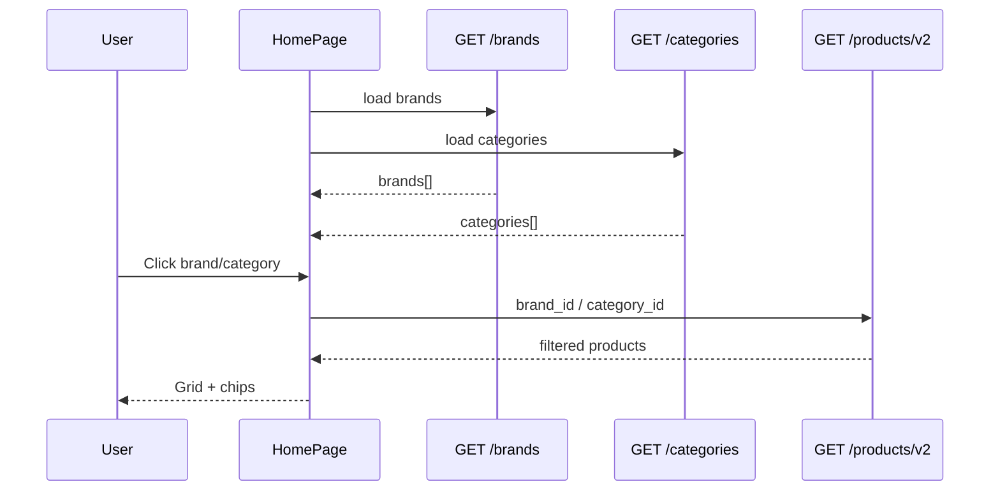

# Use Case — UC-CAT-09: Duyệt danh mục và hãng (Browse Categories And Brands)

| Thuộc tính | Giá trị |
|------------|---------|
| **ID** | UC-CAT-09 |
| **Tên** | Xem danh sách hãng/danh mục trên trang chủ và lọc sản phẩm |
| **Mức độ ưu tiên** | Cao |
| **Phiên bản** | Bám code hiện tại |

---

## 1. Mô tả ngắn

Trên **HomePage (`/`)**, khách xem hai khối điều hướng:

1. **“Máy tính laptop”** — hàng ngang logo/nút **hãng** (`brands`).
2. **“Chọn theo nhu cầu”** — lưới **danh mục** với icon (`categories`).

Click toggle **multi-select** → cập nhật `localFilters.brand_id` / `category_id` → listing chính gọi **`GET /api/products/v2`** (UC-CAT-01). Metadata tải từ API public:

- `GET /api/products/brands`
- `GET /api/products/categories`

**Không có** trang `/categories` hay `/brands` riêng — browse inline trên trang chủ + sidebar `ProductFilter`.

**FE:** `HomePage.jsx`, `ProductFilter.jsx`, hooks `customerUseBrandsFull`, `customerUseCategoriesFull`  
**BE:** `getBrands`, `getCategories`

---

## 2. Tác nhân

| Tác nhân | Vai trò |
|----------|---------|
| **Guest / Customer** | Xem logo/icon, chọn/bỏ chọn lọc |
| **HomePage** | Toggle filter, chips “Đang lọc theo” |
| **React Query** | Cache `staleTime: Infinity` cho brands/categories |
| **Backend** | Trả full list, sort cố định |

---

## 3. Preconditions

| # | Điều kiện |
|---|-----------|
| PRE-01 | API `/products/brands` và `/products/categories` hoạt động |
| PRE-02 | DB có bản ghi `brands`, `categories` (seed/admin) |
| PRE-03 | User trên route `/` |

---

## 4. Postconditions

### Thành công

| # | Kết quả |
|---|---------|
| POST-01 | Danh sách hãng/danh mục hiển thị với logo/icon hoặc fallback text |
| POST-02 | Item được chọn có style `border-blue-600 bg-blue-50` |
| POST-03 | Grid sản phẩm refresh theo `brand_id` / `category_id` CSV trên v2 API |
| POST-04 | `appliedChips` hiển thị tên hãng/danh mục đã chọn |

### Xóa lọc

| # | Kết quả |
|---|---------|
| POST-C01 | `handleClearFilters` xóa brand/category (và filter khác) — **giữ** `?search=` URL |

---

## 5. Trigger

- User mở trang chủ.
- User click logo hãng hoặc ô danh mục.
- User click chip xóa từng hãng/danh mục.
- User dùng `ProductFilter` checkbox (cùng data `brandsSimple` / `categoriesSimple`).

---

## 6. Luồng chính — Tải metadata

| Bước | Tác nhân | Hành động |
|------|----------|-----------|
| 1 | FE | `customerUseBrandsFull()` → `GET /api/products/brands` |
| 2 | BE | `Brand.findAll({ order: [["brand_name", "ASC"]] })` |
| 3 | BE | `200 { brands: [...] }` |
| 4 | FE | `customerUseCategoriesFull()` → `GET /api/products/categories` |
| 5 | BE | `Category.findAll({ order: [["display_order", "ASC"]] })` |
| 6 | BE | `200 { categories: [...] }` |
| 7 | FE | Map `brandsSimple` / `categoriesSimple` cho `ProductFilter` |
| 8 | FE | `categoriesNeedList` — subset ưu tiên tên cố định |

### `categoriesNeedList` — thứ tự ưu tiên tên

Danh sách mong muốn (normalize lowercase):

- Văn phòng, Gaming, Mỏng nhẹ, Đồ họa - kỹ thuật, Sinh viên, Cảm ứng, Laptop AI

Nếu không khớp tên nào → fallback `categoriesFull.slice(0, 10)`.

---

## 7. Luồng chính — Chọn hãng

| Bước | Tác nhân | Hành động |
|------|----------|-----------|
| 1 | User | Click nút hãng (logo hoặc text) |
| 2 | FE | `toggleNumberInList(localFilters.brand_id, id)` |
| 3 | FE | `handleFilterChange({ brand_id: [...], page: 1 })` |
| 4 | FE | `useProductsV2` append `brand_id=1,2` |
| 5 | BE | `where.brand_id Op.in` hoặc equality nếu 1 id |
| 6 | FE | Re-render grid + chip “Hãng: …” |

**UI hãng:**

- `logo_url` → `` height 8
- Không logo → tên rút gọn trong nút `min-w-[96px]`

---

## 8. Luồng chính — Chọn danh mục

| Bước | Tác nhân | Hành động |
|------|----------|-----------|
| 1 | User | Click card danh mục |
| 2 | FE | `toggleNumberInList(localFilters.category_id, id)` |
| 3 | FE | `handleFilterChange({ category_id: [...], page: 1 })` |
| 4 | FE | `useProductsV2` → `category_id` CSV |
| 5 | BE | Lọc `products.category_id` |
| 6 | FE | Chip “Danh mục: …” |

**UI danh mục:**

- `icon_url` → ảnh vuông aspect-square
- Không icon → text tên trong ô xám

---

## 9. Luồng thay thế

### AF-01: Lọc qua `ProductFilter` (panel “Bộ lọc”)

| Bước | Mô tả |
|------|--------|
| AF-01.1 | Checkbox brands/categories — cùng toggle logic |
| AF-01.2 | Map `f.brands` → `brand_id`, `f.categories` → `category_id` |
| AF-01.3 | Không sửa URL search |

### AF-02: Kết hợp hãng + danh mục + spec + search

Tất cả merge trong `v2Filters` — AND trên query BE.

### AF-03: Hooks rút gọn `{ id, name }`

| Hook | Endpoint | Output |
|------|----------|--------|
| `customerUseBrands()` | `/products/brands` | `mapBrand` |
| `customerUseCategories()` | `/products/categories` | `mapCategory` |

HomePage dùng bản **Full** để lấy `logo_url`, `icon_url`.

### AF-04: Admin quản lý category/brand

| Route | Ghi chú |
|-------|---------|
| `/admin/categories` | CRUD — không thuộc UC storefront browse |
| `/admin/brands` | CRUD |

Storefront chỉ **đọc** public GET.

---

## 10. Luồng ngoại lệ

### EF-01: API brands/categories lỗi

React Query error — khối UI có thể rỗng / không render nút.

### EF-02: `brand_id` / `category_id` invalid

Toggle với `Number(id)` falsy → bỏ qua render (`if (!id) return null`).

### EF-03: Parent category (`parent_id`)

Model `Category` có `parent_id` — API trả **flat list**, FE **không** build cây phân cấp.

---

## 11. Quy tắc nghiệp vụ

| ID | Quy tắc |
|----|---------|
| BR-01 | Multi-select hãng và danh mục — OR trong cùng dimension, AND giữa dimensions |
| BR-02 | Mỗi thay đổi lọc reset `page: 1` |
| BR-03 | Categories sort **`display_order ASC`**; brands sort **`brand_name ASC`** |
| BR-04 | Public API **không** ẩn category/brand inactive (không field inactive trên model) |
| BR-05 | Lọc listing theo id, **không** theo slug trên v2 (slug chỉ PDP) |

---

## 12. API

```http
GET /api/products/brands
```

```json
{
  "brands": [
    {
      "brand_id": 1,
      "brand_name": "Dell",
      "slug": "dell",
      "logo_url": "/uploads/...",
      "description": "..."
    }
  ]
}
```

```http
GET /api/products/categories
```

```json
{
  "categories": [
    {
      "category_id": 2,
      "category_name": "Gaming",
      "slug": "gaming",
      "icon_url": "...",
      "display_order": 1,
      "parent_id": null
    }
  ]
}
```

**Listing sau khi chọn:**

```http
GET /api/products/v2?brand_id=1,3&category_id=2&page=1&limit=30
```

---

## 13. Triển khai

| File | Vai trò |
|------|---------|
| `server/routes/productRoutes.js` | `GET /brands`, `GET /categories` (trước `/:id`) |
| `server/controllers/productController.js` | `getBrands`, `getCategories` |
| `server/models/Brand.js`, `Category.js` | Schema |
| `client/app/pages/HomePage.jsx` | UI browse + toggle + chips |
| `client/app/components/ProductFilter.jsx` | Checkbox filter panel |
| `client/app/hooks/useProducts.js` | `customerUseBrandsFull`, `customerUseCategoriesFull` |

---

## 14. Sơ đồ tuần tự



---

## 15. Liên kết

| UC / FR |
|---------|
| UC-CAT-01 BrowseAndFilterProducts |
| UC-CAT-02 SearchProductsByKeyword |
| Admin: `FR_AdminListCategories`, brand FRs |
| `docs/feature_requirements/catalog/FR_FilterSortProducts.md` |

---

## 16. Known gaps

| # | Mô tả |
|---|--------|
| GAP-01 | Không trang catalog riêng `/categories/:slug` |
| GAP-02 | `categoriesNeedList` hard-code tên — DB khác tên → fallback 10 đầu |
| GAP-03 | Không hiển thị cây `parent_id` |
| GAP-04 | Header/nav không link trực tiếp tới danh mục |
| GAP-05 | `customerUseBrands` vs `customerUseBrandsFull` — query key khác, dữ liệu trùng endpoint |
| GAP-06 | Admin dùng `/admin/categories` — khác public `/products/categories` (có thể lệch cache nếu sửa admin) |
