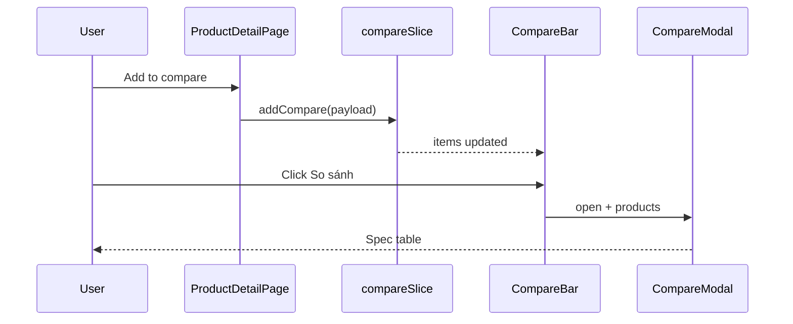

# Use Case — UC-CAT-06: So sánh sản phẩm (Compare Products)

| Thuộc tính | Giá trị |
|------------|---------|
| **ID** | UC-CAT-06 |
| **Tên** | Thêm tối đa 3 cấu hình vào danh sách so sánh và xem bảng thông số |
| **Mức độ ưu tiên** | Trung bình |
| **Phiên bản** | Bám code hiện tại |

---

## 1. Mô tả ngắn

Trên **trang chi tiết**, khách (đã chọn variation) bấm **“+ Thêm vào so sánh”** → Redux `compareSlice` lưu tối đa **3** item (key `variation_id`, FIFO khi đầy). Thanh **`CompareBar`** cố định dưới màn hình hiện thumbnail; khi ≥ 2 item, nút **“So sánh”** mở **`CompareModal`** — bảng client-side từ snapshot `specs` + `discount_percentage`.

Backend có **`GET/POST /api/products/compare`** build ma trận từ `products.specs` JSONB — **FE hiện không gọi**.

**FE:** `compareSlice.js`, `ProductDetailPage.jsx`, `CompareBar.jsx`, `CompareModal.jsx`  
**BE (unused by FE):** `compareProducts` trong `productController.js`

---

## 2. Tác nhân

| Tác nhân | Vai trò |
|----------|---------|
| **Customer** | Add / xóa / mở modal so sánh |
| **Redux store** | `compare.items[]` in-memory |
| **Backend (optional)** | Matrix compare API |

---

## 3. Preconditions

| # | Điều kiện |
|---|-----------|
| PRE-01 | User đang ở `ProductDetailPage` |
| PRE-02 | `selectedVariation` không null (nút compare enabled) |
| PRE-03 | Redux store đã mount (`store.js` → `compare` reducer) |

---

## 4. Postconditions

### Thành công

| # | Kết quả |
|---|---------|
| POST-01 | Item mới trong `compare.items` nếu `variation_id` chưa có |
| POST-02 | `CompareBar` hiển thị khi `items.length > 0` |
| POST-03 | Modal hiển thị bảng khi user bấm “So sánh” và ≥ 2 items |
| POST-04 | `clearCompare` / `removeCompare` cập nhật UI |

### Không thay đổi

| # | Kết quả |
|---|---------|
| POST-N01 | Refresh trang → **mất** danh sách (không persist LS) |
| POST-N02 | Không ghi DB |

---

## 5. Trigger

- Click “+ Thêm vào so sánh” trên PDP.
- Click “So sánh” trên CompareBar.
- Click “Xoá tất cả” / remove (nếu có UI remove từng item — bar hiện chỉ clear all).

---

## 6. Luồng chính — Thêm item

| Bước | Tác nhân | Hành động |
|------|----------|-----------|
| 1 | User | Chọn cấu hình (UC-CAT-05) |
| 2 | User | Click “+ Thêm vào so sánh” |
| 3 | FE | `dispatch(addCompare({...}))` |
| 4 | Redux | Nếu trùng `variation_id` → **return** (không thêm) |
| 5 | Redux | Nếu `length >= 3` → `shift()` xóa item **cũ nhất** |
| 6 | Redux | `push` payload |
| 7 | FE | `CompareBar` render |

### Payload (thực tế)

```javascript
{
  variation_id: selectedVariation.variation_id,
  product_id: product.product_id,
  product_name: product.product_name,
  thumbnail_url: product.thumbnail_url,
  discount_percentage: product.discount_percentage,
  specs: {
    price: selectedVariation.price,
    processor, ram, storage, graphics_card, screen_size, color
  },
  variation: selectedVariation
}
```

**Lưu ý:** So sánh theo **variation**, không chỉ `product_id` — hai cấu hình cùng máy vẫn là 2 slot.

---

## 7. Luồng chính — Xem bảng so sánh

| Bước | Tác nhân | Hành động |
|------|----------|-----------|
| 1 | User | Có ≥ 2 items, click “So sánh” (`disabled` nếu &lt; 2) |
| 2 | FE | `setCmpOpen(true)` |
| 3 | FE | `CompareModal` nhận `products={compareItems}` |
| 4 | FE | `normalizeSpecs(p.specs)` flatten → cột “Thông số” |
| 5 | FE | Hàng **Giá gốc** / **Giá sau giảm** từ `specs.price` + `discount_percentage` |
| 6 | User | ESC / click overlay / nút X → `onClose` |

---

## 8. Luồng thay thế

### AF-01: Chỉ 1 item

CompareBar hiện nhưng nút “So sánh” **disabled** (`items.length < 2`).

### AF-02: Item thứ 4

FIFO: item đầu tiên trong queue bị đẩy ra khi thêm item mới.

### AF-03: Cùng variation hai lần

`addCompare` no-op lần 2.

### AF-04: Xóa tất cả

`dispatch(clearCompare())` → bar ẩn (`return null`).

---

## 9. Luồng ngoại lệ

### EF-01: Chưa chọn variation

Nút disabled; `title` tooltip hướng dẫn.

### EF-02: `specs` rỗng trong modal

Các hàng spec hiển thị “—”; giá phụ thuộc `specs.price` snapshot lúc add.

### EF-03: Gọi API compare (nếu tích hợp sau)

| Method | Body/Query |
|--------|------------|
| GET | `/api/products/compare?ids=1,2,3` |
| POST | `{ "ids": [1,2,3] }` |

**Route ordering bug:** trong `productRoutes.js`, `GET /:id` đứng **trước** `GET /compare` → request `GET /api/products/compare` có thể vào **`getProductDetail`** với `id = "compare"` → 404 Product not found. **`POST /compare` vẫn hoạt động** vì không match GET `/:id`.

---

## 10. Quy tắc nghiệp vụ

| ID | Quy tắc |
|----|---------|
| BR-01 | `MAX = 3` items |
| BR-02 | Unique key = **`variation_id`** |
| BR-03 | FIFO eviction khi vượt max |
| BR-04 | Modal cần **≥ 2** items |
| BR-05 | Specs so sánh = snapshot variation fields, **không** full `product.specs` JSONB |
| BR-06 | Không có entry so sánh từ `ProductCard` listing |

---

## 11. API Backend (chưa dùng FE)

```http
GET /api/products/compare?ids=1,2,3
POST /api/products/compare
Content-Type: application/json
{ "ids": [1, 2, 3] }
```

Response:

```json
{
  "products": [{ "id", "name", "thumbnail_url", "base_price", "discount_percentage" }],
  "compare": [
    { "group": "display", "rows": [{ "label": "...", "values": ["...", "—"] }] }
  ]
}
```

Logic: gom tất cả `group` / `label` từ `products.specs` JSONB; fill `"—"` nếu thiếu.

---

## 12. Triển khai

| File | Vai trò |
|------|---------|
| `client/app/store/slices/compareSlice.js` | MAX=3, add/remove/clear |
| `client/app/store/store.js` | Register reducer |
| `client/app/pages/ProductDetailPage.jsx` | dispatch addCompare, CompareBar/Modal |
| `client/app/components/CompareBar.jsx` | Fixed bottom UI |
| `client/app/components/CompareModal.jsx` | Table normalizeSpecs |
| `server/controllers/productController.js` | `compareProducts` L1157–1231 |
| `server/routes/productRoutes.js` | Routes compare (**sau** `/:id`) |

---

## 13. Sơ đồ tuần tự (luồng thực tế — client only)



---

## 14. So sánh FE modal vs BE API

| Khía cạnh | FE CompareModal | BE compareProducts |
|-----------|-----------------|-------------------|
| Đơn vị | Variation snapshot | **Product** ids |
| Nguồn specs | Fields variation + price | `products.specs` JSONB groups |
| Giá | `specs.price` + discount % | `base_price` summary only |
| Persist | Session Redux | Stateless |

---

## 15. Liên kết

| UC / FR |
|---------|
| UC-CAT-04 ViewProductDetail |
| UC-CAT-05 SelectProductConfiguration |
| `FR_CompareProducts.md` |

---

## 16. Known gaps

| # | Mô tả |
|---|--------|
| GAP-01 | FE **không** gọi API compare |
| GAP-02 | `GET /products/compare` **bị che** bởi `GET /:id` (route order) |
| GAP-03 | Không persist `localStorage` — F5 mất list |
| GAP-04 | Compare chỉ trên PDP — không global trên Layout |
| GAP-05 | BE compare theo **product_id**; FE theo **variation_id** — mô hình không khớp |
| GAP-06 | Modal giá dùng `specs.price` variation; hàng specs không có `product.specs` đầy đủ |
| GAP-07 | `CompareBar` key thumbnail `product_id` — trùng nếu 2 variation cùng product (hiếm) |
| GAP-08 | Không `removeCompare` từng item trên bar (chỉ clear all) |
