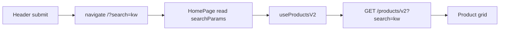

# Use Case — UC-CAT-02: Tìm sản phẩm theo từ khóa (Search Products By Keyword)

| Thuộc tính | Giá trị |
|------------|---------|
| **ID** | UC-CAT-02 |
| **Tên** | Tìm laptop theo từ khóa trên danh sách trang chủ |
| **Mức độ ưu tiên** | Cao |
| **Phiên bản** | Bám code hiện tại |

---

## 1. Mô tả ngắn

Khách nhập từ khóa trên **Header** (desktop), submit form hoặc chọn gợi ý “Xem tất cả kết quả”, hệ thống điều hướng tới **`/?search=<keyword>`**. `HomePage` đọc query `search`, gộp vào `filters.search` và gọi **`GET /api/products/v2?search=...`** (cùng pipeline lọc/phân trang UC-CAT-01).

**Không** có trang `/search` riêng — kết quả hiển thị trên **trang chủ**.

**Endpoint:** `GET /api/products/v2` (param `search`)  
**Legacy:** `GET /api/products?search=` (`getProducts`) — cùng logic `ILIKE` tên SP  
**FE:** `Header.jsx` (submit), `HomePage.jsx` (đọc URL), `useProductsV2`

---

## 2. Tác nhân

| Tác nhân | Vai trò |
|----------|---------|
| **Guest / Customer** | Nhập từ khóa, xem kết quả |
| **Header** | `navigate('/?search=' + query)` |
| **HomePage** | `urlSearchQuery = searchParams.get("search")` |
| **Backend** | `where.product_name = { [Op.iLike]: '%search%' }` |

---

## 3. Preconditions

| # | Điều kiện |
|---|-----------|
| PRE-01 | User ở storefront, Header render (desktop form; mobile form đơn giản hơn) |
| PRE-02 | Từ khóa sau trim không rỗng (submit) |

---

## 4. Postconditions

### Thành công

| # | Kết quả |
|---|---------|
| POST-01 | URL chứa `?search=<keyword>` |
| POST-02 | Listing refresh với `search` trong `v2Filters` |
| POST-03 | Chip/banner có thể hiển thị từ khóa đang search (qua `urlSearchQuery` trong ProductFilter display) |

### Thất bại

| # | Kết quả |
|---|---------|
| POST-F01 | Submit ô trống → không navigate |
| POST-F02 | Không khớp tên → grid rỗng, không lỗi đặc biệt |

---

## 5. Trigger

- Submit form search Header (`handleSearch`).
- Click “Xem tất cả kết quả” trong dropdown autocomplete (UC-CAT-03).
- Click mục **Lịch sử / Xu hướng (Mock)** → set query + `navigate('/?search=...')`.

---

## 6. Luồng chính

| Bước | Tác nhân | Hành động |
|------|----------|-----------|
| 1 | User | Gõ từ khóa vào ô “Tìm kiếm laptop…” |
| 2 | User | Enter hoặc click icon Search (submit) |
| 3 | FE | `handleSearch`: `if (searchQuery.trim()) navigate('/?search=' + searchQuery)` |
| 4 | FE | Đóng dropdown (`setIsSearchFocused(false)`) |
| 5 | FE | `HomePage` mount/update: `urlSearchQuery = searchParams.get("search")` |
| 6 | FE | `filters = { ...localFilters, search: urlSearchQuery }` — **URL search override** local |
| 7 | FE | `useProductsV2(v2Filters)` append `search` query param |
| 8 | BE | `getProductsV2`: `where.product_name ILIKE %search%` |
| 9 | BE | Trả danh sách + pagination |
| 10 | FE | Render lưới `ProductCard` như browse thường |

---

## 7. Luồng thay thế

### AF-01: Kết hợp search + bộ lọc khác

| Bước | Mô tả |
|------|--------|
| AF-01.1 | User đã có `?search=Dell`, tiếp tục chọn hãng ASUS |
| AF-01.2 | BE áp **cả** `search` AND `brand_id` — có thể rỗng nếu mâu thuẫn |

### AF-02: Đổi từ khóa mà không xóa filter local

| Bước | Mô tả |
|------|--------|
| AF-02.1 | `localFilters` (brand, price, spec) **giữ nguyên** |
| AF-02.2 | Chỉ `search` lấy từ URL mới |

### AF-03: Clear filters (HomePage)

| Bước | Mô tả |
|------|--------|
| AF-03.1 | `handleClearFilters` reset brand/category/price/spec/sort |
| AF-03.2 | **Vẫn giữ** `?search=` — user phải xóa URL thủ công hoặc search lại |

### AF-04: Trending link có filter giá

| Ví dụ | `/?minPrice=0&maxPrice=15000000` |
|--------|----------------------------------|
| Ghi chú | Mock trending; **HomePage hiện chỉ đọc `search`**, không parse `minPrice`/`maxPrice` từ URL |

---

## 8. Luồng ngoại lệ

### EF-01: Ký tự đặc biệt trong URL

Keyword encode qua `navigate` — cần encodeURIComponent nếu có space (browser thường xử lý).

### EF-02: Phân biệt hoa thường

PostgreSQL `iLike` → **không phân biệt** hoa thường.

### EF-03: Chỉ tìm theo `product_name`

Không tìm trong brand, category, specs JSON, SKU variation.

---

## 9. Quy tắc nghiệp vụ

| ID | Quy tắc |
|----|---------|
| BR-01 | Search full listing dùng param `search` trên **v2** |
| BR-02 | Match partial substring `%keyword%` |
| BR-03 | `urlSearchQuery` **ưu tiên** hơn mọi `localFilters.search` (field search local gần như không dùng) |
| BR-04 | Autocomplete (UC-CAT-03) thêm `is_active: true`; listing v2 **không** |

---

## 10. API

```http
GET /api/products/v2?search=Macbook&page=1&limit=30
```

Ví dụ kết hợp:

```http
GET /api/products/v2?search=Gaming&brand_id=2&sort_by=price_asc
```

---

## 11. Triển khai

| File | Vai trò |
|------|---------|
| `client/app/components/Header.jsx` | `handleSearch`, Link “Xem tất cả…” |
| `client/app/pages/HomePage.jsx` | `useSearchParams`, merge filters |
| `client/app/hooks/useProducts.js` | `params.append("search", filters.search)` |
| `server/controllers/productController.js` | `getProductsV2` L123–135, `getProducts` L266–284 |

---

## 12. Sơ đồ hoạt động



---

## 13. Liên kết

| UC / FR |
|---------|
| UC-CAT-01 BrowseAndFilterProducts |
| UC-CAT-03 UseSearchAutocomplete |
| `FR_SearchProductsByKeyword.md` |

---

## 14. Known gaps

| # | Mô tả |
|---|--------|
| GAP-01 | Không có route `/search` chuyên biệt |
| GAP-02 | Trending mock link `minPrice`/`maxPrice` **không** được HomePage đọc |
| GAP-03 | Clear filter không xóa search URL |
| GAP-04 | Mobile Header search **không** có dropdown autocomplete |
| GAP-05 | Chỉ search `product_name`, không full-text specs/brand |
| GAP-06 | v2 vs suggestions khác điều kiện `is_active` |
