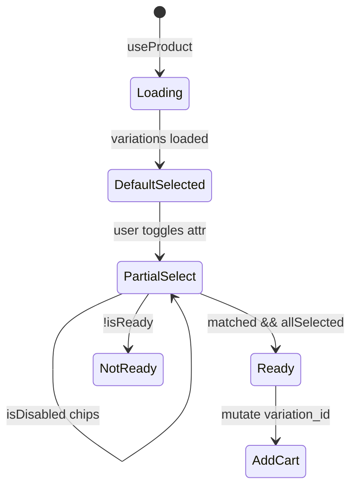

# Use Case — UC-CAT-05: Chọn cấu hình sản phẩm (Select Product Configuration)

| Thuộc tính | Giá trị |
|------------|---------|
| **ID** | UC-CAT-05 |
| **Tên** | Chọn biến thể (CPU, RAM, SSD, GPU, màn hình, màu) trên trang chi tiết |
| **Mức độ ưu tiên** | Cao — bắt buộc trước mua/so sánh |
| **Phiên bản** | Bám code hiện tại |

---

## 1. Mô tả ngắn

Trên `ProductDetailPage`, mỗi sản phẩm có nhiều **`ProductVariation`**. User chọn từng thuộc tính trong tập **`ATTRS`**; FE tìm variation **khớp đủ** các field đã chọn (`matchVariation`), cập nhật **giá**, **tồn kho**, **gợi ý KNN**, và bật nút **Thêm giỏ / Mua ngay** khi `isReady`. Lần đầu load, hệ thống auto-chọn variation **primary** hoặc **rẻ nhất**.

**Không có API riêng** “chọn cấu hình” — toàn bộ **client-side** trên dữ liệu `GET /api/products/:id`.

**FE:** `ProductDetailPage.jsx`  
**Liên quan:** `FR_SelectProductVariation.md`

---

## 2. Tác nhân

| Tác nhân | Vai trò |
|----------|---------|
| **Customer** | Click chip cấu hình, đổi số lượng |
| **ProductDetailPage** | State `sel`, `selectedVariation`, `matched` |
| **Backend** | Chỉ cung cấp danh sách `variations` trong product detail |

---

## 3. Preconditions

| # | Điều kiện |
|---|-----------|
| PRE-01 | `product.variations.length >= 1` (nếu 0 → không chọn được, add/compare disabled) |
| PRE-02 | Product detail đã load (`useProduct` success) |

---

## 4. Postconditions

### Thành công

| # | Kết quả |
|---|---------|
| POST-01 | `selectedVariation` trỏ tới biến thể khớp (hoặc null nếu chưa đủ lựa chọn) |
| POST-02 | Giá hiển thị theo `currentVariation.price` + `discount_percentage` |
| POST-03 | `useRecommendedByVariation` refetch theo `variation_id` mới |
| POST-04 | `isReady === true` → cho phép add to cart / buy now |

### Một phần

| # | Kết quả |
|---|---------|
| POST-P01 | Chọn thiếu option → `matched` có thể null, nút mua disabled |
| POST-P02 | Combination vô hiệu → chip `isDisabled` |

---

## 5. Trigger

- Load PDP → `useEffect` auto-select default variation.
- User click giá trị thuộc tính (`toggleSelect`).
- User đổi quantity (không đổi variation).

---

## 6. Thuộc tính cấu hình (ATTRS)

```javascript
const ATTRS = [
  "processor",
  "ram",
  "storage",
  "graphics_card",
  "screen_size",
  "color",
];
```

| Thuộc tính | UI label (typical) | Nguồn options |
|------------|-------------------|---------------|
| processor | CPU | `uniqueOptions` = distinct từ variations |
| ram | RAM | |
| storage | SSD | |
| graphics_card | GPU | |
| screen_size | Màn hình | |
| color | Màu | |

`requiredKeys` = các attr có ít nhất 1 giá trị khác rỗng trong catalog variations của SP đó.

---

## 7. Luồng chính

### 7.1 Khởi tạo mặc định

| Bước | Hành động |
|------|-----------|
| 1 | `product.variations` có dữ liệu |
| 2 | Tìm `v.is_primary === true` |
| 3 | Nếu không: `reduce` chọn **giá thấp nhất** |
| 4 | `setSelectedVariation(defaultVariation)` |
| 5 | `setSel` từ các field của default (`ATTRS.reduce`) |

### 7.2 User đổi cấu hình

| Bước | Hành động |
|------|-----------|
| 1 | `toggleSelect(k, val)` — click lại để bỏ chọn (`""`) |
| 2 | `next = { ...prev, [k]: val }` |
| 3 | `m = variations.find(v => matchVariation(v, next))` |
| 4 | `setSelectedVariation(m \|\| null)` |
| 5 | `matchVariation`: mọi key trong `sel` đã set phải khớp `String(v[k]) === String(s[k])`; key chưa set thì bỏ qua |

### 7.3 Điều kiện “sẵn sàng mua”

```javascript
const allSelected = requiredKeys.every((k) => !!sel[k]);
const isReady = Boolean(matched) && allSelected;
```

| Biến | Ý nghĩa |
|------|---------|
| `matched` | Variation khớp partial/full selection |
| `allSelected` | Đã chọn đủ mọi nhóm option có dữ liệu |
| `isReady` | Cả hai — dùng trước add to cart |

### 7.4 Vô hiệu hóa chip không khả thi

```javascript
const isDisabled = (k, val) => {
  const s = { ...sel, [k]: val };
  return !variations.some((v) => matchVariation(v, s));
};
```

---

## 8. Luồng thay thế

### AF-01: Chỉ một variation

| Bước | Mô tả |
|------|--------|
| AF-01.1 | `uniqueOptions` mỗi attr 1 giá trị |
| AF-01.2 | Auto-select vẫn chạy; user có thể không cần click |

### AF-02: Thêm vào so sánh

| Điều kiện | `disabled={!selectedVariation}` trên nút compare |
|-----------|--------------------------------------------------|
| Payload | `specs` snapshot từ **variation** (price, cpu, ram, …) — UC-CAT-06 |

### AF-03: Hết hàng

| Bước | Mô tả |
|------|--------|
| AF-03.1 | `stock = Number(variation.stock_quantity)` |
| AF-03.2 | Handler add to cart kiểm tra stock & alert |

### AF-04: BE `primaryVariationId`

| Mô tả |
|--------|
| JSON detail có `primaryVariationId` — FE **không** đọc trực tiếp; tự sort tương tự logic BE |

---

## 9. Luồng ngoại lệ

### EF-01: Không có variation khớp

`matched === null` → giá có thể fallback `product.base_price` qua `currentVariation` (variation đầu hoặc selected null).

### EF-02: User bỏ chọn một attr

Toggle cùng giá trị → `""` → có thể mất `matched` → `isReady` false.

### EF-03: So sánh khi chưa chọn đủ

Nút “+ Thêm vào so sánh” disabled + tooltip “Vui lòng chọn đủ cấu hình…”.

---

## 10. Quy tắc nghiệp vụ

| ID | Quy tắc |
|----|---------|
| BR-01 | Một variation = tổ hợp đầy đủ 6 trường (có thể null color) |
| BR-02 | Matching **theo từng attr đã chọn**, không ép attr chưa chọn |
| BR-03 | Default: **primary** &gt; **cheapest price** &gt; phần tử đầu |
| BR-04 | Giỏ hàng gửi **`variation_id`**, không gửi rời từng attr |
| BR-05 | Listing filter spec (UC-CAT-01) độc lập với selector PDP |

---

## 11. Tương tác API (gián tiếp)

| Hành động | API |
|-----------|-----|
| Load options | `GET /api/products/:id` |
| Add cart | `POST /api/cart/items` (hook `useAddToCart`) với `variation_id` |
| Recommendations | `GET /api/products/variations/:id/recommendations` |

---

## 12. Triển khai

| File | Vai trò |
|------|---------|
| `client/app/pages/ProductDetailPage.jsx` | ATTRS, sel, toggleSelect, isReady, handlers |
| `server/models/ProductVariation.js` | Schema fields |
| `server/controllers/productController.js` | Trả variations trong detail |

---

## 13. Sơ đồ trạng thái (rút gọn)



---

## 14. Liên kết

| UC / FR |
|---------|
| UC-CAT-04 ViewProductDetail |
| UC-CAT-06 CompareProducts |
| `FR_SelectProductVariation.md` |

---

## 15. Known gaps

| # | Mô tả |
|---|--------|
| GAP-01 | Không đồng bộ `primaryVariationId` từ API vào FE init (logic duplicate) |
| GAP-02 | `is_available` không ẩn variation hết hàng trên BE |
| GAP-03 | Compare yêu cầu `selectedVariation` nhưng message nói “đủ cấu hình” — có thể có variation khi chưa `allSelected` |
| GAP-04 | Không có URL deep-link `?variation_id=` |
| GAP-05 | ProductCard listing chọn variation display riêng (primary/cheapest) — có thể khác PDP selection |
