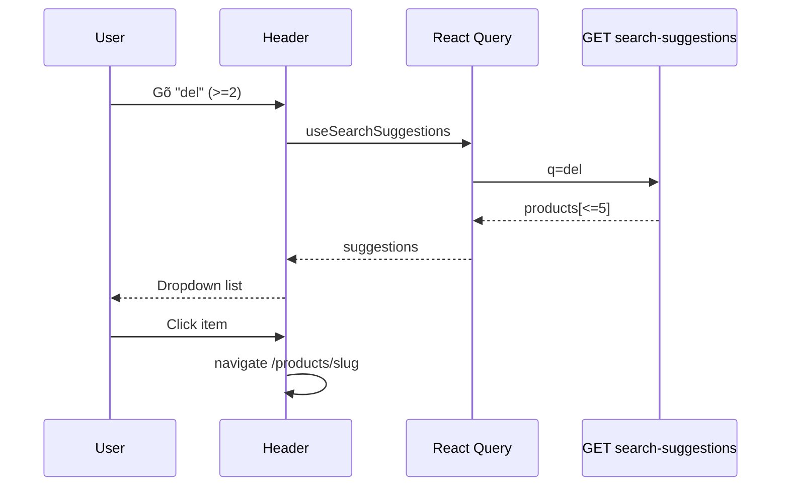

# Use Case — UC-CAT-03: Gợi ý tìm kiếm tự động (Use Search Autocomplete)

| Thuộc tính | Giá trị |
|------------|---------|
| **ID** | UC-CAT-03 |
| **Tên** | Gợi ý sản phẩm khi gõ trên Header (live search dropdown) |
| **Mức độ ưu tiên** | Trung bình |
| **Phiên bản** | Bám code hiện tại |

---

## 1. Mô tả ngắn

Khi khách **focus** ô tìm kiếm trên Header (desktop), dropdown hiện:

- **&lt; 2 ký tự:** nội dung mock (lịch sử + xu hướng) — **không gọi API**.
- **≥ 2 ký tự:** gọi **`GET /api/products/search-suggestions?q=`** qua `useSearchSuggestions`, hiển thị tối đa **5** sản phẩm (ảnh, tên, giá), click → **`/products/:slug`**.

**Endpoint:** `GET /api/products/search-suggestions`  
**FE:** `Header.jsx`, `useSearchSuggestions` trong `useProducts.js`

---

## 2. Tác nhân

| Tác nhân | Vai trò |
|----------|---------|
| **Guest / Customer** | Gõ, chọn gợi ý hoặc “Xem tất cả” |
| **React Query** | `enabled: query.length >= 2`, `staleTime: 5 phút` |
| **Backend** | `getSearchSuggestions` |

---

## 3. Preconditions

| # | Điều kiện |
|---|-----------|
| PRE-01 | Viewport desktop (`hidden md:flex` form) — dropdown logic gắn form desktop |
| PRE-02 | `q.trim().length >= 2` để BE trả data (FE cũng skip API nếu &lt; 2) |

---

## 4. Postconditions

### Thành công

| # | Kết quả |
|---|---------|
| POST-01 | Dropdown hiển thị danh sách gợi ý hoặc “Không tìm thấy…” |
| POST-02 | Click item → PDP `/products/{slug}`, clear ô search |
| POST-03 | Link “Xem tất cả” → `/?search={query}` (UC-CAT-02) |

### Không đổi session

Autocomplete **không** yêu cầu đăng nhập; không ghi lịch sử thật (mock only).

---

## 5. Trigger

- `onFocus` input → `setIsSearchFocused(true)`.
- `onChange` → cập nhật `searchQuery` → React Query refetch (nếu ≥ 2 ký tự).
- Click outside (`useOutsideClick`) → đóng dropdown.

---

## 6. Luồng chính (live search)

| Bước | Tác nhân | Hành động |
|------|----------|-----------|
| 1 | User | Focus ô search |
| 2 | FE | `shouldShowDropdown = isSearchFocused` |
| 3 | User | Gõ ≥ 2 ký tự |
| 4 | FE | `useSearchSuggestions(searchQuery)` enabled |
| 5 | FE | `GET /products/search-suggestions?q=${query}` |
| 6 | BE | Nếu `search.length < 2` → `{ products: [] }` |
| 7 | BE | `Product.findAll` where `is_active: true` AND name `iLike` |
| 8 | BE | `limit: 5`, attributes gọn + 1 variation price + primary image |
| 9 | BE | `200 { products: [...] }` |
| 10 | FE | `renderLiveSearchContent`: map thumbnail, name, `formatPrice` |
| 11 | FE | Giá = `variations[0].price` hoặc `base_price`, nhân `(1 - discount%/100)` |
| 12 | User | Click row → `handleSuggestionClick(slug)` |

---

## 7. Luồng thay thế

### AF-01: Ô search trống hoặc 1 ký tự (`isSearchEmpty`)

| Nội dung | Nguồn |
|----------|--------|
| Lịch sử | `MOCK_HISTORY` — click → set query + navigate `/?search=` |
| Xu hướng | `MOCK_TRENDING` — Link preset |
| Nhãn UI | “(Mock)” — không persist |

### AF-02: “Xem tất cả kết quả”

```jsx
<Link to={`/?search=${searchQuery}`} ...>
```

Chuyển sang UC-CAT-02 full listing.

### AF-03: Submit form (Enter) không chọn gợi ý

`handleSearch` → `/?search=` — **không** qua suggestions API.

### AF-04: Loading state

`isLoadingSuggestions` → text “Đang tìm kiếm…”.

---

## 8. Luồng ngoại lệ

### EF-01: API lỗi

React Query error — UI có thể không có banner riêng (chỉ empty/loading tùy state).

### EF-02: Sản phẩm inactive

**Không** xuất hiện trong suggestions (`is_active: true`) nhưng vẫn có thể lọt listing v2 (GAP).

### EF-03: Thiếu ảnh

Fallback `thumbnail_url` hoặc `/placeholder.svg`.

### EF-04: Mobile

Form mobile **không** mount dropdown `renderLiveSearchContent` — chỉ submit search thường.

---

## 9. Quy tắc nghiệp vụ

| ID | Quy tắc |
|----|---------|
| BR-01 | Minimum 2 ký tự (FE + BE) |
| BR-02 | Tối đa 5 gợi ý |
| BR-03 | Chỉ sản phẩm `is_active === true` |
| BR-04 | Match `product_name` ILIKE |
| BR-05 | Variation trong response: `limit: 1` — giá có thể không phải primary/cheapest |

---

## 10. API

```http
GET /api/products/search-suggestions?q=mac
```

Response (rút gọn):

```json
{
  "products": [
    {
      "product_id": 1,
      "product_name": "...",
      "slug": "...",
      "thumbnail_url": "...",
      "base_price": "...",
      "discount_percentage": 10,
      "variations": [{ "price": "25000000" }],
      "images": [{ "image_url": "..." }]
    }
  ]
}
```

---

## 11. Triển khai

| File | Vai trò |
|------|---------|
| `server/controllers/productController.js` | `getSearchSuggestions` L504–546 |
| `server/routes/productRoutes.js` | **Trước** `/:id` — route OK |
| `client/app/components/Header.jsx` | Dropdown UI, mock blocks |
| `client/app/hooks/useProducts.js` | `useSearchSuggestions` |
| `client/app/hooks/useOutsideClick.js` | Đóng dropdown |

---

## 12. Sơ đồ tuần tự



---

## 13. Liên kết

| UC / FR |
|---------|
| UC-CAT-02 SearchProductsByKeyword |
| UC-CAT-04 ViewProductDetail |
| `FR_SearchProductsByKeyword.md` (catalog) |

---

## 14. Known gaps

| # | Mô tả |
|---|--------|
| GAP-01 | Lịch sử / xu hướng **hard-coded mock**, không API |
| GAP-02 | Mobile không có autocomplete dropdown |
| GAP-03 | Debounce: mỗi keystroke có thể gọi API (React Query cache giảm tải) |
| GAP-04 | Giá gợi ý dùng `variations[0]` không đồng bộ logic primary/cheapest của ProductCard |
| GAP-05 | `is_active` chỉ ở suggestions, không ở v2 listing |
