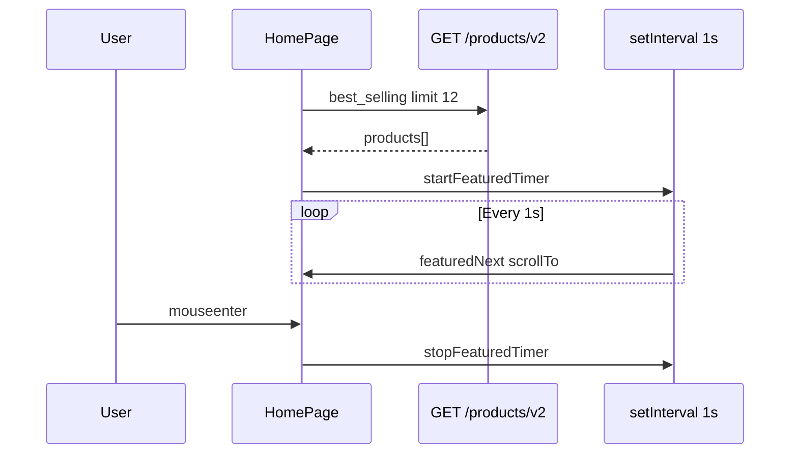

# Use Case — UC-CAT-10: Xem carousel sản phẩm nổi bật (View Featured Products Carousel)

| Thuộc tính | Giá trị |
|------------|---------|
| **ID** | UC-CAT-10 |
| **Tên** | Xem và tương tác carousel “SẢN PHẨM NỔI BẬT” trên trang chủ |
| **Mức độ ưu tiên** | Trung bình–Cao |
| **Phiên bản** | Bám code hiện tại |

---

## 1. Mô tả ngắn

Khối **“🔥 SẢN PHẨM NỔI BẬT”** trên **HomePage** hiển thị carousel ngang các **`ProductCard`**, dữ liệu từ **`GET /api/products/v2`** với bộ lọc cố định:

- `page: 1`, `limit: 12`
- `sort_by: best_selling`

Carousel **tự cuộn** mỗi **1 giây**, có nút prev/next, **tạm dừng** khi hover; cuộn bằng DOM `scrollTo` (không dùng thư viện carousel).

**“Nổi bật” trong code = bán chạy nhất** (subquery `sold_qty` từ `order_items`), **không** có bảng “featured pin” hay flag admin.

**FE:** `HomePage.jsx` (refs, interval, `ProductCard`)  
**BE:** `getProductsV2` + `sortBy === "best_selling"`

---

## 2. Tác nhân

| Tác nhân | Vai trò |
|----------|---------|
| **Guest / Customer** | Xem carousel, hover pause, prev/next, click card → PDP |
| **HomePage** | `featuredFilters`, timer, scroll logic |
| **React Query** | `useProductsV2(featuredFilters)` — query key tách listing chính |
| **Backend** | Tính `sold_qty`, sort DESC |

---

## 3. Preconditions

| # | Điều kiện |
|---|-----------|
| PRE-01 | User trên `/` |
| PRE-02 | Có thể có hoặc không có đơn hàng lịch sử (ảnh hưởng thứ tự best_selling) |
| PRE-03 | API v2 hoạt động |

---

## 4. Postconditions

### Thành công

| # | Kết quả |
|---|---------|
| POST-01 | Tối đa 12 sản phẩm trong carousel |
| POST-02 | Auto-scroll chạy khi có ≥ 1 sản phẩm |
| POST-03 | Hover dừng timer; mouse leave khởi động lại |
| POST-04 | Click card → `/products/:slug` (ProductCard) |

### Rỗng / loading

| # | Kết quả |
|---|---------|
| POST-L01 | Loading: 6 skeleton pulse |
| POST-E01 | Empty copy: “Chưa có sản phẩm nổi bật.” — timer không chạy |

---

## 5. Trigger

- User load HomePage — `useEffect` phụ thuộc `featuredProducts.length`.
- User hover vào vùng carousel.
- User click `ChevronLeft` / `ChevronRight`.

---

## 6. Luồng chính — Fetch dữ liệu

| Bước | Tác nhân | Hành động |
|------|----------|-----------|
| 1 | FE | `featuredFilters = { page:1, limit:12, sortBy:"best_selling", _version:"inactive_enabled" }` |
| 2 | FE | `useProductsV2(featuredFilters)` — **`_version` không gửi BE** |
| 3 | FE | `GET /api/products/v2?page=1&limit=12&sort_by=best_selling` |
| 4 | BE | `soldQtyExpr` subquery SUM quantity từ order_items + orders status hợp lệ |
| 5 | BE | `order: [[literal sold_qty DESC], [created_at DESC]]` |
| 6 | BE | Trả `products` + include category, brand, variations, primary image |
| 7 | FE | `featuredProducts = featuredData?.products ?? []` |

### Order status tính vào “bán chạy”

`confirmed`, `processing`, `shipping`, `delivered`, `PAID`

---

## 7. Luồng chính — Carousel mechanics

| Ref / state | Vai trò |
|-------------|---------|
| `featuredRef` | Container `flex gap-4 overflow-x-auto scroll-smooth px-12` |
| `featuredItemRef` | Gắn item `i===0` để đo `offsetWidth` (~240–260px) |
| `featuredIndexRef` | Index hiện tại modulo `count` |
| `featuredTimerRef` | `setInterval` 1000ms gọi `featuredNext` |

**Scroll:**

```javascript
const gap = 16;
el.scrollTo({ left: index * (itemW + gap), behavior: "smooth" });
```

| Hàm | Hành vi |
|-----|---------|
| `featuredNext` | index++ % count |
| `featuredPrev` | index-- + count % count |
| `startFeaturedTimer` | interval 1s |
| `stopFeaturedTimer` | clearInterval |

**Hover:**

```jsx
onMouseEnter={stopFeaturedTimer}
onMouseLeave={startFeaturedTimer}
```

**Mount effect:**

```javascript
useEffect(() => {
  featuredIndexRef.current = 0;
  requestAnimationFrame(() => scrollFeaturedToIndex(0));
  startFeaturedTimer();
  return () => stopFeaturedTimer();
}, [featuredProducts.length]);
```

---

## 8. Luồng thay thế

### AF-01: User click ProductCard

| Bước | Mô tả |
|------|--------|
| AF-01.1 | Navigate PDP — logic trong `ProductCard` (slug ưu tiên) |
| AF-01.2 | Carousel timer không liên quan sau khi rời trang |

### AF-02: Listing chính cùng lúc

| Mô tả |
|--------|
| `useProductsV2(v2Filters)` **độc lập** query key — filter user **không** đổi featured block |

### AF-03: SP mới chưa có đơn

| Mô tả |
|--------|
| `sold_qty = 0` — có thể xếp sau theo `created_at DESC` trong tie-break |

### AF-04: Ít hơn 12 SP trong DB

Carousel hiển thị đủ số có; vẫn auto-scroll nếu ≥ 1.

---

## 9. Luồng ngoại lệ

### EF-01: API v2 lỗi

`isFeaturedLoading` false, `featuredProducts` rỗng → empty state.

### EF-02: `itemW === 0` lúc đo

`scrollFeaturedToIndex` return sớm — có thể không scroll đến khi layout xong (requestAnimationFrame lần đầu giảm rủi ro).

### EF-03: Không lọc `is_active`

Cùng gap listing v2 — SP inactive vẫn có thể lên “nổi bật” nếu có đơn.

---

## 10. Quy tắc nghiệp vụ

| ID | Quy tắc |
|----|---------|
| BR-01 | Featured **định nghĩa bằng** `sort_by=best_selling`, không admin pin |
| BR-02 | Cố định `limit=12` — không cấu hình ENV |
| BR-03 | Auto-advance **1 giây** — không cấu hình |
| BR-04 | Carousel **độc lập** bộ lọc listing phía dưới |
| BR-05 | Card dùng cùng logic giá variation primary/cheapest như grid (ProductCard) |

---

## 11. UI structure

| Phần | Mô tả |
|------|--------|
| Section | `rounded-3xl` gradient xanh đậm + pattern SVG |
| Title | Badge “🔥 SẢN PHẨM NỔI BẬT” |
| Gradient mask | Trái/phải fade che biên scroll |
| Nút | Tròn `bg-white/15` trái/phải |
| Item width | `min-w-[240px] max-w-[240px]` (sm: 260px) |
| Height skeleton | 340px |

---

## 12. API

```http
GET /api/products/v2?page=1&limit=12&sort_by=best_selling
```

Response shape giống listing v2 (`products`, `pagination`, `total`).

---

## 13. Triển khai

| File | Vai trò |
|------|---------|
| `client/app/pages/HomePage.jsx` | featuredFilters, carousel refs/timer, JSX section |
| `client/app/components/ProductCard.jsx` | Card trong carousel |
| `client/app/hooks/useProducts.js` | `useProductsV2` |
| `server/controllers/productController.js` | `getProductsV2` soldQtyExpr, orderClause |
| `docs/feature_requirements/catalog/FR_ViewFeaturedProductsCarousel.md` | FR |

---

## 14. Sơ đồ tuần tự



---

## 15. Liên kết

| UC / FR |
|---------|
| UC-CAT-01 BrowseAndFilterProducts |
| UC-CAT-04 ViewProductDetail |
| `FR_ViewFeaturedProductsCarousel.md` |

---

## 16. Known gaps

| # | Mô tả |
|---|--------|
| GAP-01 | Không admin “ghim” sản phẩm nổi bật |
| GAP-02 | SP không bán vẫn có thể hiện nếu ít dữ liệu đơn |
| GAP-03 | Không `is_active` filter trên v2 |
| GAP-04 | Interval 1s có thể quá nhanh cho UX/a11y |
| GAP-05 | Không swipe touch library — chỉ native overflow scroll |
| GAP-06 | `_version: inactive_enabled` chỉ bust cache — tên gây hiểu nhầm |
| GAP-07 | Carousel chỉ trên HomePage — không lặp ở trang khác |
