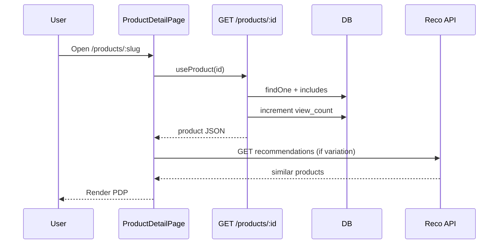

# Use Case — UC-CAT-04: Xem chi tiết sản phẩm (View Product Detail)

| Thuộc tính | Giá trị |
|------------|---------|
| **ID** | UC-CAT-04 |
| **Tên** | Xem trang chi tiết laptop (ảnh, giá, cấu hình, Q&A, gợi ý KNN) |
| **Mức độ ưu tiên** | Cao |
| **Phiên bản** | Bám code hiện tại |

---

## 1. Mô tả ngắn

Khách mở **`/products/:id`** (`id` = `product_id` số hoặc **slug**). FE gọi **`GET /api/products/:id`**, hiển thị gallery ảnh, tên, giảm giá, bộ chọn cấu hình (UC-CAT-05), nút thêm giỏ / mua ngay, modal thông số, Q&A embedded, carousel **gợi ý KNN** theo variation đang chọn. BE **tăng `view_count`** best-effort và tính `primaryVariationId` nếu thiếu.

**Endpoint:** `GET /api/products/:id`  
**Gợi ý:** `GET /api/products/variations/:variation_id/recommendations`  
**FE:** `ProductDetailPage.jsx`, `useProduct`, `useRecommendedByVariation`, `SpecsModal`, `ProductRecommendations`

---

## 2. Tác nhân

| Tác nhân | Vai trò |
|----------|---------|
| **Guest / Customer** | Xem, hỏi (nếu login), thêm giỏ |
| **Staff / Admin** | Trả lời Q&A (`roles` localStorage) |
| **Reco service** | Python KNN `RECO_API_BASE` (optional) |
| **Backend** | `getProductDetail`, `getRecommendedByVariation` |

---

## 3. Preconditions

| # | Điều kiện |
|---|-----------|
| PRE-01 | Sản phẩm tồn tại (`product_id` hoặc `slug`) |
| PRE-02 | Route `products/:id` trong `App.jsx` |

---

## 4. Postconditions

### Thành công

| # | Kết quả |
|---|---------|
| POST-01 | PDP render đầy đủ từ `data.product` |
| POST-02 | `view_count` +1 (async, lỗi bị nuốt) |
| POST-03 | `primaryVariationId` có trong JSON nếu có variations |
| POST-04 | KNN recommendations refresh khi đổi variation |

### Thất bại

| # | Kết quả |
|---|---------|
| POST-F01 | 404 → FE error state / LoadingSpinner |
| POST-F02 | Reco API down → block gợi ý rỗng hoặc fallback (tùy component) |

---

## 5. Trigger

- Click `ProductCard` / autocomplete / link nội bộ → `/products/:slug`.
- Direct URL / refresh.

---

## 6. Luồng chính

| Bước | Tác nhân | Hành động |
|------|----------|-----------|
| 1 | User | Navigate `/products/:id` |
| 2 | FE | `useProduct(id)` → `GET /api/products/${id}` |
| 3 | BE | `whereKey = isNaN(id) ? { slug } : { product_id }` |
| 4 | BE | `findOne` + include category, brand, variations, images, tags, questions (tree Q&A) |
| 5 | BE | Sort images `display_order`, questions/answers theo `order` clause |
| 6 | BE | 404 nếu không có |
| 7 | BE | `product.increment("view_count").catch(() => {})` |
| 8 | BE | Sort variations logic → set `primaryVariationId` |
| 9 | BE | `200 { product: json }`, `specs` null → `{}` |
| 10 | FE | `useEffect` chọn variation mặc định (primary → cheapest) — UC-CAT-05 |
| 11 | FE | Hiển thị giá `finalPrice = variation.price * (1 - discount%)` |
| 12 | FE | `useRecommendedByVariation(selectedVariation.variation_id)` |
| 13 | User | Tương tác: gallery, specs modal, Q&A, compare, cart |

---

## 7. Dữ liệu trả về (chính)

| Nhóm | Trường / quan hệ |
|------|------------------|
| Product | `product_id`, `product_name`, `slug`, `base_price`, `discount_percentage`, `thumbnail_url`, `specs` JSONB, `view_count`, `is_active`, … |
| Variations | `variation_id`, `price`, `stock_quantity`, `is_available`, `is_primary`, CPU/RAM/SSD/GPU/screen/color |
| Images | `image_url`, `display_order`, `is_primary` |
| Q&A | `questions` (parent null), `children`, `answers`, `user` |
| Tags | Many-to-many `Tag` |

**Lưu ý:** Comment BE cho phép `where: { is_available: true }` trên variations — **đang tắt**, trả cả variation hết hàng.

---

## 8. Luồng thay thế

### AF-01: Xem thông số kỹ thuật

| Bước | Mô tả |
|------|--------|
| AF-01.1 | Click “Xem thông số kỹ thuật” → `SpecsModal` / `SpecsTable` |
| AF-01.2 | `normalizeSpecs(product.specs)` flatten JSONB nhóm `{ label, value }` |

### AF-02: Đặt câu hỏi (đã login)

| Bước | Mô tả |
|------|--------|
| AF-02.1 | `POST /api/products/:id/questions` + Bearer token |
| AF-02.2 | Thành công → `window.location.reload()` (không invalidate React Query) |

### AF-03: Staff trả lời

| Bước | Mô tả |
|------|--------|
| AF-03.1 | `canAnswer` = roles includes `admin` hoặc `staff` |
| AF-03.2 | `POST /api/products/questions/:question_id/answers` |

### AF-04: Follow-up question

| Điều kiện | `is_answered`, không có child, chủ câu = current user |
|-----------|------------------------------------------------------|

### AF-05: Thêm so sánh

→ UC-CAT-06 (`addCompare` + CompareBar trên cùng page).

### AF-06: Thêm giỏ / Mua ngay

| Bước | Mô tả |
|------|--------|
| AF-06.1 | Cần `matched` variation + `allSelected` (`isReady`) |
| AF-06.2 | `useAddToCart.mutate({ variation_id, quantity })` |
| AF-06.3 | Một số nhánh còn `dispatch(addItem)` optimistic local |

---

## 9. Luồng ngoại lệ

### EF-01: Product not found — 404

```json
{ "message": "Product not found" }
```

### EF-02: Reco timeout / 503

`getRecommendedByVariation` gọi `axios` tới `RECO_API_BASE` — failure → next(error) hoặc empty tùy implementation phía dưới L548+.

### EF-03: Slug trùng / id sai

User thấy 404 hoặc spinner error.

---

## 10. Quy tắc nghiệp vụ

| ID | Quy tắc |
|----|---------|
| BR-01 | Nhận diện route param: số → PK, chuỗi → slug |
| BR-02 | `primaryVariationId`: ưu tiên `is_primary`, stock, giá thấp |
| BR-03 | View count tăng mỗi lần load detail thành công |
| BR-04 | Q&A chỉ load câu hỏi gốc (`parent_question_id: null`) kèm children |
| BR-05 | Giá hiển thị theo **variation đang chọn**, discount trên **product** |

---

## 11. API

```http
GET /api/products/thinkpad-x1-carbon
GET /api/products/42
```

```http
GET /api/products/variations/101/recommendations
```

Response detail (rút gọn):

```json
{
  "product": {
    "product_id": 42,
    "product_name": "...",
    "variations": [...],
    "images": [...],
    "questions": [...],
    "primaryVariationId": 101,
    "specs": { "display": [{ "label": "...", "value": "..." }] }
  }
}
```

---

## 12. Triển khai

| File | Vai trò |
|------|---------|
| `server/controllers/productController.js` | `getProductDetail`, recommendations |
| `server/routes/productRoutes.js` | `GET /:id` (**sau** static routes) |
| `client/app/pages/ProductDetailPage.jsx` | UI chính |
| `client/app/hooks/useProducts.js` | `useProduct`, `useRecommendedByVariation` |
| `client/app/components/SpecsModal.jsx` | Modal specs |
| `client/app/components/ProductRecommendations.jsx` | KNN UI |
| `client/app/components/ProductCard.jsx` | Link `/products/${slug\|\|id}` |

---

## 13. Sơ đồ tuần tự



---

## 14. Liên kết

| UC / FR |
|---------|
| UC-CAT-05 SelectProductConfiguration |
| UC-CAT-06 CompareProducts |
| `FR_ViewProductDetail.md`, `FR_IncrementProductViewCount.md`, `FR_ViewKNNRecommendationsOnProduct.md` |

---

## 15. Known gaps

| # | Mô tả |
|---|--------|
| GAP-01 | Q&A POST dùng `fetch` thô + **full page reload** |
| GAP-02 | `is_available` filter variations **chưa bật** trên BE |
| GAP-03 | CompareBar/Modal **chỉ** trên ProductDetailPage, không global Layout |
| GAP-04 | Auth check Q&A trộn Redux + `localStorage.token` |
| GAP-05 | Một số handler add-to-cart comment/duplicate logic |
| GAP-06 | Route `GET /compare` đặt **sau** `GET /:id` — xem UC-CAT-06 |
