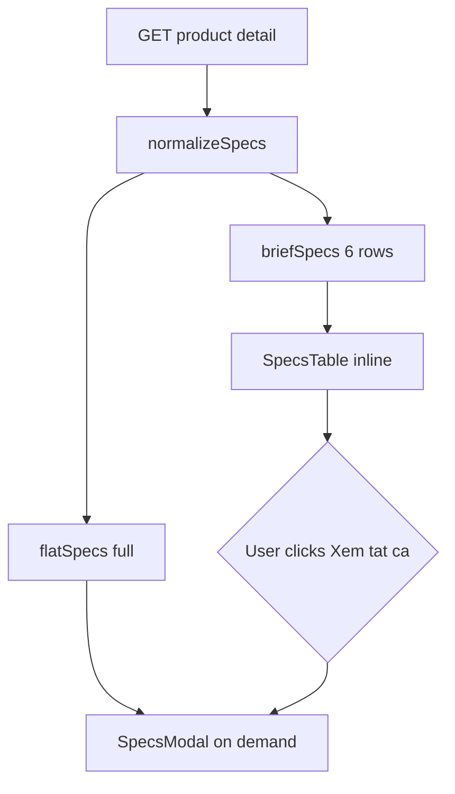

# Use Case — UC-CAT-08: Xem thông số kỹ thuật sản phẩm (View Product Specifications)

| Thuộc tính | Giá trị |
|------------|---------|
| **ID** | UC-CAT-08 |
| **Tên** | Xem thông số kỹ thuật (tóm tắt + modal đầy đủ) trên trang chi tiết |
| **Mức độ ưu tiên** | Cao |
| **Phiên bản** | Bám code hiện tại |

---

## 1. Mô tả ngắn

Trên **`ProductDetailPage`**, thông số lấy từ cột JSONB **`products.specs`** (không phải từng field variation). FE chạy **`normalizeSpecs`** để flatten nhiều dạng JSON → object phẳng `{ nhãn: giá trị }`, hiển thị:

1. **Bảng tóm tắt** — `SpecsTable` với **6 dòng đầu** (`briefSpecs`).
2. **Modal đầy đủ** — `SpecsModal` + `SpecsTable` với toàn bộ `flatSpecs`.

Hai nút mở modal: **“Xem thông số kỹ thuật”** (cạnh tên SP) và **“Xem tất cả”** (trên section tóm tắt).

**Nguồn dữ liệu:** `GET /api/products/:id` → `product.specs` (BE set `null` → `{}`).  
**FE:** `ProductDetailPage.jsx`, `SpecsModal.jsx`, `SpecsTable.jsx`

**Phân biệt:** Chip chọn CPU/RAM/… là **variation fields** (UC-CAT-05), không nằm trong modal specs JSONB.

---

## 2. Tác nhân

| Tác nhân | Vai trò |
|----------|---------|
| **Guest / Customer** | Đọc specs, mở/đóng modal |
| **Admin** | Nhập cấu trúc `specs` khi tạo/sửa SP (admin product form) |
| **ProductDetailPage** | `normalizeSpecs`, state `specOpen` |

---

## 3. Preconditions

| # | Điều kiện |
|---|-----------|
| PRE-01 | `GET /api/products/:id` thành công |
| PRE-02 | `product` object có trong state FE |
| PRE-03 | `product.specs` có thể `{}` hoặc null (BE chuẩn hóa `{}`) |

---

## 4. Postconditions

### Thành công

| # | Kết quả |
|---|---------|
| POST-01 | Section “Thông số kỹ thuật” hiển thị ≤ 6 cặp label/value |
| POST-02 | Modal hiển thị **toàn bộ** entries trong `flatSpecs` |
| POST-03 | `specOpen === false` sau đóng modal |

### Không có dữ liệu

| # | Kết quả |
|---|---------|
| POST-N01 | `SpecsTable` text: “Chưa có thông số kỹ thuật.” |

---

## 5. Trigger

- User scroll tới block specs dưới gallery / mô tả.
- User click **“Xem thông số kỹ thuật”** hoặc **“Xem tất cả”**.
- User click backdrop / nút X → đóng modal.

---

## 6. Luồng chính — Tải và chuẩn hóa

| Bước | Tác nhân | Hành động |
|------|----------|-----------|
| 1 | FE | `useProduct(id)` → `product.specs` |
| 2 | FE | `normalizeSpecs(product.specs)` → `flatSpecs` |
| 3 | FE | `briefSpecs = Object.entries(flatSpecs).slice(0, 6)` → object 6 key đầu |
| 4 | FE | Render `<SpecsTable specs={briefSpecs} dense />` |
| 5 | User | Click mở modal |
| 6 | FE | `setSpecOpen(true)` |
| 7 | FE | `<SpecsModal open specs={flatSpecs} onClose={...} />` |
| 8 | FE | `SpecsTable` render all rows trong modal scroll |

### `normalizeSpecs` — các shape đầu vào

| Shape JSONB | Xử lý |
|-------------|--------|
| `section: [{ key, value }]` hoặc `{ name, label, value }` | Mỗi phần tử → 1 dòng `out[key] = value` |
| `section: { subKey: subVal }` | Key `"Title(section) - Title(subKey)"` |
| `section: scalar` | Key `Title(section)` |

Hàm `toText` hỗ trợ array/object lồng nhau (giống logic compare modal).

---

## 7. Luồng chính — Modal UX

| Bước | Chi tiết |
|------|----------|
| M-1 | `SpecsModal`: `if (!open) return null` |
| M-2 | Backdrop `bg-black/40 backdrop-blur-sm` → `onClick={onClose}` |
| M-3 | Panel `max-w-3xl`, `max-h-[75vh] overflow-auto` |
| M-4 | Header “Thông số kỹ thuật” + nút X |
| M-5 | **Không** trap focus / **không** đóng ESC (khác CompareModal) |

---

## 8. Luồng thay thế

### AF-01: Specs rỗng

| Bước | Mô tả |
|------|--------|
| AF-01.1 | `flatSpecs = {}` |
| AF-01.2 | Bảng tóm tắt + modal đều hiện “Chưa có thông số kỹ thuật.” |
| AF-01.3 | Nút mở modal vẫn bấm được |

### AF-02: Nhiều hơn 6 nhóm specs

| Bước | Mô tả |
|------|--------|
| AF-02.1 | Tóm tắt chỉ 6 entry **theo thứ tự Object.entries** (không sort alphabet) |
| AF-02.2 | “Xem tất cả” cần thiết để xem phần còn lại |

### AF-03: Specs dùng cho lọc cân nặng (HomePage)

| Mô tả |
|--------|
| BE `getProductsV2` parse `products.specs->>'weight'` — **khác** use case hiển thị PDP |

### AF-04: So sánh sản phẩm

| Mô tả |
|--------|
| Compare modal dùng **snapshot variation fields**, không `product.specs` JSONB — UC-CAT-06 |

---

## 9. Luồng ngoại lệ

### EF-01: Product chưa load

`product` undefined → page spinner/error trước khi tới specs.

### EF-02: HTML trong mô tả vs specs

Block **“Mô tả sản phẩm”** dùng `dangerouslySetInnerHTML` cho `product.description` — **tách biệt** specs table.

### EF-03: JSON specs malformed

`normalizeSpecs` có thể bỏ qua hoặc stringify lạ — phụ thuộc shape; không validate schema runtime.

---

## 10. Quy tắc nghiệp vụ

| ID | Quy tắc |
|----|---------|
| BR-01 | Specs gắn **product**, không đổi khi user đổi variation (trừ khi admin sửa SP) |
| BR-02 | `briefSpecs` = **6 entries đầu** của `flatSpecs`, không phải “6 quan trọng nhất” |
| BR-03 | Modal và inline dùng **cùng** `flatSpecs` — đồng nhất nội dung |
| BR-04 | Variation selector hiển thị CPU/RAM/… riêng — không merge vào `SpecsTable` |
| BR-05 | Compare API (`compareProducts`) dùng cùng JSONB `specs` nhóm `{ label, value }` — khác UI SpecsTable |

---

## 11. Component contract

### `SpecsTable.jsx`

```javascript
export default function SpecsTable({ specs = {}, dense = false })
```

| Prop | Mô tả |
|------|--------|
| `specs` | Object phẳng string→string |
| `dense` | `text-sm` vs `text-base` |

### `SpecsModal.jsx`

| Prop | Mô tả |
|------|--------|
| `open` | boolean |
| `onClose` | fn |
| `specs` | `flatSpecs` |

### `ProductDetailPage` state

```javascript
const [specOpen, setSpecOpen] = useState(false);
```

---

## 12. Ví dụ `products.specs` (JSONB)

```json
{
  "display": [
    { "label": "Kích thước", "value": "15.6 inch" },
    { "label": "Độ phân giải", "value": "1920x1080" }
  ],
  "connectivity": {
    "usb": "2x USB-A, 1x USB-C",
    "hdmi": "1"
  },
  "weight": "1.75 kg"
}
```

Sau `normalizeSpecs` (minh họa keys):

- `Kích thước` → `15.6 inch`
- `Connectivity - Usb` → `2x USB-A, 1x USB-C`
- `Weight` → `1.75 kg`

---

## 13. Triển khai

| File | Vai trò |
|------|---------|
| `client/app/pages/ProductDetailPage.jsx` | normalizeSpecs, briefSpecs, buttons, modal |
| `client/app/components/SpecsModal.jsx` | Overlay modal |
| `client/app/components/SpecsTable.jsx` | Bảng 2 cột |
| `server/controllers/productController.js` | `attributes: { include: ["specs", ...] }`, null→{} |
| `docs/feature_requirements/catalog/FR_ViewProductSpecsModal.md` | FR |

---

## 14. Sơ đồ hoạt động



---

## 15. Liên kết

| UC / FR |
|---------|
| UC-CAT-04 ViewProductDetail |
| UC-CAT-05 SelectProductConfiguration |
| UC-CAT-06 CompareProducts |
| `FR_ViewProductSpecsModal.md` |

---

## 16. Known gaps

| # | Mô tả |
|---|--------|
| GAP-01 | Modal **không** đóng bằng phím ESC |
| GAP-02 | `briefSpecs` order phụ thuộc insertion order object — không ổn định giữa engines |
| GAP-03 | Không in/export PDF |
| GAP-04 | Không hiển thị specs trên `ProductCard` / listing |
| GAP-05 | Admin nhập specs — format JSON không validate ở FE storefront |
