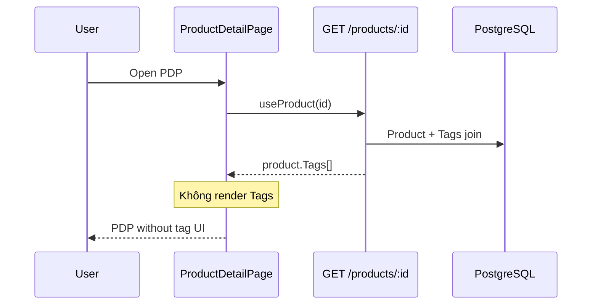

# Use Case — UC-CAT-07: Xem nhãn sản phẩm (View Product Tags)

| Thuộc tính | Giá trị |
|------------|---------|
| **ID** | UC-CAT-07 |
| **Tên** | Xem / nhận dữ liệu tag gắn với sản phẩm trên chi tiết |
| **Mức độ ưu tiên** | Thấp–Trung bình (BE đủ, FE chưa hiển thị) |
| **Phiên bản** | Bám code hiện tại |

---

## 1. Mô tả ngắn

Hệ thống lưu **tag** (nhãn marketing/phân loại) quan hệ **many-to-many** với sản phẩm qua bảng `product_tags`. Khi gọi **`GET /api/products/:id`**, backend **eager-load** model `Tag` và trả về trong JSON (thường key Sequelize: **`Tags`**).

**Hiện trạng storefront:** dữ liệu tag **có trong response API** nhưng **`ProductDetailPage.jsx` không render** chip/tag nào — use case này mô tả **khả năng dữ liệu + luồng dự kiến**, và ghi rõ gap UI.

**Endpoint:** `GET /api/products/:id` (fragment `Tags`)  
**Model:** `server/models/Tag.js`, association `server/models/index.js`

---

## 2. Tác nhân

| Tác nhân | Vai trò |
|----------|---------|
| **Customer** | Dự kiến xem nhãn trên PDP (chưa có UI) |
| **Developer / QA** | Inspect Network → thấy `Tags` trong JSON |
| **Admin** | Gán tag qua DB/seed hoặc tooling ngoài (không có màn admin tag riêng trong repo) |
| **Backend** | `getProductDetail` include `Tag` |

---

## 3. Preconditions

| # | Điều kiện |
|---|-----------|
| PRE-01 | Sản phẩm tồn tại (`product_id` hoặc `slug`) |
| PRE-02 | (Tuỳ chọn) Bản ghi trong `product_tags` nối `product_id` ↔ `tag_id` |
| PRE-03 | Bản ghi tương ứng trong `tags` (`tag_name`, `slug` unique) |

---

## 4. Postconditions

### Thành công (API)

| # | Kết quả |
|---|---------|
| POST-01 | Response `product` chứa mảng `Tags` (0..n phần tử) |
| POST-02 | Mỗi tag có `tag_id`, `tag_name`, `slug`, timestamps |
| POST-03 | Junction `product_tags` **không** lộ pivot fields (`through: { attributes: [] }`) |

### Hiện trạng FE

| # | Kết quả |
|---|---------|
| POST-FE01 | User **không thấy** tag trên giao diện PDP |
| POST-FE02 | `useProduct` vẫn cache object đầy đủ trong React Query |

### Không có tag

| # | Kết quả |
|---|---------|
| POST-N01 | `Tags: []` hoặc key vắng — không lỗi |

---

## 5. Trigger

- User mở trang chi tiết `/products/:id` → FE gọi `GET /api/products/:id`.
- (Tương lai) User click chip tag → lọc listing theo tag *(chưa implement)*.

---

## 6. Luồng chính — Backend cung cấp tags

| Bước | Tác nhân | Hành động |
|------|----------|-----------|
| 1 | FE | `useProduct(id)` → `GET /api/products/${id}` |
| 2 | BE | `Product.findOne` + `include: [{ model: Tag, through: { attributes: [] } }]` |
| 3 | BE | Serialize `product.toJSON()` |
| 4 | BE | `200 { product: { ..., Tags: [...] } }` |
| 5 | FE | `const product = productData.product` |
| 6 | FE | **Không có bước render tag** trong JSX hiện tại |

### Include (code thực tế)

```javascript
{ model: Tag, through: { attributes: [] } }
```

File: `server/controllers/productController.js` trong `getProductDetail`.

---

## 7. Luồng dự kiến — Hiển thị tag (chưa code)

| Bước | Mô tả |
|------|--------|
| 7.1 | `const tags = product.Tags ?? product.tags ?? []` |
| 7.2 | Render `tags.map(t => <Link to={\`/?tag=${t.slug}\`}>…</Link>)` |
| 7.3 | Click → listing lọc theo tag *(cần API `GET /products/v2?tag_id=` — **chưa có**)* |

---

## 8. Luồng thay thế

### AF-01: Sản phẩm không gắn tag

| Bước | Mô tả |
|------|--------|
| AF-01.1 | Association trả `Tags: []` |
| AF-01.2 | UI dự kiến: ẩn block tag |

### AF-02: Admin / seed gán tag

| Bước | Mô tả |
|------|--------|
| AF-02.1 | Insert `tags` + `product_tags` (SQL seed, script, hoặc tương lai admin form) |
| AF-02.2 | Lần GET detail sau → mảng `Tags` đầy đủ |

### AF-03: Consumer khác dùng cùng API

| Actor | Ví dụ |
|-------|--------|
| `useAdminProduct` | `GET /products/:id` — form admin có thể thấy `Tags` trong payload nếu inspect |

---

## 9. Luồng ngoại lệ

### EF-01: Product not found — 404

Không có `Tags` vì không có `product`.

### EF-02: Tag bị xóa nhưng junction còn

Tùy FK DB — có thể lỗi join hoặc orphan (cần ràng buộc migration).

### EF-03: FE tìm sai key

Code `product.tags` (lowercase) trong khi Sequelize trả **`Tags`** → luôn rỗng nếu không normalize.

---

## 10. Quy tắc nghiệp vụ

| ID | Quy tắc |
|----|---------|
| BR-01 | `tag_name` và `slug` **unique** trên bảng `tags` |
| BR-02 | Một SP có **nhiều** tag; một tag gắn **nhiều** SP |
| BR-03 | Tag **không** thay thế `category_id` / `brand_id` — ba lớp metadata độc lập |
| BR-04 | `getProductDetail` **không** lọc tag theo `is_active` product (tag load theo SP tìm được) |
| BR-05 | Không có API public `GET /tags` hoặc lọc listing theo tag |

---

## 11. Mô hình dữ liệu

### Bảng `tags`

| Cột | Kiểu | Ghi chú |
|-----|------|---------|
| `tag_id` | INTEGER PK | |
| `tag_name` | STRING(50) UNIQUE | Hiển thị |
| `slug` | STRING(50) UNIQUE | URL-friendly |
| `created_at` / `updated_at` | | |

### Bảng `product_tags` (junction)

| Cột | Ghi chú |
|-----|---------|
| `product_id` | FK → products |
| `tag_id` | FK → tags |

### Association

```javascript
Product.belongsToMany(Tag, { through: "product_tags", foreignKey: "product_id" })
Tag.belongsToMany(Product, { through: "product_tags", foreignKey: "tag_id" })
```

---

## 12. API — Fragment response

```http
GET /api/products/macbook-pro-14
```

```json
{
  "product": {
    "product_id": 10,
    "product_name": "MacBook Pro 14",
    "Tags": [
      {
        "tag_id": 1,
        "tag_name": "Gaming",
        "slug": "gaming",
        "created_at": "...",
        "updated_at": "..."
      },
      {
        "tag_id": 4,
        "tag_name": "Mỏng nhẹ",
        "slug": "mong-nhe"
      }
    ]
  }
}
```

**Normalize FE (khuyến nghị):**

```javascript
const tags = product?.Tags ?? product?.tags ?? [];
```

---

## 13. Triển khai

| File | Vai trò |
|------|---------|
| `server/models/Tag.js` | Model |
| `server/models/index.js` | M2M associations |
| `server/controllers/productController.js` | Include trong `getProductDetail` |
| `client/app/hooks/useProducts.js` | `useProduct` — trả full JSON |
| `client/app/pages/ProductDetailPage.jsx` | **Không** import/render tags |
| `docs/feature_requirements/catalog/FR_ProductTagsInDetail.md` | FR chi tiết |

---

## 14. Sơ đồ tuần tự (hiện trạng)



---

## 15. Liên kết

| UC / FR |
|---------|
| UC-CAT-04 ViewProductDetail |
| UC-CAT-01 BrowseAndFilterProducts (lọc category/brand — khác tag) |
| `FR_ProductTagsInDetail.md` |

---

## 16. Known gaps

| # | Mô tả |
|---|--------|
| GAP-01 | **Không có UI** hiển thị tag trên `ProductDetailPage` |
| GAP-02 | Không API lọc sản phẩm theo `tag_id` / `slug` |
| GAP-03 | Không trang admin CRUD tag / gán tag trong form sản phẩm (grep repo không thấy `tag_id` ở admin) |
| GAP-04 | Key Sequelize `Tags` vs `tags` — FE chưa normalize |
| GAP-05 | Click tag → listing: chưa thiết kế route `/?tag=` |
| GAP-06 | Tag không xuất hiện trên `ProductCard` listing |
