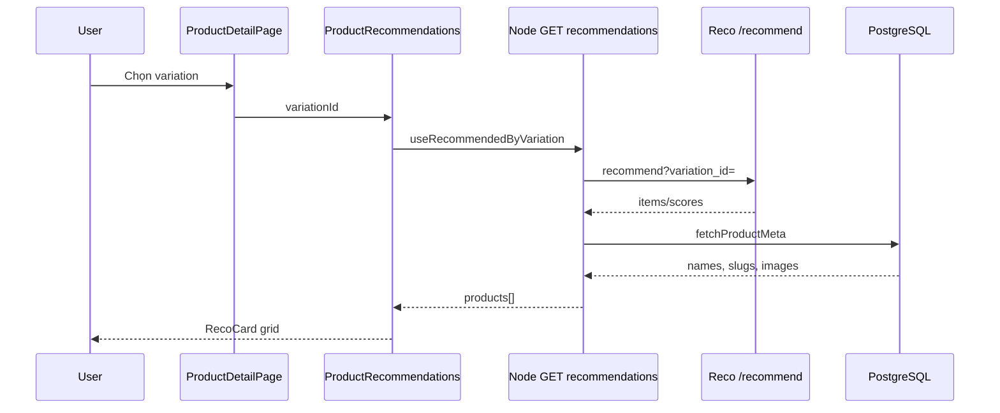

# Use Case — UC-CAT-11: Xem gợi ý sản phẩm tương tự (View Similar Product Recommendations)

| Thuộc tính | Giá trị |
|------------|---------|
| **ID** | UC-CAT-11 |
| **Tên** | Xem gợi ý KNN theo cấu hình (variation) đang chọn trên PDP |
| **Mức độ ưu tiên** | Trung bình (phụ thuộc recommendation service) |
| **Phiên bản** | Bám code hiện tại |

---

## 1. Mô tả ngắn

Khi khách xem **chi tiết laptop** và có **variation** đang chọn (mặc định primary/cheapest hoặc user chọn — UC-CAT-05), block **“Gợi ý cho cấu hình đang chọn”** gọi:

**`GET /api/products/variations/:variation_id/recommendations`**

Node.js **proxy** sang Python Flask **`GET {RECO_API_BASE}/recommend?variation_id=...`**, chuẩn hóa response, **enrich** ảnh/tên/slug từ PostgreSQL (`fetchProductMeta`), trả về cho **`ProductRecommendations.jsx`** (grid tối đa **5** card, skeleton loading, thêm giỏ nhanh).

**Env:** `RECO_API_BASE` (default `http://127.0.0.1:8000`), `RECO_TIMEOUT_MS` (default `7000`).

---

## 2. Tác nhân

| Tác nhân | Vai trò |
|----------|---------|
| **Guest / Customer** | Xem gợi ý, mở PDP gợi ý, thêm giỏ từ RecoCard |
| **ProductDetailPage** | Truyền `currentVariationId` |
| **ProductRecommendations** | UI grid + `useRecommendedByVariation` |
| **Node API** | `getRecommendedByVariation` |
| **Recommendation service** | `recommendation_service/app.py` — `/recommend` |

---

## 3. Preconditions

| # | Điều kiện |
|---|-----------|
| PRE-01 | PDP loaded, `product.variations` có ít nhất một biến thể |
| PRE-02 | `variation_id` hợp lệ (number) |
| PRE-03 | (Khuyến nghị) Flask reco service đang chạy port 8000 |
| PRE-04 | Model KNN/index đã train — variation tồn tại trong index |

---

## 4. Postconditions

### Thành công

| # | Kết quả |
|---|---------|
| POST-01 | Section hiển thị ≤ 5 `RecoCard` |
| POST-02 | Mỗi card có `name`, `image`, `price`, link `/products/{slug}?v={variation_id}` |
| POST-03 | Response meta: `basedOn.variationId`, `source: "knn"`, `generated_at` |

### Không có gợi ý / lỗi upstream

| # | Kết quả |
|---|---------|
| POST-E01 | UI: “Chưa có gợi ý phù hợp.” |
| POST-E02 | BE có thể `502` với `products: []` — FE coi như rỗng |

### Đổi cấu hình

| # | Kết quả |
|---|---------|
| POST-C01 | User đổi variation → query key đổi → refetch gợi ý mới |

---

## 5. Trigger

- Load PDP → `currentVariationId` set sau `useEffect` default variation.
- User `toggleSelect` cấu hình → `selectedVariation` đổi → `variationId` prop đổi.
- React Query refetch (`staleTime: 60s`, `keepPreviousData: true`).

---

## 6. Luồng chính — Frontend

| Bước | Tác nhân | Hành động |
|------|----------|-----------|
| 1 | PDP | `currentVariationId = selectedVariation?.variation_id \|\| variations[0]?.variation_id` |
| 2 | PDP | `<ProductRecommendations variationId={currentVariationId} />` |
| 3 | FE | `useRecommendedByVariation(variationId)` — `enabled: !!variationId` |
| 4 | FE | `GET /api/products/variations/${variationId}/recommendations` |
| 5 | FE | `items = (data?.products ?? []).slice(0, limit)` — default `limit=5` |
| 6 | FE | Loading → 5× `RecoSkeleton` |
| 7 | FE | Render `RecoCard` cho từng item |

**Lưu ý:** `ProductDetailPage` còn gọi `useRecommendedByVariation(selectedVariation?.variation_id)` ở L53 nhưng **không dùng** biến `recommendations` — duplicate hook (GAP).

---

## 7. Luồng chính — Backend adapter

| Bước | Hành động |
|------|-----------|
| 1 | Parse `variation_id`; invalid → `400 { products: [], error: "invalid variation_id" }` |
| 2 | `axios.get(\`${BASE}/recommend?variation_id=${id}\`, { timeout: TIMEOUT })` |
| 3 | Status ≥ 400 → `502` + `error: upstream_${status}` |
| 4 | Parse payload: `items` hoặc `debug` hoặc raw array |
| 5 | Dedupe theo `product_id`, giữ score cao nhất (`performance_score`, `score`, `rank_score`) |
| 6 | `fetchProductMeta(productIds)` — name, slug, thumbnail, rating |
| 7 | Map object FE: `id`, `variation_id`, `name`, `image`, `slug`, `price`, `score`, `explain`, … |
| 8 | Sort `score` DESC |
| 9 | `200 { products, basedOn, generated_at, source: "knn" }` |

### Exception path

`catch` → `502` + `error: "adapter_exception"` + `detail.message`, `BASE`.

---

## 8. Luồng chính — RecoCard tương tác

| Bước | Hành động |
|------|-----------|
| 1 | Link `href = /products/${slugOrId}?v=${variation_id}` |
| 2 | Giá: `item.price`, discount `item.discount_percentage` (thường 0 — BE không trả) |
| 3 | “Thêm vào giỏ” → `dispatch(addItem({ product_id, variation_id, product snapshot }))` — **optimistic local**, không gọi `useAddToCart` API ngay |
| 4 | Cần cả `item.id` và `item.variation_id` — thiếu thì return |

---

## 9. Luồng thay thế

### AF-01: Flask trả shape `debug`

Adapter chấp nhận `payload.debug` như danh sách items (mode debug/train).

### AF-02: Nhiều variation cùng `product_id`

Dedupe `bestByProduct` — giữ variation có score cao hơn.

### AF-03: Meta DB thiếu ảnh

`image: meta.thumbnail_url` có thể null → FE placeholder `/placeholder.svg`.

### AF-04: `variationId` null tạm thời

Hook disabled → không gọi API; section có thể hiện empty/loading ngắn.

---

## 10. Luồng ngoại lệ

### EF-01: Reco service down

502 hoặc network error → React Query error state; UI thường hiện empty message.

### EF-02: Variation không có trong index Flask

Flask `404` / error body → Node 502, products rỗng.

### EF-03: Deep link `?v=` không đọc ở PDP

User click RecoCard với `?v=123` — **ProductDetailPage không parse** search param → vẫn default variation (GAP).

### EF-04: Timeout 7s

Axios abort → adapter_exception 502.

---

## 11. Quy tắc nghiệp vụ

| ID | Quy tắc |
|----|---------|
| BR-01 | Gợi ý gắn **variation_id**, không `product_id` đơn thuần |
| BR-02 | Public API — không JWT |
| BR-03 | FE hiển thị tối đa **5** — cắt client-side, không query `limit` BE |
| BR-04 | Similarity do **ML service**, không rule “cùng category” (code cũ đã comment) |
| BR-05 | Enrich tên/ảnh **ưu tiên DB** hơn payload Flask |
| BR-06 | Đổi variation trên PDP → gợi ý **phải** đổi theo |

---

## 12. API

### Node

```http
GET /api/products/variations/101/recommendations
```

**200 (rút gọn):**

```json
{
  "products": [
    {
      "id": 12,
      "variation_id": 45,
      "name": "Laptop XYZ",
      "image": "https://...",
      "slug": "laptop-xyz",
      "price": 22000000,
      "score": 0.87,
      "rating_average": 4.5,
      "explain": { "source": "indexed", "score_source": "fresh:benchmark" }
    }
  ],
  "basedOn": { "variationId": 101 },
  "generated_at": "2026-05-27T10:00:00.000Z",
  "source": "knn"
}
```

**502 upstream:**

```json
{
  "products": [],
  "basedOn": { "variationId": 101 },
  "source": "knn",
  "error": "upstream_500",
  "upstream": {}
}
```

### Flask (nội bộ)

```http
GET http://127.0.0.1:8000/recommend?variation_id=101
```

Route file: `recommendation_service/app.py` — `recommend_core(variation_id)`.

---

## 13. React Query

```javascript
export function useRecommendedByVariation(variationId) {
  return useQuery({
    queryKey: ["reco-by-variation", variationId ?? "none"],
    enabled: !!variationId,
    keepPreviousData: true,
    staleTime: 60 * 1000,
  });
}
```

---

## 14. Triển khai

| File | Vai trò |
|------|---------|
| `client/app/components/ProductRecommendations.jsx` | Section + RecoCard |
| `client/app/pages/ProductDetailPage.jsx` | Mount component, `currentVariationId` |
| `client/app/hooks/useProducts.js` | `useRecommendedByVariation` |
| `server/controllers/productController.js` | `getRecommendedByVariation`, `fetchProductMeta` |
| `server/routes/productRoutes.js` | Route **trước** `GET /:id` — OK |
| `recommendation_service/app.py` | Flask `/recommend` |
| `recommendation_service/core/recommend.py` | KNN logic |
| `docs/feature_requirements/catalog/FR_ViewKNNRecommendationsOnProduct.md` | FR |

---

## 15. Sơ đồ tuần tự



---

## 16. Liên kết

| UC / FR |
|---------|
| UC-CAT-04 ViewProductDetail |
| UC-CAT-05 SelectProductConfiguration |
| `FR_ViewKNNRecommendationsOnProduct.md`, `FR_ProxyRecommendationsFromBackend.md` |
| `FR_MLServiceRecommendEndpoint.md` |

---

## 17. Known gaps

| # | Mô tả |
|---|--------|
| GAP-01 | **Phụ thuộc** service Python — không chạy → gợi ý rỗng/502 |
| GAP-02 | Query `?v=variation_id` trên URL **không** được PDP đọc |
| GAP-03 | `useRecommendedByVariation` **gọi 2 lần** (PDP L53 unused + component) |
| GAP-04 | RecoCard `addItem` local — có thể lệch server cart nếu chưa sync |
| GAP-05 | `discount_percentage` / `review_count` thường thiếu trên reco payload |
| GAP-06 | Không gợi ý trên HomePage / listing |
| GAP-07 | Không hiển thị `explain` score cho user (chỉ trong JSON) |
| GAP-08 | Train/index offline (`train_recommend.py`) — ngoài runtime UC |
